# 赚钱道路上的大忌（四） - P1 - 赏味不足 - BV1Rv42167be

大家好啊，呃今天呢啊对。

就这个主题啊，就随缘了，就我想到哪是哪，所以有的时候会发现更新的快。

有的时候更新的慢啊，呃首先第一点啊，杭州活动我们继续报名好吧。

2月25号下午在上城区，今天我们要讲的大忌呢一共有两个，一个是第一点，叫做千千万万不要把你的客户当人看啊。

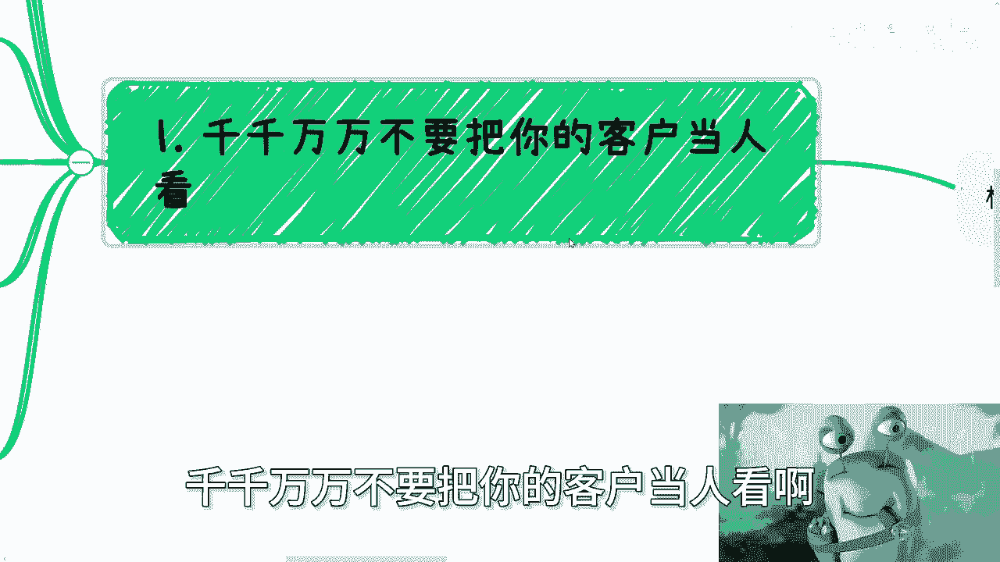

然后很多人很开心啊，陈老师骂人了是吧。

又要骂人了啊不啊，我跟你讲，我他妈骂的不是啊，那么其实啊你看啊，你不把这个课那个顾客当人看啊，这句话我们要从两个角度去分析，第一个是什么叫做你别去太从客户角度思考好，那么第二个叫什么呢，叫做呃。

他们自己很多时候也不把他们自己当人，那请问我为什么要把他们当人对吧，那其实你会发现我这里还特地补充了一点，就是散户端，企业端，政府端客户都一样，没什么太大区别，我们打个比方啊，比如说你今天做个业务。

你要做的其实就是不停的去寻找，能够让你变现的客户对吧，就是换而言之，就是说能够认可你这个业务，咱不管是真的认可还是冲动消费。

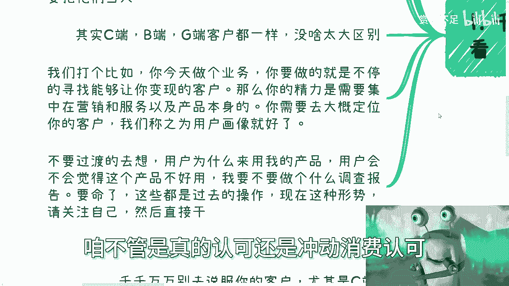

认可，咱不去管它啊，那么你的精力就是需要集中放在，所谓的营销和服务和产品本身啊，当然这句话你要理解啊，不要不是说你就不停的在打磨你的产品和服务，不是的，你产品跟服务服务啊，其实有就可以了，不用太好啊。

主要是在于营销包装上面，然后呢你需要大概去定位你的客户啊，就是说你这个用户画像是怎么样子的，比如说大概是什么年龄段的，大概是怎么消费能力的，大概是怎么样的一些，比如受众群体，你得你得清楚就结束了啊。

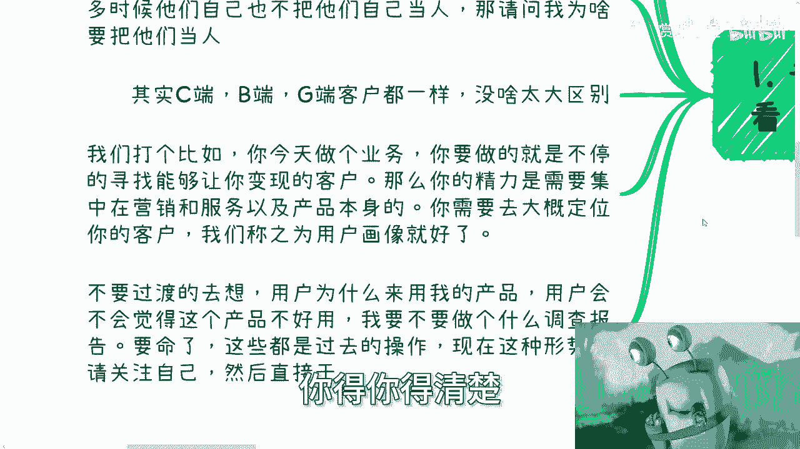

不要再往下想了啊，你不要就是说啊，你说我今天做一个东西啊，然后我吃饭也在想，睡觉也在想，晚上也在想啊，然后感觉我的，我很努力啊，好我跟你讲没卵用的，你这个除了自我感动没有卵用的啊，不要过度的去想。

因为为什么，因为用户为什么来用我的产品，用户会不会觉得这个产品不好用，我要不要去做一个什么调查报告，我跟你讲，拜拜啊拜拜，这些都是过去的操作，而且这些也都是过度的操作，现在整个这种形式我跟你讲。

你只要关注你自己，然后去干什么意思。

就是你就关注好你自己的产品，自己的服务和你主要的营销，然后你就去干就结束了，你说今天有谁来，今天没有谁来，漏下来到底是谁，你能控制吗，不能控制，那你想他这么多干嘛呢啊这是第一点。

第二点就刚刚回到我们刚刚说的。

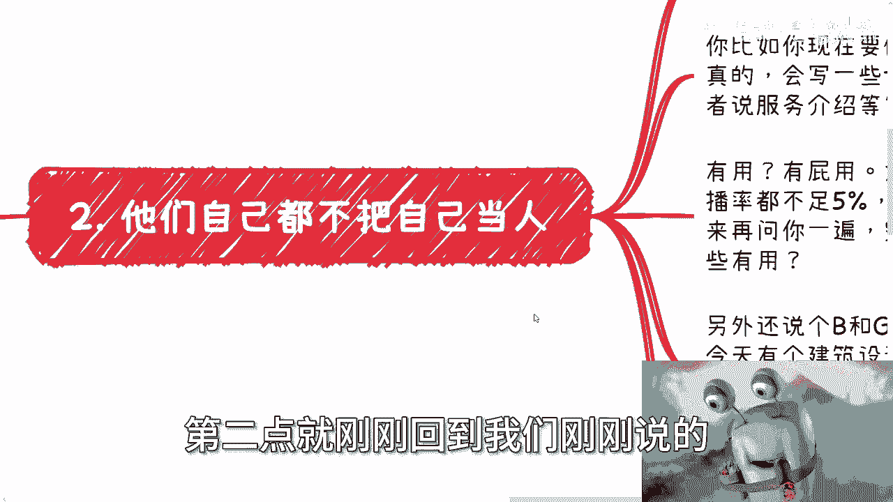

他们自己很多时候都不把自己当人看，我为什么要把他们当人看啊，好我们来举两个例子。

比如说你先做个服务，我其实聊下来我会发现很多人蛮认真的，他会写一些tips，也就是说会写一些提醒啊。

甚至会有操作手册，甚至会有服务介绍，我我就跟他讲啊，每次看到这种，我真的我就就蠢笑了，你知道吗，真的蠢，笑了就逗乐了啊，有用啊，有屁用有用啊，为什么，因为现在的人我就这么跟你讲，一个5分钟的视频。

完播率不足5%啊，就这种吊样子，然后一个海报上明明什么信息都有，他们还要再问你一遍，我跟你这么说，完全就是一个生活不能自理啊，你你做个什么啊，还做个操作手册，做个提醒啊，谁他妈去看是不是你。

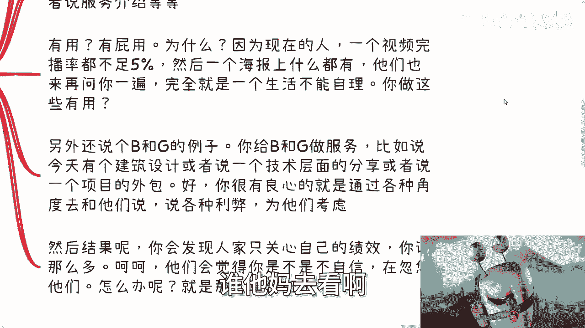

我每次问他们，我说你们为什么要做这个东西啊，我们希望有更好的用户体验，我们希望用户能够更完整的了解你的东西，那不好意思，你的用户不是人，你以为你用户是什么啊对吧。

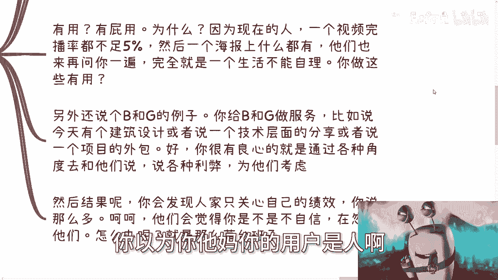

然后再说个B和G的那个例子，你给B和G做服务，比如说今天有个建筑设计，或者有个技术层面的分享，或者说有一个项目的外包，好你我就这么说，你很有良心的去通过各种角度去跟他们说，应该用什么技术。

应该用什么样的方案啊，然后哪种方案可能利弊分别是什么对吧，因为你不可能有一种方案是啊，全是好处没有坏处，你总归有长板短板的嘛对吧。

那么说各种利弊为他们考虑结果呢，结果你会发现人家只关心自己的绩效，你说这么多，你就跟一个被耍被耍的猴是一样的，也就是说你说这么多，甚至会让他们觉得你是不是不自信，在想办法忽悠他们，什么意思啊。

良心他妈的喂了狗啊，还不如喂狗狗都不如啊，怎么办呢，没有办法的，我就告诉你，世界就这个样子。

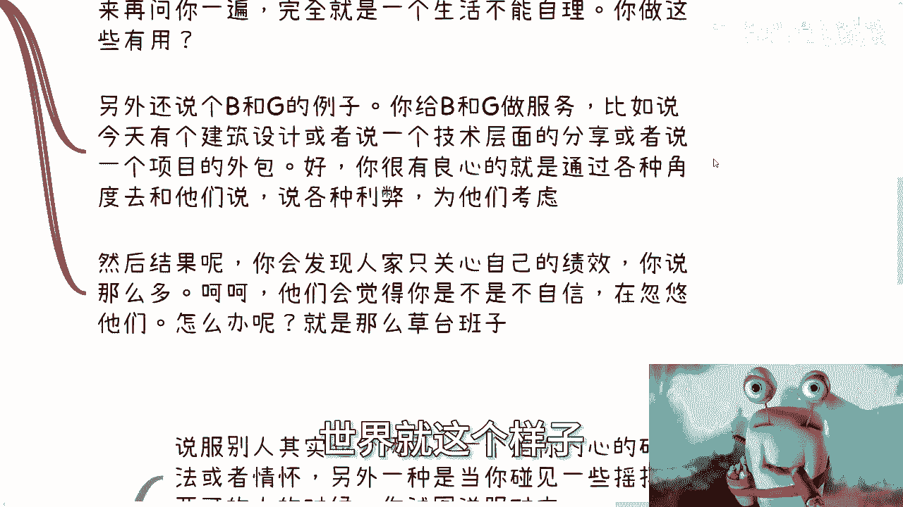

社会就是这个样子，就他妈草台班子，你能说什么呢，对吧，第3000万不要说服别人啊。

这也是重中之重，不管是谁哦，因为说服别人其实也分两层，一层是你内心的确有这种想法或者情怀，另外一种是什么呢，就是碰，当你碰到一些就是呃可能他自己是比较摇摆的，或者模棱两可的那种人的时候。

你试图去说服对方。

那当然我告诉你，无论前者还是后者，不好意思，你都赚不到钱呃，呃赚钱与你没有任何关系啊，八竿子打不着边，你除了给你带自己带来无尽的痛苦以外，没有什么用啊，那么你内心比如说第一种，你内心就是这种想法或情怀。

它会映射到你的产品或者服务里面，比如说很多人做一个自己的产品或者服务，然后就说我要去卖，我不管他是卖给C端还是卖给B端，还是卖给C端啊，好我就问他怎么卖呢，对啊怎么卖呢，他说哎我就去打广告啊，我就去啊。

这个跟别人去描述对吧，我比如说还还有的甚至到什么啊，学校门口对吧，他说我跟学生会合作，或者我去跟什么什么哪些人合作对吧，去卖，我说第一现在已经不是以前去铺呃，那个地推铺销售的时代了，而且说的不好听点。

你也没有这么多钱和时间给你去铺啊，这是第一点，第二点，你尝试说服别人来用你的产品跟服务，其实本质上就是不靠谱的，为什么这个就跟你谈恋爱是一样的，你可以今天死缠烂打，或者通过一种极端的方式。

比如说哈你跪在地上对吧，比如说你在门口跪一跪，一晚上都可以，你是追一个人，然后呢，然后呢，你觉得对方是真心实意接受你的吗，对吧，会开心吗，会长久吗，会有结果吗。

因为为什么，因为你会发现你但凡通过说服的方式啊，你只会给你自己带来无尽的风险啊。

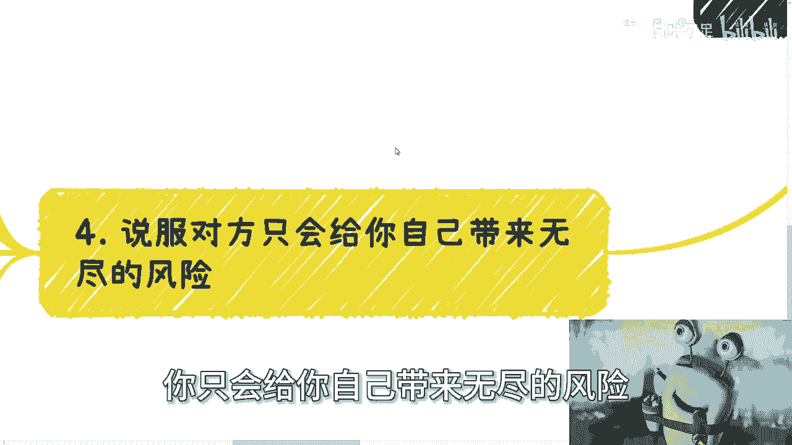

你要记住一点，千千万万不要去说服你的客户。

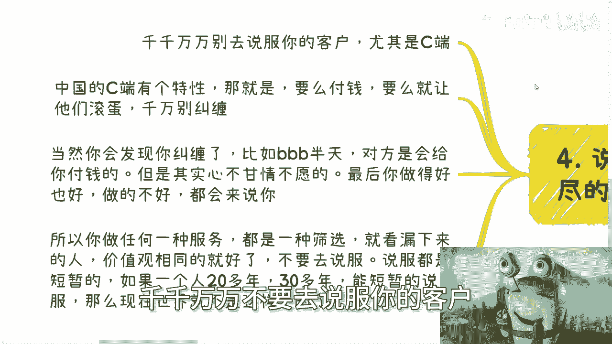

尤其是C端啊，尤其是C端，就是中国的C端有个特性，那就是什么，就是要么他就付钱，要么你就让他们滚蛋滚蛋，千万不要去跟他们纠缠，因为你会发现你纠缠了，如果在那边逼逼逼逼逼逼来逼去逼半天对吧。

对方会给你付钱啊，有的会给你付钱，就有一定比例，但是其实心不甘情不愿，而且你会发现这种心不甘情不愿的人，最后只会给只会来黑你，只会雷只会来，就是说去嗯去喷你啊，就是最后你无论做的好还是做的不好。

都会来说你，所以你做任何一个服务都是一种筛选，就是看漏下来的人价值观是不是相同就好了，不要去说服说服任何一个人，他都是短暂的，你就想想看，如果一个人20多年，30多年过来，能短暂的被说服，那我就告诉你。

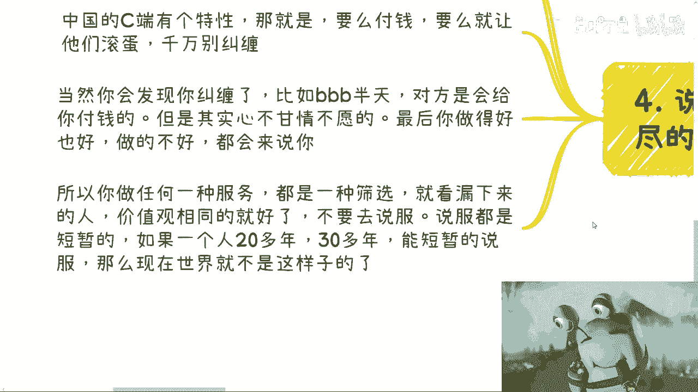

现在他妈的世界就不是这个样子的，你就像我啊，你就像我咨询也好，活动也罢，加完基本上两三句话内都付款，付完款，大家约时间，对不对，你但凡我碰到那种跟我说来说去问问123，我跟你讲，问第一句我礼貌回答。

问第二句我不耐烦地回答，问第三句我就删了，为什么，因为无论对我还对你们，只要大家去赚钱呢，我不缺你一个客户对吧，我不缺一个客户，我也没必要为了你这个客户去冒险哦，我非要收你的钱。

然后搞到最后好像你还心不愿情，心不甘情不愿的，然后弄资咨询完了，或者你来参加活动了，还要说陈老师不好，我图啥呢，我就问我图啥，我是图，你这几百块钱吗，艾玛奇了怪了对吧，所以说你们要去赚钱的时候。

你们一定要明白，就是很多时候你得果断，你得彻底啊，不是说你彻底果断就是冷血，而是说你要控制风险，不要去搞那些有的没的，我跟所有人都说，就是当你们要赚钱的时候，你的目标就是赚钱。

所有的行为只要跟赚钱没关系的，你都不要去多想，就像我刚刚说的，你别人为什么过来多付钱，就你过来哔哔哔哔，一句两句三句这么垫，头上长角了对吧，你但凡没付钱，你你再逼就等于在白嫖，那逼什么东西啊。

是不是这个道理对吧，你们不要千万觉得就说哦，人家逼逼逼的吧，你去回复人家或者怎么样，你做一个客服，你去回复一下这个叫你的职责，如果你要去做自己的业务，做自己的商业，你要去带他赚他的钱，那不好意思。

这种人最好不要多碰，而且我就告诉你，从逻辑上来讲，你碰都不要碰，明白吧啊好好吧，就这么着嗯，有啥要咨询的，这个商业上，职业上啊，合同上对吧，融资上或者什么上，反正只要有的啊，你们觉得有疑问的对吧。

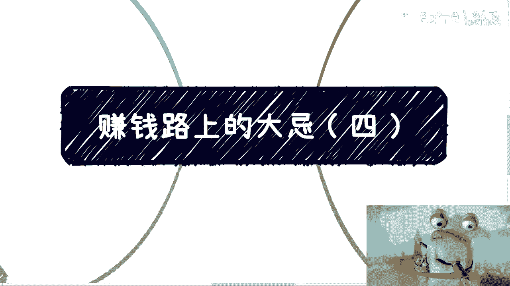