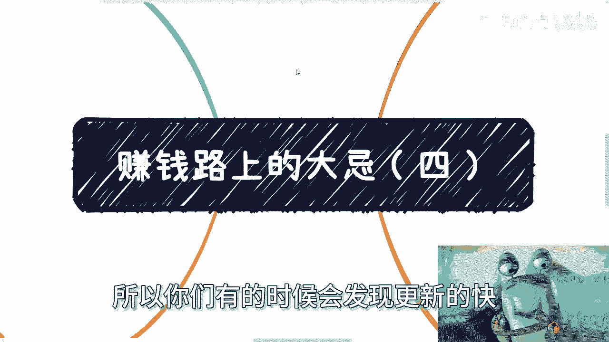

# 赚钱道路上的大忌（四）💸 - 课程编号：P1

在本节课中，我们将要学习在商业和赚钱过程中需要避免的两个核心大忌。这些观点旨在帮助你更高效地聚焦于业务本身，避免不必要的精力消耗和风险。

---

## 第一点：切勿将客户当人看 🤖

上一节我们介绍了课程概述，本节中我们来看看第一个大忌。这里的“不把客户当人看”并非指不尊重客户，而是需要从两个角度来理解。

### 角度一：避免过度从客户角度思考

你的核心精力应集中在**营销、服务和产品**上。请注意，这里的重点并非无限打磨产品，而是确保产品与服务“可用”即可，主要精力应放在营销与包装上。

你需要对客户进行基本定位，例如：
*   年龄范围
*   消费能力
*   受众群体特征

定位完成后，就无需再深入纠结。不要过度思考“用户为何选择我”、“产品是否好用”或“是否需要做用户调研”。这些属于过度操作，在当前的商业环境下效率低下，且容易陷入自我感动。

**核心行动公式**：
`你的精力 = 聚焦(产品, 服务, 营销) + 执行`

你无法控制具体哪些客户会来，因此多想无益。

### 角度二：客户自身常不把自己当人看

很多时候，客户自身的行为也决定了我们无需过度“人性化”服务。

以下是两个例证：

**例证一：C端（个人消费者）服务**
许多人会认真制作使用提示、操作手册或服务介绍，以期提升用户体验。但现实是，当前用户的注意力极度稀缺。一个5分钟的视频，完播率可能不足5%；一张信息齐全的海报，用户仍会反复询问基础信息。在这种情况下，精心准备的说明文档往往无人阅读。

**例证二：B端/G端（企业/政府）服务**
当你为B端或G端客户提供专业服务（如设计、咨询、外包）时，若基于专业良心，详尽分析各种技术方案的利弊以供其选择，结果可能适得其反。对方可能只关心自身绩效，你的专业分析反而会被视为不自信或忽悠，最终“良心喂了狗”。

社会运转的本质如此，过度将客户理想化并为此投入，是不经济的。

---

## 第二点：切勿尝试说服别人 🚫

在理解了与客户相处的正确心态后，我们来看看另一个致命错误：试图说服别人。无论是出于内心的情怀，还是面对摇摆不定的潜在客户时，试图说服对方接受你的产品或服务，都与赚钱背道而驰。

### 说服行为的两层风险

1.  **内在情怀映射**：将自己的想法强加于产品，并试图通过广告、地推或游说等方式“说服”市场接受。这类似于通过死缠烂打追求对象，即使短暂成功，也难以持久和愉快。
2.  **面对摇摆客户**：当遇到模棱两可的客户时，花费大量时间精力去说服对方付费。这尤其需要警惕。

### 为何必须避免说服（尤其是C端）

中国的C端市场有一个特性：客户要么痛快付费，要么就应果断放弃。与潜在客户反复纠缠、说服，即使最终成交，也常会带来“心不甘情不愿”的客户。这类客户极易在事后提出不满、抱怨甚至诋毁，无论你的实际服务好坏。

**核心逻辑**：商业的本质是筛选，而非教育或说服。你的产品与服务本身，就是在寻找与你有相同价值观的客户群体。一个拥有二三十年固有认知的人，很难被短暂说服。试图说服所有人，只会引入高风险客户，增加不必要的售后成本和声誉风险。

**行动准则**：
*   果断筛选：对于咨询后反复提问却不付款的潜在客户，应保持警惕并果断止损。
*   目标纯粹：赚钱时，目标就是赚钱。一切与赚钱核心目标无关的行为（如无效说服、纠缠）都应避免。你的时间很宝贵，不应浪费在可能白嫖或带来后续风险的人身上。

---

本节课中我们一起学习了赚钱路上的两个大忌：一是不要过度人性化地看待和服务客户，而应聚焦核心业务与执行；二是绝对不要试图说服别人接受你的产品或服务，商业的成功在于筛选对的客户，而非教育错的客户。牢记这两点，有助于你更清晰、更高效地开展商业活动，控制风险，聚焦价值创造。