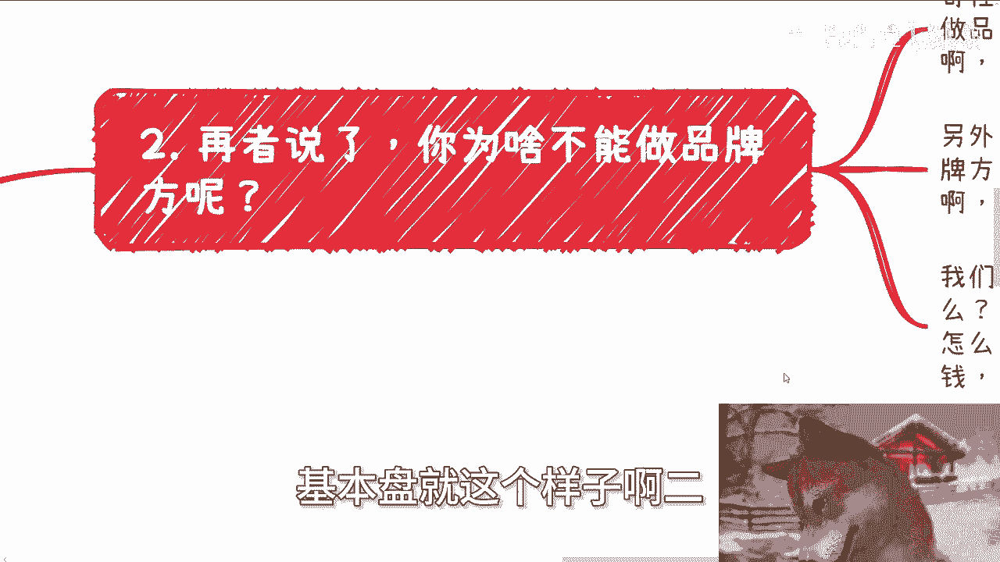

# 课程01：赚钱的首要原则——无风险与不亏损 💰

在本节课中，我们将探讨一个看似简单却至关重要的商业原则：赚钱的首要任务是避免风险并确保自己不亏损。我们将通过分析常见的商业误区，来理解如何在实际操作中应用这一原则。

---

上一节我们提到了课程的核心主题，本节中我们来看看为什么这个原则是默认的，却常常被忽视。

许多人认为“赚钱需要承担风险”或“投资必然有亏有赚”是商业世界的真理。然而，这种思维可能源于长期被固化的观念。例如，人们追求高学历是为了赚钱，但高学历本身并不能保证盈利。同样，在商业选择上，许多人默认接受了“加盟商必须自己出资并承担全部风险”的框架，却从未质疑其合理性。

---

在理解了常见误区后，我们来看看具体有哪些思维陷阱需要避免。

以下是四个需要警惕的关键点：

1.  **跳出既定框架**：商业世界并非只有一种模式。例如，加盟不一定是“自己出钱、自己担风险”的唯一形式。你可以探索成为品牌方、或作为中间代理帮助品牌方寻找加盟商并从中抽成等模式。核心是**转移风险**，而非被动接受。
2.  **质疑“别无选择”**：当面临看似需要高额投入的选项时（如加盟、投资），反问自己：是否真的别无选择？不了解的领域可以选择不做，或者先去深入了解。行动的逻辑应该是 **`了解 -> 评估 -> 行动`**，而非 **`冲动 -> 投入 -> 后悔`**。
3.  **区分“受害者有罪论”**：在商业决策中，如果是在无人胁迫、信息可查的情况下，自己主动选择了高风险行为并导致损失，这与“受害者有罪论”有本质区别。责任在于决策前的调查不足，而非事后归咎于外部环境。
4.  **优先选择零成本或低成本试错**：在投入大量资金前，完全可以通过零成本或低成本的方式测试和了解一个领域。例如，组织线下活动可以在公园或免费场地进行，利用各大社交平台进行宣传。其成本模型可以简化为：**`成本 ≈ 时间 + 精力`**，而 **`金钱成本 ≈ 0`**。这本身就是一种商业实践。

---

掌握了需要避免的陷阱后，让我们将这些要点整合，回归到最根本的行动指南上。

综上所述，践行“无风险、不亏损”原则的核心路径是：
*   **首要目标**：寻找那些不需要你预先投入资金，或者即使失败也不会造成财务损失的机会。
*   **行动前提**：在行动前，务必反复问自己“为什么做”以及“是否已了解清楚”。对于不清楚的环节，先设法弄明白。
*   **实践路径**：从组织一场线下活动、运营一个自媒体账号等低成本实践开始，积累真实的商业感知和经验。

本节课我们一起学习了赚钱的核心原则在于规避风险和确保本金安全。关键在于打破思维定式，主动选择低成本试错的路径，并在每次行动前进行充分的了解和评估。记住，**`不亏损`** 是比 **`高收益`** 更优先的决策基础。