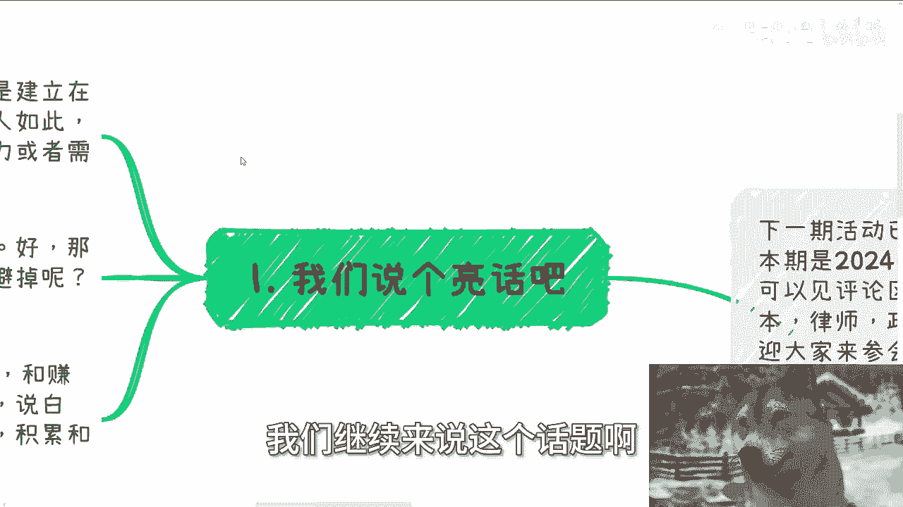
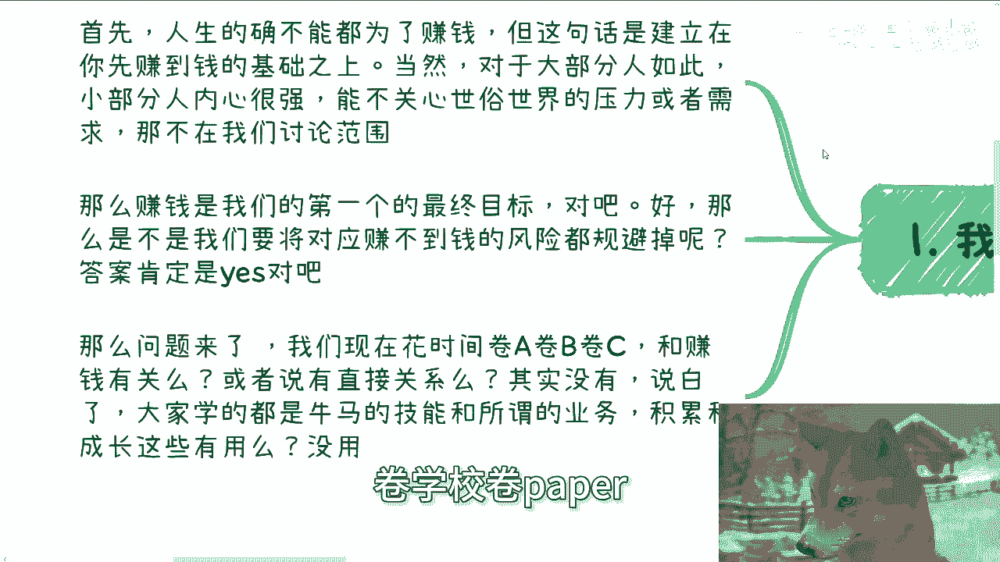
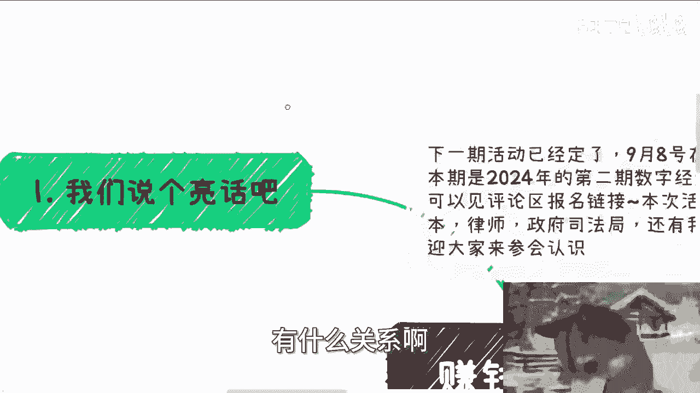
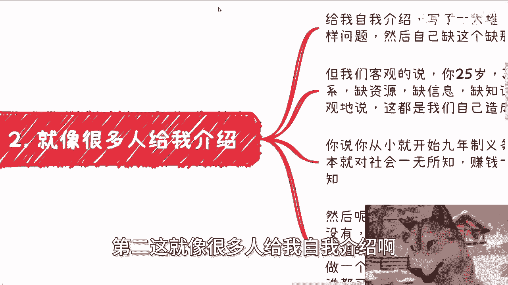
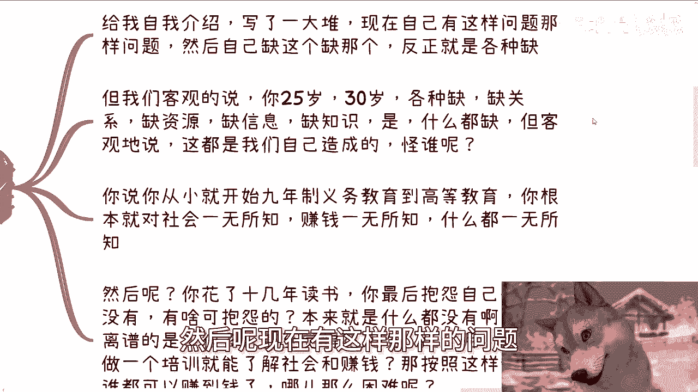
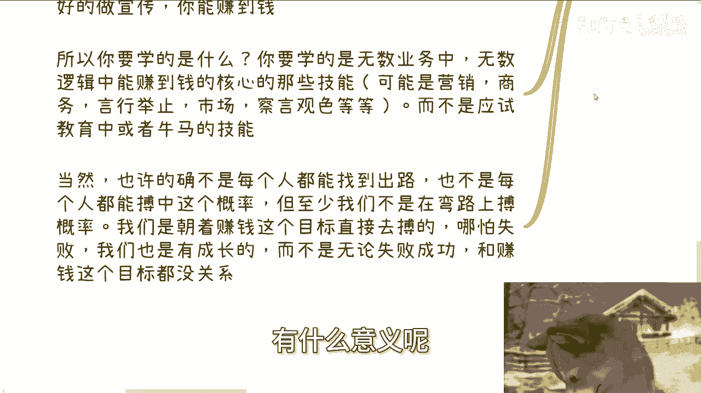
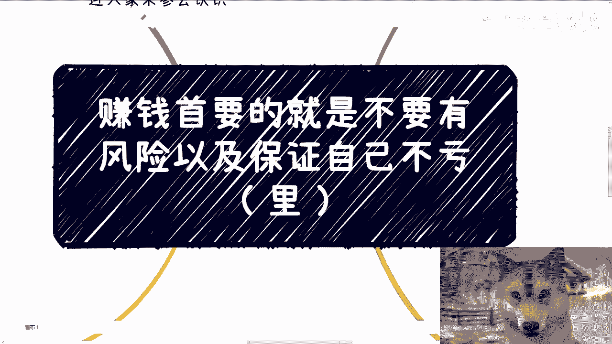

# 赚钱首要的就是不要有风险以及保证自己不亏（里） - P1 - 赏味不足 - BV1Z9HxeEEW1

好那么讲完刚刚那个呢我们就来讲理啊，讲礼，那可能刚刚讲的那个方面呢，已经讲到那个程度了啊，可能很多人也会觉得啊，这个我再往下讲好像也没什么好讲的是吧，还是有的还是有的啊，首先啊我先说一下啊。

下期活动已经定了，9月8号在上海啊，本期是2024年的第二期数字经济大会，详细的可以见评论区报名链接啊，本次活动呢邀请了有资本啊，律师啊，还有我的一些创业合资合作伙伴啊。

欢迎大家可以过来多参会认识认识啊，好那么我前面的这个水完了啊，我们继续来说这个话题啊。

首先啊人生的确不能多为了赚钱，这句话是对的，但这句话的前提是，建立在你先赚到钱的基础之上对吧，这就好像很多人跟我说，哎我就想追求自己的兴趣爱好，我就想去怎么样怎么样，可以没问题。

但是你要去追求很多东西的，前提是你得先了解这个社会，包括赚钱的规律和门道对吧，当然对于大部分人来讲是如此，可能有一小撮人，比如说内心很强大，他说我可以出家啊，我可以他妈的不管外界的事事情啊。

我可以不被这个世俗的社会的压力，或者说需求所困扰，那没问题，这些人不在我们今天讨论范围内，也不在我的，怎么说呢，这个社交范围内对吧，那么赚钱是我们的第一个最终目标对吧，这件事情对大众来讲没问题啊。

对你们对我都没问题，对不对，好，那么我们接下来就说核心了，那么是不是，我们要将对应赚不到钱的风险都规避掉，如果单纯这个问题的话，答案肯定是yes，对不对，当然你说我有没有能力规避，这是另外一件事情啊。

好那么问题来了，我们现在花时间卷A卷B卷C跟赚钱有关系吗，啊卷学历卷，学校卷paper有关系吗。

或者说有直接关系吗，答案一定是没有的对吧，你说有直接吗，没有的，说白了所有人学的是什么，都是牛马的技能，跟所谓的业务技能积累跟成长这些有用吗，或者跟所谓的赚钱的这个最终目标有关系吗。

没有你说说看有什么关系啊。

你说啊我能找到工作是啊，你能找到是你保证是你能控制的吗，不能你找到工作能做多久，是你控制的吗，也不能你找到工作能赚多少钱，是你控制的吗，也不能有什么必然关系啊，没有关系啊。

第二这就像很多人给我自我介绍啊。

他们给我自我介绍是这样子的，写了一大堆，然后呢现在有这样那样的问题。

然后呢就跟我说啊，自己缺这个，自己缺那个，反正就是各种缺，我们客观的说，你一个25岁是或者这么说吧，你一个18岁，20岁，25岁，30岁，各种缺，缺关系，缺资源，缺信息，缺知识是什么都缺。

但是我们客观的来讲，这是不是我们自己造成的，这是不是你们自己造成的是吧，就像我说的，你觉得你为什么缺，是因为你以前一直在读书，你以前没有了解过社会，你也不知道怎么去了解，那请问谁逼你赌，谁逼你不了解了。

对不对，是你父母拿刀子架你脖子上，逼你读吗，没有吧，嗯对吧，是我们每个人默认我们要去读，以及读了之后能够找到好的工作，以及找到好的工作能赚到钱，但是请问成立吗，又或者说就像我上个视频说的。

这个真理又是怎么来的呢，哎妈奇了怪了，对不对，你怪谁都没用，你只能怪自己啊，你你客观的说，你从你从小就9年制义务教育到高等教育，你这些时间等于就是，在高校的这么一个牢笼里面，在学校的牢笼里面。

你根本就对社会一无所知，不管是生活上还是情感上，还是说赚钱上面，你一无所知对吧，这就好像我就单纯随便问个问题，你注册公司报税每个不同的名那个叫什么明细，或者说每个不同的名目下面税怎么报的，有多少百分比。

你知道吗，你不知道对吧，你做家公司有多少风险在里面，你知道吗，不知道你知道个啥，你什么都不知道，你不要搞得你好像知道，你知道的都是短视频告诉你的，什么都不知道，对不对，然后呢，那我们又客观的说。

你花了十几年读书，你最后抱怨自己什么都没有，有啥可抱怨的，本来就什么都没有啊，你你认为的有，只是你认为的有啊，谁跟你讲过，一定有是吗，但最离谱的是什么，很多人十几年读书，他什么都没有。

但是甚他他反而会觉得花几次对吧，培训或者花啊，花几次的这种尝试，或者几个月的培训，或者说呃做几个月的咨询，他就能够了解社会更赚钱的逻辑了，那我就这么说，按照这种说法，他没什么门槛。

谁都可以赚到哪这么困难呢，那问题事实是这样子的，对不对，何必自欺欺人呢，嗯第三很多人说我很多人问啊，为什么这么难，我其实以前就说过，什么是最容易的，你们读书是最容易的，为什么。

因为有老师带有标准答案对吧，那有老师带有标准答案意味着什么，意味着不用动脑子，脑子这个东西是不需要的，你就是个机器对吧，那什么最容易啊，让大家觉得读书可以学习到一切，让你们能够在学校的这个牢笼里面。

不关心任何外面的事情，也不了解任何外面的东西，这是最容易的，对不对，那大家认为读书可以获得一切，当然啊，我从来没有说过读书跟应试教育没有用，但是有用和去你们能从里面获得一切，这两这两者不划等号好吗。

不划等号啊，我只是告诉大家，别误解，应试教育的本身就是为了应试，别搞得自己好像真的能从中学到什么，不好意思，你什么都学不到，你说难吗，当然难了，因为整个社会没有标准答案，这跟赚不赚钱其实没有关系对吧。

没有标准答案，因为没有所谓的老师，而且另外也没有所谓的那个那个，你也分不清楚所谓的敌我，自然就难了，但是问题是这才是社会的本质啊对吧，你要我说你花了十几年来读书，最后也就是个应试教育的结果。

你能得到什么吗，没有除了一张纸对吧，还是说啊，而且你得到这张纸，本质上还是因为你有个老师以及有标准答案，这就好像一个人被关了十几年，20几年出来之后，你问我为什么这么难，你觉得有意义吗。

这句这个问题你怪谁呢对吧，你要我说你可以认为社会难，但同样的你也可以认为是自己之前太无知，这就好像我们现在说整个整个经济形势困难，对吧，或者大家的这个财政状态不好，就是你你你看问题一定要有两面性。

就是你既可以认为现在是经济情况不好，或者现在财政差，你也可以认为是之前的20年，大家过得太好了，你明白吗，就是换而言之是什么，就是换而言之，就是说有可能啊，我只是说有可能本身你们十几年被关在里面。

就什么都不知道而出来，你们才是真正的在活着，真正的接触这个社会，而同样的这个才是所谓接触社会这个东西，才是一个真实的样貌，而不是你们学校里面所得到的所有的信息，对不对，这就像我们说刚刚说的那个经济。

经济形势一样的，就是很有可能有没有有没有一种可能性，并不是现在经济形势差，并不是因为大家财政不好，而是因为这可能才是一个，就是从长远的时间来讲，这可能才是一个啊，就是各个国家正常的一个样子。

之前的10年20年大家觉得过得很好，是因是反而是因为天时地利人和，让大家觉得过得很好，他不是一个常态，对吧好，第四，我们回归主题啊，说了这么多，跟我们主题有什么关系呢，你想啊，你应试教育为了一张纸。

也就这个文凭，那请问文凭能赚到钱吗，不能对吧，不能啊，应试教育能赚到钱吗，也不能，你会很多新兴技术，你有很多公司，你养了很多开发跟主播，请问能赚到钱吗，依然不能，那么这些东西的投入的本身。

不管是时间还是别的东西，就是所谓的风险跟亏，那么什么能赚到钱呢，你懂得如何把握那些要追求文凭人的心理，你如你懂得把握那些追求文凭人的家庭父母，你能赚到钱，你懂得怎么在知识。

应试教育当中进行相关的辅导和活，符合国家方向的去辅导，做应试教育的培训，或者说包括出国，你能赚到钱，你知道怎么从企业，政府高校当中接到单子，你知道如何去搞好关系，你能赚到钱，你知道怎么做营销。

怎么更好的做宣传，你能赚到钱对吧，也就意味着什么，意味着你手上有工具没有用，你得懂得怎么用这个工具，你单纯有这个工具，工具能换来钱吗，不能，所以你要学的是什么，你要学的是无数业务当中，无数逻辑当中。

无数细分领域当中能赚到钱的那些核心的技能，可能是营销，可能是商务，可能是一些言行举止，可能是市场，可能是察言观色等等等，但永远不可能是你们应试教育当中的那些东西，或者来说牛马的技能，这些都赚不到钱。

对吧，那些辛苦钱不要来跟我讲啊，什么什么一年，什么什么做，做22要做365天对吧，赚了多少钱那种不要来讲啊等等，太low了，这种不叫赚钱，这就这就这种就叫就叫牛马啊，当然也许啊还是那句话。

的确我们不是每个人都能找到出路的，也不是每个人都能在这个博弈当中，博中这个概率的，但是至少我们不是在弯路上博概率啊，你想想是不是就是我们就算是博概率，我们也得朝着赚钱这个目标去补啊，你哪怕失败了。

我们也是有成长的，而不是说我们现在所大部分的人在那边走，走独木桥，或者在那边做，有做一些有的没的，你你你无论走独木桥还是做些有的没的，你最终无论成功还是失败，跟赚钱这个最终目标都没有关系，有什么意义呢。

对不对，有任何意义吗，啊能吗，就像我之前一直说的两个例子，第一你挂个清华北大的文凭，你挂个哈佛的文凭怎么来，钱能从天上掉下来吗，啊你站在路口填，从钱从天上掉下来，给你印钞有用吗，没有用对吧。

这第一第二我给你们找到，比如说啊我给你们找到各个地方的关系，我给你们3分钟自我介绍，你怎么介绍，你跟对方说爱，我是什么学校出来的，我得过什么金奖，我拿过什么paper哦，我写过什么论文对吧。

我怎么样怎么样有用吗，会听你这些东西吗，会吗，不会为什么，因为你讲所有东西都不能赚钱，有用吗，对不对，就是很多人他只是当下没有这个压力，他没有到这个时间，他明白不了，或者他也不屑于明白，但是同样道理。

等你明白了，来不及了，跟你有什么关系啊，我就问当下他妈的物价这么高，房价这么高，切就你就你打工那赚点钱有用吗，有什么用。

