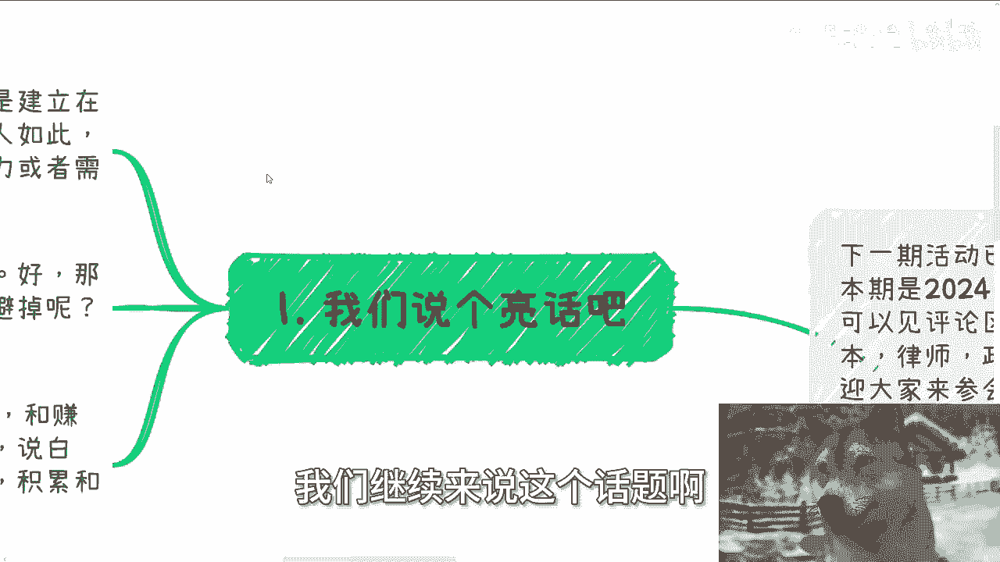
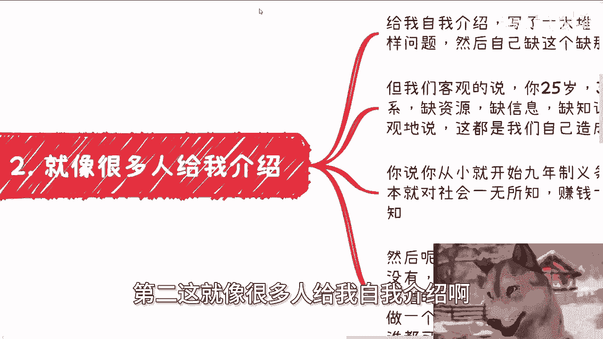

# 课程：赚钱的首要原则是无风险与不亏损（第一部分）💰 - P1

在本节课中，我们将探讨赚钱的核心原则，即如何避免风险并确保自己不亏损。我们将分析传统教育与赚钱目标之间的关系，并指出哪些技能才能真正带来财富。

---

上一节我们提到了赚钱的最终目标，本节中我们来看看实现这个目标的前提条件。

首先，人生的确不能只为了赚钱，这句话是正确的。但这句话的前提是，建立在你先赚到钱的基础之上。这就好像很多人说，只想追求自己的兴趣爱好。可以，没问题。但是，追求很多东西的前提是，你得先了解这个社会，包括赚钱的规律和门道。当然，对于大部分人来讲是如此。可能有一小撮人，内心很强大，可以出家，可以不管外界的事情，可以不被世俗社会的压力或需求所困扰。那没问题。这些人不在我们今天讨论范围内，也不在我的社交范围内。那么，赚钱是我们的第一个最终目标。这件事情对大众来讲没问题，对你们对我都没问题。

---

那么，我们接下来就说核心了。是不是我们要将对应赚不到钱的风险都规避掉？如果单纯这个问题的话，答案肯定是 **yes**。当然，你说我有没有能力规避，这是另外一件事情。

好，那么问题来了。我们现在花时间卷A、卷B、卷C跟赚钱有关系吗？卷学历、卷学校、卷paper有关系吗？或者说有直接关系吗？答案一定是没有的。你说有直接吗？没有的。说白了所有人学的是什么？都是牛马的技能。跟所谓的业务技能积累、跟成长这些有用吗？或者跟所谓的赚钱的这个最终目标有关系吗？没有。你说说看有什么关系啊？你说啊我能找到工作。是，你能找到是你保证是你能控制的吗？不能。你找到工作能做多久，是你控制的吗？也不能。你找到工作能赚多少钱，是你控制的吗？也不能。有什么必然关系啊？没有关系啊。

---

第二，这就像很多人给我自我介绍。他们给我自我介绍是这样子的，写了一大堆。然后呢现在有这样那样的问题。然后呢就跟我说啊，自己缺这个，自己缺那个，反正就是各种缺。我们客观的说，你一个25岁，或者这么说吧，你一个18岁、20岁、25岁、30岁，各种缺。缺关系、缺资源、缺信息、缺知识，是什么都缺。但是我们客观的来讲，这是不是我们自己造成的？这是不是你们自己造成的？就像我说的，你觉得你为什么缺？是因为你以前一直在读书，你以前没有了解过社会，你也不知道怎么去了解。那请问谁逼你读？谁逼你不了解了？对不对？是你父母拿刀子架你脖子上，逼你读吗？没有吧。是我们每个人默认我们要去读，以及读了之后能够找到好的工作，以及找到好的工作能赚到钱。但是请问成立吗？又或者说就像我上个视频说的，这个真理又是怎么来的呢？你怪谁都没用，你只能怪自己。你客观的说，你从你从小就9年制义务教育到高等教育，你这些时间等于就是在高校的这么一个牢笼里面，在学校的牢笼里面。你根本就对社会一无所知，不管是生活上还是情感上，还是说赚钱上面，你一无所知。这就好像我就单纯随便问个问题，你注册公司报税每个不同的名目下面税怎么报的，有多少百分比，你知道吗？你不知道。你做家公司有多少风险在里面，你知道吗？不知道。你知道个啥？你什么都不知道。你不要搞得你好像知道，你知道的都是短视频告诉你的，什么都不知道。

然后呢，那我们又客观的说。你花了十几年读书，你最后抱怨自己什么都没有，有啥可抱怨的？本来就什么都没有啊。你认为的有，只是你认为的有啊。谁跟你讲过一定有？但最离谱的是什么？很多人十几年读书，他什么都没有。但是他反而会觉得花几次培训，或者花几次的尝试，或者几个月的培训，或者说做几个月的咨询，他就能够了解社会更赚钱的逻辑了。那我就这么说，按照这种说法，它没什么门槛，谁都可以赚到，哪这么困难呢？那问题事实是这样子的。何必自欺欺人呢？

---

第三，很多人问，为什么这么难？我其实以前就说过，什么是最容易的？你们读书是最容易的。为什么？因为有老师带，有标准答案。那有老师带有标准答案意味着什么？意味着不用动脑子。脑子这个东西是不需要的，你就是个机器。那什么最容易啊？让大家觉得读书可以学习到一切，让你们能够在学校的这个牢笼里面，不关心任何外面的事情，也不了解任何外面的东西，这是最容易的。那大家认为读书可以获得一切。当然，我从来没有说过读书跟应试教育没有用。但是有用和你们能从里面获得一切，这两者不划等号。不划等号。我只是告诉大家，别误解。应试教育的本身就是为了应试，别搞得自己好像真的能从中学到什么。不好意思，你什么都学不到。

你说难吗？当然难了。因为整个社会没有标准答案。这跟赚不赚钱其实没有关系。没有标准答案，因为没有所谓的老师，而且另外也没有所谓的敌我，自然就难了。但是问题是这才是社会的本质。你要我说，你花了十几年来读书，最后也就是个应试教育的结果。你能得到什么吗？没有，除了一张纸。还是说，而且你得到这张纸，本质上还是因为你有个老师以及有标准答案。这就好像一个人被关了十几年、20几年出来之后，你问我为什么这么难，你觉得有意义吗？这个问题你怪谁呢？你要我说，你可以认为社会难，但同样的你也可以认为是自己之前太无知。

这就好像我们现在说整个经济形势困难，或者大家的这个财政状态不好。你看问题一定要有两面性。就是你既可以认为现在是经济情况不好，或者现在财政差，你也可以认为是之前的20年，大家过得太好了。你明白吗？就是换而言之是什么？就是换而言之，就是说有可能，我只是说有可能，本身你们十几年被关在里面，就什么都不知道而出来，你们才是真正的在活着，真正的接触这个社会。而同样的，这个才是所谓接触社会这个东西，才是一个真实的样貌，而不是你们学校里面所得到的所有的信息。这就像我们说刚刚说的那个经济形势一样的。就是很有可能，有没有一种可能性，并不是现在经济形势差，并不是因为大家财政不好，而是因为这可能才是一个，从长远的时间来讲，这可能才是一个各个国家正常的一个样子。之前的10年20年大家觉得过得很好，反而是因为天时地利人和，让大家觉得过得很好，他不是一个常态。

---

第四，我们回归主题。说了这么多，跟我们主题有什么关系呢？你想啊，你应试教育为了一张纸，也就这个文凭。那请问文凭能赚到钱吗？不能。应试教育能赚到钱吗？也不能。你会很多新兴技术，你有很多公司，你养了很多开发跟主播，请问能赚到钱吗？依然不能。那么这些东西的投入的本身，不管是时间还是别的东西，就是所谓的风险跟亏。

那么什么能赚到钱呢？你懂得如何把握那些要追求文凭人的心理，你懂得把握那些追求文凭人的家庭父母，你能赚到钱。你懂得怎么在知识、应试教育当中进行相关的辅导，符合国家方向的去辅导，做应试教育的培训，或者说包括出国，你能赚到钱。你知道怎么从企业、政府、高校当中接到单子，你知道如何去搞好关系，你能赚到钱。你知道怎么做营销，怎么更好的做宣传，你能赚到钱。也就意味着什么？意味着你手上有工具没有用，你得懂得怎么用这个工具。你单纯有这个工具，工具能换来钱吗？不能。

所以你要学的是什么？你要学的是无数业务当中、无数逻辑当中、无数细分领域当中能赚到钱的那些核心的技能。可能是营销，可能是商务，可能是一些言行举止，可能是市场，可能是察言观色等等等。但永远不可能是你们应试教育当中的那些东西，或者来说牛马的技能。这些都赚不到钱。那些辛苦钱不要来跟我讲，什么一年做365天赚了多少钱，那种不要来讲，太low了。这种不叫赚钱，这种就叫牛马。当然，也许还是那句话，的确我们不是每个人都能找到出路的，也不是每个人都能在这个博弈当中博中这个概率的。但是至少我们不是在弯路上博概率。你想想是不是？就是我们就算是博概率，我们也得朝着赚钱这个目标去搏。你哪怕失败了，我们也是有成长的。而不是说我们现在所大部分的人在那边走独木桥，或者在那边做些有的没的。你无论走独木桥还是做些有的没的，你最终无论成功还是失败，跟赚钱这个最终目标都没有关系，有什么意义呢？有任何意义吗？能吗？

就像我之前一直说的两个例子。第一，你挂个清华北大的文凭，你挂个哈佛的文凭怎么来？钱能从天上掉下来吗？你站在路口，钱从天上掉下来，给你印钞有用吗？没有用。这第一。第二，我给你们找到各个地方的关系，我给你们3分钟自我介绍，你怎么介绍？你跟对方说，我是什么学校出来的，我得过什么金奖，我拿过什么paper，我写过什么论文，我怎么样怎么样，有用吗？会听你这些东西吗？会吗？不会。为什么？因为你讲所有东西都不能赚钱，有用吗？就是很多人他只是当下没有这个压力，他没有到这个时间，他明白不了，或者他也不屑于明白。但是同样道理，等你明白了，来不及了，跟你有什么关系啊？我就问当下物价这么高，房价这么高，你就你打工那赚点钱有用吗？有什么用。

---

本节课中我们一起学习了赚钱的核心原则是避免风险和不亏损。我们分析了传统教育路径与赚钱目标之间的脱节，指出文凭和应试技能本身并不能直接带来财富。真正的赚钱能力来自于对市场需求的理解、人际关系的把握以及核心商业技能的掌握，如营销、商务和市场洞察力。希望你能重新审视自己的技能树，将精力投入到真正能创造价值的方向上。