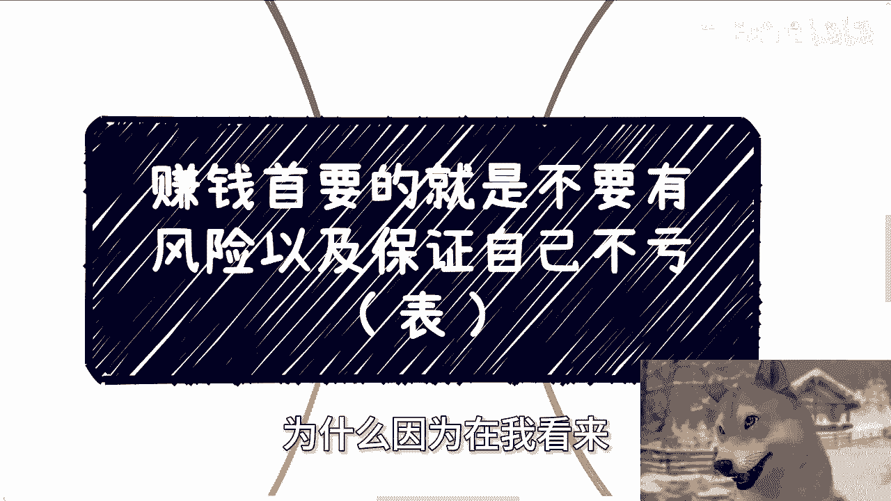
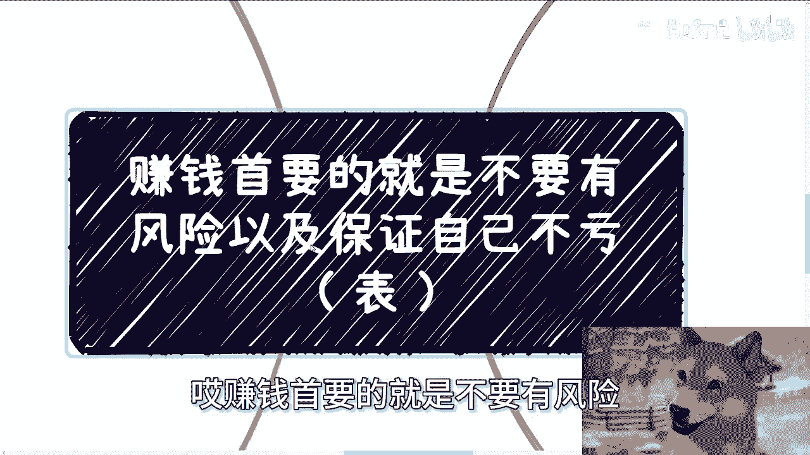
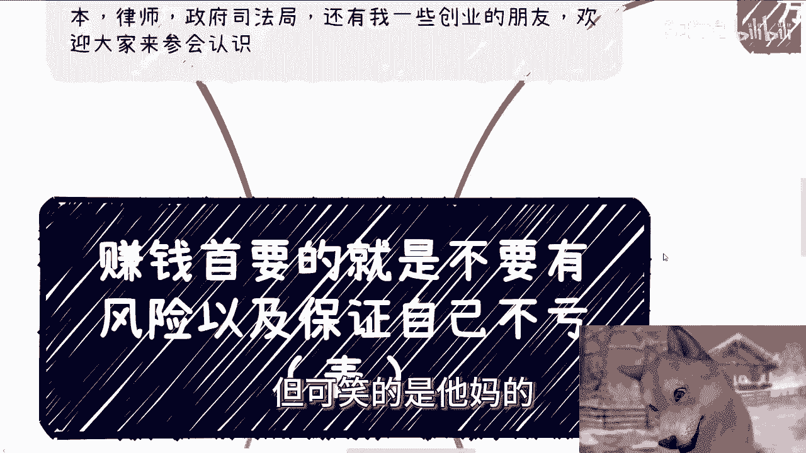
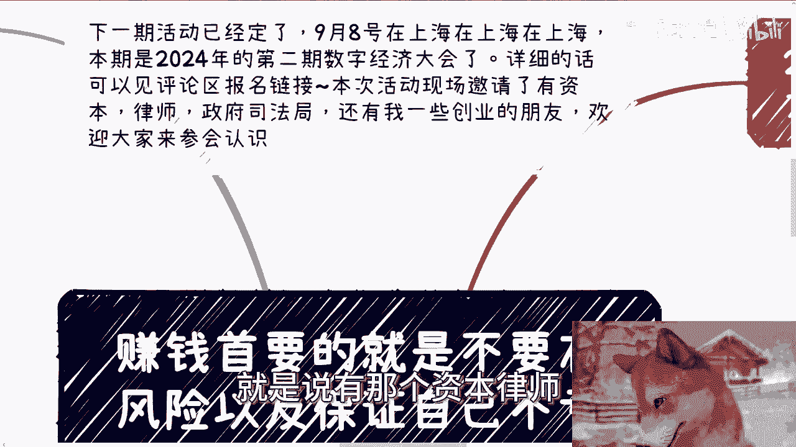
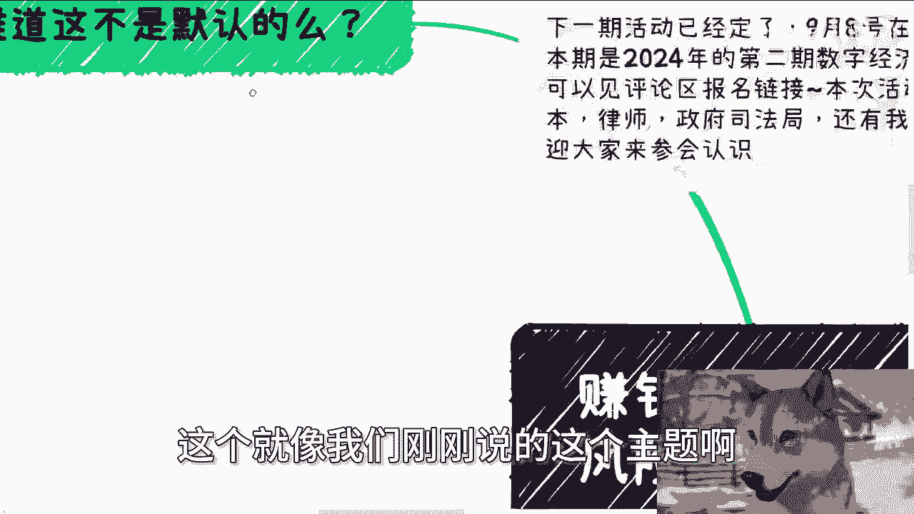
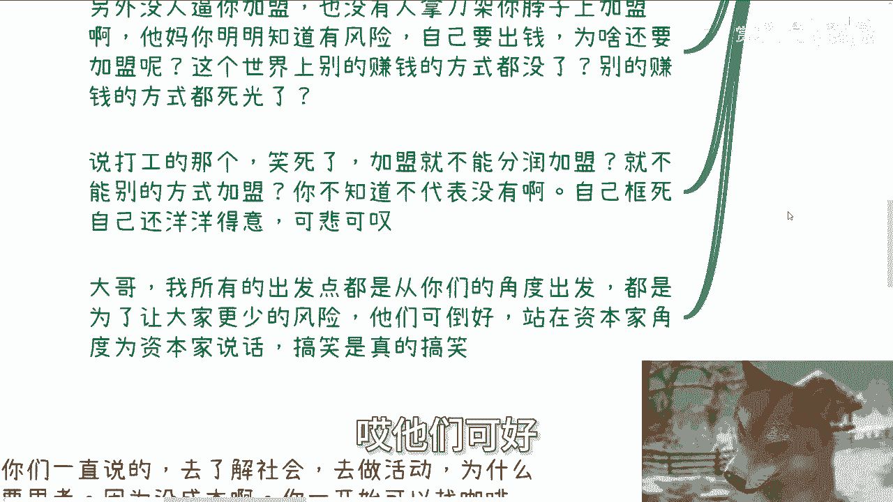
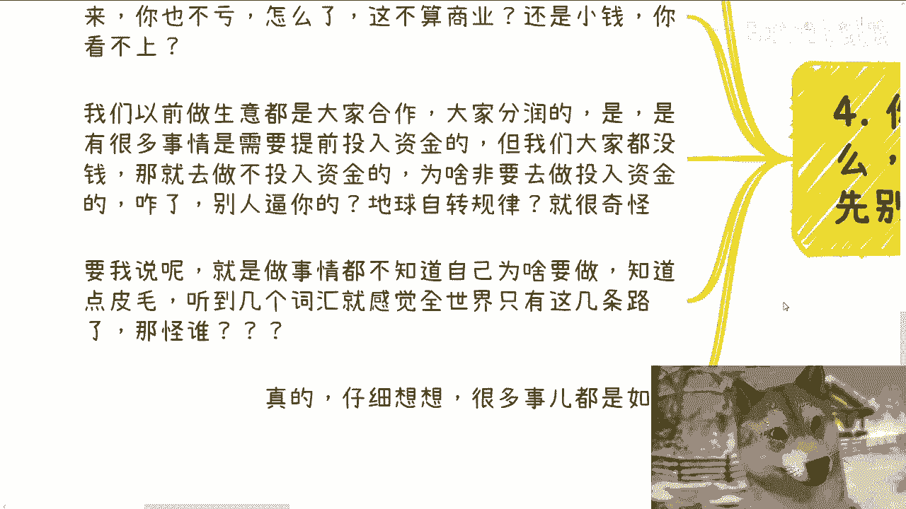
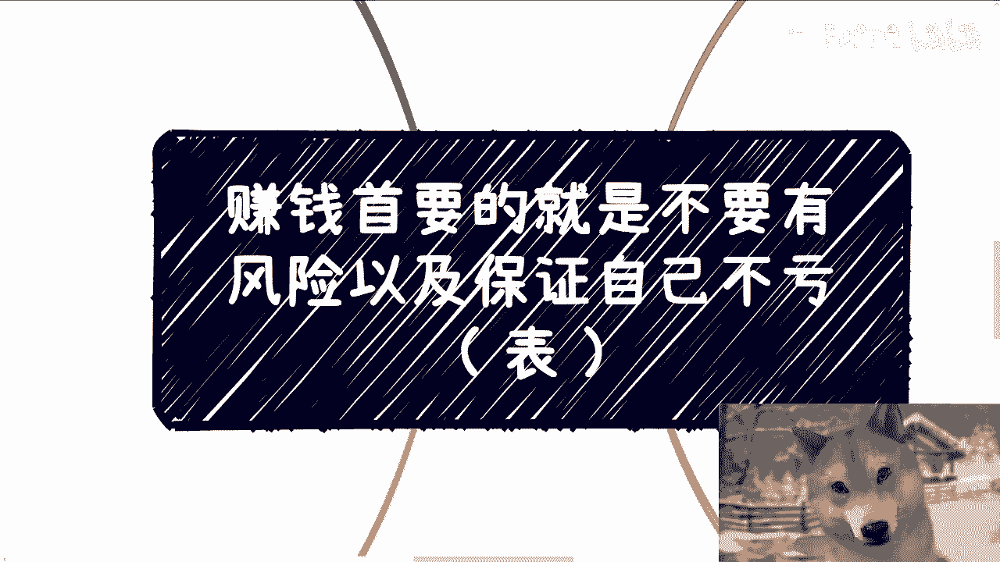
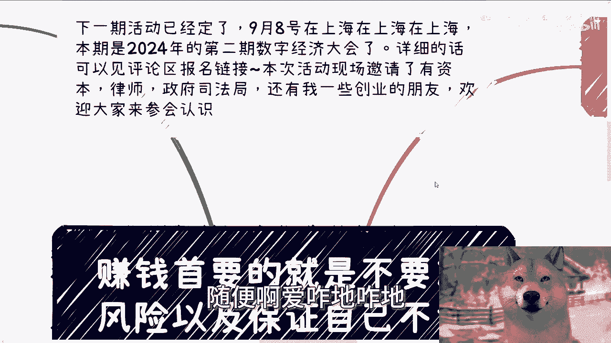

# 赚钱首要的就是不要有风险以及保证自己不亏（表） - P1 - 赏味不足 - BV1TGH4eKEow

好大家好呃，9月份了啊，9月份了。

时间过得还是很快的啊，那么今天我们来讲的主主题啊，是跟昨天那个叫什么代理跟加盟商的，那个主题衍生出来的啊，我就从来没有想过啊，我还会衍生出来这个主题啊，为什么，因为在我看来。

我认为这种主题没什么好讲的，那么唉你看看这主题对吧，他妈的不知道的，以为我脑残是吧，唉赚钱首要的就是不要有风险。

以及保证自己不亏，这他妈都知道是吧，这还用讲吗啊，但可笑的是。

他妈的呵呵啊，待会我们来说啊，首先啊就是那个下一期活动已经定了，9月8号在上海啊，就本周日额，本期呢是2024年的第二期数字经济大会啊，年底的话我会在北京再办一次啊，内容不一样的，每次内容都不一样的。

因为我请的嘉宾都不一样，呃详细的话可以评论区见报名链接好吧，本次活动的话我也邀请了，就是说有那个资本律师额。

还有我的一些创业领导啊，创业的朋友，欢迎大家过来能多参会，多认识认识啊，呃好我们先来看啊，首先啊这个就像我们刚刚说的这个主题啊。

难道不是默认的吗，对吧啊，嗯就像我今天就觉得这个也自我反思的事情啊，就难道还有人赚钱要自己有风险，或者自己要吃亏吗，对吧我不太明白啊，那一些人呢我觉得是不是被驯化太久了啊，跪的太久了。

或者还说他妈的被洗脑太久了，就觉得好像有很多真理啊，奇怪了，我都我其实也不明不太明白，很多人认为所谓的真理哪来，就像我问他们，我说你们读书为了什么啊，他说他说要赚钱啊，我说那你读了比较高的学历。

又为了什么，为了赚钱，那我说你读了高的学历能赚钱吗，不一定吧，你缺你保证吗，你知道吗，你不知道你知道个啥，对不对，不要自欺欺人啊，硬是应试教育，下面你跟我说，你知道你知道个啥啊。

你包括昨天还有评论跟我说什么，他说哎呀，他说我就不想赚钱，我就是想通过读书啊，我就是想读一个好的学历，我就是想要去了解整个社会的样子，我就想去呃学习到很多知识，你听听这说的话，他妈搞笑嘞。

你确定你读书能学到知识，你确定你读书能了解社会，以及你确定读书能知道别的东西啊，对吧就是就是他会觉得这是一个真理，而且甚至他还会来反问我，哼那么看笑了啊，昨天我不是说了加盟跟代理商吗，啊，有评论说他说。

加盟就是借着别人的品牌下蛋去赚钱，这句话对不对对，没毛病啊，自己肯定是需要投入的啊，风险是自己承担，那还有评论说呢，风险肯定自己担啊对吧，让品牌方担，你不是加盟，你这是打工，你说这里面两句话对不对对。

没毛病对吧，但是我觉得搞笑的是什么，我昨天你们自己去看看我昨天的主题，我主题他妈就是告诉大家加盟这种逻辑，就是因为风险要自己担，要自己出钱，所以风险很高，赚钱难度很高，还要来跟我反。

就是反复去强调这件事情干嘛呢，对不对，那搞笑嘞，我什么时候说过我，我好像搞得我好像说他妈的加盟风险不在自己，一样对吗，另外是什么，另外没人逼你加盟，也没有人拿刀子架你脖子上，让你加，对不对啊。

就很多人很搞笑的，明明知道有风险，明明知道自己要出钱，那为什么还要加盟呢对吧，而按照这个说法，那世界上别的赚钱方式没了，别的赚钱人都死光了啊，说打工那个就更搞笑了，加盟难道就不能分润加盟啦。

就不能用别的方式加盟啦，啊，哎你不知道不代表没有啊，你自己框死自己，还他妈洋洋得意，还拿出来炫耀，还要还要拿出来评论一下，有什么好评论的，对不对，你非要被别人定的那种框架，被所谓的项目方电脑框架框死。

然后非要告诉自己哦，但世界就这么运转的，而像加盟必须只必须自己出钱，必须他妈风险自己，那谁他妈告诉你，太搞笑了对吧，唉我就不明白了，我所有的出发点都是从普罗大众，从老百姓角度出发，我来告诉你们。

这风险在哪里，都是为了让大家更少的风险诶，他们口号站在资本家的角度为资本家说话。

我的我是不太明白的对吧，当然啊我也得告诉你们啊。

中国的基本盘就这个样子啊，也许你们不了解，但是我告诉你们基本盘就这个样子啊。

二再者说了，你说啊我们今天说这个主题对吧，好，再者说你为什么不能做品牌方呢，哎奇怪了，你说这些人啊给我评论，就是他既然知道风险在加盟新加盟商身上，那请问你为什么要做加盟商呢，你为什么不能做品牌方呢。

对吧好嘞，那我只要这么回，他肯定要想了，妈的我就是个普通人啊，我就是个他妈的什么都没有的人，我怎么可能做品牌方呢，好那咱就这么说，你做不了对吧好，那做不了可以不做啊，你可以找别的路啊，谁当兵。

你做了对不对，另外你也可以做代理的代理嘛，你找到品牌方对吧，你帮品牌方做营销，找真正的代理商，找真正的你认为要承担风险，出钱的韭菜，你就负责抽抽水，怎么了呢，这不是方法吗，啊诶我他妈搞不懂了哦。

我们做事情难道不是为了自己赚钱，风移风险转移出去吗，啊我就发现很多人他妈读书读傻了，是吧，非要这么死板，那他妈的确怪不得这么多人被割嘛，对吧，怎么了，非要加盟天经地义啊，加盟必须出钱，必须自己承担风险。

谁他妈告诉你的，啊你非要跟我说哦，这个品牌就是这么加盟，那你可以不加盟啊，你找别的品牌怎么了，别的品牌死光了，我都不知道他妈脑子怎么想的对吧，第三记住你不了解的，你可以不做，你懂吗，没人逼你做啊。

对不对，我跟你讲真的好多事啊，和我说，张老师，我去帮别人做电商了，亏了很多钱，我说对方给你什么东西，你为什么要跟对方做对吧，你为什么要投钱以及流量哪里来，一问三不知，问这些东西没有一个知道的。

那我就问他，那你为什么要做呢，你既然不清楚，你为什么要做呢，对不对，对方逼你了，绑架你家人了还是威胁你了啊，还有跟我说开线下自习室的，尼玛说3年亏了多少钱，还花了很多精力，我说你评估过市场没有。

你评估过投入产出比，没有流量的转化率多少，比如说你一年里有多大流量，有这些流量里面有多少是付钱的，你知道吗，你不知道，那我就问了，你为什么要做呢，对吧，那之前还有人让我帮他制造舆论啊。

说自己投资亏了大概30万，我说那你现在干嘛呢，我当时怎么跟他讲的，这个行为就非常的不了解我国国情，请问拉了有用吗，拉拉叫什么，拉拉叫你是寻衅滋事，懂吗啊，第二哼，我当时就问他逼你投了吗，绑架你投了吗。

还是怎么地了对吧，我说一没逼你投，二没绑架你投，你自己贪，你自己想要中彩票，你为什么要投呢，我以前就说过，很多人从头到尾只会说，普通人做事试错成本很高，普通人做事很容易被骗，哎我他妈奇了怪了。

哎我就问啊，我先问一点，是咱们从逻辑来讲啊，这个世界上是不是所有事情成本都很高，不是吧，是不是所有事情成本都很低，也不是吧，对不对，那也就是说总有试错成本高，以及总有试错成本低的，对不对，好。

那我说怎么地呢，你非要去选择试错成本高的，那他妈怪谁呢，唉我奇了怪了，对不对，那有人又要说了，他说陈老师，你这个是受害者有罪论，哎尼玛大哥，你有没有想过我们上面举的这些例子，以及你们所怎么说呢。

被被坑过的一些案例，你是受害者，我就问是谁让你变成受害者的，是他妈你自己啊，你别学会一句话，就他妈到处套啊，对不对哦，你说一个女的穿衣自由，然后她穿的怎么说呢，比较性感啊。

或者来说他可能也没有穿得比较性感，他就按照自己的这个这个爱好喜欢去传达，然后被骚扰了，然后这个时候网络上就有人说哎这个女的不好，这个女的自作自自作自受，这叫什么，这叫受害者有罪论，对吧，哦你们做商业。

你们要赚钱，以及上面这些东西，就像我说的，包括你们投资，有人逼你们吗，有人架在脖子上吗，没有啊，你们这些所谓的受害人，是他妈属于没事情做网上贴啊，还他妈主动贴，这怪谁啊，对不对，他妈莫名其妙啊。

有的人要说了，那我们没得选啊，操大哥，你是没得选，那你可以不选啊，啊你不了解，你可以先去了解，你不明白你可以先去明白，对不对，谁他妈的跟你就像，就像你现在要去应试教育，你考你考个大学，你你考个硕士啊。

谁跟你说，你一年级读完就考大学了，有人跟你这么讲吗，啊你咋你咋不两年级读完就去读下读大学呢，你咋不去高考呢，哎奇了怪了，是你没得选吗，啊你可以不选啊。

谁他妈让你瞎选了呢，然后瞎选完了还在那边抱怨，哎呀，普通人试错成本很高，搞你妈个蛋呢，搞对吧，第四你做事情你多问问自己，为什么你但凡不清楚的先了解清楚。

你别着急，做不好嘛，对不对，我一直跟你们讲的，去了解社会，去做活动，为什么，因为这些东西不需要思考，因为你没有成本，你除了一些精力成本，时间成本，你没有别的实质上的成本对吧，场地你可以找咖啡馆。

你甚至可以找个公园都可以，免费地方都可以，无所谓，然后正常的自媒体平台你就做宣发对吧，我就这么跟你说，B站微博小红书，抖音快手视频号，你能做的地方都做一遍对吧，能宣发的地方都宣发一遍，怎么了呢。

能能你有什么成本啊，你不做这些事情的时候，不也是吃喝玩乐吗，有什么区别，有人来最好没人来拉倒你也不亏啊，怎么了，这不算商业了啊，还是说这些小钱你看不上，这我就不明白了呀对吧，我们以前做生意都是什么。

都是大家合作，大家分润的，是还是那句话，这世界上有很多事情是需要提前投入资金的，但是同样的，但他妈这世界上也有很多事情，不是需要投入资金的，那么总归没有一件事情百分之百的吧，啊哦但是你说OK陈老师。

我们普罗大众没没钱，没有资本，那你就去做不投入资金的了，怎么了，那为什么非要去做投入资金的吗，怎么了，那别人逼你啦啊还是你你你是被人控制了啊，地球自转规律还是怎么说，哎我就搞不明白呀，是不是你要我说。

就是做事情都不知道自己为啥要做的，你读一个硕士，出出个国都不知道自己为什么要读的，你就知道点皮毛，听到几个词汇就感觉全世界就他妈这样几条路，那他妈怪谁呢啊怪谁。

对吗，你回到我们主题叫什么叫赚钱，首要的是不要有风险以及保证自己不亏，对不对，诶，那第一我们要就要去了解怎么样才叫没有风险，第二就是我们尽量不要自己投入金钱，那你肯定不会亏对吧。

然后细枝末节里面包括合同啊，包括股份啊，包括其他东西啊，kiss白kiss，我们到时候再去看，对不对，而不是说你什么都不了解啊，然后就就默认啊，我我好像很了解社会，一点一点都没接触过的情况。

下面啊我很了解对吧，然后呃那个那个什么就是我们昨天说的啊，比如说有有些人有有些机构对吧，说什么保证就业的啊，保证怎么样的啊，你你觉得诶也好像也不贵对吧，五六千七八千，我试试看，那怪谁呢，哎妈奇了怪了。

就是哼就是你知道吗，就是我们在网络上一直吐槽的时候是什么，就是你比如说最近房子跌了对吧，很多人在那边说啊，这个跌了对吧，这个哎呀自己很亏对吧，怎么样子，那我们就这句话呀。

那涨的时候攒他妈没见你们分钱的啊，尼玛奇了怪了哦，这世界对你们来讲，这妈永远涨啊，不能不能亏啊，亏了就他妈抱怨，嘿，蛮好玩的对吧，嗯行啊，就这么着啊，活动的话9月8号啊。

9月8号详情的话呢，见评论的这个置顶链接好吧，然后议程啊，嘉宾啊都在里面，你们有任何问题的私信我好吧，有任何问题私信我，剩下的话就是说职业规划啊，商业规划随缘啊，真随缘，我也不逼你们。

我也不架着刀子在你们脖子上，我也架不到，对不对啊，你们觉得有任何的规划和未来建议的，你们希望通过跟我的沟通，给你们一些比较贴近社会发展的建议，跟规划的话，那么你们就可以整理好对应的个人问题，跟个人背景。

我们再来做咨询啊，随便啊。

