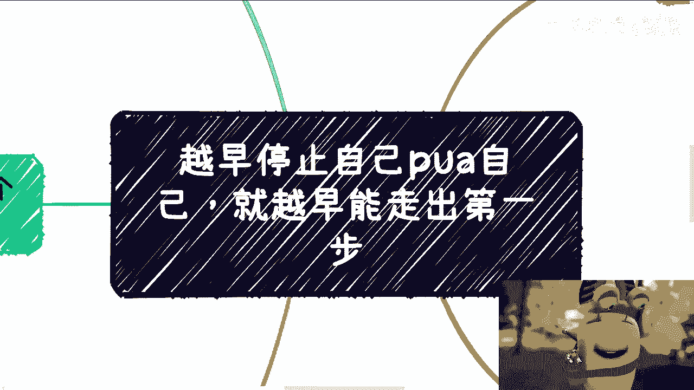
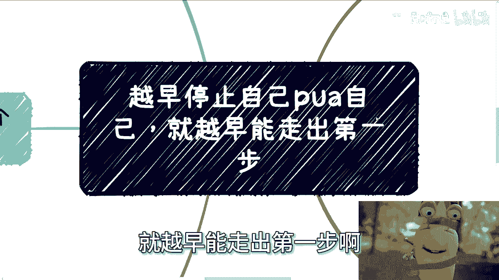
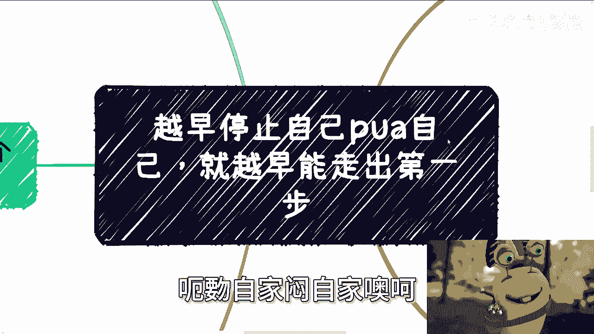
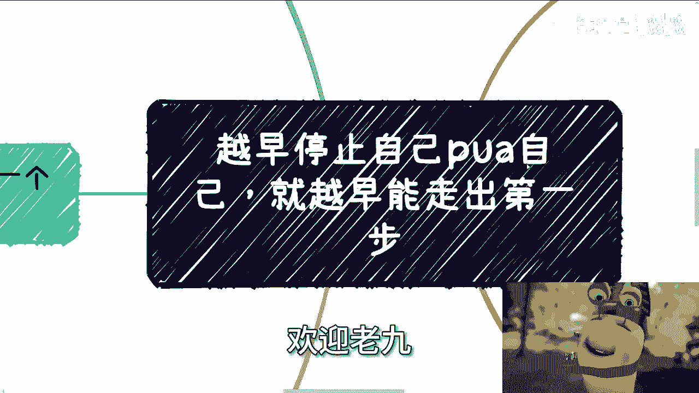
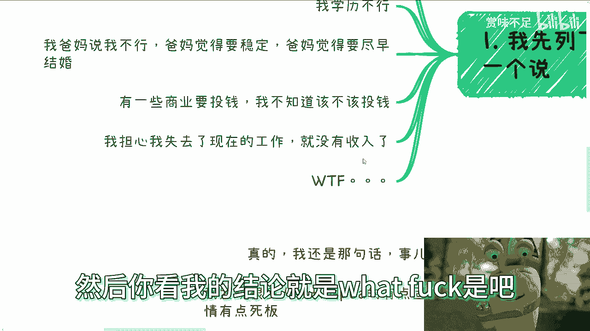
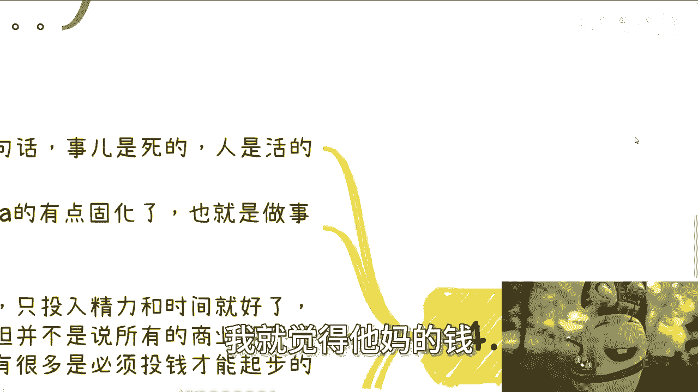

# 越早停止pua自己，就能越早的走出第一步 - P1 - 赏味不足 - BV1aQ4y1L75o

好大家好啊，这个昨天深圳活动啊，非常的成功啊，然后很感谢大家，然后我现在已经到香港了，哎呀然后沟通了太多人啊，往往是被气得半死，就是呃我真的觉得大家就是思考问题的时候，多问自己一个问题，你多问了呢。

你就会明白，就说他你自己思考方式其实是有问题的，但是呢现在大部分情况这个问题是我在问，就是就是对方其实就是我沟通下来，我会发现就是对方其实讲的时候呢，会非常有自信啊，而且觉得非常有条理。

但是我但凡问他一句，就最后我再问一嘴啊好了，他其实马上就能意识到，他自己思考方式是有问题的，但是我不问哎呀。

就真的思考不出来，所以说本期的这个主题叫做最越早停止自己，PUA自己啊，就越早能走出第一步啊。

我给你们翻译一下，我怎么感觉我翻译不来，啊，咳咳思考一下啊，要洗了，一开始这个月早就飞不起来啊，主要是孟子干。

越跨就能够越跨地步好了。

这样子哎呀不管他啊，然后第一个我先列一下啊，然后待会一个个来说，就是你比如说啊听到最多的啊，呃我性格不行，我不外向啊，我沟通不来啊，我心里没底对吧啊，然后呢第二个就是说我学历不行啊。

第三个就是说我爸妈觉得我不行啊，我爸妈觉得要稳定啊，我爸妈觉得要尽早结婚啊，我爸妈觉得我啊一事无成对吧，那当然了，这些父母呢其实也不是说觉得自己孩子不行，他可能就觉得就是说哎呀就一直在温室里面。

也不希望大家就是出去搞那些有的没的啊，然后还有呢就是有一些说商业要投钱的啊，我不知道该不该投钱，哎呀我真的也是服了，你知道吗，我待会给你们讲的，我他妈真的是我他妈跪了啊。

还有呢就是说我担心我失去现在的工作，就没有收入了啊，然后你看我的结论就是what 是吧。

米格来说啊。

我觉得最离谱的呢就是历史原因，就是什么意思呢，就是说嗯无论这个线下还是评论区啊，就是呃都是这种情况，他首先是一顿操作猛如虎啊啊，然后描述一大堆过去的事情，然而这些事情就是真的，我要不是看在呀呀呀呀。

让他放大哎呀，这个触摸屏不是触摸屏，这个触摸板不太好弄。

就这样吧，就是要不是看在就是说大家可能第一次见。

或者就是网络上萍水相逢啊，我真的我他妈早就骂了，你知道吗，就是当然啊，你从我角度来讲，每一个人都是这么过来的，但是我觉得尽早明白这个道理呢，你们知行合一之后，你们肯定是越早得到更多更多的机会，为什么。

因为家庭父母导师，学校朋友，每个人呢这个都有每个人的过去跟经历啊，呃你想啊，如果你们现在已经有了自己的关系网，也能够有一定的立足之本对吧，那我觉得大家聊聊过去。

聊聊有哪些什么什么，你说这个POA5啊，或者怎么样的事情无所谓对吧，但是你不要老是PUA自己说，把这些事情就把把把曾经发生的事情，或者把已经过去的事情，就作为现在做事情的一种判断对吧，你想想看啊。

过去可能已经很惨淡，非常的悲伤对吧，但是你为什么还要因为这些过去，或者为什么还要因为这些事情，然后去影响现在的事情和影响未来呢对吧，你为什么现在做一些判断的，就做一些判断，或者我们来思考一些问题的时候。

你还要再去想说，哎呀你看啊我父母怎么样，哎呀你看啊我以前多么的惨对吧，哎你看哦我性格怎么样子，有意义吗，你们想看有没有意义对吧，就是这就好像你永远在拿根绳子束缚住你自己，然后还不停的在抱怨。

就是说啊你看我怎么这样子怎么这样子，但没有人让你这样子，这是你自己在这样子对吧，你甚至还有些人就是用过去去抱怨，现在，甚至去抱怨身边的人，然后嗯貌似一切的错误都是别人造成的。

还要去传递负面情绪给身边的人。

何必呢，对不对啊，然后第二点就是你看啊自己也觉得自己不行啊。

那其实很多时候你看啊，我们说格局很大，你要宽宏大量，你要有足够的胸怀，不是说一味的去吃亏，一味的去让步，或者一味的就是说哎呀，好像好像哎自己吃点亏对吧，自己好像啊为人处事要要好一点或者怎么样子，并不是。

而是说你自己活的，你要自己认可就好了，因为因为你们要明白我们是怎么样的一个人，我们为人处事说话对吧，包括你做事的状态，你做事情的态度是怎么样子的啊，这些东西会默认吸引到哪些人。

或者说会默认让你过滤掉你身边哪些人对吧，你要这么想啊，你越是让步，越是好说话，你越是老实人，身边的人只会不停的拿捏你啊，为什么，因为这就是人性啊对吧，有好多人好多人真的好多人啊，就是我们第二点说的。

可能每个人的本质跟一些内心的东西，他的确是改不了的啊，这个有可能的，而且是很难改，但是剩下的对吧，我觉得，你大部分人说的什么性格啊啊什么为人处事啊，然后然后怎么样子，这些东西包括沟通对吧。

它都是一些技能，他都是些技巧，没什么不能改变的啊，那么我们可能我们活到现在，比如说你20多年，30多年，你们可能会听到很多人，最最最嗯对自己的评价对吧，比如说朋友啊，父母啊啊。

甚至还有些被动的性格测试啊对吧，那么还是那句话，你可以去做参考，但你不能把这些东西作为你目前去判断，或者去去决断事情的一些原因吧对吧，一些基础吧对吧，这就好像你说自己很外向或者很内向，很粗心对吧。

好anyway啊，然后就开始做接下来的判断跟计划，然后这就好像你现在我们就说啊，就说有很多选项，if else对吧，你你f else的时候，你默认了前提条件，但问题是你为什么要去默认他呢，对不对。

你想过没有对吧，就是你今天默认你自己怎么样怎么样怎么样，那就等于你在还没有做，还没有真正踏出第一步之前，你就已经起码筛选掉了50%的可能性，那我就问嘛对吧，那我们现在要的是什么，我们现在要的是生存。

我们现在要的是寻找更多的可能性，那你我说不好听点，明明大家是什么都没有的，或者说没有什么竞争力，那我们为什么还要默认去过滤掉，50%的可能性呢，对不对，我又不是让你上刀山下火海，你说好，我我只选择。

我只能上刀山下火海，对吧，你说你性格外向，性格内向，然后接下来做事情，做岗位，做职业，你默认说你就感觉哦那个东西我做不了，这个东西我做不了，你怎么就做不了呢，对不对对吧，那我还是那句话。

这不是你自己PUA，你自己是什么东西对吧，好然后就是投钱跟不投钱，哎呀这个事情我真的他妈的真的哎，我他妈都不知道怎么讲啊，我告诉你们，还是那句话，事永远是死的，人是活的好吗，不要就是我，我发现啊。

很多人真的是长期PUA下来，真他妈人就有点固化了，你们知道吧，就是就是我怎么我怎么讲呢，就是说很多事情它不是只有零跟一啊，事情是复杂化的啊，呃事情是复杂化的，但是人不要跟着事情那么死板，你知道吗。

就是说你比如说我说商业，商业尽量不投钱，只是投入精力跟时间就好了，那这个的确是大部分人当下最好的选择，但并不是说所有的商店都不投钱对吧，不同行业不同业务有很多，它也是必须投钱才能起步的啊。

但是问题是什么，问题是你是活的，什么意思呢，就是说我们不要去纠结，你说啊这个商业到底要投钱还是不投钱，你要我说啊，你愿意投你就投亏也是你活该，对不对，你不愿意投，那你就跟我说的一样，用资源。

用信息去换钱不就好了吗对吧，那你非要去纠结，你说我我真的，我发现最近有一些小伙伴跟我讨论了，就纠结，他说哎陈老师，你说这个东西不用投钱诶，我看到那个业务要投钱，那他妈的投不投钱，你去纠结它干嘛呢啊。

我就说不好听点，关你吊事，关我吊事对吧，你纠结这个东西是你能赚钱，我能赚钱，大家都赚不到，你去纠结他干嘛呢，对吧好，说个题外话啊，昨天有个小伙伴跟我说，别人让他投钱啊。

请这位小伙伴如果能看到这个视频的话，你自己微信就不要再来跟我讲话了，你再跟我讲话，我他妈就删掉了，不用我不想跟你逼逼啊，我跟你讲，明摆着就是骗局，你作为一个成年人，你这种东西还问我嘛对吧，你我跟你讲。

你跟我你跟我描述的事情，我真的只能感叹什么，我他妈，昨天晚上我真的只能感叹，中国人是他妈真的有钱啊，我真的我真的觉得中国人是真的有钱啊，我就在想你们这么有钱，为什么不交给我呢，哎我奇了怪了对吧。

哦你们情愿交给陌生人，你不交给我，你交给我，我至少我觉得我是有信心帮你们赚钱的对吧，或者说我这么说吧，你们交给我对吧，那我以后做业务，我每一年的利润分10%给你们不香吗，当然我开个玩笑。

我也不要你们钱对吧，真的我就觉得他妈的钱。

哎哟真的钱多，我他妈真的无语了啊，然后呢，第五个就是我跟你讲这个事情就很好玩啊，他说我害怕失去工作啊。

我我就没有收录了，我给你们讲什么意思啊，就这个事非常有趣，我问你妈，你说先有鸡还是先有蛋对吧，肯定很多人说我不知道，但关我吊事对不对，好没毛病啊，我们你这个态度就变了啊，就是说你不要去陷入当中。

陷入到这个问题，就是说我非要还要去思考信用，担心有机，你不用去思考，什么意思呢，就是一些小伙伴思考的方式啊，就是我们要去做一件事情对吧，好比如说我们要去做A啊，但是呢我不知道我做这个A。

到底是跟我现在这个组织主要工作是一起做的，还是说我索性全职去做这件A啊，好他的思考方式是什么，他说如果辞掉现在的工作，那我直接去做A，我觉得有风险啊，那如果不吃呢，我又怕这个A呢我做不好啊。

那么同样的那个未来，未来10年，未来20年对吧，那我要没这个工作呢，我就怕我没有收入不稳定对吧，好，我给你们来翻译一下啊，这句话的意思就是说我既要当，又要立牌坊，不就是吗，是不来，你就跟你相当于跟我说。

张老师，我想干笔大的，但是我又不想冒风险，不就这句话对不对，而且更何况什么意思啊，哎我就跟你们讲，未来的事，谁去指导呢，我发现真的现在很多人跟我沟通下来，就是他会跟我说，老师我担心这个老师。

我担心那个哎，担心的事情都是没有发生的，你有什么好担心的，对不对啊，然后我们非要拿未来不知道的事情，然后作为基础，然后你就跟我说，陈老师，因为我担心这个，所以我不敢做这个做做另外一个事情哦，陈老师。

因为我担心那个，所以我现在也不知道怎么做，你不是有是不是有什么大病，就是你非要拿未来不知道的东西，来阻碍你现在前进的脚步，这不是自己PUA自己是啥。

你想想是不是对吧，这不是一个道理吗，我我给你们讲还有什么，还有些就非常哭笑不得的，就是那种什么什么什么啊，我以前什么父母说啊，医生说啊，或者什么说什么，哎我不适合看书，我静不下心对吧，说什么样子哎。

你静不下心，这是你的事啊，你自己不能慢慢去自我调节或者自我去改变吗，哦别人说什么好，我永远静不下心啊，以后静下心来的事情我都不做了，唉就我我我真的我说我我就是无法理解，我真的就无法理解，我无法理解的。

不是说这些事情我无法理解，就是说明明对吧，现在人寿命越来越长，我算大家平均95岁100岁，20多岁，30岁给自己棺材板盖好了对吧，哦你明明自己盖也不是别人帮你盖，而且也没有人有资格帮你盖对吧。

你自己帮自己盖好，然后还不停的抱怨说，陈老师，我怎么这个做不好，哎呀我怎么那个做不好，我怎么可选项这么少，你可以选项都是你自己，哎哎哎哎红笔大叉叉掉的，那你刮刮三进来，对不对，好吧嗯好差不多啊。

这个嗯差不多就这样吧，啊然后后面的话活动年前应该就不办了，年前因为你看嘛1月份1月底，可能很多人都都都都没心思，2月10号就过年了嘛，然后嗯年后再说，年后的话呢，反正广州深圳这边我觉得嗯还是很热情的。

所以说广州深圳深圳这边肯定还会再办，上海杭州就按照日常来办，南京这边我再想想好吧，然后其他的话就是嗯什么成都啊，或者其他地方，到时候反正随缘吧，再安排好吧，OK那先这么着吧啊大家有什么详细的问题啊。

合同啊，商业啊，职业啊对吧，或者说你们觉得你们有很多想法对吧，可能跟身边的朋友啊，父母啊可能沟通不上的，那么你们也可以整理好吧，我们在做咨询，唉行吧，就这么着吧。

