# 越早停止pua自己-就能越早的走出第一步---P1---赏味不足---BV1aQ4y1L75o_no

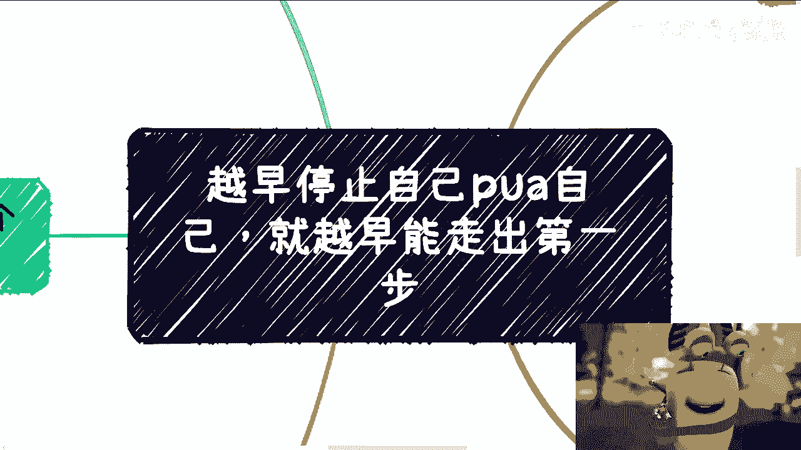

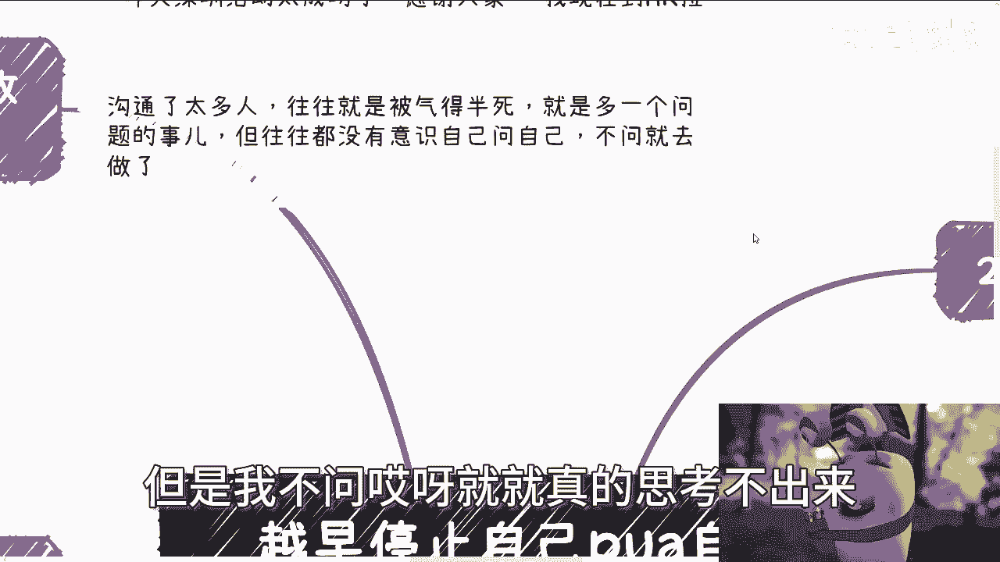

在本节课中，我们将探讨一个阻碍许多人成长的核心问题：自我PUA。我们将分析其常见表现，并学习如何识别和停止这种自我限制的思维模式，从而为行动扫清障碍。

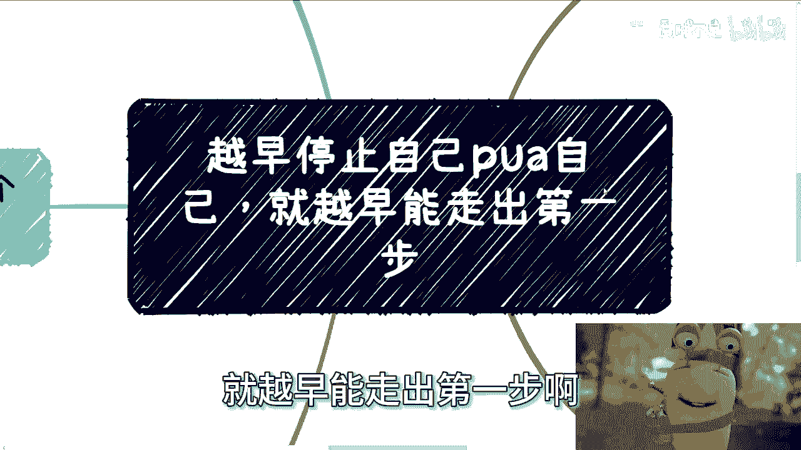

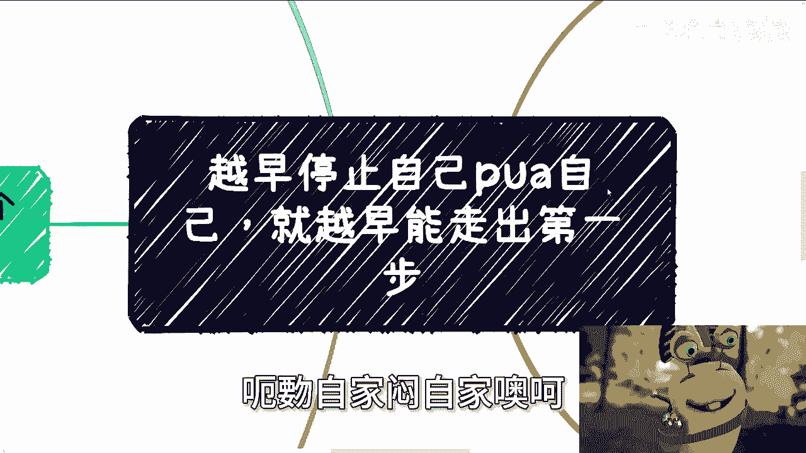

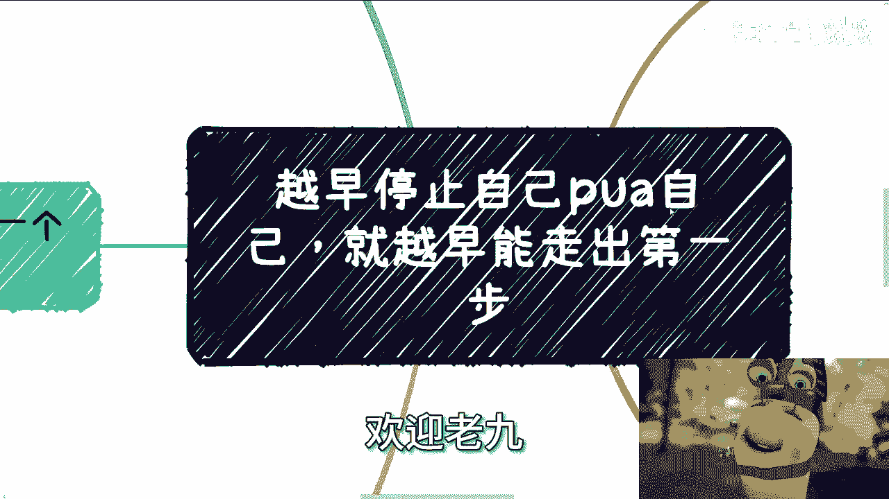

## 概述

许多人在沟通和思考时，常常陷入一种自我否定的循环。他们对自己的性格、能力或过去经历做出负面预设，这些预设像无形的枷锁，限制了当下的判断和未来的可能性。本节课程旨在帮助你识别这些思维陷阱。

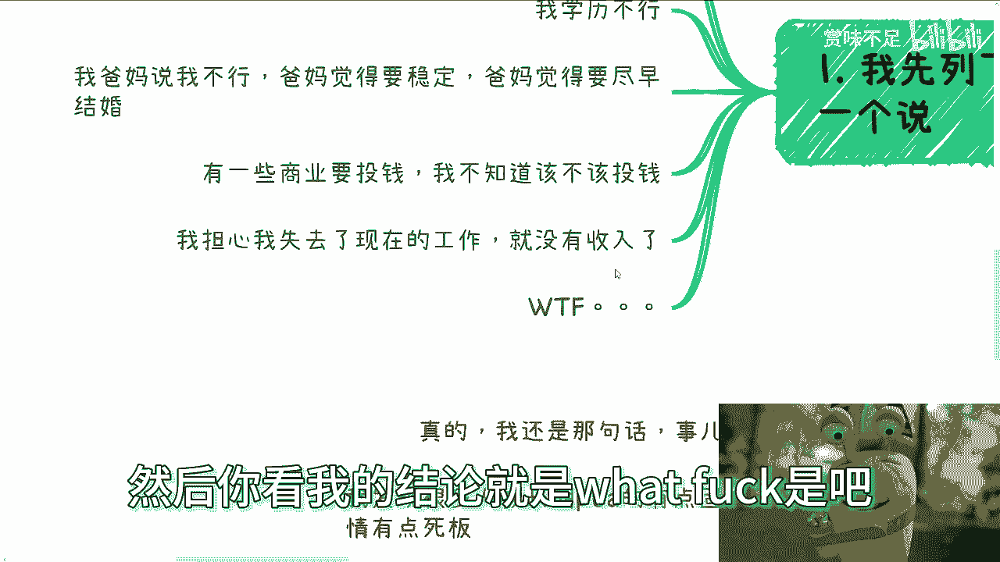

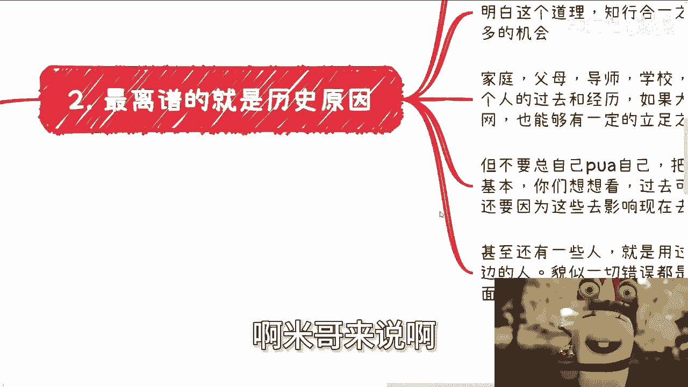

上一节我们概述了自我PUA的现象，本节中我们来看看它的几种具体表现。

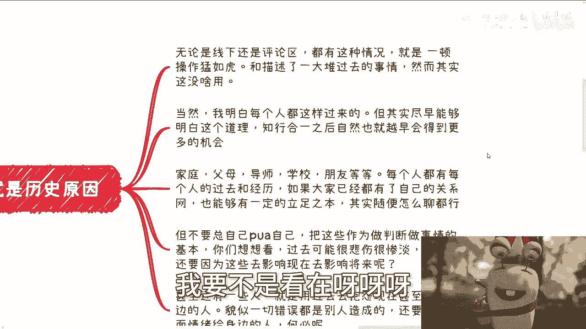

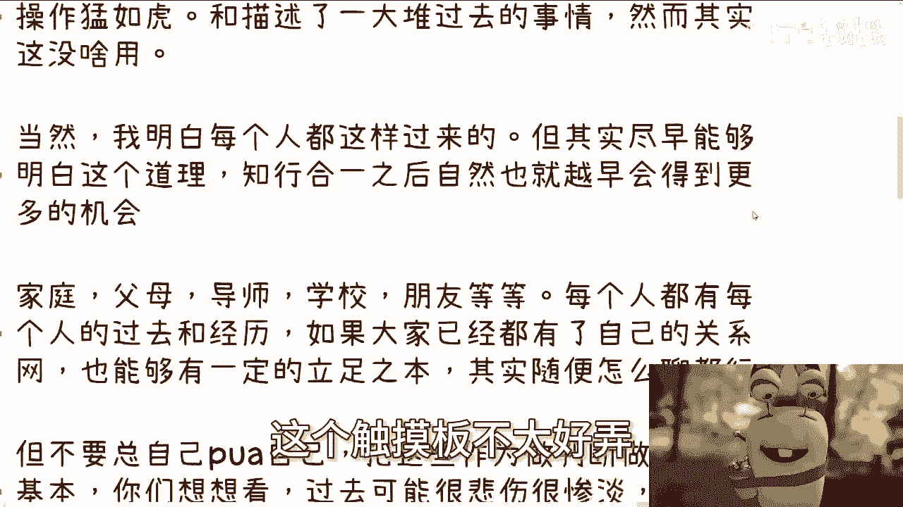

以下是几种典型的自我PUA陈述：

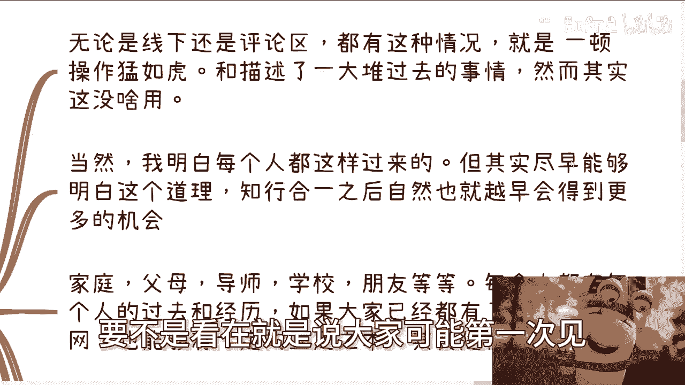

*   **自我否定**：例如，“我性格内向，不擅长沟通”。
*   **条件限制**：例如，“我学历不够，所以做不了”。
*   **外部压力内化**：例如，“我父母认为我不行/需要稳定”。
*   **风险恐惧**：例如，“创业要投钱，我不知道该不该投”。
*   **现状依赖**：例如，“我害怕失去现在的工作，没有收入”。

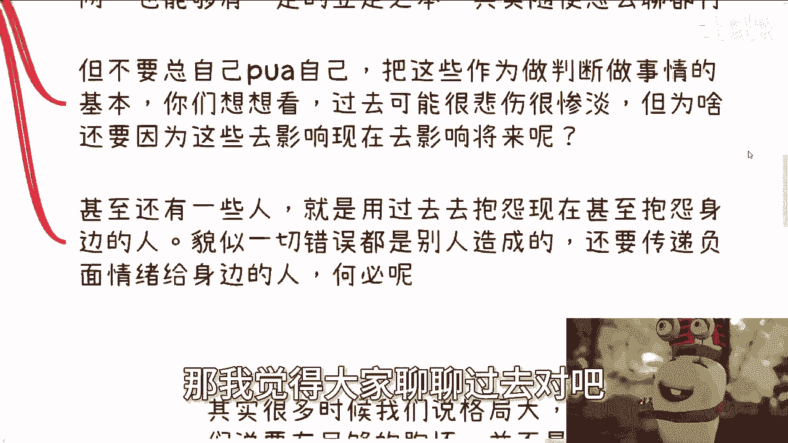

## 核心问题分析

### 1. 沉溺于“历史原因” 🔄

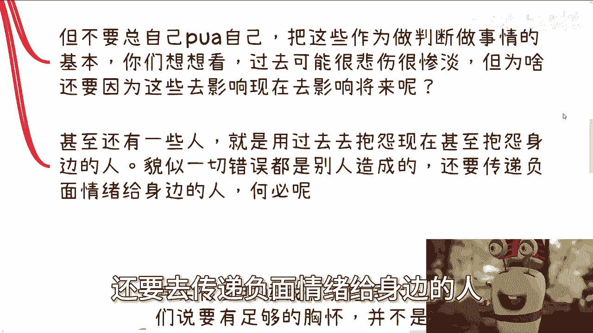

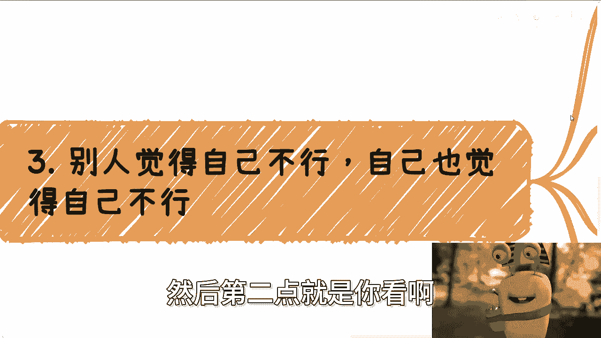

许多人习惯用过去的经历——无论是家庭背景、个人挫折还是他人评价——作为当下不行动或做判断的主要依据。这就像在编程时，为一个本应面向未来的函数设置了错误的初始条件。

**错误思维模式**：
```python
# 用过去定义现在和未来的函数
def make_decision(current_situation):
    past_failure = True  # 默认前提：过去失败过
    if past_failure:
        return “放弃或害怕尝试” # 基于过去做出负面决策
    else:
        return “尝试”
```

**正确思路**：过去的事情已经发生，它可以是经验，但不应该成为定义你现在能力和未来可能性的枷锁。纠结于无法改变的过去，只会束缚你改变现在和未来的手脚。

### 2. 自我设限与错误默认 🚧

许多人默认自己“不行”、“不适合”，并在做计划前就基于这些预设过滤掉了大量选项。这相当于在行动之前，就主动关闭了半数的大门。

**核心公式**：
**实际可能性 = 总可能性 × (1 - 自我设限过滤比例)**

如果你默认自己“不善沟通”、“学历低”，可能在你意识到之前，就已经过滤掉了超过50%的职业或发展路径。我们的目标是生存和寻找更多可能性，因此不应在起点就进行不必要的自我过滤。

### 3. 陷入“非此即彼”的僵化思维 ⚖️

世界不是非黑即白的，但自我PUA容易让人思维固化，认为事情只有“投钱”与“不投钱”、“辞职”与“不辞职”这两种极端选择。

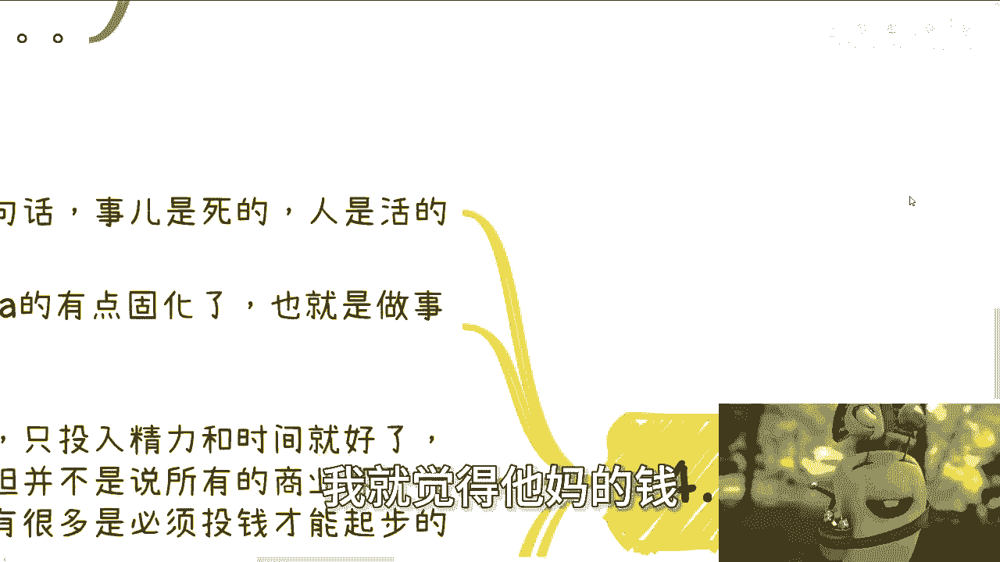

**举例**：关于商业投钱的问题。原则是“尽量以资源、信息、时间换取价值，谨慎投入金钱”，但这并非绝对真理。不同行业情况不同，关键在于你是活的——你可以评估、学习、寻找资源、设计最小化可行方案，而不是纠结于一个抽象的是非题。

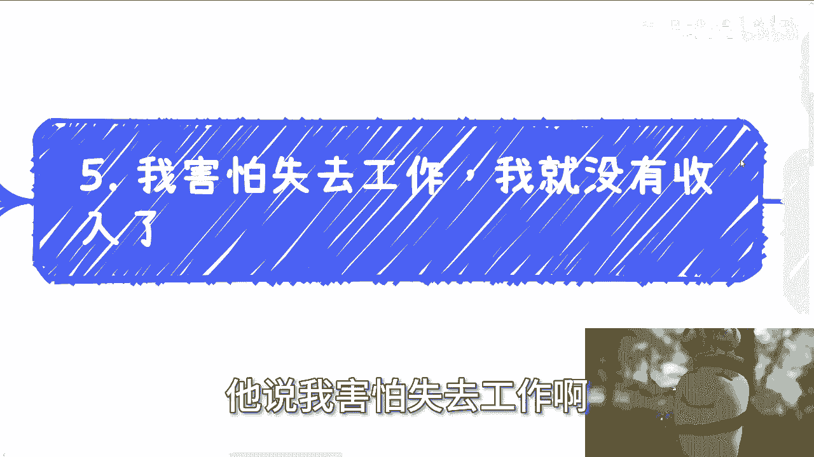

### 4. 担忧未发生的“未来” 🌌

一种常见的自我PUA是，用对未知未来的恐惧，作为当下不行动的理由。例如，“如果我辞职做新项目，失败了怎么办？未来没有收入怎么办？”

这本质上是“既想获得巨大收益，又不想承担任何风险”的矛盾心态。未来无法预测，用想象中的困难来阻碍当下切实的脚步，是典型的自我束缚。

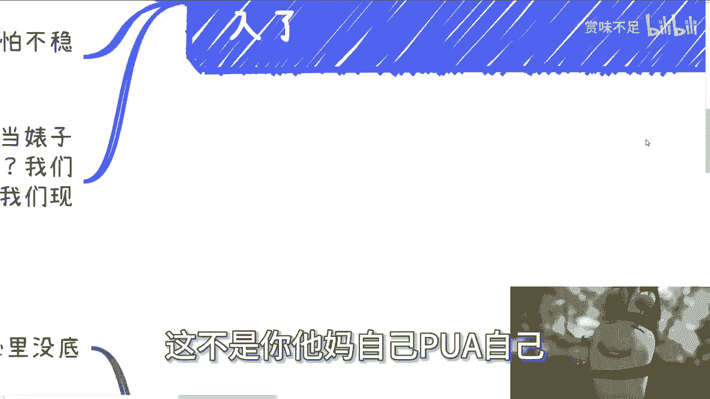

## 总结与行动指南

本节课我们一起学习了自我PUA的几种表现形式及其危害。关键在于认识到：**问题永远是死的，但人是活的**。你的性格、技能、处事方式都可以通过练习改变，过去的经历不应成为今天的判决书，未来的担忧也不应成为现在的绊脚石。

**行动建议**：
1.  **觉察**：在自我否定时，多问自己一句：“这个想法是事实，还是我的预设？”
2.  **重构**：将“因为我……，所以我不能……”的句式，改为“虽然我……，但我可以通过……来尝试……”。
3.  **聚焦当下**：专注于眼前能做的事情，而不是纠结于无法改变的过去或无法预知的未来。
4.  **接受灰度**：放弃非黑即白的思考，在复杂情境中寻找灵活解决方案。

停止自我PUA，就是停止用无形的绳子捆绑自己。越早解开这些绳索，你就能越早、越轻盈地迈出通向新可能性的第一步。