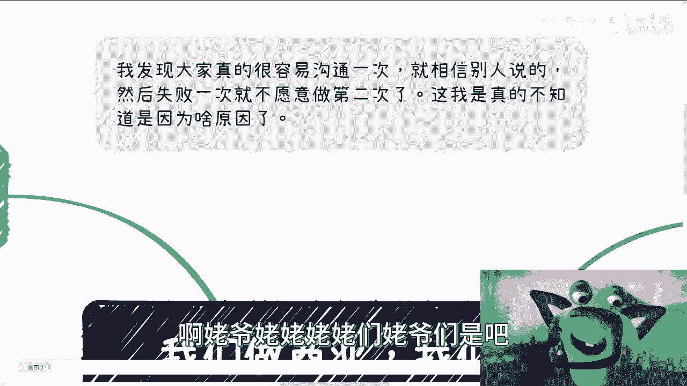
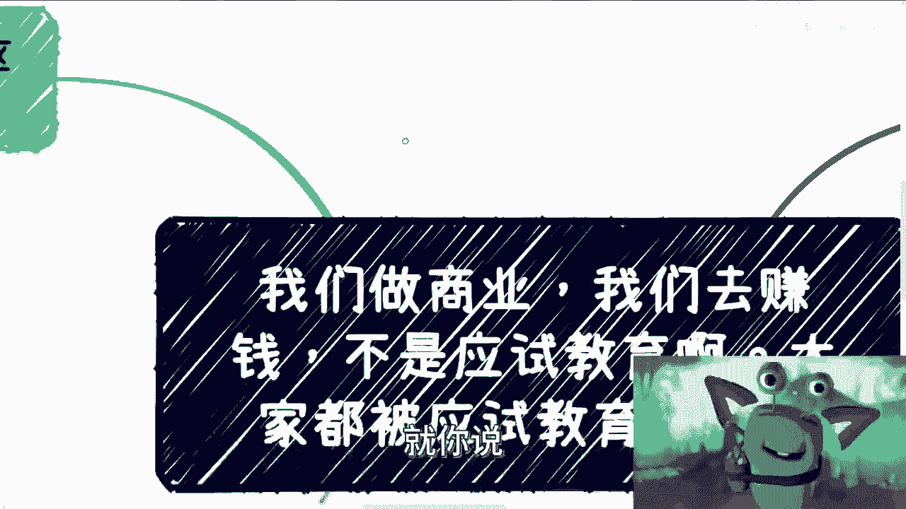
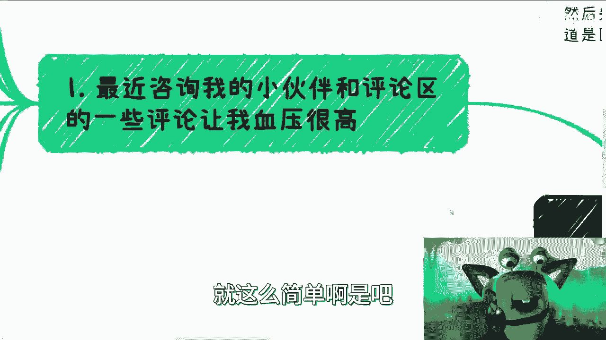
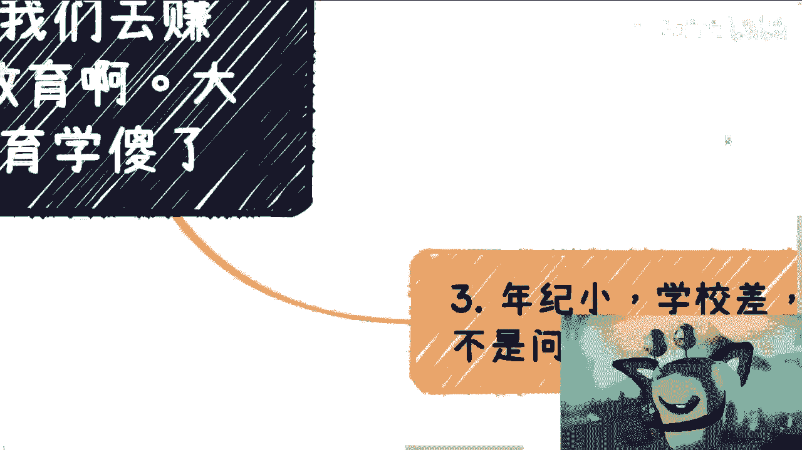

# 跳出二十多年的象牙塔-赚钱-商业等很多事情都不是应试教育---P1-跳出二十多年的象牙塔-赚钱不是应

在本节课中，我们将要学习一个核心观点：商业世界与赚钱的逻辑，与我们熟悉的应试教育模式截然不同。许多人习惯于寻找标准答案和固定公式，但这在真实的商业实践中往往是行不通的。我们将探讨这种思维差异的根源，并学习如何调整心态，以更有效的方式在商业世界中行动。

## 应试教育思维在商业中的困境

上一节我们提到了商业与应试教育的不同，本节中我们来看看应试教育思维在具体商业场景中会导致哪些问题。

许多人习惯于像应对考试一样处理商业问题，期待有明确的“1+1=2”式的标准答案。然而，商业决策高度依赖背景、关系和具体条件。





例如，询问“合同应该怎么签”或“第一步该怎么走”，并没有一个放之四海而皆准的公式。答案取决于：
*   **背景**：具体的业务场景是什么。
*   **对象**：合作方是谁，你自身的情况如何。
*   **目标**：这个案例（case）的最终目的是什么。


用代码来类比，商业决策更像是需要根据输入参数动态计算的函数，而不是一个写死的常量。

```python
# 商业决策更像是一个函数，而非固定答案
def 如何签合同(业务背景, 合作方情况, 我方情况, 案例目标):
    # 在这里根据复杂的输入参数进行判断和计算
    return 定制化的签约方案

# 而不是一个简单的赋值
正确答案 = “用公司签”  # 错误！这不是固定不变的。
```

如果总是期待一个统一的“正确答案”，那么你得到的很可能不是真正的解决方案，而是别人用来“割韭菜的镰刀”。

## 商业实践的核心：行动与调研，而非空想

上一节我们指出了寻找标准答案的误区，本节中我们来看看在商业中什么才是正确的起点。

商业成功的起点不是空想出一个完美的计划，而是基于大量实践和调研的行动。许多人容易犯两个极端错误：




以下是两种常见的错误思维模式：

1.  **尝试一次就放弃**：例如，社交或推销时被拒绝一次，便认为自己“没有价值”而不再尝试。在商业中，失败是常态，成功需要经历大量尝试，可以理解为“人肉大数据”的过程。公式可以表达为：
    **成功概率 ≈ 尝试次数 × 单次尝试成功概率**
    只有基数（尝试次数）足够大，才有机会获得成功。

2.  **轻信一次就结论**：仅通过一次沟通，在未验证任何证据（如合同、流水、证明）的情况下，就将听到的信息当作真理，并以此为基础制定计划。这如同建筑在沙地上的楼阁，基础极不牢靠。

正确的做法是：**先了解大框架和别人的做法，而不是一开始就纠结于自己“该怎么干”**。你需要的是调研，而不是空想。

以下是开始行动前应做的调研清单：
*   市场需求是否存在？用户真有此需求吗？
*   是否有前人做过？利润率大概多少？
*   你的方案是否与潜在客户（如国企、高校）的实际运行逻辑匹配？

就像搭乐高，如果不看说明书，不了解每块积木的接口，只管埋头硬拼，很难拼出想要的造型。商业同样需要你先了解“积木”（市场、规则、客户）本身。

## 打破自我设限：身份与年龄不是障碍

上一节我们讨论了行动的重要性，本节中我们来破除关于自身条件的常见迷思。

许多人将“年纪小”、“学习差”、“普通身份”视为无法赚钱的绝对障碍。但这并非事实。商业世界中有大量成功案例与学历、身份、年龄无关。


商业的本质之一是资源的整合与流转。在中国，许多商业活动呈现“层层外包”的模式。对于初学者，最务实的策略是：



**第一步，了解国情和规则，先努力成为这层层外包中最底层的一个节点。** 这个节点往往对“光环”（学历、技术）要求最低，核心是能干活、价格有竞争力。通过承接具体的案例（case）和积累社交关系，再逐步向上攀登。

这个过程的关键在于 **“自救”** —— 即主动切入，通过实践获得真实认知和自信，而非等待他人给予一个“方案”或“带领”。没有人能给你完美的、量身定制的行动手册，因为那本手册需要在你自己行动的过程中书写。

## 如何辨别信息与建立信任

上一节我们谈到了从底层切入，本节中我们来看看在行动中如何判断信息的真伪和人的可靠性。

在网络时代，信息过时、失真甚至虚假的程度越来越高。那么，如何判断什么是真的，谁又是靠谱的呢？

核心方法依然是 **“通过实践验证”**。


1.  **用结果验证信息**：当你按照某个信息或路径，完成一个完整的商业小案例并赚到了钱，那么这条路径上的信息至少部分是真实可行的。公式可以简化为：
    **信息可信度 ∝ 实践成功案例**
2.  **用行动验证人脉**：最可靠的合作伙伴，是那些与你一起成功完成过交易、分享过利益的人。例如，合作中“先付款后干活”还是“先干活后付款”，虽是小细节，却能体现诚意与可靠性。共同成功经历是信任的基石。

商业中允许“画饼”（设定远大目标），但关键在于最终的交付。通常的模式是：目标设定为200分，承诺做到100分，实际交付达到60分以上。了解并适应这种现实，而不是追求100%符合预期的“标准答案”，是商业思维成熟的表现。

## 总结与行动指南 🚀

本节课中我们一起学习了如何摆脱应试教育思维，以更适应商业现实的方式去思考和行动。

我们来总结一下核心要点：
*   **商业无标准答案**：抛弃寻找“1+1=2”式固定解的习惯，学会基于具体背景做定制化决策。
*   **行动优于空想**：成功源于大量尝试（以量取胜）和扎实调研，而非一次失败或一次听闻就下结论。
*   **突破自我设限**：学历、年龄、出身不是商业成功的决定性障碍。从“层层外包”中最基础的节点切入，是可行的起点。
*   **实践验证一切**：信息的真伪、人脉的可靠，都需要通过亲自完成商业小案例来验证。
*   **拒绝自我恐吓**：不要被自己臆想的困难吓倒，很多障碍只存在于想象之中。

最后记住：**不要自己给自己营造一个“楚门的世界”**。跳出自我设定的框架，通过持续的行动和失败去接触真实的世界，才是从“象牙塔”思维转向“商业”思维的关键。赚钱是你们自己的事，需要你们主动去干、去试、去总结，没有人能提供一份保证成功的标准答卷。