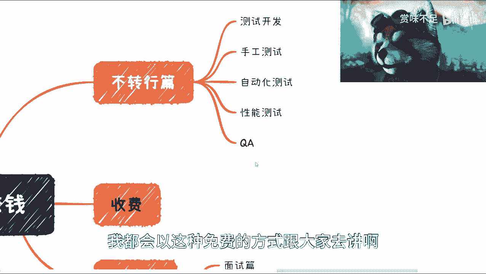

# 软件开发与软件测试在2023如何赚钱（先导篇）- P1 🧭

在本节课中，我们将探讨在当前行业背景下，软件开发与测试从业者可以思考的几种职业发展路径。课程将分析市场现状，并概述后续会详细讲解的几个核心方向。

## 概述：当前行业背景

上一节我们介绍了课程的整体框架，本节中我们来看看当前软件开发与测试领域面临的宏观环境。

大前提很简单：从业人员数量在增加，包括人口增长、裁员和毕业生涌入。与此同时，岗位数量却在减少。这是所有人都清楚的事实。

从整个经济周期来看，五年能够恢复算是一个比较乐观的估计。但对于许多人的职业规划而言，五年已经是一段相当长的时间。

因此，我开设了这个系列内容。内容主要针对开发与测试技术人员，但会稍微偏向测试领域多一些。不过，其他内容对开发和测试人员而言，其实没有很大差别。

## 本系列内容形式

我将以免费的方式讲解这些内容。如果大家对其中某一块内容感兴趣，希望深入了解细节，可以私信我。后续可以通过按小时收费的线上或线下咨询方式进行详细探讨。

以下是本系列课程将要涵盖的几个主要方向，后续我会为每个方向单独制作视频详细讲解。

## 核心方向预览

### 1. 不转行篇 🔄

对于很多人来说，当下情况不佳，转行也不现实。不转行篇将探讨如何在现有领域内深耕和发展。

以下是“不转行”方向下可以细分的几个路径：
*   **测试开发 (SDT)**
*   **手工测试**
*   **自动化测试 (Automation)**
*   **性能测试 (Performance)**
*   **质量保证 (QA)**

### 2. 跳槽篇 🚀

如果考虑更换工作，跳槽篇将提供相关指导。

以下是“跳槽”时需要关注的两个方面：
*   **面试技巧**
*   **职业规划**（包括作为“老人”或“新人”的不同策略）

### 3. 兼职篇 💼

如果既不想转行，又不想在现有公司“躺平”，可以考虑利用技术做兼职。

以下是“兼职”可以尝试的几个方向（开发与测试人员均可）：
*   **技术顾问**
*   **培训讲师**
*   **技术咨询**
*   **其他自由职业**

### 4. 转行篇 🧳

转行是很多人考虑的选项，但风险较高。本系列希望能给大家一些启发。如果下定决心，可以找我进行收费咨询。

以下是“转行”的两个可能路径：
*   **跨行业，但岗位不变**：转换到不同行业，但继续从事开发或测试工作。
*   **跨行业，且岗位转变**：转换到不同行业，并从事其他岗位，例如产品经理、销售等。

### 5. 其他（玄学篇）❓

除了上述方向，我感觉应该还存在其他方式，但目前尚未想好。等考虑成熟后，我会再录制视频进行扩展。如果大家有任何想要了解的方向，也可以留言告诉我。

## 总结与建议

本节课中我们一起学习了在当前行业背景下，开发与测试人员可以考虑的几大职业发展路径。

总体而言，大前提是近两年行业情况不佳。我在其他平台也回复过，目前最好的方式之一可能是去读书（如攻读硕士或出国留学），以度过这段困难时期。

现状是竞争越来越激烈。当岗位稀缺时，内卷的空间也变得有限。所有从业者，包括开发和测试人员，都需要面对一个现实：随着年龄增长，以及互联网行业整体下行，必须为未来做打算。现在不考虑，未来会更被动。

我的分享并非贩卖焦虑或唱衰行业。行业的发展不会因个人言论而改变，其本质是正处于下行周期。因此，我们才需要认真考虑这些应对策略。

我平时主要在上海，欢迎周边朋友约线下交流。线上咨询费用目前约为 **800元/小时**。如果大家有跳槽、转行需要介绍资源等需求，也可以通过私信联系我。

本节课就到这里。后续我会将每一个方向展开，进行详细讲解。