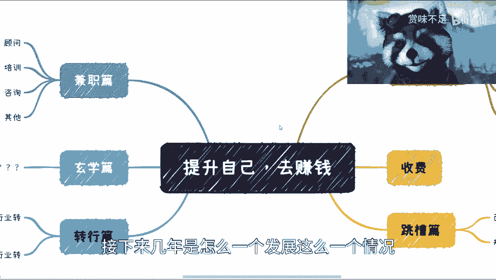
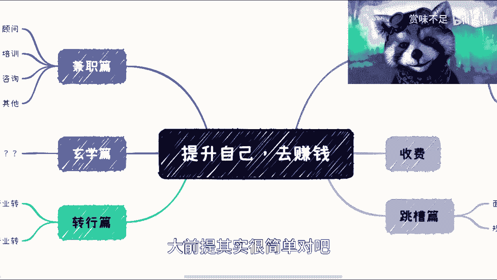
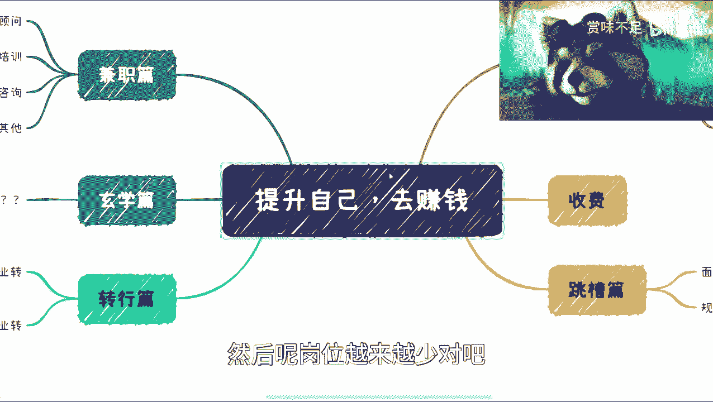
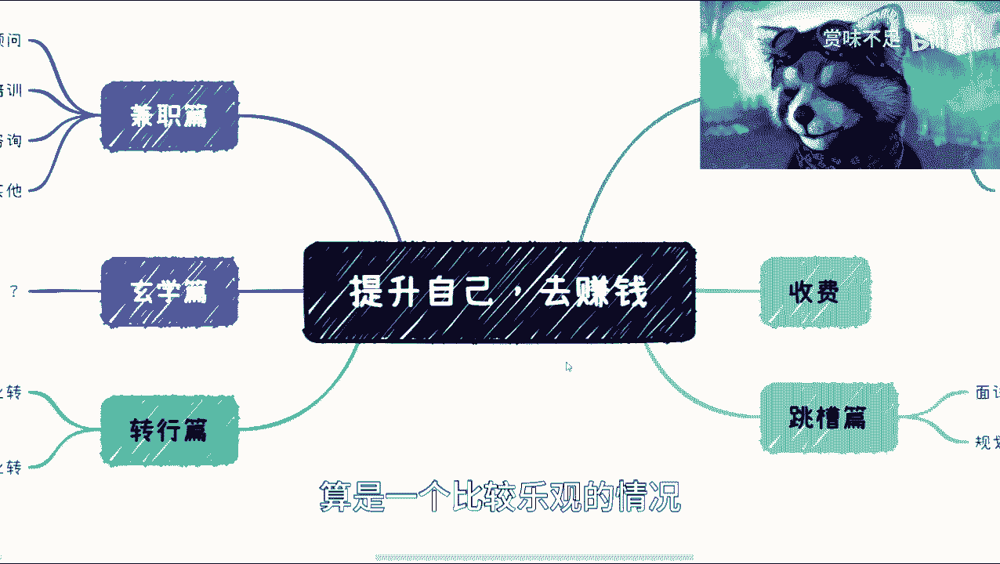
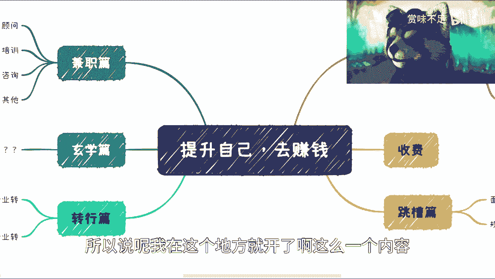
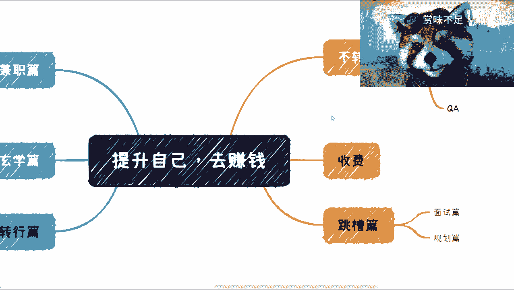
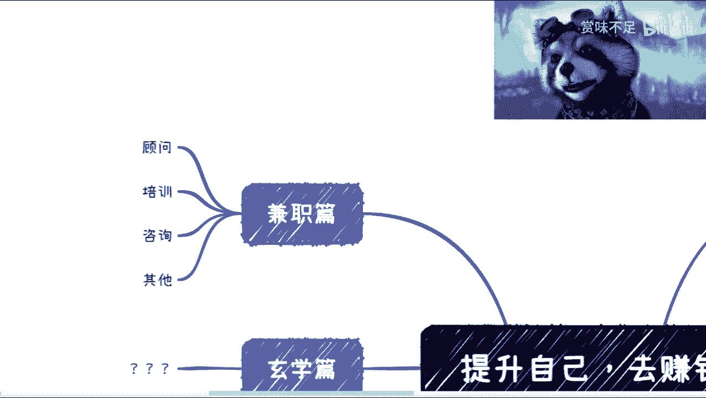
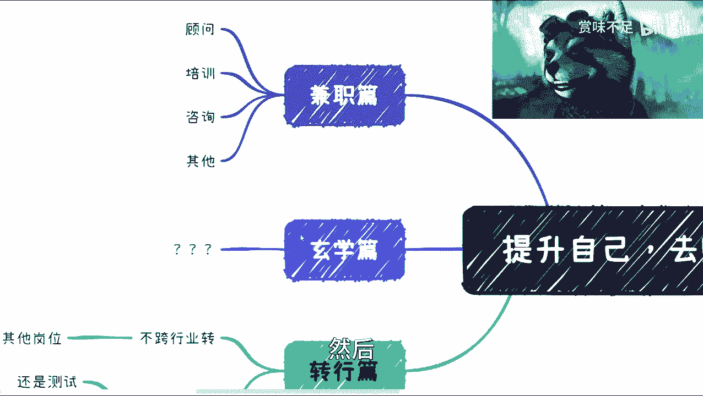

# 软件开发，软件测试在2023如何赚钱（先导篇） - P1 - 赏味不足 - BV1RY411Q741

好啊大家好，我是赏味不足，昨天呢那个录了一个测试的一个视频对吧，然后看了一下大家的反馈都还OK，因为这个这两年的情况也不是很好对吧，然后我看到有很多人回复，就说嘛啊这个这个最近这几年啊。

接下来几年是怎么一个发展。

怎么一个情况，因为我说一下大前提，大前提其实很简单对吧。

就是所有的这个人都在增加对吧，人口啊，包括裁员的对吧，包括毕业的对吧等等等啊。

然后呢岗位越来越少对吧，这个所有的人都其实清楚啊，那么从整个经济上来讲呢，其实呃我在B站上也回复别人啊，就是说啊5年能够恢复。

算是一个比较乐观的情况，但是呢这个对于很多人来讲呢，就整个一个职业规划，其实5年已经是呃比较长的人对吧。

所以说呢我在这个地方就开了啊，这么一个内容啊。

那么呃主要是针对技术，我觉得主要是针对开发测试的啊。

那么内容上面呢我会稍微。

我会稍微偏向于呃测试一些啊，但是其他的一些呃这个内容上面，其实开发跟测试都可以去看，其实没什么很大差别啊。

把它放大一点。

呃首先是这样子的，就这边的内容呢，我都会以这种免费的方式跟大家去讲啊。

但是我也希望就是说这个大家如果有兴趣啊，不如说想要做里面的某一块啊，想要细节了解的对吧，你们可以私信我，到时候那个以一个这种不如说咨询啊，啊不如说按小时收费啊对吧，这种线上咨询或者线下咨询方式好吧。

然后我给大家再来讲。

啊那么这个地方呢我列了几个啊，列了几个，我后面会把它每一个单独再列出来啊，就是说这个我先给大家做一个预告啊，后面我每一个会单独再出个视频啊，单独出个视频，那么首先在这个地方先说这个不转行啊，不转行。

因为对于很多人来讲呢，他觉得啊我这个当下情况也不好对吧，你让我转行的也不现实啊，那不转行偏，那这个地方呢我后面会一个个来说啊，就是分成，不如说测试开发SDT对吧，手工就是美女对吧。

自动化automatically啊，性能performance对吧，然后QA这么几个方面啊，我后面会单独再来开好吧，就是大家可以关注。

我后面就是持续性的这个视频啊，嗯第二个呢就是跳槽啊，那么你说这个不行啊，我要换工作好，那换工作换工作这边呢我会给大家列一些，比如说面试你看得见吗，我看看啊，看得见啊，面试对吧。

还有就是比如说一些职业规划上面的啊，包括就是说你作为一个这个去年的人，包括里面别人啊，可能从这两个方面。

这两个方面来讲啊，那么这个地方呢还有就是说啊。

你说啊我也不想转对吧，我也呃呃这个这个我想保持现状躺平啊，但是呢我公司内躺平的。

我公司我也不想躺平了，怎么办呢，我还利用列了一个对吧，兼职篇，那兼职片这边分分开来就测试开发都可以做，技术都可以做对吧，你不如说顾问培训咨询其他对吧。

这个我会后面我会再来单独讲啊，那么还有一个呢就转行对吧，因为昨天那个视频出来之后，也有很多人会问嘛，他说他说你这个视频讲了半天，结论就是要转行呃，事实上呢也的确是如此。

但是呢我们也不得不去考虑实际情况对吧，因为转行也不是所有人都能转的，而且转行的风险性很高啊，那么我希望在这个，接下来这些免费的视频里面呢，能够给大家一些启发啊，那么大家如果下定决心想要去了解的。

或者想要去转行呢，唉那么回头可以找我收费咨询啊，那个我们来看啊，转行这边我会写几个呢，一个就是说跨行业转，你跨行业转呢，就是说你可以跨不同的行业，但是你还是做测试对吧，或者做开发可以的啊，没问题啊。

这个我回头我也会单独来说，那第二个呢就是跨行业去转做其他岗位，那你比如说你说你要做产品经理对吧，这个销售啊，或者来说其他的一些啊。

这个回头我们再来说啊，那么呃这边我还列了个玄学。

我还没想好这里面写什么啊，但是呢我有种感觉。

我大概觉得就除了我这边写的转不转行跳槽。

转行兼职以外，应该还有一个方式，但我还没想好啊。

反正回头想好了，我再来录视频好吧，我再来把这个扩展出来。

然后这个大家要是有什么这个想要了解的。

也可以留言呃，告诉我，因为我这边写的也不是很全嘛。

啊呃那么总体来讲呢，我觉得这个大前提大前提还是说，因为这两年情况不好啊，然后呢我在B站上也回复人家，我说啊，我说这两年其实最好的方式是什么呢，就是你还是去读书啊，你你你可以去读硕士读呃。

出海出海去读都可以啊，就是读书，然后把这一段比较困难的时间熬过去，因为现在这个情况是什么呢，就是嗯很简单，就是越来越卷啊，然后本来呢比如说啊，大家这个这个工作都找不到情况。

下面你卷呢你最多就是卷一些薪资对吧，卷一些这个叫做啊这个加班对吧，但是现在你说人越来越多，岗位越来越少，那你怎么卷呢，你连岗位都没有，你卷不动了对吧，那么而且呢，其实我觉得所有的人类都要去面对一个事实。

就包括我这边说的开发测试对吧，都一样的，就是说你要面对的现实，就是说你们随着年龄的增长，随着这两年的互联网的这个跌路跌下神坛，随着这两年的这个互联网走下行趋势，你一定要去往未来去考虑的。

你说你现在不考虑，说实话你现在考虑已经晚了对吧，但是你现在不考虑，那你后面就更没有没有没有这个先发优势对吧，那么所以我们说啊，其实呃这个我们不是说要去，因为有很多人，这个因为网络现在大家也都知道嘛。

我也不清楚大家，这个这个对于自己规划是什么样子的，但是总有人觉得，不如说啊啊这个我做这个视频对吧，有很多人觉得啊这个你在这个贩卖焦虑对吧，或者唱衰，但是事实是什么呢，就是你们想想看。

我贩不贩卖焦虑不重要，唱不唱衰也不重要，这个行业不会因为我唱衰就衰，而不会因为我不唱衰不衰对吧，所以说本质上来讲呢，就是互联网整个就在往下去走啊，那么接下来其实我们就得考虑这些东西啊。

然后呢我平时一般在上海啊，然后周边呢，我觉得大家都可以约一些线下的交流啊，没问题的，然后线上呢按照之前的话，我差不多收大概800块钱一个小时，这么一个费用好吧，然后我也希望就是说大家呃有有需要的啊。

你们可以私信我，或者来说因为微博啊，呃这个B站你们都能找得到对吧啊，我也希望就是说能够帮助到大家，包括就是说大家呃跳槽啊或者转行啊，希望我去介绍一些资源的，其实也可以嗯，OK那么我这节就先说到这儿好吧。

然后后面的话我会把它每一个每一节都展开了。

展开了。