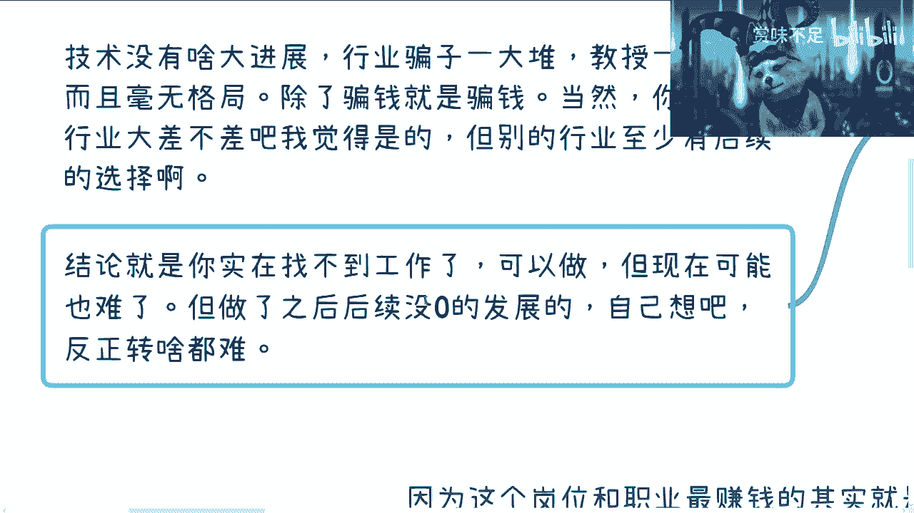

# 软件测试-国内最下下策的岗位---P1---赏味不足---BV1Jo4y1w73F

在本节课中，我们将深入探讨软件测试岗位在国内的现状、历史演变以及未来的职业发展前景。我们将分析其为何被视为职业选择的“下下策”，并探讨其背后的商业逻辑。

## 概述：为何是“下下策”？

首先给出一个明确的结论：在国内，选择软件测试作为职业是下下策。这个结论并非源于该行业或岗位本身不行，而是因为整个行业生态从上到下都是扭曲的。从管理层到商业伙伴，普遍对这个岗位的价值缺乏清晰的认知。

## 一、 职业发展的局限性

上一节我们概述了核心观点，本节中我们来看看软件测试岗位在个人职业发展上的具体局限。

这个岗位在技术深度、业务理解和商业头脑的培养上均存在严重不足。从事该岗位后，无论是内部转岗还是未来创业，都缺乏必要的技能和知识积累。

以下是该岗位的三个主要局限：

1.  **技术积累薄弱**：岗位要求的技术深度有限，难以形成核心竞争力。
2.  **业务理解缺失**：工作内容通常与核心业务逻辑脱节，无法积累有价值的行业认知。
3.  **商业价值模糊**：在商业合作与变现中难以体现明确价值，导致职业天花板低。

## 二、 行业生态与历史成因

理解了岗位本身的局限后，我们再来看看造就当前局面的行业生态和历史原因。

软件测试培训曾是此领域最赚钱的环节，但这波红利期早已过去。其泛滥源于过去互联网高速发展期，许多人通过短期培训涌入该行业，导致人才过剩。

以下是推动该生态形成的几个关键因素：

1.  **历史机遇**：互联网上升期的高起薪吸引了大量非科班人员通过培训入行。
2.  **低门槛入口**：软件测试因入门相对容易，成为转行互联网的热门选择。
3.  **现状变化**：随着行业红利消退和市场卷化，该岗位的生存空间已被严重挤压。

## 三、 对比：运营岗位的优势

与软件测试相比，运营岗位在可持续发展和经验复用上具有显著优势。运营工作中积累的用户洞察、市场策略和项目协调能力，对个人长期的职业发展或创业都有实质性帮助。

其价值可以概括为一个简单的公式：

**运营经验 ≈ 可迁移的商业技能 + 行业认知 + 人脉资源**

## 四、 “存在即合理”的商业逻辑

尽管前景不被看好，但软件测试岗位依然存在，这背后有一套完整的商业闭环逻辑。

这个生态的维持依赖于多方利益的驱动，而非岗位本身的技术或业务价值。

以下是支撑该岗位存在的几个核心利益点：

1.  **企业预算管理**：团队领导者需要一定的“人头数”（HDCOUNT）来维持或申请预算。
2.  **政策补贴申请**：企业在申请政府或产业园补贴时，常需要满足特定的人才数量指标。
3.  **培训产业需求**：培训机构需要持续的生源来维持运营。
4.  **就业市场供给**：大量求职者需要工作机会，即使明知是“下下策”也会选择进入。

## 五、 未来展望与最终结论

综合以上分析，我们可以对软件测试岗位的未来做出明确判断。

以当前认知评估，该岗位在未来10到20年内都难有根本性改观。技术发展停滞，行业乱象丛生，且缺乏后续转型的有力跳板。

最终的结论很明确：除非走投无路、急需一份工作糊口，否则不应选择软件测试作为职业起点。如果选择进入，需要清醒认识到其**几乎没有职业发展积累**的现实。

---

**本节课中我们一起学习了**：软件测试岗位在国内被视为“下下策”选择的核心原因，包括其职业发展的局限性、形成当前生态的历史与商业因素，以及与其他岗位（如运营）的对比。最重要的是，我们明确了该岗位在未来很长一段时间内缺乏发展前景的结论。