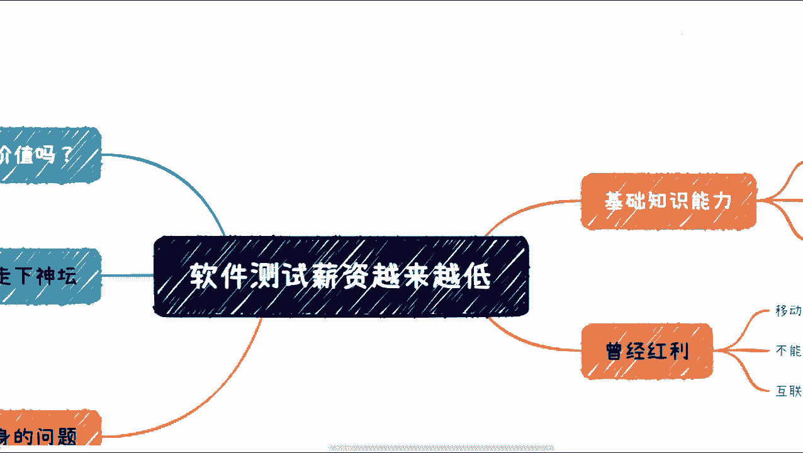
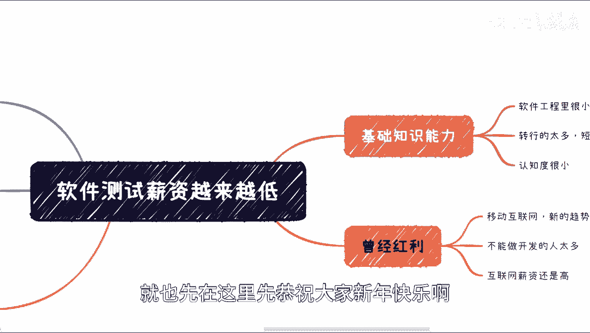
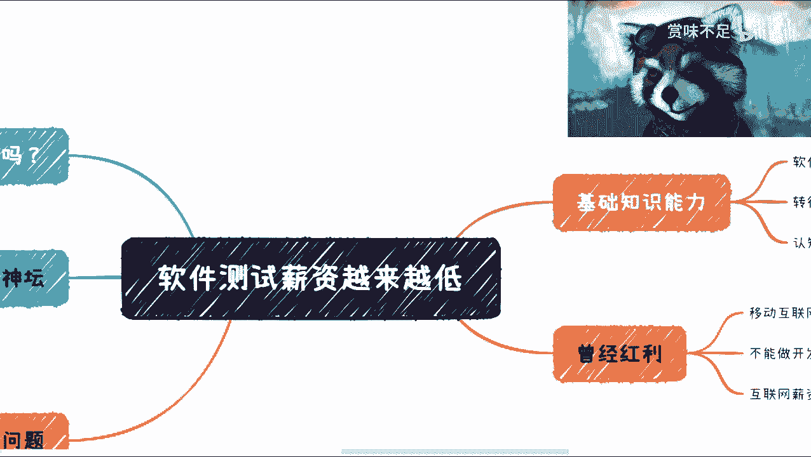
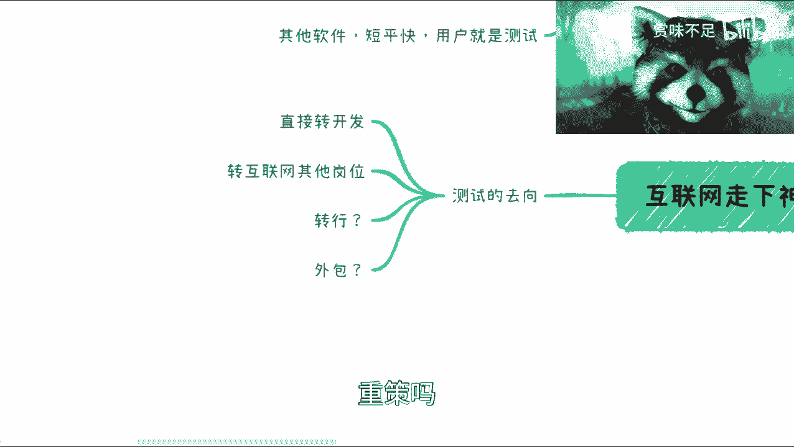
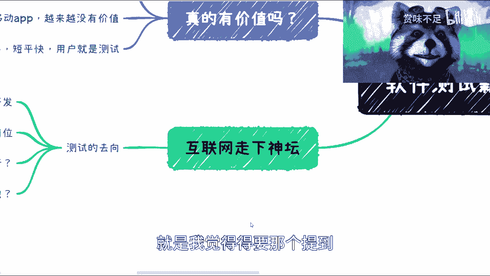
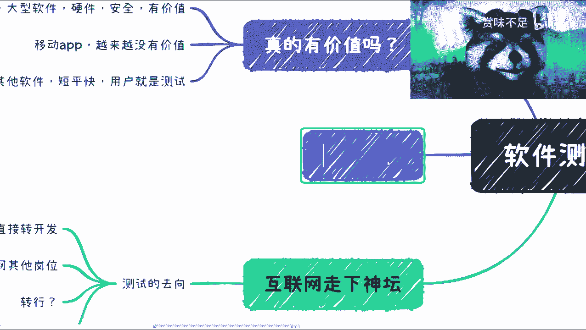
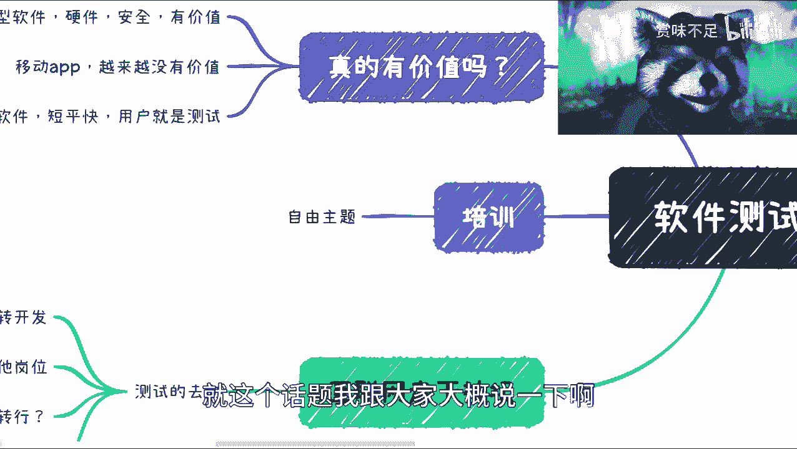
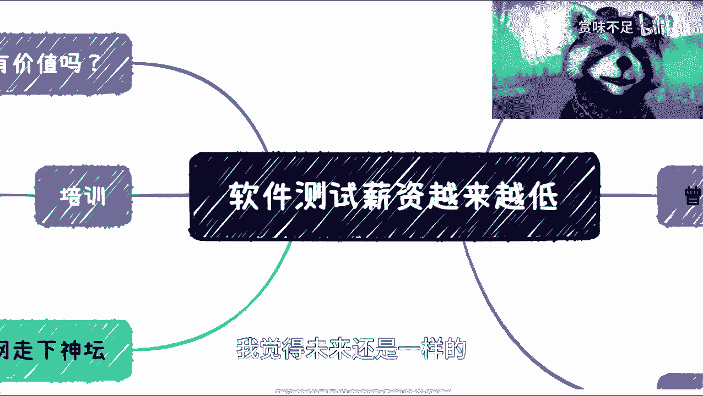
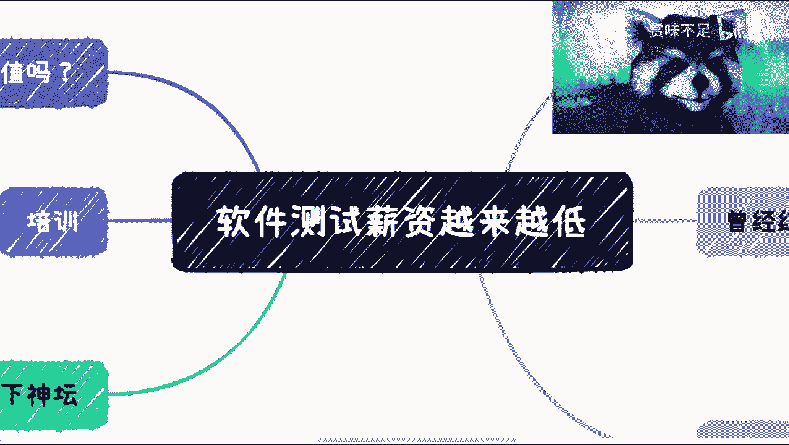

# 软件测试为啥薪资越来越低 - P1 - 赏味不足 - BV1Cd4y1V7si

好大家好啊，我是赏味不足，那么这个也好久好久没有录视频了。

就也先在这里先恭祝大家新年快乐啊。

呃昨天呢在微博上呢看到有这么一个啊。

看到有这么一个话题，就是说软件测试这个薪资越来越低啊，啊然后呢下面也有这个小伙伴说啊，就是这个接下来有没有什么软件测试，做软件测试前途啊对吧，或者说这个这个软件工程上面对吧，互联网上面到底什么个情况啊。

我今天正好想就录个视频，可以给大家解说一下啊，哎对我这个把我的摄像头开开来啊，好诶这样就好了，完美对吧。

那首先是这样子的啊，就是现在呢整个互联网都从2018年开始呢，基本上就走下坡那个下坡趋势了啊，其实大家也都知道，那么首先呢我觉得软件测试呢，在这个基础能力上面，他从一开始其实就是一个畸形的一个存在。

为什么呢，因为我们先来看啊，我把这个放大一点看看啊，对因为一开始你看啊，软件工程里面，它本来就是这个测试转软件工程，现在很小的一部分，那从以前到现在为止，当然现在可能那个大学的课程里面。

应该会相对这个多一点啊，就以前基本上软件工程里面提到软件测试的，是很小很小一部分甚至都不提啊，那么以至于就是说很多的这个学生出来之后呢，他说哎我只知道我要我要制作开发嗯，但是你说测试是什么。

我不知道对吧，这是一方面，第二方面呢其他的这个受众，他的这个参与从业人员呢参差不齐，因为转行的实在太多对吧，因为昨天那个微博下面也有一个评论啊，就是说啊这个就是说培训的越来越多对吧。

就是水的人也越来越多，那越来越多，整个行业肯定是越来越不行的，那么其实本质上是什么呢，就是说啊太多的人想要去做开发，那太多人想要去做软件，太多人想要去做互联网，他们都觉得互联网薪资很高。

但是呢你要让他们去做产品经理啊，去做这个叫啊开发啊，或者销售，或者其他一些市场运营，他都是需要一些专业能力的啊，那么这个时候呢你就会面临一个问题，就说啊那我是不是做软件测试。

那么你要说软件测试并不是说他没有专业能力，而是说他的专业能力，并不是那么容易被看得出来，或者并不是那么容易体现的出来对吧，那么第三点是什么呢，就是这个认知度很小，就是真正的在软件测试这个行业去做的人。

他对于软件测试本身的认知到底有多少啊，他其实很小，他更多的就是说啊我别人跟我说什么啊，怎么做我就怎么做啊，你问他到底应该怎么做，比如说面对一个项目，面对一个一个一个团队，或者面对一个一个上下文。

他到底应该怎么做，他不知道啊，那么呃OK那么我们往下来说好，那这是一块啊，那么我们来看曾经的这个红利啊，曾经红利呢也比较简单对吧，你比如说互联网曾经有过一大波红利，那到移动互联网这边又有一大波红利。

那么每一波新的红利里面，其实都会有新的公司啊，新的团队，新的产品，那么对应的就会有开发测试啊，产品啊，销售等等等各种各样的岗位呃，那另外一方面呢就是说就像我们刚刚提到的，你想做这个开发的人太多啊。

但是真正能做人呢其实又并不多，对啊并不多，那么他们怎么办呢，他说我就想来做这个测试呃，那么就像我们刚刚提到的，就是说整个开发这边其实你要去衡量他的能力，很好衡量，就是哎你就做产品吧对吧，你就开发你。

你比如说多少天开发了什么功能，这功能能不能用对吧，这个你都是很好衡量的，但测试你怎么衡量呢，你说他能找到bug和不能找到bug，它能够衡量吗，他不能衡量对吧，你能找到并不代表你能力很强。

你不能找到也不能代表你能力不强对吧，那有很多人也会说，那我们还有自动化测试对吧，还有渗透对吧，还有这个呃呃持续击沉对吧，那这个后面我们再来说啊，第三点呢就是互联网薪资还是高啊。

就是就算啊现在已经走下神坛了啊，但是就是说大部分的人啊，他左右去平衡一下，他说哎你看我现在做销售啊，我现在去做一个什么别的岗位，我可能薪资是X对吧，那我比如说培训三个月对吧，这个软件测试对吧。

我去到公互联网公司去这个瞎猫碰死耗子对吧，那我可能也能碰到一个，比如说至少六七千七八千对吧，我可能碰得到啊，那么他衡量一下，他会觉得唉我还是去做这个软件相关的，或互联网相关的对吧。

那是因为整个大部分的人，他看到的只是眼前的这么一个例啊，他看到眼前的这么一个利益，但是呢他不会去想，就是未来到底什么个情况对吧，那么我们从现在来看啊。

好那么我们来看几个东西啊，第一个就是说，第一个就是说我们来看本身，你说真的有价值吗，那我们来看啊，就是说周期长，大型软件或者某些硬件，某些安全它的确是有价值的啊，肯定是有价值的。

但是呢就是说在安全这个层面呢，它其实已经不属于整个测试范围体系了啊，因为安全本身，比如说安全的这个这个这个定位，包括我们说QA这个定位它其实是独立的啊，这跟tester这边的这个这个这个定位。

它其实是区分开来的，那么他肯定是有价值的，但是呢由于目前到今天为止，比如说互联网节奏越来越快对吧，人们的生活越来越快对吧，就是说整个APP也好，HTML也好，它本身这个测试价值是越来越低的。

因为为什么呢，因为，我们做好功能，做好产品，他要的是尽快上线对吧，我们可以直接用线上来做测试，我们也可以直接用a b test来做，我们也可以做各种各样的，这个这个这个那个内测。

但是你说是不是需要专业的，这个专门的这个测试人员，你要花一笔钱去养着，我觉得随着时间推移，大部分公司的老板越来越明白，就是其实我不需要，那当然你从团队的这个架构结构上面，你说他要吗，他要的啊。

但是你随着目前比如说疫情啊，包括整个这个呃，这个大家的收入都比较低呀对吧，或者说整个企业都比较困难了，他越来越来越来越多，都会觉得哎我一定要留下来。

有核心价值的这个团队对吧，那么好，那么我们来看这个本身的这个问题啊，你说它本身问题有什么，你比如说手工测试对吧，你手工测试我用外包不能做吗，我用户内测不能用吗对吧，还是说还是说我这个没有手对吧。

我为什么一定要去花个几千块钱，1万块钱养着一个测试呢，对不对啊，那么第二个呢自动化，那自动化呢我觉得做过的人都知道啊，就是说但凡你是一个变化很快的一个产品啊，你本身的自动化。

它的效率还不一定有手工测试来的高对吧，而且迷你很多的case说实话都是可有可无的啊，你并不能把那些比如说呃高优先级的，或者说高复杂度的啊一些东西把它做成自动化，你很难很难啊，那么持续集成就更不要说了啊。

持续集成这件事情，我觉得更多的价值是在于开发啊，在于单元，单元单元测试啊，开发啊，打包啊对吧，发布啊啊等等等对吧，这些上面你说这个东西跟测试本身关系大吗啊，随着时间推移越来越不大了啊。

那么case自动化生成就更别谈了对吧，因为这个东西啊讲讲到现在可能有十多年了啊，但是你说十多年，在一个并不是那么重要的领域里面，做了一个并不是那么重要的功能，而且这功能甚至还不是那么成熟。

那请问它会有什么前途对吧好，那么最后就来说测试开发对吧，那么就像我们刚刚说的，就是说你随着对吧，这个成本越来越高，随着整个的这个大家的啊收入越来越低，就企业这边的这个困难度越来越高。

那么这个时候他就会发现就是我要的是什么，我要的是产品开发能力，而不是说我要一个四不像的能力对吧，因为大部分的测试开发啊，我们以前微软这边对吧，google这边叫SDET对吧，大部分的测试开发。

它如果在大厂这边，他是具备开发能力的，这毫无疑问啊，我们说的大厂是global的这些大厂，但是在国内的大厂，它是基本上不具备开发能力的，就是他最多告诉你说哎我具备的是test case。

test framework这些开发能力，但是它不具备产品的开发能力，那OK那需要你什么有什么用呢对吧，而且你薪资很高，可能一个比如说一个开发3万，一个测试开发可能要2万5，那有什么意义呢。

意义不大对吧，随着时间推移。

意义越来越不大，那么我们说随着互联网走向神坛，这些人你看啊去向对吧。

那我觉得去向这件事情很简单啊，我们来看，要么我看看，大家看得见吗啊好要么你就直接转开发对吧，那请问有多少人呢，这个漏斗得筛掉一大批人吧对吧，要么你就转互联网其他岗位，但是呢这个很难，为什么呢。

因为大部分的这些人他是对商业啊，对产品啊，对所谓的需求啊，市场啊他是没有认知的，就在我看来，很多的这个技术人员，我不管他是开发测试啊，大部分人他是一个活在象牙塔里面的人，他可能10年五年做完之后。

他对整个市场，对整个的这个交社交啊，对很多东西它是一一那个一无所知的，那么你让他转到其他岗位，他能做吗，他能转，但他能做吗，做不了对吧，那好啊，那么第三个怎么办呢，转行，转到哪里去呢对吧。

我觉得开发可以转，开发转一些还好转一点，因为不同的行业关系不大对吧，他可能还是做开发，但行业的上行业的这个专属知识，垂直知识它是可以在积累的，但测试呢对吧好，那么我们再来说啊，转行还有一点是什么啊。

那个哦对外包对吧，那这个地方外包呢并不是说他要去外包公司啊，而是说他能够接一些私活，那请问测试他能接什么私活呢，开发我觉得现在私货还是可以接的，而且一直以来都是属于一种不错的这个行业啊。

不错的这种收入啊，但是你说测试能接什么外包呢，政策吗。

对吧好，那么接下来呢，就是我觉得得要。

那个提到最核心的一点是什么呢，就是我们说呃这个培训。

嗯嗯在这个培训的时候啊，其实我觉得大部分人其实做测试或做开发，都去做过培训啊，都去接受过培训，但大部分这个培训的时候呢，他不会来跟你讲这些哦，也就是说他只告诉你啊，这个东西多么能赚钱啊。

现在红利期多么强对吧，现在有多少人就业对吧，怎么样怎么样怎么样，但他不会告诉你，比如说哎等市场不好了，等你年纪大了对吧，那你接下来做什么呢，有很多人比如说被裁了之后，或者离职之后，他找不到工作。

或者他甚至降薪都找不到，那你问他接下来能干什么对吧，在我看来，大部分的这些销售啊，产品啊，它自己哪怕未来去创业，他都能够做的还是能做的很好，虽然他可能比如商业能力上有欠缺啊，但是他慢慢学习还能做很好的。

但是你说大部分的这个测试它能做什么开发，他可能还能说哎我做做CTO对吧，我做做这个整个还是做我开发的东西对吧，我商业号不用管，那你测试干嘛呢对吧，那有很多人就会说了，他说哎呀，你这个这个说的不对对吧。

你这个就是在唱衰啊，那事实是什么，事实是我只来跟大家说，现在事实是怎么样一个情况啊，昨天微博上看到有这么个话题啊，我给大家说明一下啊，你说唱衰也好，唱这个唱盛也好，跟我有什么关系，跟我没有任何关系啊。

但是我只希望所有的这些人啊能够去明白，就是你们做互联网的这些人啊，一定要去同步的去提升啊，自己的一些比如说社交能力啊，商业意识啊对吧，包括很多的一些这个合作的一些模式啊，啊包括就是我们说你要接地气啊。

你不能说啊，我这个做互联网，我就一直在象牙塔里面啊，那么到目前为止，从差不多去年开始，大部分的人啊离开了之后，你们能干嘛呢，在我看来你们什么都做不了啊，所以说呢我是觉得就是说啊。

就这个话题我跟大家大概说一下呃，这个呃再展望一下未来吧。

我觉得未来还是一样的，就是本身啊这个趋势它是不会改变的，因为整个经济到三到5年内，他要恢复还是很难的，那么在一个经济比较下行啊，然后大家都比较困难的一个情况，一个就像我刚刚说的，一个不怎么受重视的行业。

和一个不怎么受重视的岗位，他只会越来越不受重视啊，那当然你也不能说啊，这个这个这个就一定没有钱对吧，因为呃那个所有的这个软件领域，硬件领域，他该做测评还要做对吧，他该要的一些虚的东西还是要虚的。

但对于大把大部分的老百姓来讲，你要去做一个岗位啊，我们说一个从一个岗位角度来讲，那么你就会越来越难啊，除非你说哎，我就是专门发国家的一些什么什么标准啊对吧，或者做一些评测啊，那还是OK的啊。

但是从岗位来讲就越来越好吧，那我这个就说到这吧。

