# 软件测试为啥薪资越来越低---P1---赏味不足---BV1Cd4y1V7si

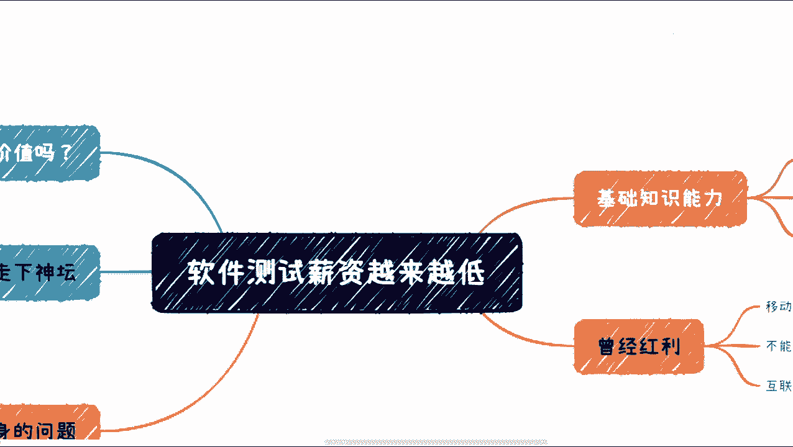

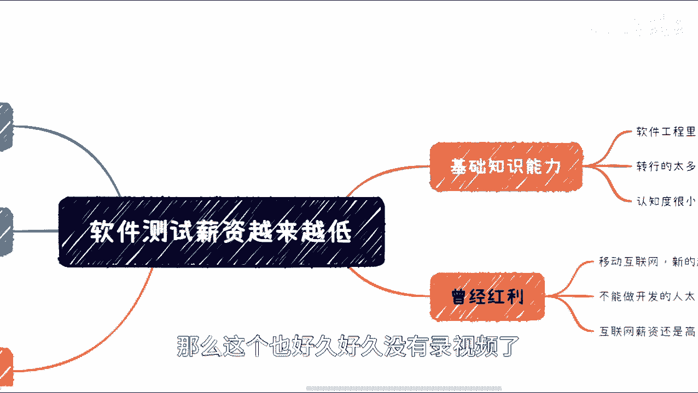

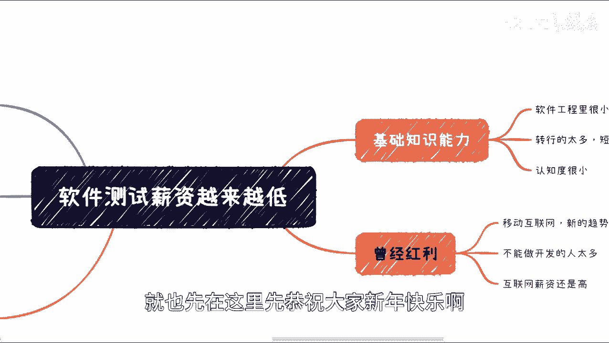

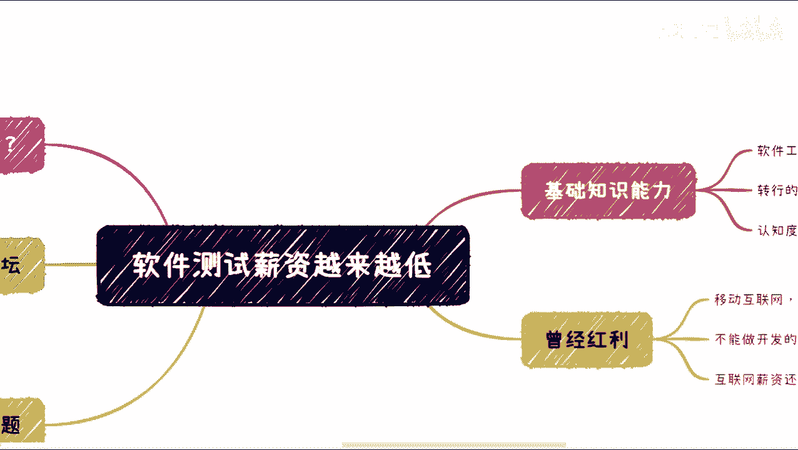

在本节课中，我们将一起探讨“软件测试薪资为何越来越低”这一现象。我们将从行业历史、现状、核心问题以及未来趋势等多个维度进行分析，旨在帮助初学者理解背后的逻辑。

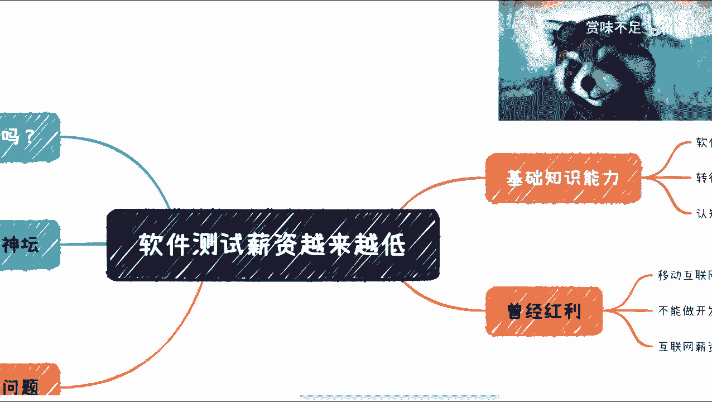

## 概述：行业背景与现状

整个互联网行业自2018年起基本呈现下行趋势。软件测试岗位在基础能力层面，从一开始就存在结构性问题。

首先，在软件工程学科中，测试历来只占很小一部分。大学课程中相关内容较少，导致许多毕业生只知开发，不知测试为何物。

其次，从业人员水平参差不齐。转行进入测试领域的人非常多，其中包含大量通过短期培训入行者，这拉低了行业的整体专业水准。

第三，从业者对测试本身的认知度普遍较低。许多人只是被动执行指令，缺乏在特定项目、团队或上下文中独立设计和实施测试策略的能力。

上一节我们介绍了行业的基本背景，本节中我们来看看曾经推动测试岗位发展的“红利”因素。

## 曾经的行业红利

互联网和移动互联网的兴起带来了多波红利。每一波新红利都催生了新的公司、团队和产品，随之产生了对开发、测试、产品、销售等岗位的大量需求。

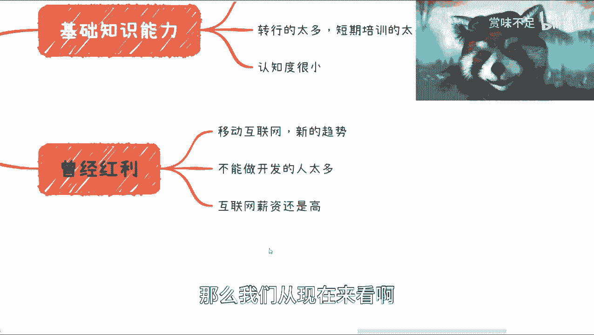

以下是推动测试岗位需求增长的几个关键因素：

*   **开发岗位竞争激烈**：想做开发的人很多，但真正具备能力的人相对较少。部分人因此转向测试岗位。
*   **能力衡量标准模糊**：开发人员的能力相对容易衡量（如功能实现、代码质量）。而测试人员的能力（如发现Bug的能力）则难以量化。发现Bug多不一定代表能力强，反之亦然。
*   **互联网薪资吸引力**：即使行业下行，互联网行业的平均薪资相比许多传统岗位仍有吸引力。一些人通过短期培训后入行，期望获得比原岗位更高的收入。

然而，这种基于短期利益的选择，往往忽视了行业的长期发展趋势。

## 测试的核心价值与当前困境

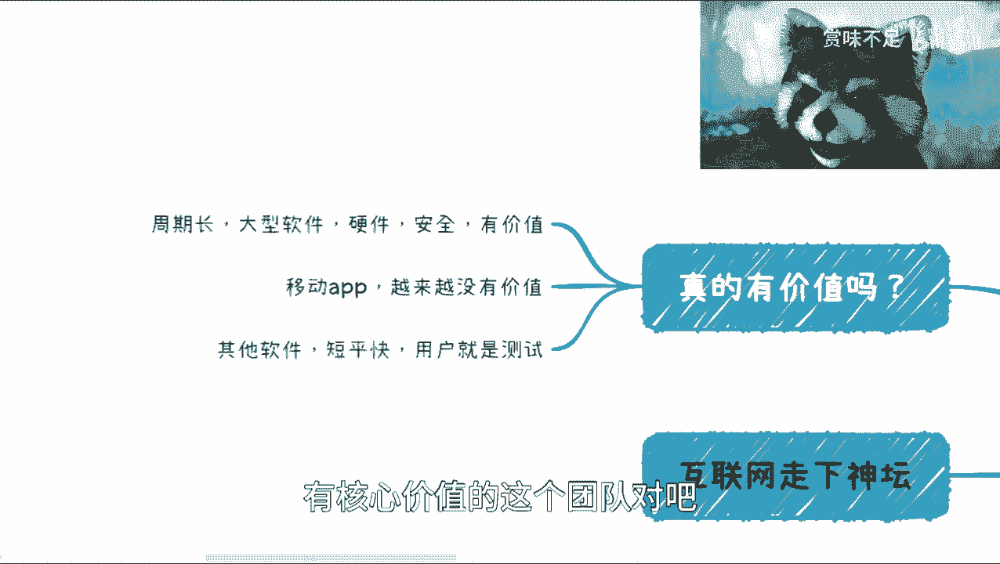

那么，软件测试本身真的有价值吗？答案是肯定的。在周期长的大型软件、某些硬件或安全领域，专业的测试不可或缺。但需要明确，安全测试（Security Testing）和质量保证（QA）的定位已日益独立于传统的功能测试。

当前困境在于，互联网节奏加快，产品追求快速上线。许多公司开始倾向于采用线上测试、A/B测试、用户内测等方式，而非长期雇佣专职测试人员。在经济下行、企业控制成本的压力下，不具备核心价值的岗位会首先受到冲击。

以下是测试领域常见的几种工作模式及其面临的问题：

*   **手工测试**：其工作容易被外包或通过用户内测替代。企业会质疑雇佣专职手工测试员的必要性。
*   **自动化测试**：对于产品需求变化快的项目，编写和维护自动化脚本的成本可能高于其收益，且很多测试用例价值有限。
*   **持续集成（CI）**：其核心价值更多体现在开发、单元测试、打包发布等环节，与测试职能的直接关联性正在减弱。
*   **测试用例自动生成**：该技术发展十余年仍不成熟，在一个非核心领域投入产出比低。
*   **测试开发（SDET）**：在国内，许多测试开发人员具备的是测试框架开发能力，而非产品业务开发能力。当企业需要压缩成本时，可能会优先保留核心的产品开发人员。

## 测试人员的职业出路

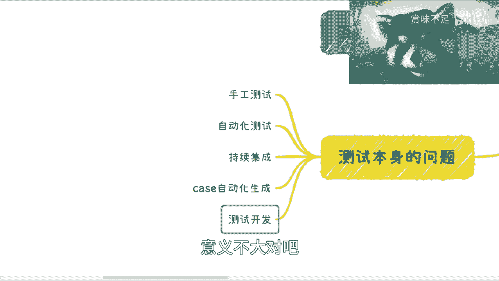

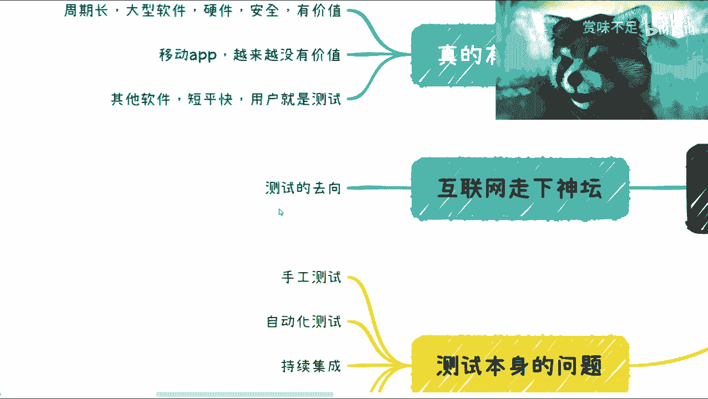

随着互联网光环褪去，测试人员面临职业转型的挑战。他们的去向大致有以下几种：

以下是测试人员可能的几种转型方向：

1.  **转向开发岗位**：这是最直接的路径，但竞争激烈，成功转型需要强大的学习能力和技术基础。
2.  **转向互联网其他岗位**：如产品、运营、市场等。这对测试人员的商业意识、产品理解和社交能力提出了很高要求，转型难度较大。
3.  **完全转行**：离开互联网行业。开发人员凭借技术能力可能更容易跨行业，而测试人员的技能通用性相对较弱。
4.  **承接外包项目**：开发人员接私活的机会较多，而测试工作很难找到稳定的外包项目来源。

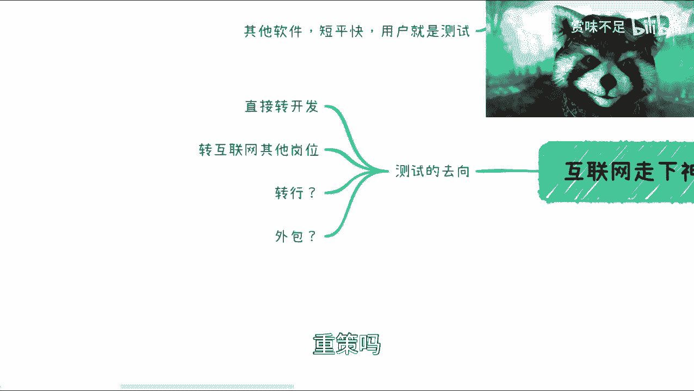

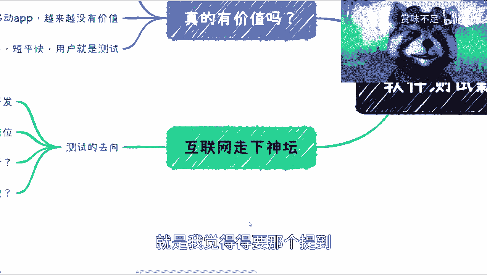

## 行业培训与个人发展建议

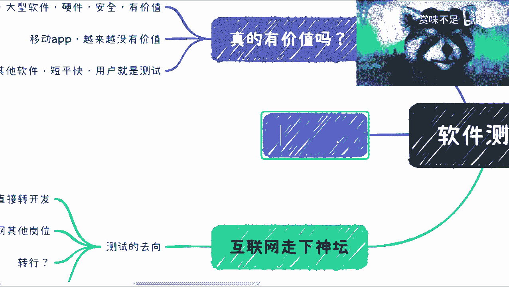

许多培训机构在招生时，往往只强调行业的高薪和就业率，却很少提及市场下行时的风险以及职业长期发展路径。

对于从业者而言，不能只专注于技术“象牙塔”。必须同步提升**社交能力**、**商业意识**，并理解真实的合作与商业模式。接地气、拓宽视野，才能在经济周期波动和行业变迁中保持竞争力。

## 未来展望

未来几年，经济复苏需要时间。在一个经济下行、企业普遍困难的环境中，一个原本就不受重视的行业和岗位，其地位可能会进一步下降。

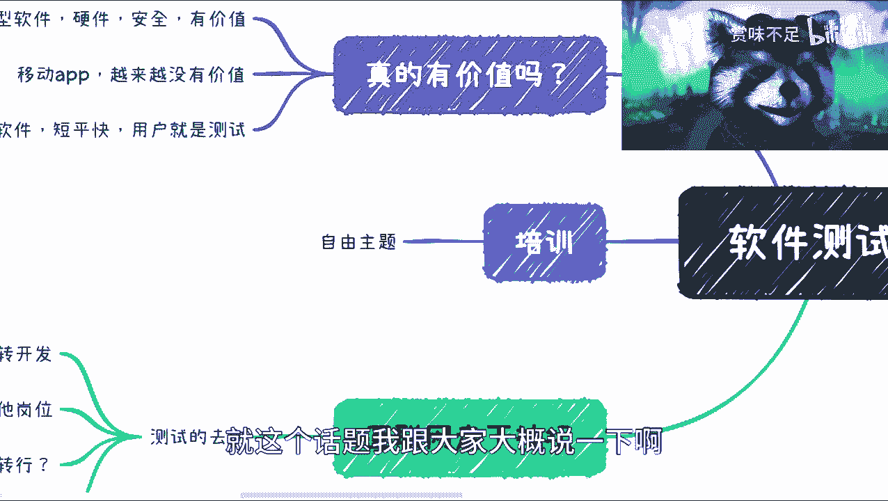

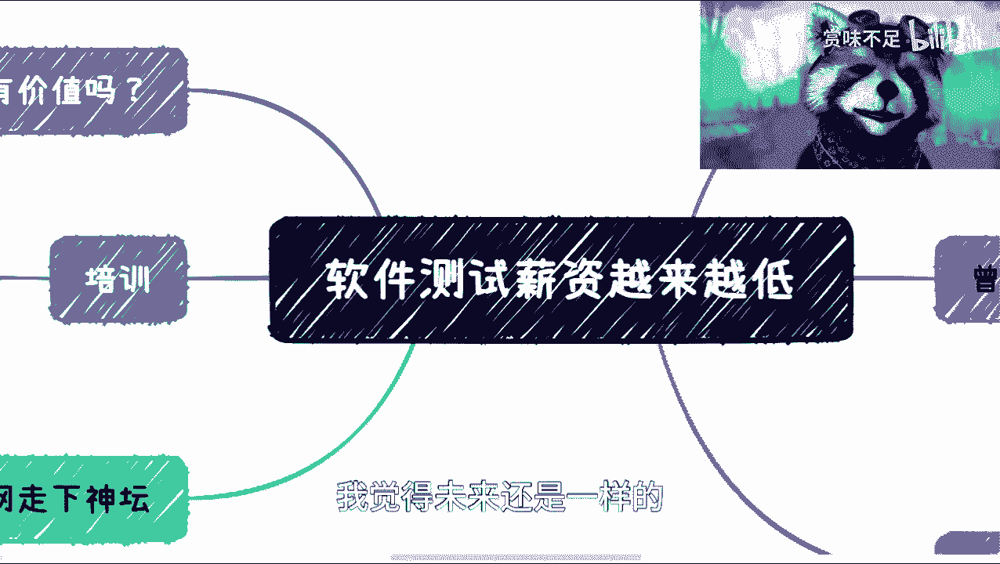

当然，在特定的软件、硬件及标准评测领域，专业测试依然有存在价值。但对于广大的普通测试岗位而言，就业市场可能会持续收紧。

## 总结

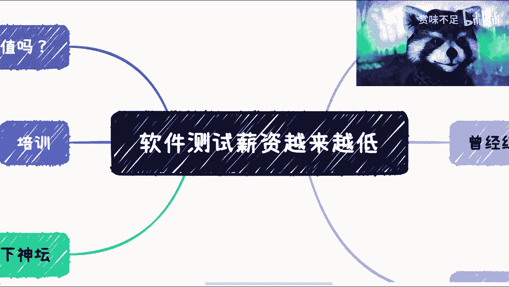

本节课中我们一起学习了软件测试行业面临的挑战。我们回顾了行业从红利期到下行期的转变，分析了测试核心价值在当前快节奏开发模式下面临的困境，探讨了测试人员的职业出路，并给出了个人发展的建议。核心结论是：测试岗位的专业性未被广泛认可，在成本压力下易被边缘化，从业者需拓宽技能树并提升综合能力以应对变化。