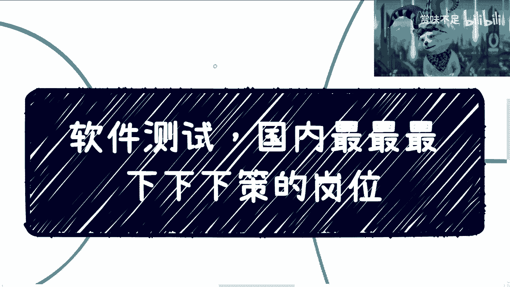
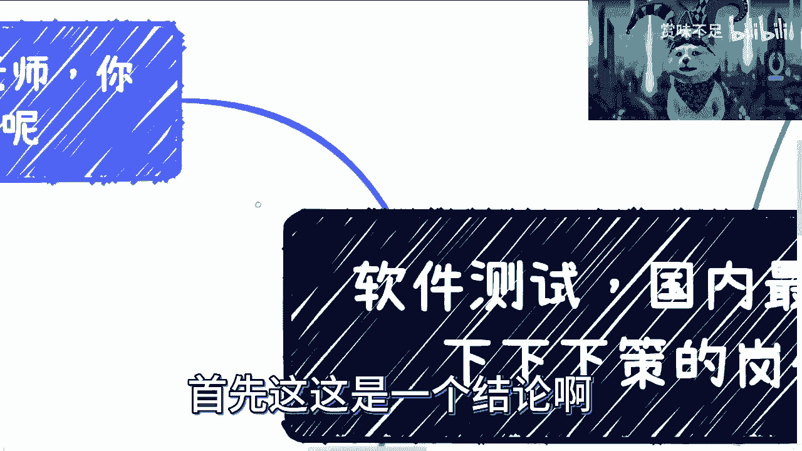
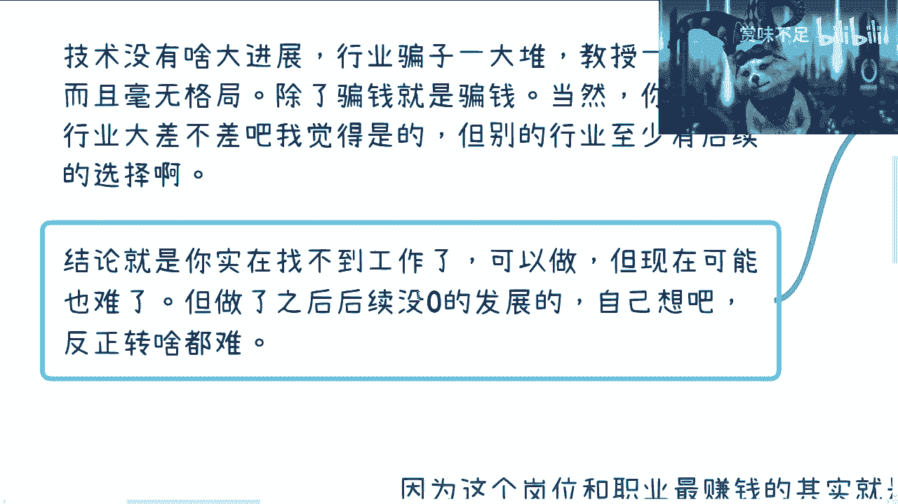
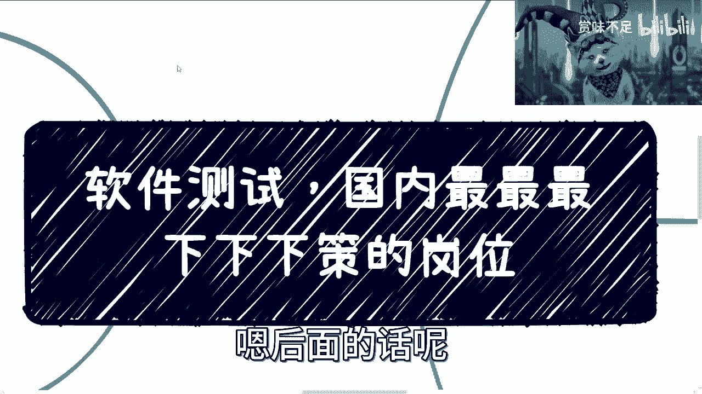

# 软件测试，国内最下下策的岗位 - P1 - 赏味不足 - BV1Jo4y1w73F

好大家好啊，这个假期快乐是吧，然后今天还有小伙伴问我今天还出不出啊，出啊给出嗯。

然后之前上上期吧，反正大家让我讲一下软件测试是吧，我跟你讲啊，这个内容以前我讲过啊，然后呢我今天再总结一遍好吧，这个后面我就不讲了好吧，就这么一块了啊，首先是这样子的啊，在国内啊。

这个我跟你们讲的很清楚，就是下下策就下下下下下下下下策啊，你们但凡不是那种走投无路对吧，要要出去讨饭了是吧，那那可以啊，就但凡不是这样子，我觉得没必要做对吧。

首先这是一个结论啊，那为啥这么肯定呢，是因为你们自己去看吧啊，就这个行业或者这个岗位啊，或者这个职业最赚钱的其实就是培训，就你真的要去赚钱，就是培训，但是我告诉你们，培训的这个上升期红利期也早就过了。

你们现在去做也没有用对吧，这是第一个，第二个呢就是说这个岗位和这个职业发展，在你的职业发展也好，在你的商业理解上面发展也好，毫无任何帮助，就是说你这个岗位啊，你去做了啊，但凡做过的小伙伴。

你们也都知道对吧，就是要技术要技术不行，要业务要业务不行对吧，要商业化商业头脑，商业头脑不行，反正就是一无所知，什么都不知道对吧，简单来讲就是说你做了之后，你回头要去转岗对吧，很难转，首先是第一点。

第二点呢就是你要回头创业啊，你更是一无所知，而且你创什么东西呢，你在里面做什么决策呢对吧，技术技术不行对吧，COCO不行，你能干嘛呢，销售销售不行，我也不知道你能干嘛是吧啊。

这第二点第三点呢就是最最重要的是什么呢，就是你做一件事情，别人对这件事情毫无认知，就比如说你今天不管你做产品，做项目，做销售对吧，做你比如说什么assistant对吧，consulting对吧。

各种各样的，你讲出去，对方至少能知道你是干嘛的，你可以说我是软件测试哈，我就问嘛对吧，在商业变现上你能帮得到啥对吧，在商业合作上你又帮得到啥对吧，更何况更不要说你在企业里面，你去问你的manager。

问你的老板，他们懂啊，不懂他们知道吗，不知道你相对一个不懂的，不知道的这个东西来讲，你指望他在公司里面能有多大价值吗，你这不是扯淡吗，是是不是啊，所以说呢就是我在这个地方写的很清楚。

最主要的原因并不是因为这个行业不行，也不是因为这个岗位不行，而是因为整整个上上下下就是扭曲的，从上到下就没人知道它是干嘛的，就这么简单啊，就这么简单，那么首先这是第一点，第二点呢。

那你说为什么培训最赚钱了，因为以前互联网20年啊，在中国发展对吧，因为互联网起薪高啊，大部分人呢都觉得要去互联网，当时整个舆论对吧，你们的老师，你们的父母对吧，各种各样的人啊，就不停的在跟你们讲。

哎呀互联网牛逼啊，这个能赚钱啊，薪资高，那么很多人就得去是吧，就想去，但是他们又没学计算机专业或者通信专业，或者自动化专业，怎么办呢，没关系啊，培训啊对啊，培训三个月，培训6年啊，六啊啊呸，培训三个月。

培训六个月对吧，就去做了，做什么呢，软件测试为什么呢，好做起门槛低啊对啊，找一圈就软件测试啊，然后就泛滥了呀，对不对，当然了，当年的情况的确是很好的对吧，当年情况的确是很好的。

因为你去找一个软件测试工作，总比你找不到工资强吧对吧，而且软件测试在当时互联网20年整个上升期，整个大家都有钱的情况下，他还是起薪还是OK的啊，不管在一线城市，二线三线四五线对吧，都还是OK的。

但是你现在呢啊没用没用嗯，然后咨询过我的人呢，其实也都知道对吧，但凡让我推荐的，我只会推荐运营，因为什么呢，因为很简单啊，你运营在后面，不管你说你是要去转转行也好对吧。

包括运营的整个的一个一个可持续发展也好，包括哪怕你以后自己创业也好，你出去就合伙做事情也好，运营的很多经验，很多东西对你是有可持续帮助的，你知道吗，就不管是你岗位上的变化，还是就是商业头脑。

你是有帮助的，你知道吗，你做测试，你什么都不会，我可以很明确告诉你，所以说啊从开始就是要死路啊，想都不用想了，那么我们说以前跟现在有什么区别啊，首先呢以前其实是可以有发展的。

当然你们也可以理解为不叫发展就叫什么呢，就是说可以混啊，什么叫可以混呢，就是大在大环境好的情况下，在大家都有钱的情况下面也没人关心你，多一个岗位，少一个岗位对吧，大家可以混啊。

你混个10年赚10年的钱也没问题对吧，但是我还是那个观点啊，我还是那句话，我们不是活10年就不活了，我们也不是活20年就不活了对吧，我们也不是活10年就财务自由了对吧，你该要想的事情还是要想的。

我跟你说，大部分如果真做软件测试这个岗位的啊，你做10年出来，你就是个废人啊，没有任何区别的啊，你跟一个废人没有任何区别啊，然后你看啊这个以前啊那么叫做都有钱是吧，以前呢大家一开始选错了就选错了啊。

后面还能换，你比如说换成产品啊，开发运维啊对吧，那为什么还能换呢，因为大家有钱，因为互联网在上升期啊，因为以前还不够卷啊，没有现在这么卷啊，你去看看5年前看看，7年前跟现在是一样的吗。

一个天一个地啊是吧，然后呢现在我不推荐啊，我很不推荐，我非常不推荐，我极力不推荐，为什么呢，为什么你越来越少了，是因为别人有非常多的，哪怕有直接经验的对吧，哪怕对口专业的。

人家从前两年开始到今年就找不到工作，更别说你要去什么转转岗，什么鸟毛玩意儿是吧，谁他妈，你你说是吧啊，更找不到你不在扯淡嘛，你说是不是，然后另外一方面呢，过去10年整个测试岗位就是在不停萎缩的。

想都不用想啊，没有任何，就是他就没有任何受到过重视的地方啊，没有意义的这件事情，唉是吧，这个是三啊四那这个人又要说了啊，他说有的人要问了啊，存在即合理，为什么还会存在，很简单啊。

因为整个商业闭环是完整的，说白了就整个商业生态是赚钱的啊，只要他哪天不赚钱，就不存在了，很简单啊，那你比如说什么怎么赚钱呢，那企业leader啊。

你们的CTO你们的manager需要测试的HDCOUNT，就这个岗位啊来冲自己的预算，肯定要我跟你们讲，你们也不用想，你们哪天变成leader，你们哪天变成manager，你们也会这样子的啊。

你不用想啊，真不用想，这第二点第三点呢，项目啊你要去申请政府补贴也好，区区补贴也好，产业园补贴也好，那你都是需要人才的对吧，那你多报一点就多点补贴，你肯定也是要的对吧，你何必跟钱过不去呢。

是不是还有呢就是培训公司啊，需要更多的包装，因为他们只有更多的生人才会活下来，才能活下去，你没有生源怎么活呢，这不搞笑吗，是不是啊，然后呢，自然啊，自然市场上面需要更多的人是需要工作的。

这个也是个很核心的，因为上面都是所谓的那个需求方啊，那么下面这些人才是供给方，那么供给方是什么呢，就是整个大环境很多人找不到工作，那么他自然而然就会去寻找机会对吧，哪怕哪怕我今天跟他们讲。

我说你们未来没什么发展的，但是没有办法，大家还是要吃饭的对吧，下下策还是要去学的啊，就有很多人还是会去学的，所以说整个生态是赚钱的，这也毫无疑问，我在这个地方也提一嘴啊。

就是说你们听所有的这个内容的时候呢，你们也可以举一反三哦，也可以去思考一下，就是说很多东西它是通的，你比如说这个地方他很多东西都是通的，不是说只有测试这样子直播电商啊对吧，网络安全啊。

所有东西其实都一样的啊，没什么区别的，只不过呢在我看来，别的岗位有很多的就是后发制人的一些方式。

但是测试没有啊，那么这个是第四点。

那么第五点是什么呢，就是有的人又要来说了啊，驴老师，你二极管怎么下定论了，我跟你讲，不好意思，这事我就二极管，为什么，因为这个事无论从以前的10年啊，包括整个大环境情况，毫无疑问想都不用想了，你知道吗。

就是原本还不错的，现在都已经是属于那种呃岌岌可危了，那更不要说原本就很渣了，那现在更渣，是不是啊，所以说我可以告诉你，以我的认知啊，就是未来10年到20年都是没戏的，想都不用想啊，你你不用抱任何希望啊。

不要抱任何希望，没有任何意义的啊，第二点呢，就是说未来10年技术本身就是这个行业啊，这本身他就没有什么进展，你们自己去看好了，没什么进展，10年前讨论什么，现在还讨论什么没有意义的，毫无竞争啊。

那行业骗子一大堆啊，教授所谓的教授一大堆啊，就是一群垃圾啊，毫无格局对吧，你们去看，你们可以去看那些教授啊，这个除了骗钱就骗钱啊，除了蹭热点就蹭热点没了没有了啊，你去看好了，就是GBT出来蹭GBT啊。

GBD不出来蹭AIGC对吧，AIGZ不出来就蹭以前的，反正就瞎瞎瞎蹭啊，嗯当然了，你说别的行业大差不差吧，我也承认的啊，我承认大厂不差的，但是别的行业至少是有后续的选择啊，我还是那句话，有后续选择啊。

结论是什么呢，就是你实在找不到工作了呢，我觉得你可以选啊，但是现在也很难了，因为毕竟现在岗位也很少，也很卷啊，但是做了之后呢，后续是没有发展的，也不是说没啥大的发展，就是没发展啊。

就是没发展，自己想好吧，我反正就这么说了啊。

就就这么个结论，反正你们自己想当然，因为我就说了嘛，每个人追求不一样对吧，有的人说我也无所谓啊，我就赚分钱那也行啊，然后你说我有的人说嘛，我就当他是奉主业对吧，剩下这个副业自己做做也行啊。

我觉得都没问题对吧，但是就是说你要但凡想在职业发展上有些什么，什么进步啊，或者就是有些积累的啊，我跟你讲就别想了。

后面的话呢反正就我不可能再去讲这个内容了，好吧，也别叫我讲这个内容了，那这是第一点，第二点呢，就是呃，或许我也会再跟大家把这个商业化一些东西，再再再再说一下，然后你们要是有什么呃想要了解的好吧。

然后你们也可以跟我讲呃，别的领域呢就是我可能回头会会讲啊，但是因为我也不是特别了解，所以我也不会说这个这个讲课的太多，因为我给大家误导就不太好好吧，哎呀行。

