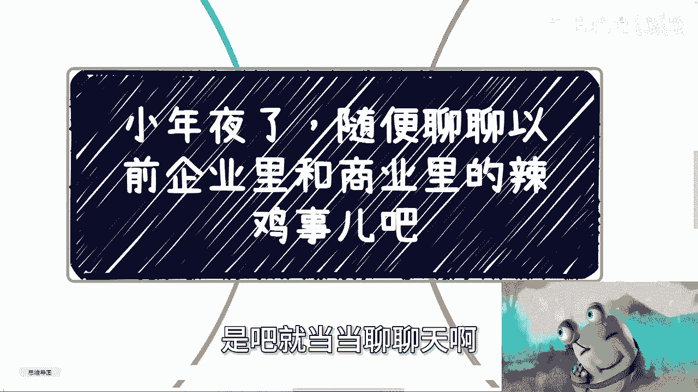
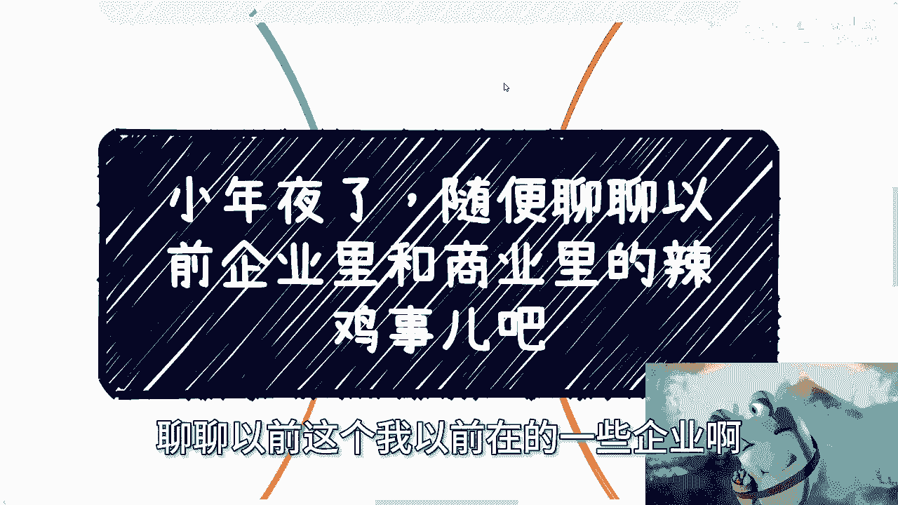
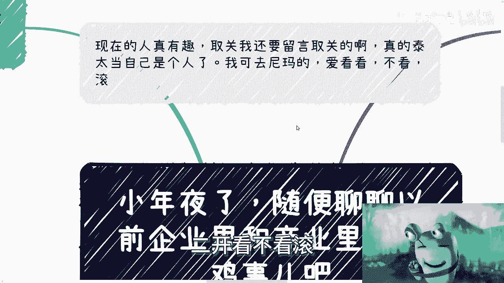
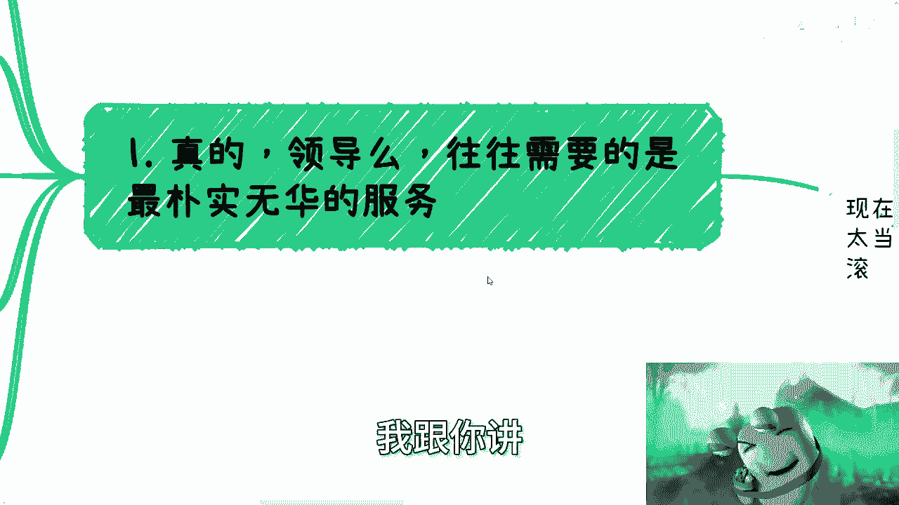
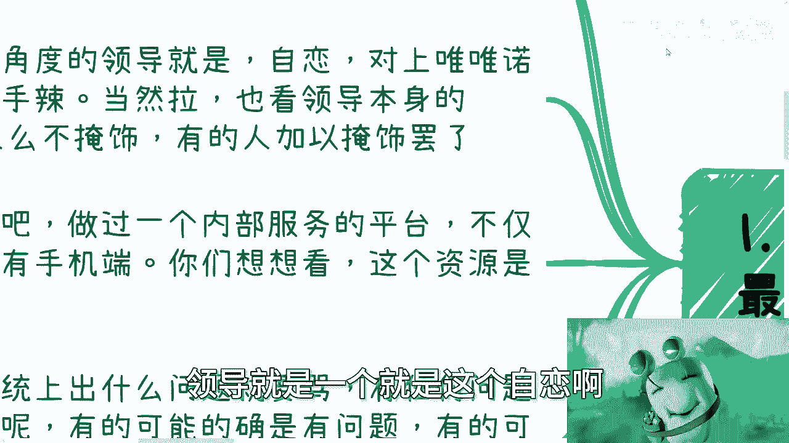
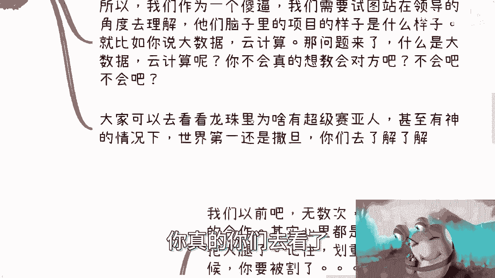
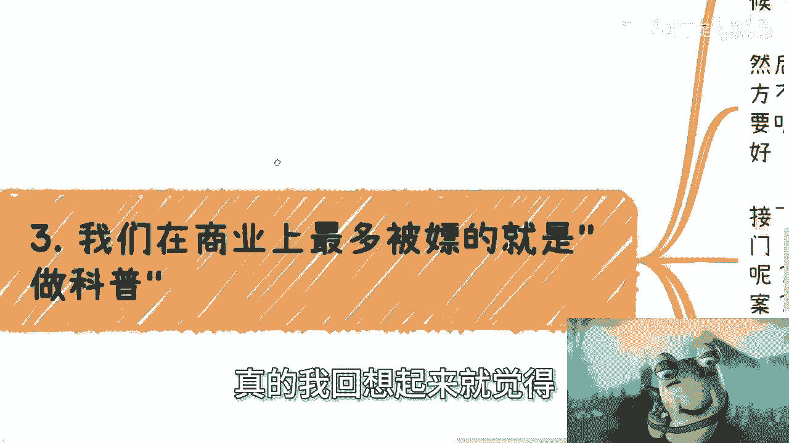
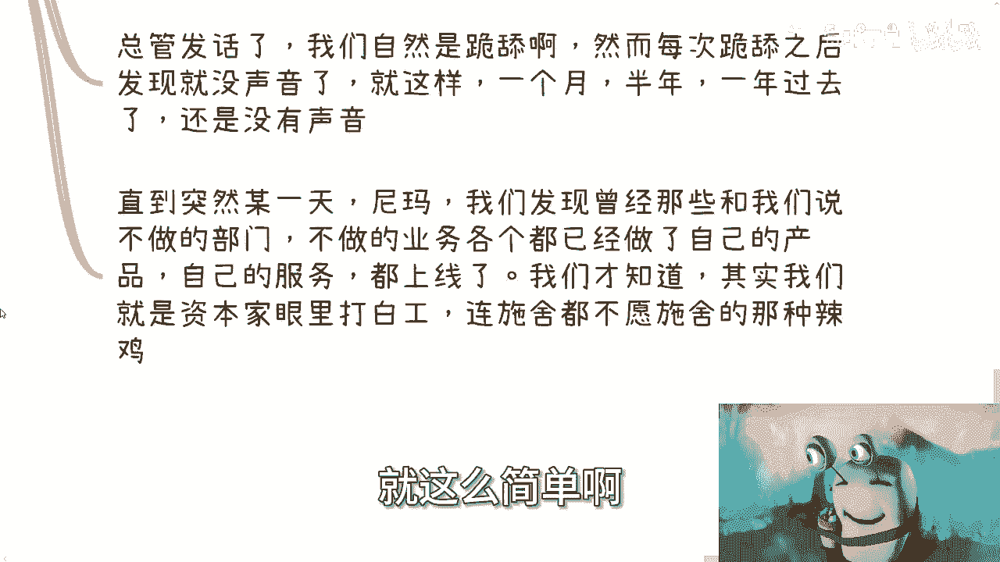
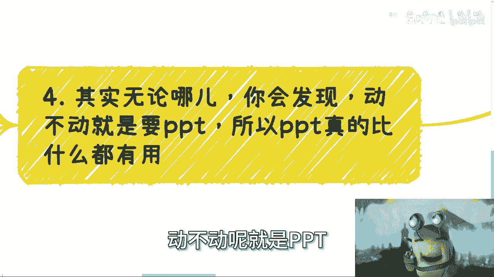
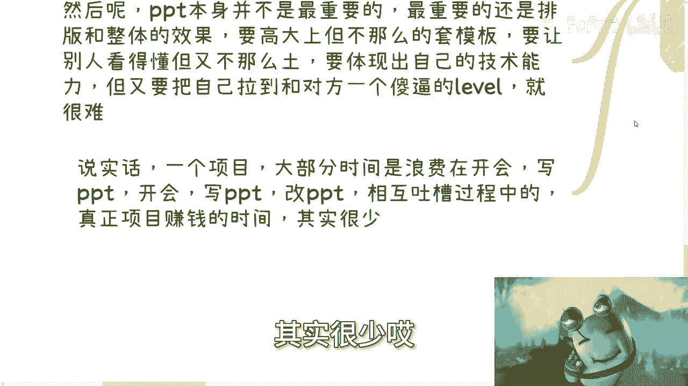

# 职场避坑指南：与“辣鸡”领导和商业陷阱过招 💼





在本节课中，我们将通过一个真实的职场故事，学习如何识别和处理工作中不称职的领导以及商业合作中的常见陷阱。内容将涵盖领导特质分析、应对策略以及商业白嫖的防范。





---



## 领导的特质与应对策略 🎯

上一节我们概述了课程内容，本节中我们来看看领导角色的普遍特质。

宏观来看，许多领导角色具有相似性。他们往往**自恋**，对上唯唯诺诺，对下则可能表现得心狠手辣。当然，领导的水平有高低之分。高水平的领导会加以掩饰，通过先PUA再安抚的方式，以达到让你加班等目的。低水平的领导则不加掩饰，直接进行打压。

面对这种情况，直接的对抗并非总是明智之举。以下是一种务实的应对策略：

当领导因不理解系统而频繁提出无理指责，并可能影响团队绩效（如KPI和年终奖）时，可以采取技术手段进行“安抚”。例如，针对该领导的用户ID和设备，专门定制一个完美无瑕的页面展示给他。核心操作可以概括为以下伪代码逻辑：

```python
if request.user_id == “boss_id”:
    display_perfect_ui() # 展示完美定制界面
else:
    display_normal_system() # 展示真实系统
```

从此，世界变得安静，团队的考核指标也得以保全。这揭示了一个道理：有时解决问题不在于纠正错误的理解，而在于满足对方“正确”的幻觉。

## 与政府或高层领导沟通的艺术 🏛️



理解了企业领导的共性后，我们来看看与政府或类似高层领导沟通时的特殊之处。



这类领导通常需要维持一种前沿、专业的形象。沟通的关键不在于用真实、复杂的技术或业务架构去说服他们，因为这可能是在“打脸”。真正重要的是，要有“逼数”，即尝试站在他们的高度，去理解他们心目中项目应该“展现”出的样子。

例如，当谈论“大数据云计算”时，目标不是真的教会他们技术原理，而是呈现一个符合其想象的高大上概念。这让人联想到漫画《七龙珠》中的角色“撒旦”：在一个充满超级赛亚人和神的世界里，名义上的“世界第一”却是一个普通人类。理解这种“展现”与“实质”的错位，是沟通的精髓所在。

## 商业合作中的“白嫖”陷阱 ⚠️

在职场内部生存之外，商业合作中也布满陷阱。接下来，我们聚焦于最常见的一种：被大公司以“合作探讨”为名进行“知识白嫖”。

许多团队都渴望与知名大公司合作，幻想借此“抱大腿”、“迎娶白富美”。然而，这种心态往往正是被收割的开始。典型的流程如下：

以下是常见的“白嫖”步骤：
1.  **初步接触**：对方姿态很高，我方需要像“太监见总管”一样恭敬，聆听对方吹嘘。
2.  **提出需求**：对方表示要开拓新业务，但“不懂”，谦虚地请求我方做个“分享”或提供“案例参考”。
3.  **我方投入**：我方怀着憧憬，连夜制作PPT、整理资料，全力进行“科普”和方案输出。
4.  **石沉大海**：分享会后，对方杳无音信。数月或数年后，却发现对方以自己的名义推出了高度相似的产品或服务，曾经的“谦虚求助者”变成了标榜的“行业专家”。
5.  **结局**：我方提供了完整的方案，却未获得任何报酬，纯粹“打了白工”。由于缺乏有效合同约束，往往维权困难。



这个过程的核心教训是：当你觉得“抱上大腿、即将起飞”时，很可能已离被割韭菜不远了。



## 职场与商业的通用“神技”：PPT 📊

无论是应对领导还是进行商业周旋，有一项技能被提升到了至关重要的地位。

在当今的职场和商业环境中，**制作PPT**堪称一项“神技”。任何事情，无论是内部汇报、对外分享还是项目沟通，第一要务往往是“写PPT”。PPT的重点不仅在于内容，更在于**排版与整体视觉效果**：需要高大上，又不能像套用模板；需要让人看懂，又不能显得土气；需要展示技术实力，又要把自己拉到与对方同一认知层面。



大量的时间被消耗在开会、写PPT、改PPT和相互吐槽上，真正用于创造核心价值的时间反而很少。这反映了一种普遍的形式主义文化。


---

本节课中我们一起学习了如何识别不称职领导的特性，并掌握了通过技术定制进行应对的务实方法。我们也探讨了与高层沟通时，“展现”比“实质”更重要的艺术。此外，我们剖析了商业合作中常见的“知识白嫖”陷阱及其步骤，提醒大家保持警惕。最后，我们认识到，无论环境如何，精通PPT这项“包装”技能在当下职场中显得尤为重要。希望这些经验能帮助你在复杂的职场和商业世界中更好地 navigate。