# 近期咨询问题总结 - P1 - 赏味不足 - BV1oV4y187XE

哈喽大家好啊，今天礼拜五来是吧，礼拜五就可以摸鱼了啊。

近期这个咨询的内容比较多啊。

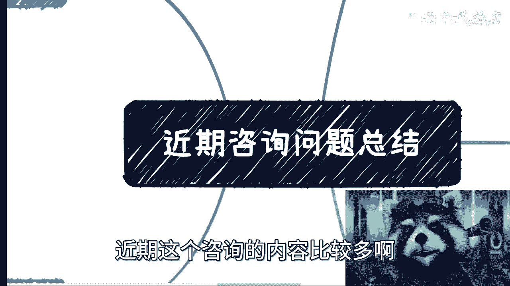

我也给大家正好总结总结就是有些通用问题嘛，就大家可以就是借鉴就借鉴啊。

首先第一个呢就是说啊吕老师说啊，为什么啊，就跟我讲，他说他参加了一个活动啊，他说啊，为什么他们说的数字经济跟讲的不一样对吧。

我们来看一下啊，就前几天呢有这么一个私信啊，他说他参加了一个活动，然后有AIGC对吧，web3各种，然后就说的各种数字经济啊，新一代生态对吧，我但表示跟我讲的不一样啊。

呃其实这个呢就跟曾经我给你们举个例子，就跟那个数字藏品是一样的，你比如说啊你参加了很多的会对吧，他都会告诉你就是数字藏品的优势啊，卖点对吧，好处对吧，各种未来对吧。

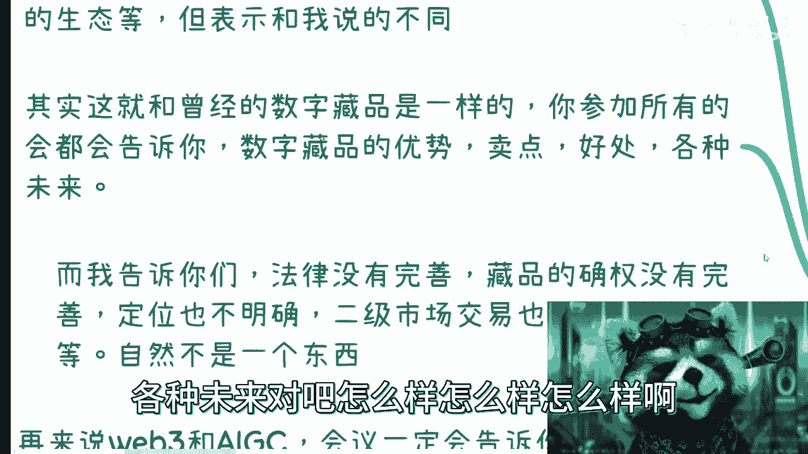

怎么样怎么样怎么样啊，但是呢我会跟你们讲呢，我说比如说数字藏品对吧。

法律没有完善啊，藏品的确啊，房产品的这个确确权没有完成对吧，定位也不够清晰对吧，二级市场交易也没有被认可对吧，就是就是我会跟你们讲，比如说当下生态当下的一些情况对吧，就事实是这样子对吧。

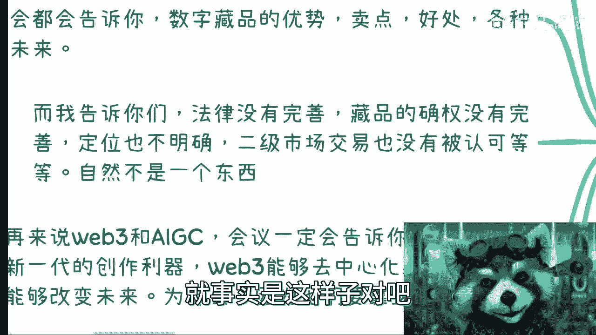

你你听起来肯定不是一个事情对吧，那肯定你们去参加个活动，也会跟我说，他说哎吕老师这个这个我听下来，整个这个藏品跟你讲的，这不是一个东西，那是不是一个东西对吧，再者说就是现在web3还有AIGC会议。

也会告诉你们，就比如说AIGC是新一代的这个创作利器，对吧啊，然后你也会听到有很多人，很多会上面会跟你说啊，有多少人因为这个东西会失业对吧，会怎么样怎么样，其实我说的嘛就本质上它都是一种营销。

都是一种生意啊，就是说web3，包括告诉你web3是能够decentralized对吧，去中心化的这个结合token能改变未来对吧，带来新的商业模式，那为什么会这么讲，是因为他们现在就要靠这些去变现。

你知道吗，他们要去做项目，要去做什么东西对吧，我要今天去靠这个东西变现，靠这个东西去做项目，我也会这么跟你们讲讲，我管你们怎么想的，对不对，那我能忽悠几个算几个对吧，就是我跟你们讲变现这件事情。

我觉得没有问题，变现本质上要去实事求是的去呈现，这个市场的情况来告诉大家。

而不是说就是利用信息差对吧，就虽然就就因为你们不懂对吧，然后他们就是有添油加醋对吧，就各种各样的对吧，就去变性，这个问题，就跟我以前跟你们讲的培训机构是一样的对吧，包括高校是一样的，是为了所谓的KPI。

然后各种夸大这个夸大市场，甚至虚构这个市场，就很多人选择很多人，我跟你讲，选择培训机构，或者说啊就是就是选专业对吧，选填志愿的那一刻开始，你就已经被割了，你知道吗，就就没有办法。

就是整个社会市场他就这个样子的啊。

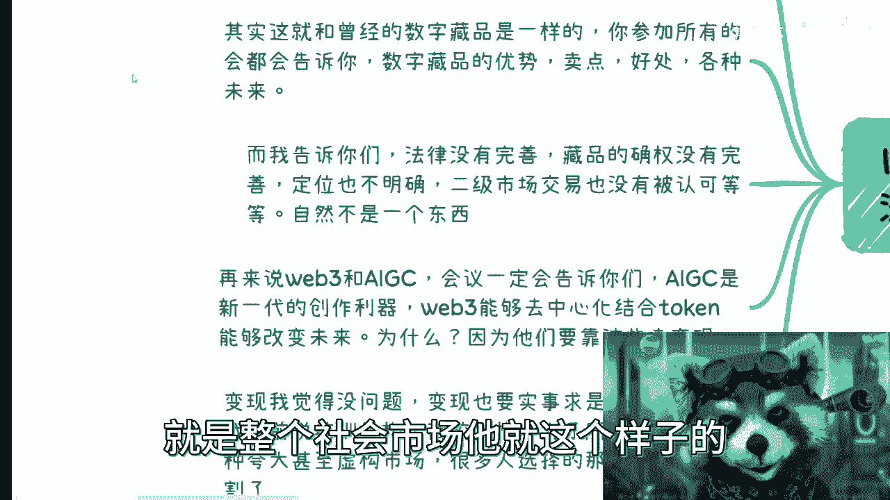

你我就说啊，就大部分的内容他都是不客观的，他都是因为他背后的利益所驱动的，但是你们为什么不会这么觉得，是因为你们不知道的，就是因为信息差哦，所以才会这样子，那你说跟我讲的会是一样的呢。

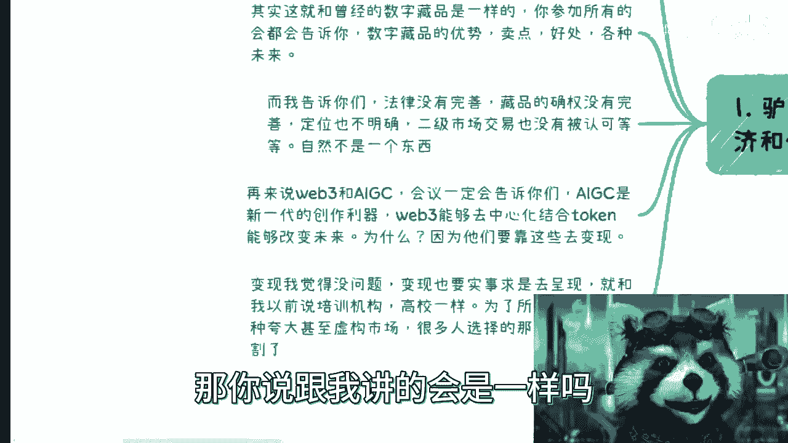

对不对，我今天要是要在你们，我就这么说，我今天要是在你们身上，要去赚这个数字经济对吧，或者说要要去这里web3或者AIG这些钱，我也不会这么说啊。

我已经告诉你妈妈这个东西牛逼，这个东西你们不学习，你们就要失业了对吧，怎么样怎么样怎么样，对不对。

这个这里没有一点问题是对吧，事实不是这样子啊，那么第二个他说哎吕老师。

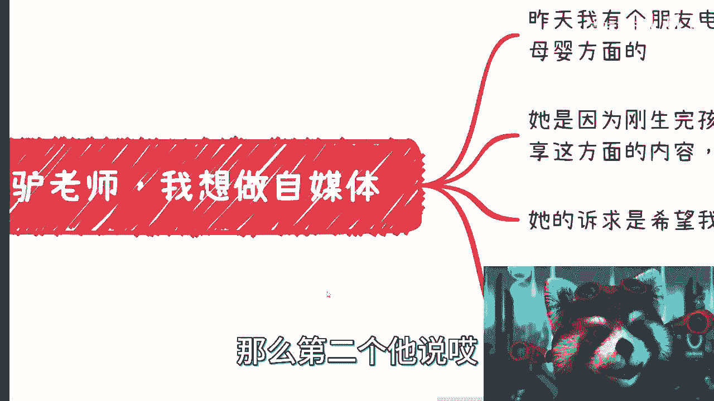

我想做自媒体啊，昨天呢我有个朋友打电话跟我说。

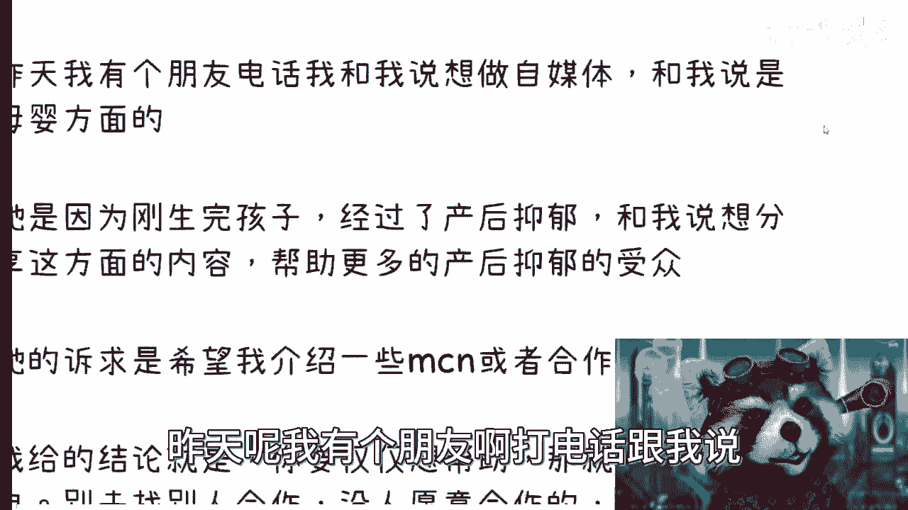

他说他想做自媒体，她想做母婴，母婴方面的啊，然后他的出发点呢是这样子的。

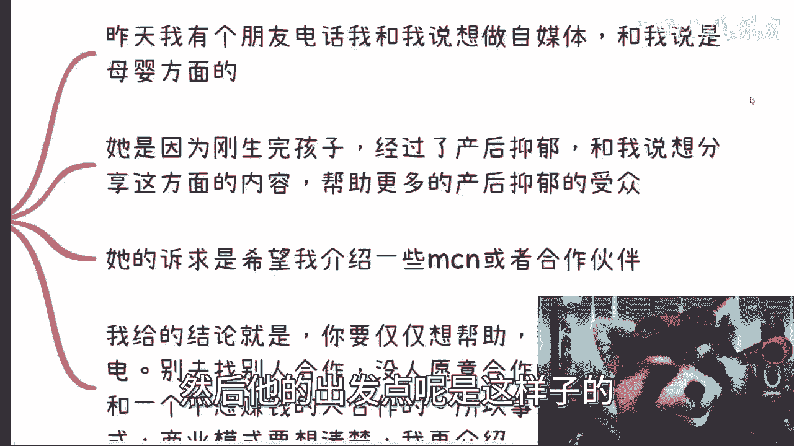

他说啊，我这个刚生完孩子对吧，然后经过了产后抑郁，然后跟我说的想分享这方面的内容啊，帮助更多的这个产后抑郁的受众。

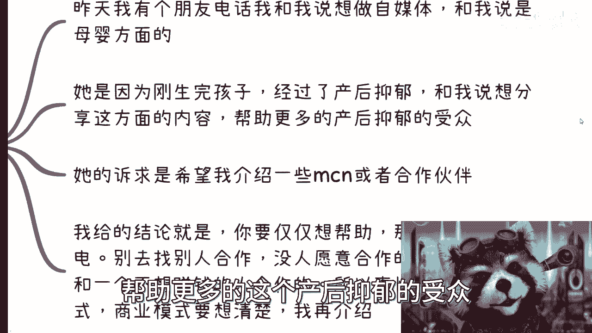

我觉得这没有问题啊，这没有问题，然后呢再聊，然后他的诉求，就是希望我能介绍一些MCN或者，合作伙伴给他，嗯反正聊，那就我就跟大家说结论了，就过程聊了蛮久的，就是我给的结论。

就是说你要仅仅想帮助那些人对吧，你其实本质上就是用爱发电啊，但是呢你用爱发电呢，你就别去找别人合作，没有人愿意合作的，因为商业合作上面是这样子的，没有人会愿意跟一个不想赚钱的人合作啊，你要用爱发电。

那你去发电，你你爱怎么发电，怎么发电，跟我们没有关系啊，所以我就跟他讲，我说所以你如果要做难，你一定现在就思考好对吧，就是你现在做目的是什么，你怎么变现，你的商业模式是什么。

你最终是要带货还是要怎么样子，就是你要把你的这个这个受众用户画像对吧，变形模式啊，产品逻辑你都想清楚。

我再给你介绍，你不想清楚，这介绍人家就会觉得那人家就会觉得，那那陈老师，你介绍一个这合作方给我对吧，又不赚钱，你介绍介绍给我干嘛对吧。

就这种会有种什么感觉呢，就是说你用爱发电没有关系对吧，我不希望别人觉得我用爱发电对吧，因为我是要去找别人合作的，我一旦让别人觉得啊。

我也是用爱发电，但人家就不跟我合作了对吧。

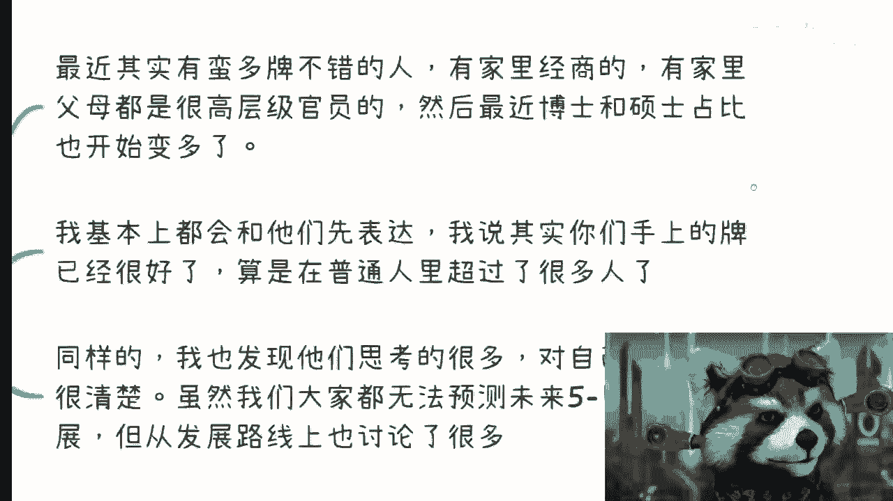

那么第三点呢，就是说我觉得手上的牌好的呢，其实就越努力，我现在呃整体咨询下来比例啊，就从我接触下来比例来讲是这样子的，因为最近呢其实有蛮多牌不错的，就比如说家里本来就经商的，然后就是说有一些年轻的。

就是22岁的硕士硕士，26岁的博士都有，你知道吗，就就我觉得是比较优秀的啊，比较优秀的，但是呢我聊下来呢，我就会发现啊，就是我基本上我都会跟他们先表达啊，我说其实他们手上的牌就很好了。

因为我觉得大部分的人，对整个基本盘是不了解的，就是他不知道他属于整个这个大部分，普通人里面属于哪个层级，他不知道啊，然后呢我就会跟他讲，我说的牌其实已经很好了，超越了很多人对吧，首先这不是说鼓励啊。

就事实也是这样子，那么同样的我发现了，其实他们就是越是资源好的，越是这种背景好的或者院士，就是说比较年轻，我不说有为吧，就年轻可能那个学历比较高的，那我发现他们思考的会比较多。

就对自己的认知呢也相对比较清楚，会相对其他的那些，就剩下的就跟我咨询的很多普通人来讲，他想的很清楚啊，就虽然说的我我也跟他们这里讲过，说虽然我们都无法预测未来五到10年的发展，但至少在未来的发展路线。

比如说的职业发展路线啦，它的这个叫什么，就是呃去跟商业里面人怎么谈判啊对吧，怎么去接触啊，怎么去沟通啊等等等，就各种发展路线上面其实讨论都很多，那这样的话就是说我不管啊。

就是说我们不用管未来的整个发展到底是啊。

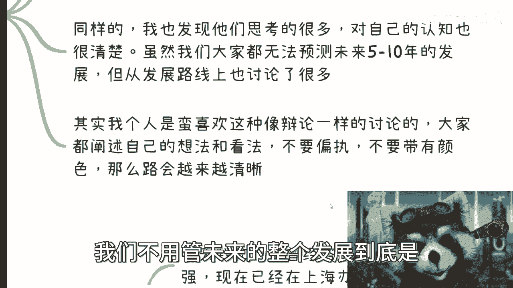

到底是怎么样子，但至少就是说他的做事情方式，是能够确定下来啊。

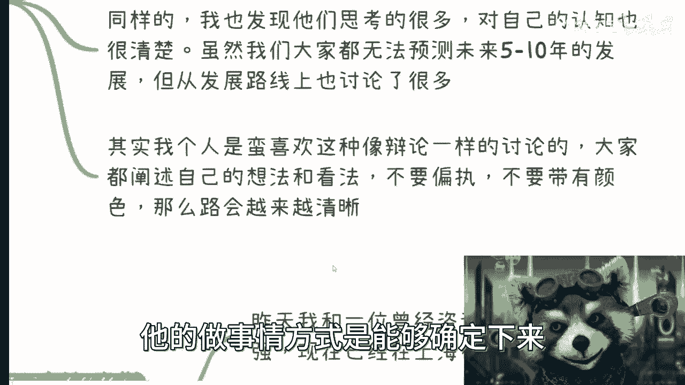

那么还有一点呢，就是说其实我个人是蛮喜欢这种，就是辩论一样的讨论，就是就其实说实话啊，就是真正有价值的，不是说我来跟你们讲什么是没有用的，就有价值的，是就是我来讲什么，你们也来讲什么。

然后呢就大家不要带有任何的偏见，或者说这种杠对吧，或者说就是这种就是有色眼镜啊，就是就是就是或者说就是说呃，就是你说拿个例去以偏概全的，就撇开这些东西，就是你真正的觉得哎，我们客观的讨论这个问题对吧。

那么你阐述这个想法和和看法，你不要偏执对吧。

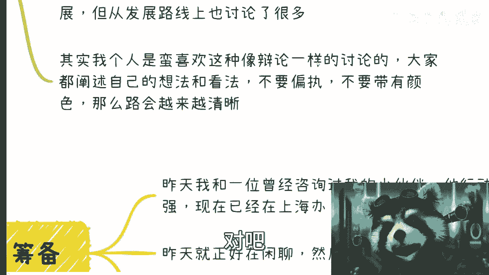

那么其实很多路就会越来越清晰啊，其实我觉得就是说我跟他们的沟通呢，可能更像一种呃辩辩论，可能稍微强势了一点，就可能是一种啊比较平缓的讨论对吧，然后大家都阐述自己的想法嘛对吧。

因为每个人因为我发现大家想走路。

其实很不一样对吧，有的嘛就是说我就是想出国对吧，有的我就想考研，有的我就想去体制内对吧，但是呢就是说就是说考研也好。

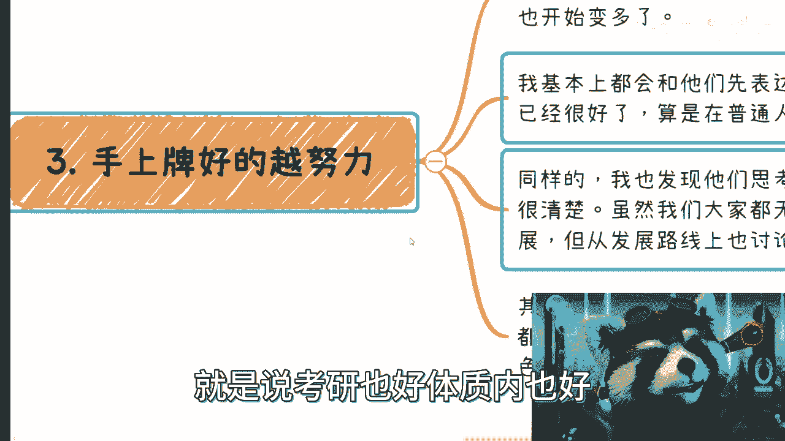

体制内也好，出国也好，并不是终点，它只是一个过程啊，那么这个当中到底怎么做对吧。

这里就是有很多的这种这种方法，那么第四个呢就是说哎我一直在筹备对吧。

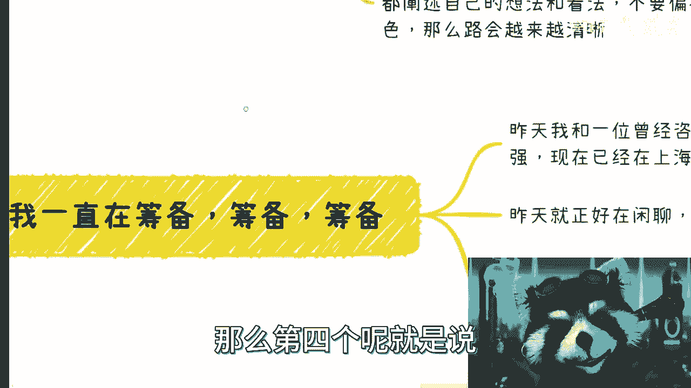

筹备筹备筹备啊，就是就前两天，有个小伙伴也是曾经咨询过我的啊，他行动力很强，就他现在已经在上海办了一期活动了，这周六会办第二期啊，就昨天那也正好在闲聊，然后我就一下子喷了，你知道吗。

我就就直接直接跟他说，我说我说就我原我我意思啊。

我就说就发了条语音嘛，我意思就是说我说你别老筹备筹备筹备对吧，我说因为什么呢，因为他现在是一个，相当于是全职在做这个事情嘛，那我就说你既然都全职做这个事情了，你就别老筹备了对吧，你说哦我要积累这个资源。

我要积累那个东西，我要怎么样子，我说现在这个情况是什么，就是你要真的去做，你就做每个东西的风口其实是很有限的，你比如说你要做AIGC对吧，你很有可能AIGC真的能够割的这个风口，就那么几个月对吧。

我说你回头比如说到今年年底你去做，做完了，不是说你没人给你付钱，是可能那些人都已经被割了两三次了，他没钱付给你啊对吧，他就算想被你哥，他也没钱给你哥，对不对，所以我说这种事情这种时候呢。

不管是什么AIGC啊，还是什么什么web3啊，还是元宇宙啊对吧，你就是你真的要去做，你就别筹备了，我说你就直接去参加活动，把那些活动给讲师那个牛过来，对不对，就调过来调过来有什么难的了。

加个微信不就调过来了嘛，对不对，你调过来之后立马就去找营销团队，或者说找那些这营销公司叫多了，就这里每个城市都多了去了，对不对，什么也就是单纯的营销公司也好，单纯的分销公司，单纯的协会就很多很多的对吧。

你就去找他们，然后让他们就告诉他们，你说你每招一个人，我给你多少钱，大家把利益谈好，你就直接下班了对吧，就是你只要左手找好，马上找右手，右手找好，马上开班，你简单粗暴啊，你别去想这么多啊。

因为他做活动到现在我知道已经有大概就想做，到现在应该有有有有小两个月了对吧，我说你这个事情有什么好想的，就直接干对吧，哦难难道你现在还还真的就是说啊，我们一个个做对吧，先从20个人做起。

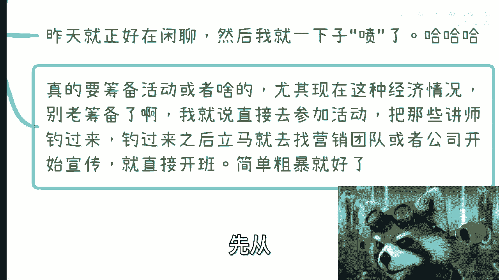

做到50个人，做到100个人，我说现在这个经济形势哪里容容得下。

你这么做，对不对。

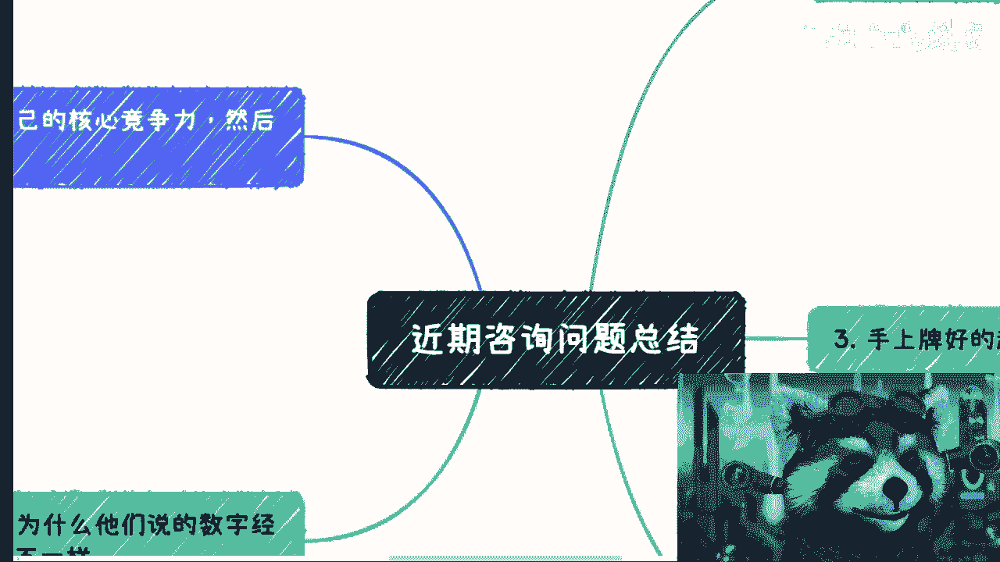

哦然后呢还有诶五呢。

哦没有五啊，那是我的问题，我想怎么就溜了呢啊就是五呢。

就是说这个组建自己的核心竞争力，然后找合作方，我觉得就是整个聊下来，我觉得大家的问题还是在于。

寻找自己的核心竞争力，已经找这个合作商的问题上面。

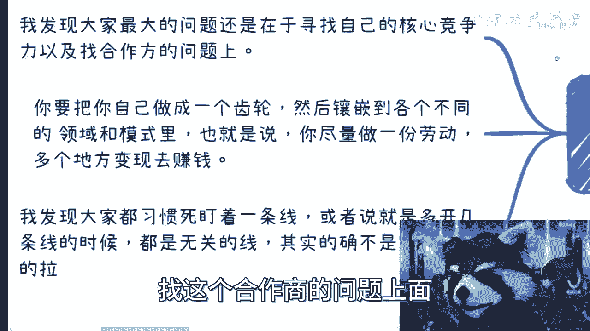

就是你我跟你讲你怎么做啊，你想想看，不管你是做自媒体还是做呃，这个这个这个解决方案还是做什么外包对吧，还是做做做各种别的业务啊，比如说跨境电商对吧，什么东西啊，就是首先第一点你得找到你的优势。

就是我说的这个优势不单单是你的，就是比如说你有什么关系，你认识什么人，你没有你就去认识嘛，对不对，你就去盘嘛，对不对啊，你就是先找到自己的几个觉得可以合作的优势，然后呢你把你的服务做成一个齿轮。

这个齿轮是什么概念呢，就是你得镶嵌到不同的领域和模式里面，我们举个例子啊，就比如说你打个比方，就比如说现在有个人说我想做知识变现，对不对，好，那么它的优势是什么，它的优势是哎。

我可能有一套完整的知识变现的课程对吧，或者说他说我能给出去讲对吧，我能够这里有这种，比如说一两个小时的这种分享经验对吧，或者怎么样，那么他所付出的劳动和积累，应该是他在他的课程跟在他的分享上面，对不对。

那么你想想看啊，他做这条线做完之后，积累之后，其实它既可以找比如像得到啊，或者像别的这种分销机构去合作，他又可以自己在自己的私域流量里面去做，又可以在抖音啊，B站啊，快手这上面去做。

也可以把这个东西卖到企业，也可以把这个东西卖到政府，也可以把这个东西卖到高校，也就是说他做的是一个人一件事情，他做的是一个积累，但是你要在多个地方变形，也就是说我发现大家其实都习惯。

就是可能从小到大就PUA也好啊，思想灌输也好，就是说他说我是听吕老师，你讲说要多开几条线，但是他开的内容都是不相关的，你知道吗，就是这个时候你就想嘛，就是你人生能有多长，你你的经历能有多少多，对不对。

你要做的，其实无非就还是说你尽量付出一份劳动，但是呢这个东西在不同的领域对吧，比如说在正起这条线啊，在C端这条线啊，在比如说跨境贸易就在海国内外这两条线啊，对吧，跨国这条线啊，或者各个方面。

我相信你们做一个努力的东西，一个积累的东西，它一定在不同的线都能够去赚钱啊，不是说单纯的一条线赚钱对吧，你就像你就像还有人跟我说什么，他说他说我这个呃这个核心竞争力，他说我想做律师对吧，打个比方啊。

就昨天有个小伙伴说做律师，那律师也是一样的呀，你本身打形式的可能少，你可以自己的主业，比如说打离婚诉讼对吧，打打一些民事诉讼，然后呢，那你同样的你要把这里这个律师发挥到最大啊，那怎么办，跨那个跨行业嘛。

对不对，你比如说你把这个东西，你把你这个咨询顾问做到互联网，对不对，做到金融对啊，做到做到什么web3，做到什么新能源电动车怎么了呢，也可以做呀，你跨行业做啊对吧，不是说你跨行业过来做律师啊。

你就以一个个人的形态对吧，或者说律所的形态去去去做顾问对吧，去做这个咨询有什么不好的，就是你不要就是说就是说老想着，就说我多开几条线，我就多去要去学东西对吧，要怎么样子，因为你精力是有限的。

你每开一条线，你都会要去积累，要去积累关系，要去积累人脉，要去学习东西，你没有这么多精力的，所以你要做的就是，我尽可能的，就把我这个东西放在不同的面上面去变现，对不对。

那这样的话就是说你所学的东西其实是相同的。

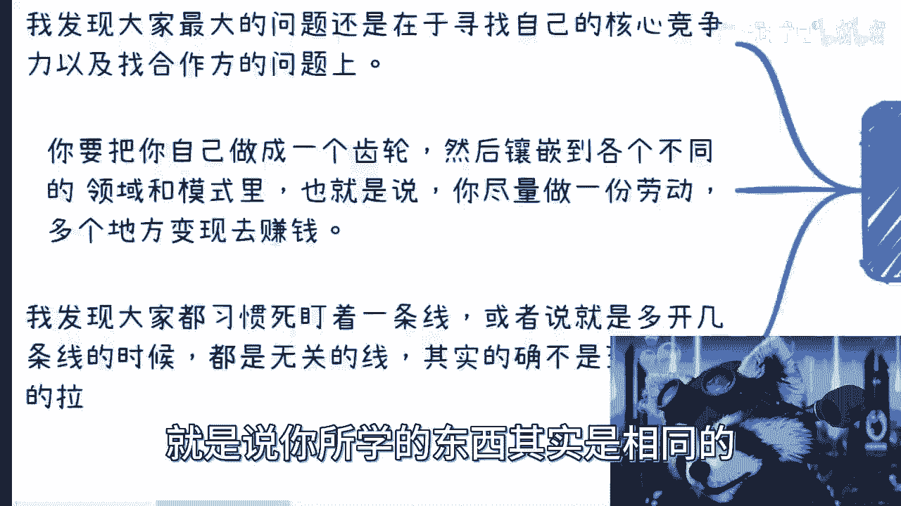

只不过就是你的话术，你的合作对吧，可能模式不太一样。

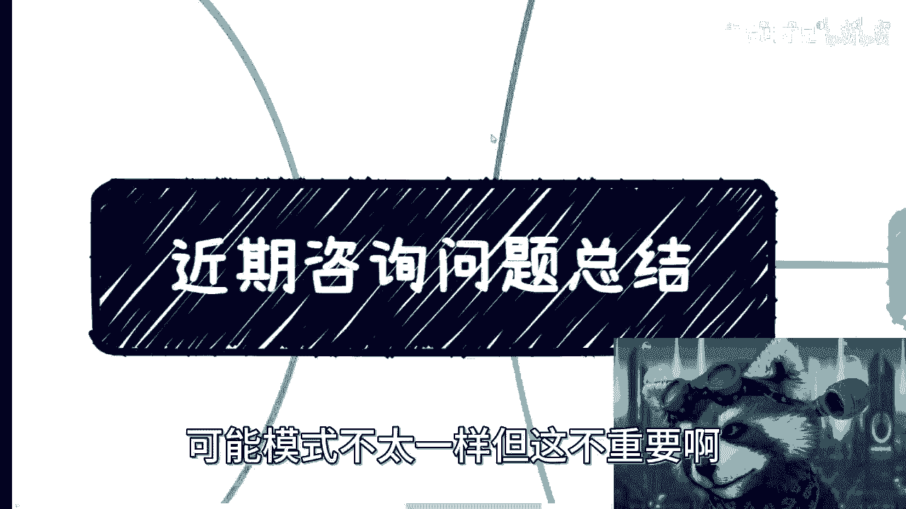

但这不重要啊对吧，那这样的话你才能多线变形。

好吧，所以我觉得就是就是这个点好像是。

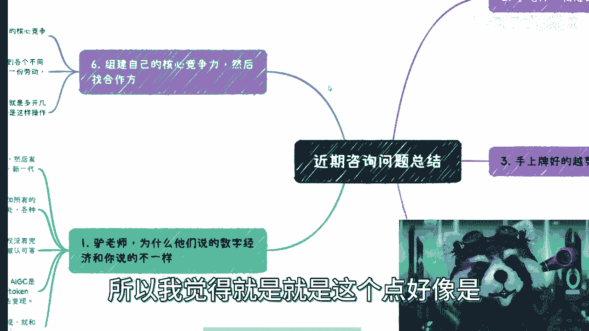

到目前一直是很通，有就是就是比较多的，而且就就好像基本上我没有碰到过那种。

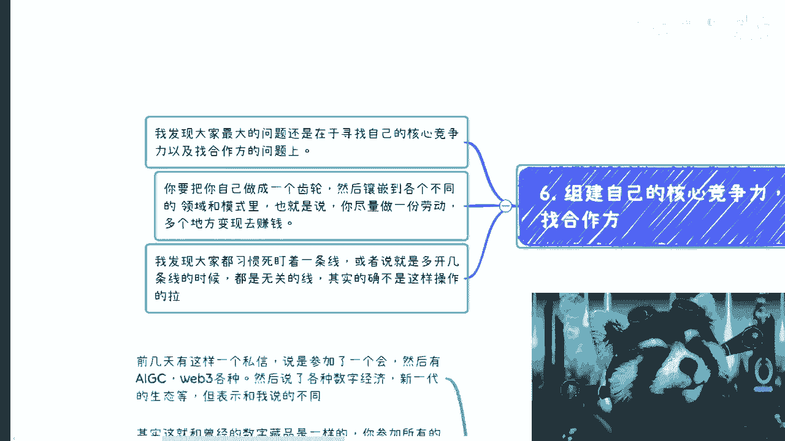

就是说在我跟他讲之前，他能想明白的。

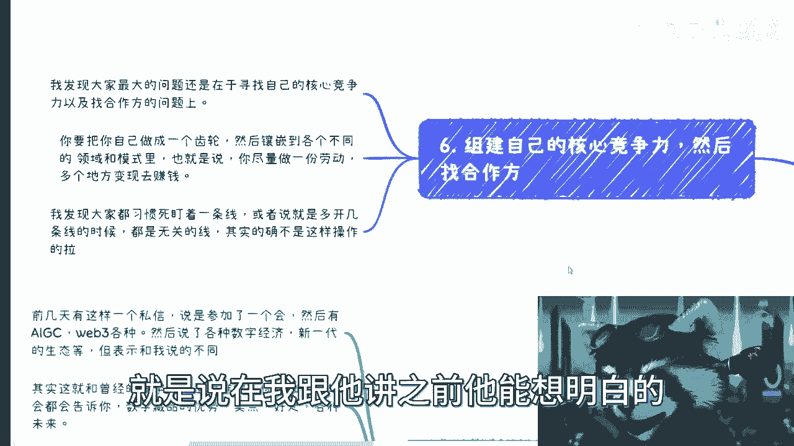

就他能想明白一些事情，但是总死盯在一条线上面，我感觉这个就很不合理啊。

好吧，这里我就给大家总结一下，嗯别的，反正我想到什么再说吧啊，行就这么着，礼拜天晚上的直播。

