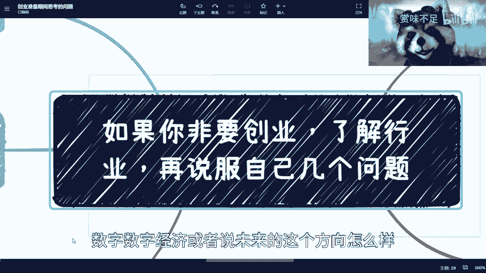
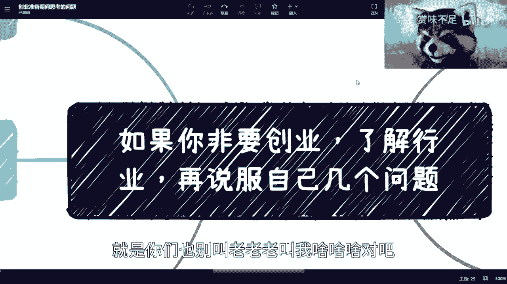
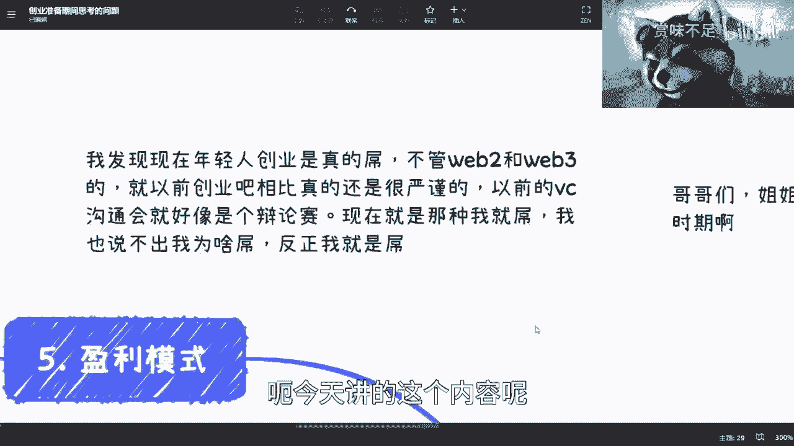
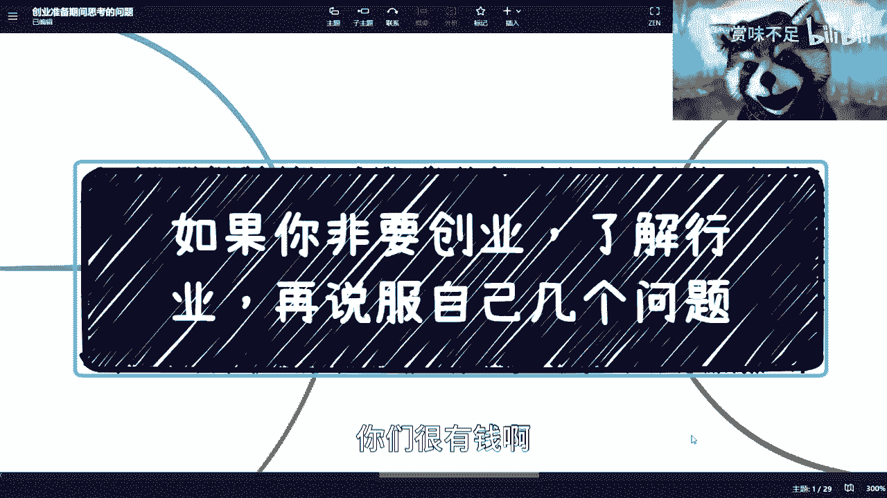
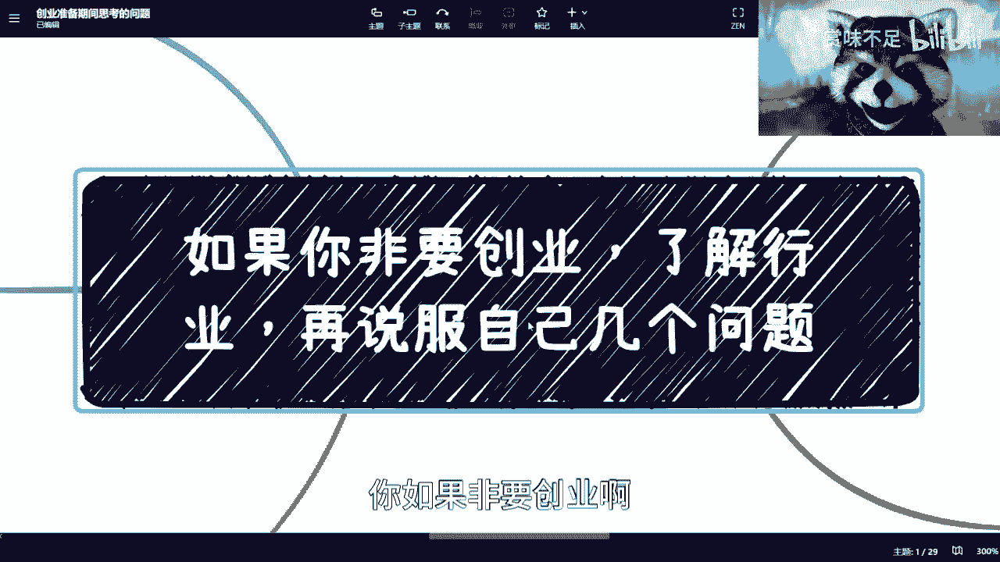
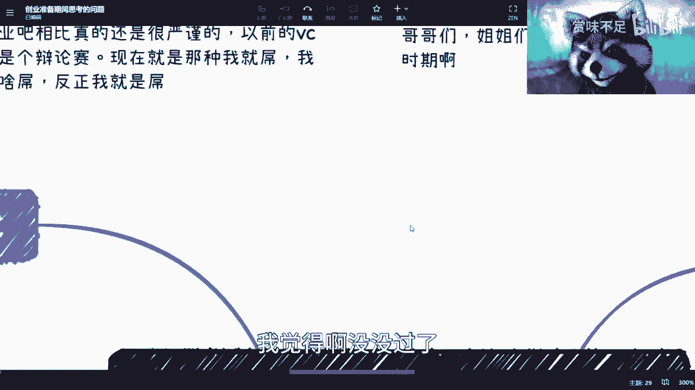
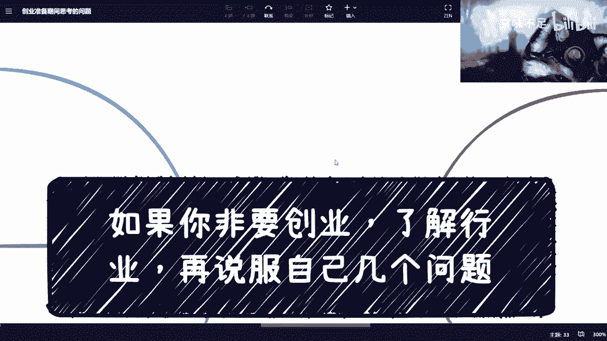
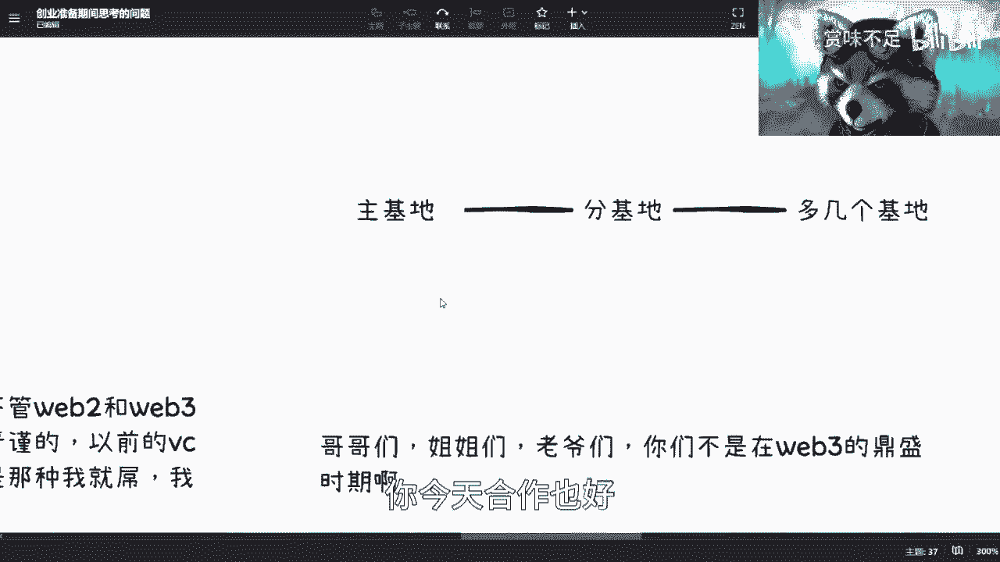
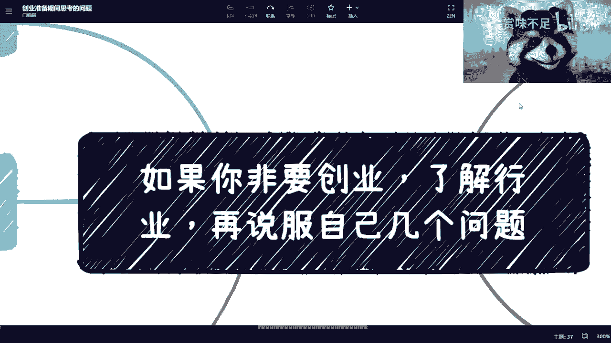

# 这是一个给一定要创业的小伙伴看的视频 - P1 - 赏味不足 - BV16h411M7qx

好啊，各位小伙伴大家好对，又是我每天都是我是吧。

哎呀最近我跟你们讲，真的，这个我本来呢蛮空的对吧。

白天都在打生化危机四啊，蛮开心的，今天开始就要忙成狗了啊，我就他就很多人呢，这个明天呢要呼唤我去深圳，我说我实在不想去，为什么呢，因为我说我这两天不要去香港吗，你又让我去深圳，我通行证也还没下来。

我去了深圳来，我还得再回上海，再再再再去香港，我说我不想折腾对吧，然后我还约了那个那个数交所。

就数据交易所跟技术交易所的那个小伙伴，反正这周本来是约这周的，但这周我实在是没空嘛，所以我只能要么约他们约，下周我去了解一下，最最近就从交易所来讲数据，数字经济或者说未来的这个方向怎么样。

反正回头我看看有哪些能跟大家说的，反正我就跟大家说好吧。

我觉得哎也没什么就有什么啦，就是你们也别叫老老老叫我啥啥啥对吧。

这都是老百姓也没什么区别的啊，呃今天讲的这个内容呢。

主要是这个说创业的事情啊，其实我发现了这个现在年轻人有一说一，这个虎也是真的虎啊，忙也是真的莽，但是不管怎么样呢，我们做事情还是要有一个什么条条框框的啊，还是要有一定的这个沉淀和积累的啊。

但这不是说咱们年纪轻莽就莽得动感啊。

忙不动的，我跟你们讲啊，如果啊在未来的这个3~5年里面对吧。

你说啊你不care啊，你们很有钱啊，非要创业好。

那我跟你讲啊，我大概今天给你们列一下，你如果非要创业啊，你先去问自己这几个问题啊。

我给你们今天会列一下呢，首先呢是这样子的啊，我是说呢就现在这个以前这个v vc啊沟通会啊，就这个创业的沟通会啊，融资啊，我们其实就像辩论赛，就比如说我以前在18年的时候，找过那个中国的时代天使投资嘛。

对吧，像红杉啊，那个叫什么一诺啊对吧，我至少别的我不敢讲对吧，至少我十佳，我是一个一个，就是实实在在每个谈了两个小时谈下来的啊，那么我们就说那个时候谈呢，我觉得都是一种就还是蛮实在的。

卧槽现在我跟你们讲不一样，就我碰到很多人，这是什么什么，就是就是我问他，我说哎那你这产品有什么竞争力啊，我不知道，我不管，反正就是我，你是蛮的，这个我也不知道怎么就怎么说，这件事情你知道吗。

然后呢我想跟你们讲，我觉得你们要真的创业难啊，这个这个年轻人们啊，未来的祖国的花朵们对吧，哥哥们，姐姐们，老爷们是吧，你们不是在web 3的鼎盛时期啊，你们要知道583的鼎盛时期怎么融资的，你们知道吗。

来我给你们讲一下啊，我就给你五分钟，你就给我讲啊，五分钟现场转账啊，几几百万几千万啊，真的不夸张的，就现场转账，你给我个钱包地址直接转，无所谓的，就几百个，几千个以太坊，几百个比特币嘛，对不对，就转嘛。

那不重要啊，但是现在不是啊，你又不是在这个鼎盛时期，你说我画个饼是吧啊。

不好意思呵呵，我觉得啊没没过了，这个村没这个店了啊。

啊我们来讲正经东西啊，首先啊你一定要明白一点，就是你不要看不起就是别人的东西，你也别老觉得自己，呃，为什么呢，因为从本质上来讲，资本才是最的啊，我们都是打工的对吧啊。

那么首先第一点呢就是说你要明白别人有的，你必须要有别人没有的，你还是要有，那否则还是那句话嘛对吧，你今天我就问你们，你们今天所有的人如果是资本，我是一个创业者对吧，我说来观众老爷们投资了对吧。

那你们也会想的呀，我的啊，陈老师，别人有的啊，你你也没有啊，别人没有的，你也没有，那我投你干什么啊，我做慈善吗对吧，我跟你们讲，比c是越来越紧的啊，越来越紧的，没有人会来这个就是就大家你好我好大家好呃。

这个你好我好大家好，没有问题的啊，吃个饭喝个酒对吧，扯个淡无所谓的，一旦涉及到金钱啊，我跟你讲哈，脑子清楚得很真的。

首先呢是这样子的啊，你比如说大公司背景啊对吧，学历啊，团队啊，站台的顾问啊，以前的案例啊，团队荣誉啊，巴拉巴拉巴拉巴拉啊对吧，你这些都要有啊，我跟你讲，我看到现在对吧，我不说我不说几千个吧对吧。

小几小几百就大几百个项目我都是看过的对吧，那毕竟毕竟我以前大概有个大半年时间，我也是跟着这个蚂蚁，还有腾讯这边的这个资本一起来看项目的对吧，那就是说你这些基础配置都要有啊，你不能说打开一个东西。

虽然我们说打开一个打开一个这个bp对吧，就上一计划书，千篇一律对吧，但千篇一律意味着什么，意味着大家都很牛逼，那可能啊这个大家就来抠细节了，那你说大家都很牛逼，你拿出来个东西什么都没有。

那你还怎么怎么搞对吧，就我跟你们讲啊，就是就是用我话来讲是什么呢，就是以前创业啊，大家都是觉得客观的去评价行业，客观的评价这个竞争对手，客观的评价现在的这个这个经济形势的，现在创业不是的。

现在创业的创始人和团队就就很多年轻啊，就让我觉得卧槽，他妈的我不管地球就是围着我转的，那这个没用的。

我跟你讲真没用的，这地球的确不是围着你转的，那怎么办呢对吧。

那你又不是王思聪，王思聪也不多，也不围着他转呢对吧，那这是第一个啊。

第二个呢就是业务竞争力啊，这个就是说接下来我们就抠细节啊，业务竞争力，我们以前有个梗叫什么呢，叫做所有的产品啊，vc都会问你，那如果今天的你的产品，这个大厂要是去做了或者去超了，你怎么办对吧。

这个是以前很经典的一个梗啊，我跟你们讲啊，其实这个事呢也不是什么很大的问题，因为什么呢，因为首先第一点啊，从大肠来讲，他来抄你东西，你真的去了解大厂，你就会发现他也不会来抄你东西，他懒得来抄你东西。

你知道吗，这第一点第二点是他就真的来创你中心，按照大厂的做事规则，他一般是会分一个很小的bu，就一个很小的一个business的一个团队，然后来做，那么你想想看一个很小的别的团队。

它其实是得不到公司的很多，渠道和资金上的支持的，那么无论从产品还是从他的这个这个叫做叫做，他其实是比不上你的一个创业团队的，那么你说这个道理，你懂大厂的同学会不懂嘛，对吧对吧，那那既然大家都懂。

那他何必来跟你竞争呢，没有必要的呀，就大家划划什么好呢，对不对，就完成了60分的kpi，3。5，对不对，就可以了，无所谓的呀，对不对，那我觉得这是第二点，第三点是什么呢，就是你其实真的从创业角度来讲啊。

你你不要说中国了，你乃至全球这么大的市场，你bt你大厂来抄怎么了呢，哦我地球围着你大厂转呢也没有呀，对不对，你抄怎么了呢，对吧，就是说我就让你，那哪怕我最终让掉你99。9%的市场，对吧，我拿那么0。

01%的市场怎么了呢，我一样能活呀，不是很重要，你知道吗，就为什么变成一个梗，是因为这个梗其实最早是用来嘲讽这些vc不懂，嘿嘿你知道吗，就嘲讽这些投资人啊才对，但是呢就是说这个问题。

你的确就是说你要去说他吧，可以的，但是呢你得要明白他为什么这个会成为一个梗，你知道吗，你得明白我刚刚说的商业逻辑，你不能说哦，我什么都不知道啊对吧，我我根本就不知道人家到底要不要抄啊。

会不会抄抄了到底跟我有什么区别，大家怎么样对吧，就就我一直说啊，就是说大家去想一个问题，你们一定要就是你像我现在这个地方写的，那个大的主题，就是你得先了解这个行业，就是我你们我跟你们说，所有咨询我的人。

我跟他们再三强调一点是什么，就是你们花最大的精力了解到的，往往室内水上20%的东西，你们一定要去想尽办法，这个挖空心思去了解水下那80%的东西，因为你真的明白了80%里面的，哪怕冰山一角，你就会知道。

其实你80%里面没有，上面20%这么的卷，而且80%的很多东西，它的投入产出比很高的，你明白吗，现在就让我感觉是什么呢，就是80%的人在卷那20%的市场，而是啊也可能不止80%。

就99%的人在卷那20%的市场，1%的人在下面卷量80%的市场，就这么个感觉啊，再往下我就不能再多说了，再多说他妈的我哪天人都没了是吧，那个业务上的肯定是要有竞争力的啊，我们来看现在无非几种啊。

第一种是什么呢，就是一般人一普通人做不了的，比如说有门槛关系的对吧，比如说某某是我爸对吧，可以的啊，我觉得没问题的，那我还是那句话嘛，资本认定资本只认就说你能不能赚钱对吧，我管你是什么对吧。

因为你你某某是我爸，这个东西，就是那水下80%的东西，对不对，因为水上来看，比如说我今天做了个产品，风生水起，然后外面的人都说哎这个产品做得好，这个业务做得好，那谁是我爸，你们知道吧，不知道的呀。

对不对啊，那你们只能看到那20%的东西，对不对，那首先是第一点，第二点是你有一定的技术门槛，那这个并不是说一定要卡脖子的技术门槛，很多时候他的技术门槛是，比如说你能够领先于整个行业半年。

或者领先于整个行业1年，或者说有信息差的半年对吧好，那么而且另外一方面，就是说你可能是有某些独特的专利对吧，这个都是有可能的，因为因为你把一个行业，把一个业务，把一个产业链去细分细分细分再细分。

切到无限制的时候，你会发现每一个细分领域，它一定都有它的一个核心竞争力在这里面的，那么你要去想的就是说你的产品到底touch到了，就触及到了它哪一个核心竞争力，那如果你说你最终看下来。

我一个核心竞争力都没有触及到，那你还做个p产品，对不对，你创个毛业，对你赚不到钱的啊，我明确跟你讲对吧，那么另外一方面呢就是说业务细分对吧，业务细分就是说你所有的业务去思考了之后，你会发现有没有可能。

比如说你拿的是一线城市的呃，叫什么陈述的模式去卷三四线城市的情况，而模式是一模一样的，只是因为有信息差哎也是可以的啊，没毛病的，从资本角度来讲，一切可以赚钱的都没有毛病，但只要那个合法的情况下面。

对不对好，那这是第三点，第四点就是说新的领域新的方向，就比如说啊这我们说数字经济啊对吧，这个这个这个电电池节能啊对吧，碳中和啊对吧，包括那个接下来那个职业教育啊对吧，包括数字化改造啊等等等都可以啊。

没问题的啊，那么你说如果啊因为又要有补充解，就是说新领域新的方向为什么能做呢，是因为相对来讲没有这么多竞争对手，就相对啊卷肯定还是卷的啊，好那么如果你评估下来，你觉得诶你等等啊，我这边还有个等等。

因为我不可能给你们便利嘛对吧，穷尽嘛，这这这做不到的啊，就是就是类似的，如果你评估下来，你说我没有，那你说这个业还创不创，我告诉你，你要真的去创，那就变成什么呢，就变成了你等于就是从人家嘴巴里要抢蛋糕。

对不对，因为你不是去创造一个蛋糕，你也不是从新的蛋糕里面去分，而是你要从老的蛋糕里面去，从里面人家居然没抢出来，对吧好，那么你自己想想看，从来就就整个全球当下的经济形势。

这个时间你去从别人嘴巴里抢抢蛋糕，我就问你何德何能啊啊你回答我，你何德何能啊，是吧啊，那么这个是第二点，说他妈的啊，对第二点，第三点是什么呢，就产品形态，产品形态这个东西呢，就是说你得想好。

你比如说你是一个h5 呢，是个小程序呢对吧，还是一个比如说人力资源平台，人海战术对吧，就卖人口对吧等等等啊，那么你说那个自制是你要自制自己去做平台呢，还是资源整合平台呢，还是服务类呢。

就是说我我我比如说我自制平台，就说我自己提供服务对吧，我自己提供里面的很很多的功能对吧，就我自己提供，就像b站一样，它它提供比如上传啊，他提供评论啊，提供很多东西啊，自自有生态对吧。

那资源整合呢就是说我自己不做，我把别人的东西整合进来，我做一个聚合平台也行啊，也没有问题啊，第三个就是说我自己甚至没有平台对吧，我就是个服务类的，比如说人力外包啊对吧，那个叫什么叫什么呃。

这个这个这个这个啊猎头啊对吧，那也可以呀对吧，包括就是说我就是卖那个直播类服务的，就我这边有很多直播直播的那个叫什么呃，小姐姐小哥哥对吧，我就卖卖人也行不行也行对啊，就是你得定位好你的产品形态是什么啊。

那当然在你一边定位的时候，你可能就得就得想一件事情，就是你的产品形态，会最终决定你的这个投入是多少，对吧，因为咱别的不说啊，就是我们先抠一下细节，咱别的不说，你不管做什么，你网站得要有吧。

你备案的要有吧，域名得要有吧，服务得要有吧，就服务器得要有吧对吧，你你你一套操作下来，我先不说钱不钱的问题，你会不会操作，你得找人操作吧，你合伙人会不会操作，对吧，你都得想好，这都不是创业。

不是说两手一摊，有个idea就有用了，没有用了。

然后那个这是第三点，第四啊。

四这个也是所有的问题里面最最关键的啊，最最关键排名第二的啊，流量从哪里来，你想看，首先这其实是个核心的问题，别的我跟你讲都不重要，第一你流量从哪来，你有没有流量好，我跟你讲。

你的有些产品它是不需要流量的，为什么，因为有很多的产品和服务，它就是本来就解决刚需的，本来就是那个在产业链里面，是一个必须会存在的东西对吧，你就你就打，比方说你说我就是做一个这个呃供货商。

或者我就是在这里面做了一个就是呃，医疗器械的一个一个提供方，那么在这个里面你想在整个产业链里面，他一定要有吧对吧，只不过就是说只不过就是说最终要看，就是说你的这个背景关系啊，你的产品质量啊对吧。

包括现在很多衣食住行，你只要在原本大生态里面对吧，你只要说我跟我在原本大神里面，某一个环节已经合作了，那么你其实就不用担心流量，因为整个大生态会给你提供流量，就是你的上下游都会变成你的流量的提供方。

对吧，但是这种是比较少的，因为往往创业的角度，你就是这种是什么，就是我刚刚说的，你有这种强强就是强关系链是可以的对吧，那么第二种是什么呢，就是c端和服务，c端和服务是最需要流量的对吧，那么c端和服务。

你要想的就是说流量从哪里来对吧，那么同样的流量来了之后，你还得想的是用户粘性，那么用户粘性就是说这个用户的留存度啊，就比如说今天啊，有一些新的小伙伴看了吕老师这个视频。

他觉得卧槽吕老师讲的是什么叉叉玩意儿对吧，垃圾对吧，好好取关了，对不对，那么那就没有用户流量，没有用户粘性对吧，那你今天做一个产品也是一样的，这个用户比如说你上来可能有些送红包啊对吧，送什么。

那用户说哎我薅个羊毛对吧，我用用，但是用完之后，用户说哎产品我日常就想不起来对吧，那个什么什么产品对吧，我根本就不想用啊，那么好了，你就没有用户粘性对吧，所以我跟你讲。

就是说流量这个东西其实本质上是什么，一从哪里来，二来的情况，下面你是你，你获取这些流量的投入产出比是什么，三来了之后能不能留存，无非就这三个问题好，那么有人就看有有有小伙伴要问了啊。

他说这流量嘛无非就那么几种嘛对吧，要么我找合作方渠道合作，对不对哈，要么呢就是我投广告对吧，什么抖音抖音啊，那个叫什么呃，小红书啊，他的投广告非常精准的对吧，就是什么用户，什么年龄段，什么城市，对不对。

好ok好，那么我们来看这个问题啊，问题来了啊，投广告对吧好，那个找合作方啊，合合合合作渠道对吧好，然后呢，或者其他的其他巴拉巴拉巴拉，巴拉巴拉巴拉巴拉对吧嗯好，那么我跟你讲啊，如果从资本的角度。

你这三个东西抛出来，我就问一个问题，这三个东西跟你有他妈的蛋关系，你知道什么意思啊，就是说这三个方式，或者所有你说的获取流量方式，你说的都是借助外部力量，跟的有个蛋关系，就他都不是你的核心竞争力。

那我他妈的投你干什么，你明白吧，你一定要想明白这件事情，就是说投广告，那的花烧钱烧钱，谁不会啊，我也会的呀，啊我他妈要你干嘛，找合作渠道，合作渠道是你的吗，啊我会因为合作渠道投你吗。

合作渠道回头他妈的说撕票就撕票对吧，说不合作就不合作，你能拿他怎么样，那我投你不是扔水里吗对吧，就是说所有的资方他一定要明白的是，你的竞争力是什么，不是你的合作方的竞争力是什么，不是你能够去花钱干什么。

我的，你做的所有事情你也能做，别人也能做，我为什么投你啊对吧，就我就我跟你们说，就很多人他没有想明就就没想明白这件事情，他觉得哎这是一个很很正常的逻辑，是很正常的，他妈的，你要想价钱从哪里来啊。

资方又不是是吧，诶啊对对对。

这里啊，然后呢，第一最最高private就最最高的这个优先级的是什么，就盈利模式啊，在你的商业计划书里面一定要有的，就是你看啊，你看啊，全计划里面一定要有的啊，业务形态产品形态对吧，流量哪来啊。

团队团队介绍对吧，盈利模式我已经帮你们全部列好了对吧，就这么几个了啊，我跟你讲啊，其他都不重要啊，这个是最重要的啊，最重要的好，那么盈利模式呢换而言之呢，就是说你如果去c，那你告诉我用户为什么买单对吧。

如果你to b和to g就to企业和政府，那你就告诉我政府跟企业为什么买单，你把这个逻辑想明白对吧，就是说这个问题你不用来回答我，你先自己问你自己用户为什么买单啊，你千万不要告诉我说卧槽他妈的。

我觉得我牛，我很牛逼，用户一定会买的，那那就那你自己玩去吧对吧，这这地地球上你要觉得地球围着你转，或者你觉得地球是一个平的，也可以无所谓啊，然后第三个是什么呢，就是说买单的逻辑是什么。

就是你会发现衣食住行它是刚需对吧，当然衣食住行算是刚需，大家都是有竞争力的，大家相互竞争，大家相互卷，有些意识就住行就被卷死了，但是你从衣食住行的起源来讲，他的确是刚需，这也没有问题啊。

这就好像你今天说，我做一个小小小那个小圆生煎，我做一个，我做一个某一个美食，我做一个奶茶，对吧啊奶奶对，就是说他你说在当下这个年轻人这个时代里面，你说他是不是刚去试，但是往下一步你就得想的是说。

你在一个刚需的领域里面，你怎么竞争得过对方，但这就是另外一个问题对吧，但是他的刚需本身是存在的，但是你们想想看，今天很多的创业者做出来的产品，他连最原始的刚需都是没有的，就是他做出来一个东西。

你用膝盖想一想，他的客户跟用户在日常生活当中，他就是没有这个需求的对吧，因为从人类来讲啊，你花钱无非只有两种，一种是刚需，就真正的生存刚需，第二种是娱乐刚需，就精神刚需对吧。

你说你说你说为什么这个叫什么，就是啊我们很多实话说那个疫情之后啊，那个那个k t v呀对吧，或者说密室逃脱啊，或者说有很多那种撸猫的地方啊，它其实你会发现很多的他其实就比如说破产啦，倒闭啦对吧。

关掉了或者怎么样了啊，你说为什么是，因为一呢，的确是因为整个就是说大家的这个，这个这个经济情况不好对吧，二呢就是说在经济情况不好的情况下面，导致了大部分的人的这个付出和这个这个投入，只会在刚需上面。

而会把那些精神继位，或者说那个叫呃精神娱乐对吧，就是更娱乐化化的一些角度，一些渠道就尽可能的省掉就省掉了，你知道吧，所以说呢就是我们在做一个产品的时候，就是大部分在我看来啊。

就是他既没有满足原始的刚需生存刚需，也没有满足这个精神娱乐的刚需，他他明显就没有刚需，你知道吗，那这个事情就变成什么呢，就是变成了我之前在说那个web 3的那个。

centralized application，就是说那个去中心化应用的时候，就说了就很多的需求啊，他是自己创业者自己yy出来的，你知道吗，这个是非常可怕的，而且因为你们要明白一点。

就是就是我我自信点说啊，就是你们很多人看到的东西跟我看到的东西，跟你们资方看到的东西，大家的整个看到这都不一样对吧，就是很有可能你们今天跟我讲一个产品，这个产品我已经看到50多个了。

或者看到100多个了，我知道就是前面都是啃啊，但是你们觉得卧槽，这他妈很牛逼，这是个刚需，那我就我也不想说什么，而且你们资方更不会跟你们说什么，而是他甚至都不想，你们哼，你知道吗。

那么这个就是我觉得你得问自己的，然后呢在这个地方呢，我要最后再说一下，关于这个，我给你们举些例子啊，你比如说我朋友圈虽然我不看啊，但是从他们的这个这个这个微信的命名上面。

我都能知道就是叫做什么墙头草来回咬对吧，就今天叫ai了好，明天我就改名字，ai今天叫g p t了，好，我名字改名字叫g p t，今天就元宇宙了，我明天改名叫metaverse对吧，今天叫区块链了。

明天改名叫blockchain对吧，反正就他妈的来回摇对吧，那么这个时候你想想看什么意思呢，意思就是说如果你创业要去跟风口的，我跟你说，你还是依然要想明白这个问题，你也就是你依然要想明白竞争力。

你依然要想明白盈利模式，因为为什么，因为我这么说吧，对于vc和对于我来讲，就是所有比我label高的人，我相信都会明白一个道理是什么，就是你但凡跟风口袋，你就是个赚快钱的，甚至你还赚不到快钱。

我不能说你是骗子，你明白吧对吧，那我觉得这个东西我觉得大家自己判断，就是不要尽量不要把自己人设做成一个，就随风摇的，因为对我来讲，这种人我从来不合作，没有意义的，有什么意义了，对不对啊，那首先是第一点。

第二点是就是ai也好对吧，元宇宙也好，你要明白你去做这个东西，就像我们刚刚说的，你做这些东西，谁是你的客户，谁是你的用户，谁来买单，为什么买单对吧，你要跟我说啊，我今天做个gpd的课程对吧。

由于信息差对吧，由于别人用不了账号对吧，那么他会来买我的东西，那ok那你这不叫创业，这叫割韭菜，对不对啊，哪个vc会来投这种东西，不可能的呀，是不是啊，这是第一点啊，第二点是说你要说元宇宙。

那你今天跟我说什么呢，你说你说啊，我做一个比如说虚拟空间对吧，我做一个数字孪生对吧，做个什么东西可以，我先不说你有没有能力做，我就问你，你卖给谁，谁来买单对吧，你想明白这件事情对吧。

就是说所有的啊，我为什么劝所有的人不要去创业对吧。

千千万万不要去创业，除非你家里有矿，而且你家里不止一座矿，对吧好，否则的话你去创业，我为什么呢，是因为你们的很多人的认知，很多人对行业认知，很多人对水下80%，但冰山都没有理解，你去创个毛衣对吧啊。

就你进去不是九死一生啊，你进去是炮灰，你知道吗啊这不是九死一生的问题了，而且很多时候就是你不要觉得就就我跟你讲，有个理论是很不对的，你千万不要觉得你吃了苦，你就一定会成长，这两者是没有因果关系的。

就是你不要觉得你去创了业就有成长，也没有因果关系的，你知道吗，就是你做一件事情，就跟你今天看一本书，来听我这个课程是一样的啊，听我这个不叫课程，就免费的视频是一样的，你有没有成长，取决于你的认知。

你知道吗，就是你现在如果对行业，对很多东西一无认知，我觉得我这个视频对你来讲没有什么帮助，你知道吗，因为我讲的东西你不能明白，我所讲的东西背后的这个核心的逻辑是什么，而我真的要跟你去讲，我也讲不明白。

你知道吗啊，而且我也不会现在这个情况跟你去讲是吧啊。

然后呢就反正关于呃最后再提一点嘛，就是关于这个副业的事情。

就是我觉得很多人嗯怎么说呢，就买某些时候呢他能懂。

但换个角度他就不懂了，我跟你们说啊，有和你们打，我没玩过，我不知道你，比如说以前有有些游戏叫什么以老的游戏啊，星期争霸对吧啊争霸对吧，和魔兽世界啊，不是魔兽世界，魔兽争霸对吧，你比如说什么帝国时代对吧。

好就这种即时战略性的，我就问你们，你们玩所有游戏的时候，你没有意义，我相信没有一个人会在那边有一个主基地对吧，哎这个是你的主基地啊，然后然后然后你说哎，我就我就这个主基地采矿啊，就就赚钱对吧。

就是所有的人玩游戏的时候，他就知道他都知道什么，他都知道我主基地，对吧，开个分基地对吧，甚至开个多多多几个分基地都懂的，你知道吗，但是我觉得我觉得就是在游戏以外，比如说在你们的工作上面。

在评论赚钱角度上面，就是嗯我觉得很多人他就没有这个意识，就其实理论上你们一毕业就应该有，就是说我必须要有除了主页这个排练a以外。

我还得有plan b plan c plan d plan e plan f，为什么，因为你要明白很多的排量它是不靠谱的，也就是你在当时。

比如说你创业也好，你今天合作也好，就是你会觉得卧槽这个人很牛逼，这个人很靠谱，这个项目很靠谱，没有用的，我告诉你们一点用都没有的，在你赚到钱之前都是空气，你知道吧，千万别把自己骗进去啊。

你一旦把自己骗进去，我跟你讲，哎你回头还得来找我，我跟你讲啊，行吧，就这么着吧啊我我也劝过了啊。

能不能劝得动。