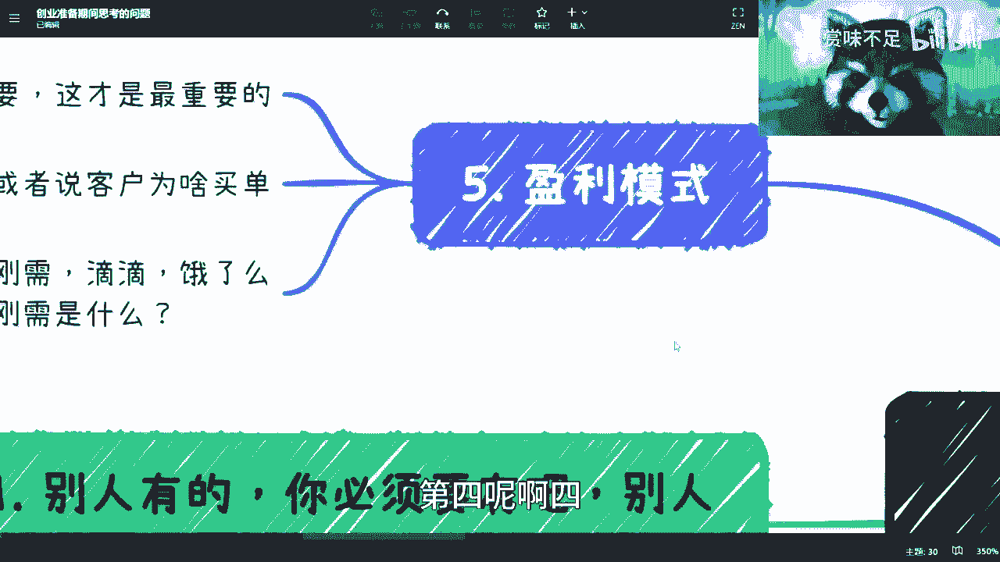

# 这是一个给一定要创业的小伙伴看的视频---P1---赏味不足---BV16h411M7qx

在本节课中，我们将要学习创业前必须想清楚的几个核心问题。课程内容基于对当前创业环境的观察，旨在帮助创业者理清思路，避免盲目投入。

---

## 概述

创业并非易事，尤其在当前的经济环境下。本节课程将系统性地梳理创业前必须自我审视的关键问题，包括个人与团队背景、业务竞争力、产品形态、流量来源以及盈利模式。理解这些问题，有助于你评估创业想法的可行性。

上一节我们介绍了课程的整体目标，本节中我们来看看第一个需要审视的方面。

## 一、 个人与团队背景

资本在评估项目时，创始团队的基础配置是重要的考量因素。如果缺乏这些基础，很难在众多项目中脱颖而出。

以下是资本通常会关注的团队背景要素：

*   **大公司背景**：核心成员是否拥有知名企业的工作经验。
*   **高学历**：团队的教育背景。
*   **完整团队**：团队结构是否完整，覆盖技术、市场、运营等关键职能。
*   **行业顾问**：是否有权威人士或专家为项目站台。
*   **成功案例**：团队过往是否有成功的项目或相关经验。
*   **所获荣誉**：团队或个人获得过的奖项或认可。

这些要素构成了与资本对话的“敲门砖”。在大家“基础配置”都很优秀的情况下，竞争就会进入更细节的层面。

## 二、 业务核心竞争力

在背景相当的情况下，业务本身的竞争力就成为关键。你需要思考你的项目为何能生存并发展。

关于业务竞争力，需要从以下几个角度深入分析：

1.  **关系或资源门槛**：是否拥有独特的、普通人无法获取的资源或关系网络。这属于“水下80%”的竞争力，外界不易察觉，但至关重要。
2.  **技术或信息差门槛**：是否拥有领先行业半年到一年的技术，或利用信息差将成熟模式复制到新市场。其核心公式可概括为：
    `竞争力 = 技术领先周期 || 信息差价值`
3.  **细分领域专利**：在产业链的无限细分中，是否在某个环节拥有专利或独特解决方案。
4.  **切入新兴领域**：是否选择数字经济、碳中和、职业教育等处于上升期、竞争相对较少的赛道。

如果你的业务不具备上述任何一点核心竞争力，就意味着你不是在创造新蛋糕，而是在红海市场中从别人嘴里抢蛋糕。在当下的经济环境中，这需要极强的实力。

## 三、 明确产品形态

想清楚做什么之后，需要明确以何种形式来做。产品形态直接决定了初始投入和运营模式。

你需要明确你的产品属于以下哪种形态：

*   **自有平台型**：如B站，自己提供核心功能和服务，构建完整生态。
*   **资源整合型**：作为聚合平台，整合第三方资源或服务。
*   **纯服务型**：如人力外包、猎头、直播公会，本身不提供平台，只提供服务。

确定产品形态的同时，就必须考虑与之配套的投入，例如网站、域名、服务器、备案等基础建设。创业不是只有一个想法就够了。

## 四、 流量来源与留存

对于大多数面向消费者（C端）的业务，流量是生存之本。你必须回答流量从哪里来、成本如何、以及如何留住用户这三个问题。

常见的流量获取方式包括：

*   付费广告投放（如抖音、小红书信息流）。
*   寻找合作渠道进行推广。
*   其他外部引流方式。

**然而，这里存在一个关键误区**：上述方式本身并不是你的核心竞争力。任何竞争对手都可以花钱投广告、找渠道。资本关心的是**你独有的、可持续的流量获取能力**是什么。如果流量完全依赖外部且不稳定，项目的风险就会极高。

## 五、 清晰的盈利模式

这是所有问题中优先级最高的一点。你必须能清晰地回答：谁为你买单？为什么买单？

思考盈利模式时，需把握两个核心：

1.  **需求真实性**：你的产品满足的是“生存刚需”（衣食住行）还是“精神刚需”（娱乐、情感）？很多创业者的需求是自我想象（YY）出来的，在现实中没有对应场景。
2.  **买单逻辑**：用户付费的动机是什么？是解决了他们的痛点，还是提供了不可替代的价值？切忌陷入“我觉得产品好，用户就一定买”的误区。

对于追逐风口（如AI、元宇宙）的创业者，更需要想清楚盈利模式。如果只是利用信息差做培训或套壳服务，那本质是“割韭菜”，而非可持续的创业，很难获得正规投资。

## 总结与忠告

本节课中我们一起学习了创业前必须想清楚的五个核心问题：**团队背景、业务竞争力、产品形态、流量来源和盈利模式**。

最后，给出两点忠告：

1.  **谨慎全职创业**：除非有充足的资本和深厚的行业认知（了解“水下80%”的规则），否则不要轻易全职创业。在认知不足时入场，很可能成为炮灰。吃苦与成长没有必然因果关系，认知提升才是关键。
2.  **建立“分基地”思维**：就像玩即时战略游戏一样，不要只依赖一个“主基地”（主业）。从职业生涯早期就应有意识规划**Plan B, Plan C**，发展副业或多元收入渠道。在真正赚到钱之前，任何项目和合作承诺都可能是“空气”，不要自我欺骗。

希望本课程能帮助你更理性地看待创业，做出明智的决策。