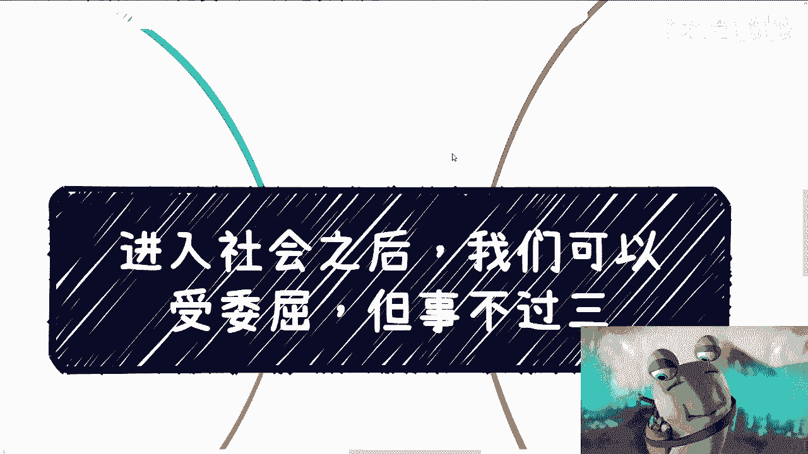
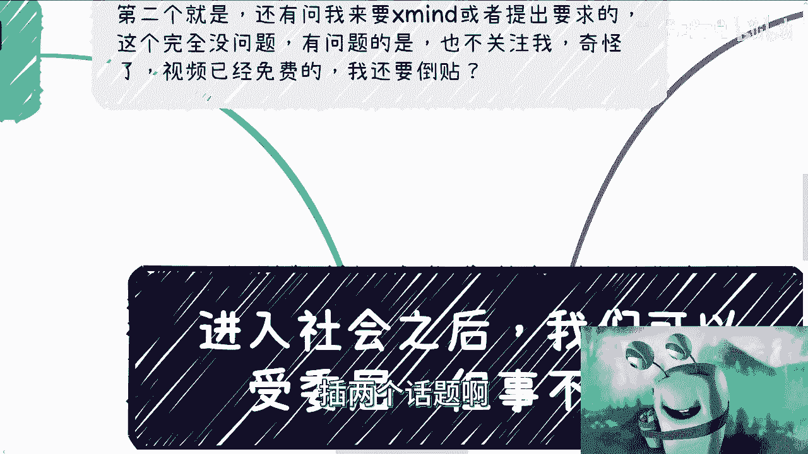
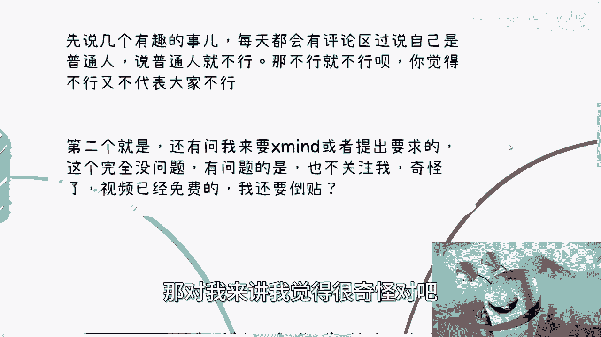
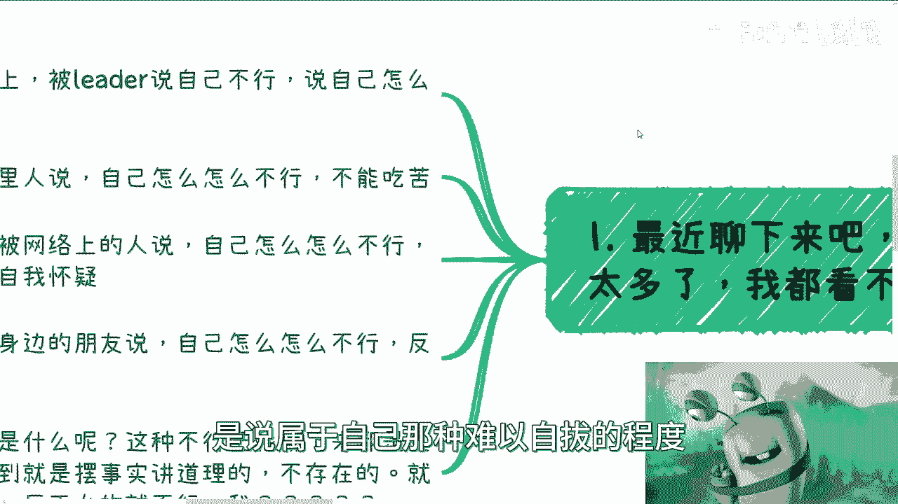
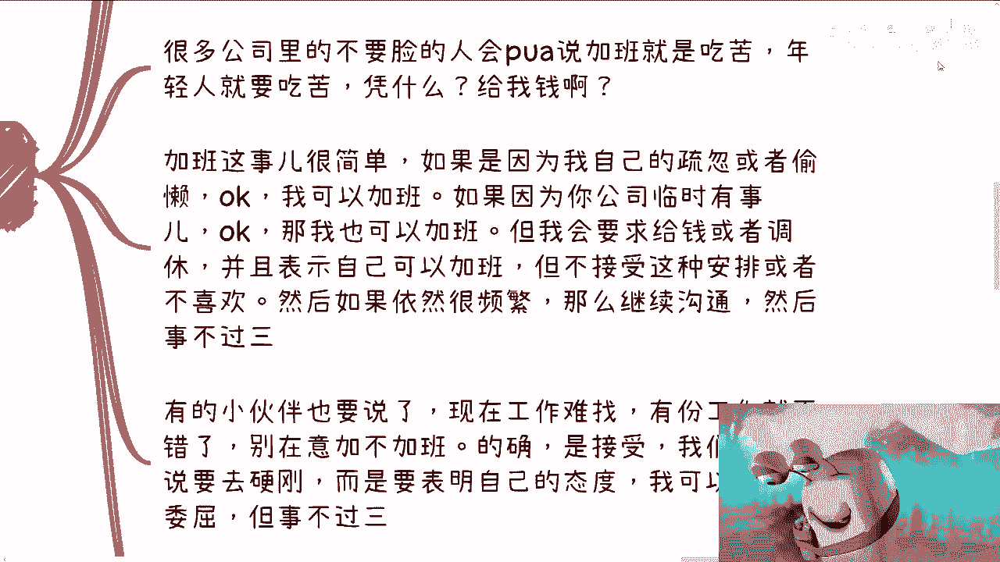
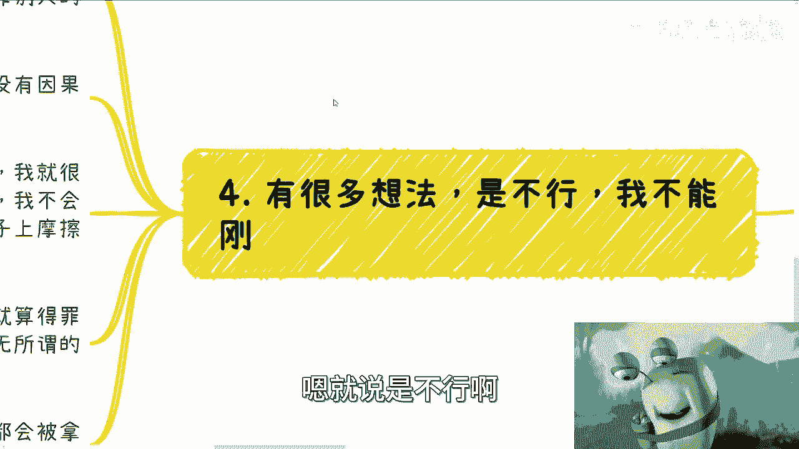

# 课程 P1：进入社会后，我们可以受委屈，但事不过三 🛡️



在本节课中，我们将探讨一个重要的社会生存原则：如何面对不公与压力，并建立自己的底线。我们将分析常见的职场与社交困境，并学习如何通过“事不过三”的原则来维护自身权益，避免被持续消耗或PUA。

---




## 概述：为何需要“事不过三”的原则




最近观察到许多被PUA的案例，无论是在职场、家庭还是社交网络中，许多人陷入深深的自我怀疑。这些指责往往缺乏具体事实依据，却让人难以自拔。因此，确立一个清晰的行为边界至关重要。


---

## 第一点：关于合同与权利的认知


上一节我们提到了普遍存在的被否定现象，本节中我们来看看具体场景下的应对。在求职和工作中，明确自身权利是第一步。


以下是关于合同与沟通的几个关键认知：

1.  **不懂就问是你的权利**：劳动合同是甲乙双方的协议。作为乙方，你有权理解合同的每一项条款。若对方无法清晰解释，可能意味着该公司本身存在问题。公式可以概括为：`你的权利 = 提问的权利 + 获得合理解释的权利`。
2.  **Offer意味着选择权，而非义务**：收到录用通知（Offer）是对你能力的认可，但接下来选择权在你手中。你需要冷静评估薪酬包（Package）、加班定义、计算方式及股权归属等细节。如果关键条款未写入合同，你有权询问原因并要求书面明确。
3.  **拒绝是一种能力**：感觉被道德绑架而无法拒绝，是将主动权拱手让人。成年人的合作应建立在相互认可和明确条款的基础上，不情愿就不要签署。

**过渡**：明确了自身权利后，我们来看看如何在实际冲突中应用“事不过三”的原则。

---



## 第二点：应用“事不过三”原则处理冲突

当权利受到侵犯时，我们需要有策略地应对，而不是默默忍受。

以下是处理不合理要求的行动指南：

1.  **界定“委屈”的范畴**：因个人疏忽导致的加班，可以视为责任，可接受无偿处理。但因公司临时安排或管理不善导致的加班，则有权要求补偿（加班费或调休）并表达对安排方式的不满。
2.  **建立明确的反击流程**：沟通是第一步。若相同问题重复发生，则需升级应对措施。其核心逻辑可以用代码表示：
    ```python
    if 受委屈次数 == 1:
        沟通，表明态度
    elif 受委屈次数 == 2:
        严肃沟通，提出警告
    else: # 事不过三
        收集证据（录音/录像） -> 采取行动（曝光/报警/法律途径）
    ```
3.  **摒弃错误归因**：不要因为别人都接受加班，就怀疑拒绝加班的自己是“有毛病”。维护自身利益是正当行为。你可以用一次、两次的沟通给予对方台阶，但第三次必须坚决维护底线。

**过渡**：除了职场，这一原则同样适用于商业合作与日常人际交往。

---

## 第三点：扩大原则的适用范围



“事不过三”不仅适用于加班，它是处理一切拖拉、画饼、不尊重承诺的行为准则。

在商业合作中：

*   **聚焦核心**：只谈能落地、能赚钱的事情。避免在空谈和画饼上浪费生命。
*   **设定容忍度**：对于拖延付款、承诺不兑现等行为，给予最多两次沟通机会。第三次则直接采取法律等正式手段。公式为：`你的时间价值 > 无休止的沟通成本`。

在人际关系中：

*   **不怕“得罪”人**：试图让所有人喜欢你是徒劳的。只要你的行为正当，不是为了主动伤害他人，就不必恐惧所谓的“得罪”。你的生存与发展，不應依赖于某个特定个人的好恶。
*   **格局决定上限**：越是害怕得罪人，你的格局和行动范围就越小。真正的成长必然伴随着不同的意见和潜在的冲突。敢于设立边界，反而能筛选出值得交往的伙伴。

**过渡**：那么，所有这些困境背后的根本原因是什么？

---


## 根本原因与总结

本节课中我们一起学习了如何用“事不过三”的原则武装自己。回顾各种案例，许多人面临的并非技能或学历问题，而是**缺乏一个清晰的、内在的行为尺度**。长期的逆来顺受，本质是一种可以被他人感知的软弱，而人性往往倾向于拿捏软弱者。

**总结**：
1.  **权利要清醒**：明确并行使你在合同与关系中的合法权利。
2.  **底线要清晰**：运用“事不过三”原则，为忍耐设定明确的次数限制和反击步骤。
3.  **内心要强大**：不怕正当的冲突，拒绝错误的自我归因。你的价值不由他人的随意指责定义。


改变只能从自身开始。建立并坚守你的尺度，世界才会对你清晰起来。