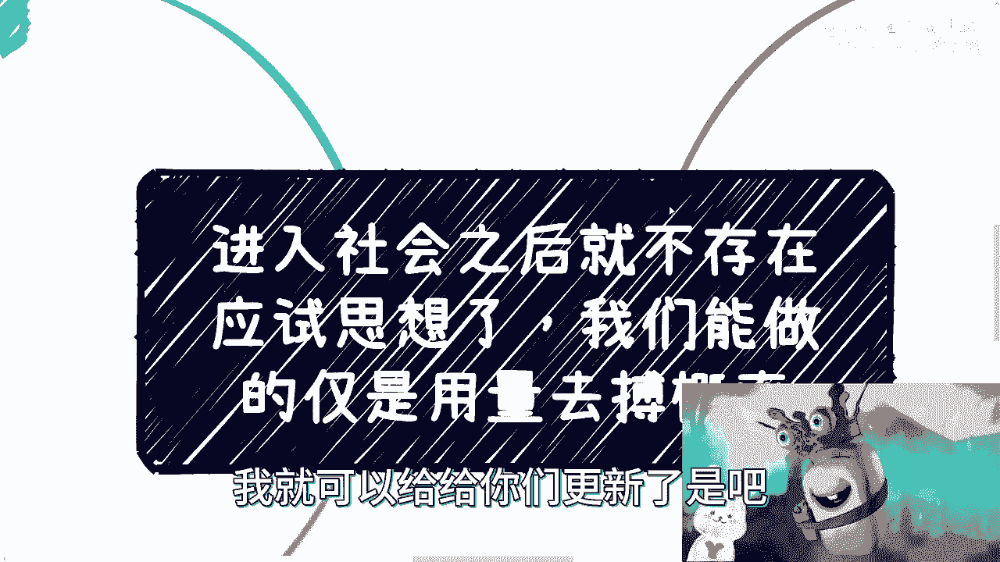
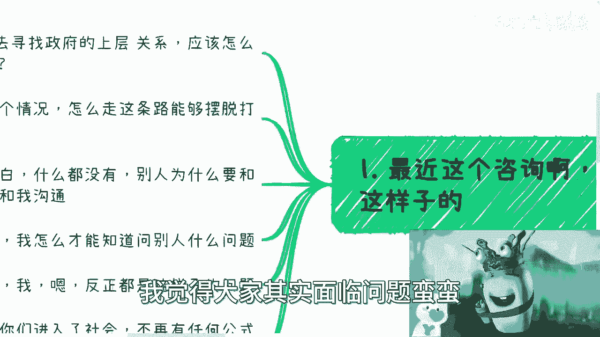
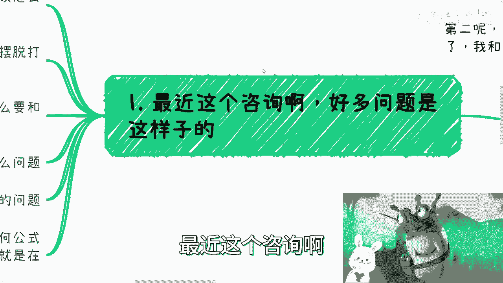
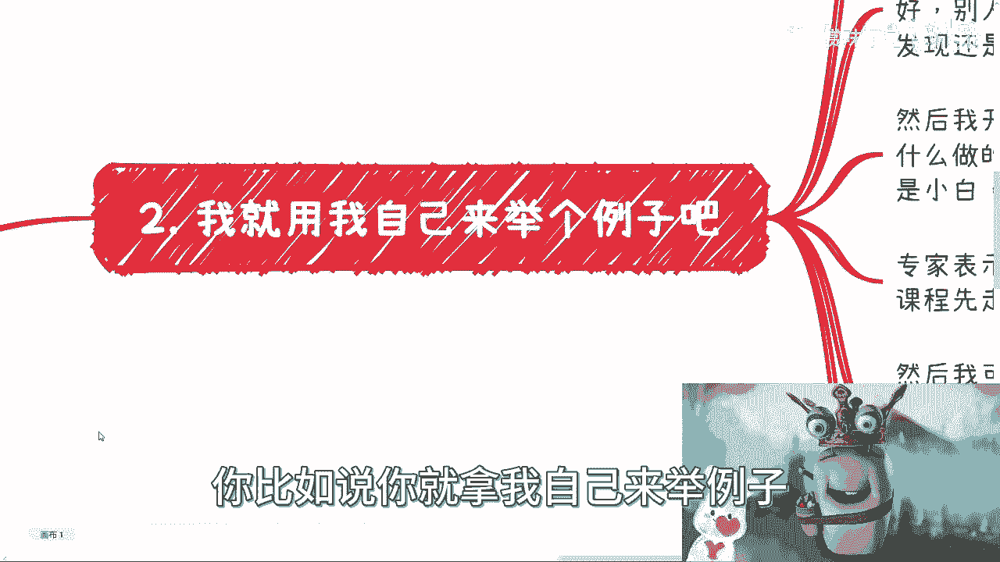
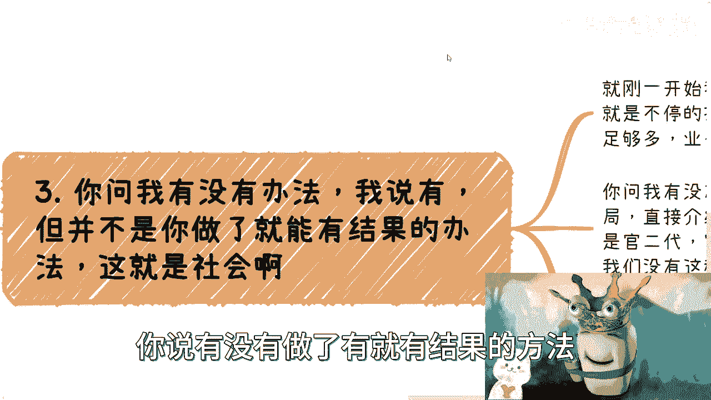
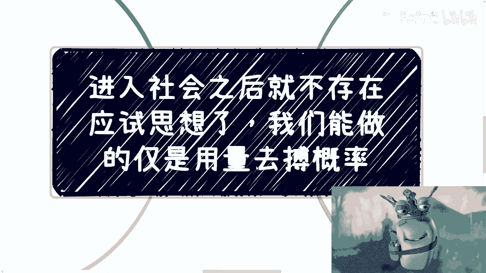
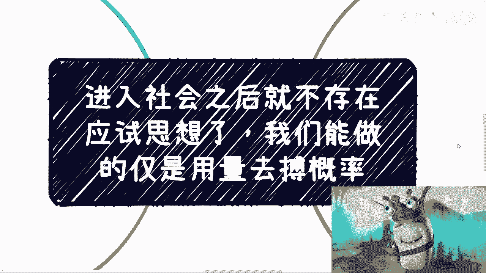

# 进入社会之后没有任何事情再可以用应试思想了 - P1 - 赏味不足 - BV1KG411Q7n5

好啊大家好啊啊我去那个哪儿啊，我去那个乌镇啊，唉实在是没啥好看的，所以我就回来了，回来了我就可以给你们更新了是吧。

呃首先呢我先说两个事情，第一呢我不是up主啊，不要来问我有没有群，有没有抖音，我什么都没有啊，也不要来自建。

找我免费合作，你们找错人了啊，你们找谁都可以，就别找我啊，因为对我来讲很简单，要么大家一起赚钱，要么就别合作，就这么简单啊，不要来跟我说啊，这个这个免费做点什么，我不需要免费啊，首先这是第一点。

第二点呢就是说呃，广州26号的活动继续报名啊，场地已经定了呃，然后我跟大家说一下流程，流程呢很简单，就是我呢会给你们讲一个topic对吧，因为我觉得以前可能没有分享一些topic，这样的话不太好呃。

我给你们分享一个就是我也写的状态里面，大家可以看一下，叫那个数字经济对吧，在web2和web3的一些发展跟趋势啊，这样的话我觉得也尽量给大家补充一些，专业知识嘛，然后剩下所有的时间。

因为差不多26号是下午01：30签到，两点钟开始对吧，差不多到05：30六点钟左右四个小时，我呢争取差不多半个小时，再加半个小时，你们的提问就结束了，剩下的时间就大家相互也好，找我也好。

就是大家线下就在这个场地里面，就大家相互交流，尽可能多的去聊好吧，因为我觉得这样才有价值对吧，否则的话你说大家跑过来对吧，这听我讲或者听大家讲，那我讲的东西未必，大家也未必是大家关心的对吧。

所以其实本质上是交流啊，这是最好的好吧。

然后呢今天这个主题是这样子的啊，就是因为最近呢咨询也碰到一些问题呃。

嗯叫什么叫做进入社会之后呢，就不存在应试思想对吧，我们能做的呢，就当然我本来想说是我们普通人做的对吧，但我也不想再带普通人三个字来，实在是哎对吧，就是不想戴，那戴着不好看啊，就我意思是说我们能做的呢。

就仅仅就是用量去搏这个概率啊，用用量变达到质变呃。

关于这个应试思想啊，我觉得我真的我我我以后肯定还会再讲。

因为这个东西我觉得大家其实面临的问题蛮蛮。

就是这个PUA的问题蛮重的，你看啊最近这个咨询啊。

好多问题是这样的，他说刘老师啊，我要寻找的生存关系好，他说应该找谁，应该找哪边对，应该找哪些部门对吧好第二个，他说刘老师啊，我现在这个情况，他说他说他说我这个本科毕业对吧，但是呢我本科的专业不是很好啊。

那我是跨跨跨专业读个硕呢，还是怎么样对吧，还是说走别的东西啊，他说我这条路怎么走，才能够摆脱打工的窘境对吧，好，他说卢老师啊，我就是小白啊，什么都没有啊，别人为什么要跟我合作，然后为什么要跟我沟通对吧。

然后呢呃这个这个你看啊他卢老师啊，我怎么才能知道问别人什么问题对吧，他说卢老师啊对吧，反正都这样了，我跟你们讲啊，之前45月份的时候呢，还有人更夸张啊，就是那种私信过来是这样子的。

他说呃有没有什么方法啊，他说能保证我两三年后有稳定两三万块钱，我就想说，那你要有这方法，我也想知道对吧，哦那我想告诉你们的是什么呢，就是如果你们能看到这个视频啊，我希望你们我就是懂或不懂。

一点都不重要啊，我希望你们得要有个中心思想，就是哥哥们姐姐们对你们进入社会，我这么说啊，你们要么就打工打一辈子啊，就是躲在象牙塔里面就躲一辈子，你们但凡想进入社会啊，比如说做什么自媒体啊，做什么东西。

就是想要跳出打工的整个的这个链路的时候，我就告诉你，不会再有任何的公式性的东西，你明白吧，哦不要去幻想再有公式性的东西，没有的啊，就是如果我今天我告诉你们，我有这个东西，那我就是在割你们，你明白吗。

就是在骗没有用的，就是你就算愿意付给我这笔钱，就是大家比如说一个愿打一个愿挨，对你们来讲也没有用，因为对你们毫无帮助。

你知道吧啊首先是第一点，我们来说啊，你比如说我就拿我自己来做来举个例子，你看啊我小蜗牛呢，小蜗牛怎么不动啊，靠这垃圾啊，好了啊，你比如说你就拿我自己来举例子。

你比如说你说你们有没有想过，我为什么要做这么多的视频，或者说我为什么这么频繁的做这么多视频，我能不能少做一点，可以呀对吧，我以前就做的很少，然后呢可能会发生什么呢，我来给你们模拟一下，对不对。

我来给你们模拟一下，比如说我今天做了一个一个月之后做了一个，我发现我没有流量，然后呢我就开始反思，是不是我做的不好，是不是我哪做的不行，是不是我标题不够，标题党，是不是我内容不够不够贩卖焦虑对吧。

然后我就去看别人怎么做的，然后我就去抄抄看对吧，但是好了，抄了几次发现他妈的我还是没有流量好呢，我就开始很焦虑啊，我开始东想西想啊，这个焦虑的很，那么接下来呢就是说你看啊。

我去小红书抖音B站微博各个地方刷一圈，刷完之后呢，他就要说了啊，我开始找一些专家咨询，我就问我说某某某专家你好啊，我为什么做的没有流量，你们为什么做的有流量啊，我应该怎么做才有流量，我是小白，我不懂啊。

对吧好，你看啊，这个话术熟不熟悉，是不是很熟悉啊，好专家表示，那是因为你SB，当然他不会说啊，那是因为你SB啊，你不懂套路，来，5万块钱的课程先买一套啊，那5000块钱也可以啊。

啊所以说几千块钱不重要对吧，然后呢我表示我可能没有钱啊，那么我觉得太贵了，那么接下来呢我就开始到抖音，到小红书，到别的地方去找一些那种小几百，小几千的这种咨询或者培训。

那结果呢就是我拿到了一堆资料和一堆课程啊，看上去好像我这个叫什么，就是非常有收获啊，但是这就跟我们到网上下载电子书是一样的，我就问你们，你们会看吗，反正我不会看，而且我觉得大部分人也不会看。

但是话又说回来，你看了有用吗，那也没有用啊，你看了就会了吗，也不会啊，对不对，因为本身这件事情它就不是一个因果关系啊，你知道吗，就是很多人想希望得到的答案，是我这么做能得到一个结果，但是不好意思。

在社会上不存在这种东西啊对吧，那我随便给你们打个比方，比如说你们今天去请政府领导吃饭，我就告诉你们每个人包红包差不多1500，就是比较基层的领导，比如一千五两千块钱对吧好，然后呢，比如说啊我跟你们讲。

这个人好，那么一般来讲呢，你们吃完饭啊，后面呢有些什么单子，大家就比较好方便合作的对吧好，那问题是你们听完这句话，你们难道得出个结论，就说哦我知道了，我今天跟他吃顿饭啊，包个2000块钱红包啊。

你可能不来，我就问你可能吗啦，哦那照你这么说吧，你请一顿饭，我请一顿饭，他请一顿饭，可能不来，对不对，就是这个当中不是这种因果关系啊，你只能说你有这个概率，但是到底怎么做，你里面还有很多细节对吧。

所以说呢你看啊，我们就说你今天得到一个叫什么，就是一个应试教育的一个流程啊，那么我就问请问有用吗，没有用没有用，为什么，因为我们不是在读书啊。

啊我们不是在读书，我们不是在考试啊，啊哥哥们姐姐们对吧，那么第二点，你问我有没有办法，我说有，但并不是你做了就能有结果的办法，这就是社会，那当然你说你说有没有做了，有就有结果的方法。

有啊没有啊，那你看啊，你问我有没有方法，我说有啊，你可以找关系啊，拉饭局啊，直接介绍啊，或者喝点小酒啊都可以啊对吧，或者通过一些别的方式，但是问题是你没有这些东西，你没有关系啊对吧，富二代，那你不是啊。

对不对，那当然我也不是，所以说我们没有这种方法，你问我有没有，那我们用不了啊，有卵用啊，对不对啊，那么我们来看一下，一开始在第一个里面我列的这些对吧，就大家问的啊，你说有没有办法有。

我说有的方法就是你不停的去接触，不停的去沟通，人要足够的多，会要足够多，业务要做看的足够多，你才有积累，而不是那种你一两次三四次，然后就是好，我不行了，那那你你你你你记得个屁啊对吧。

然后还有小伙伴问我来，他说我想做咨询啊，他说怎么能够跟我一样做咨询跟分享，有没有什么技巧，我说有啊，技巧是什么，我就告诉你我小会议对吧，100个人左右的，我讲到今天1500场肯定是有的，打底的。

2000场说不定都有了对吧，大会以500人到1000人来十多场肯定是有的，你走一遍呗，你先走一遍再说啊，对吧，不是那种说哦，我今天好像做了一两次，三四次就跑过来跟我说，爱刘老师，我觉得这个东西我不行啊。

这个东西我怎么感觉我好像这个做不了，那屁话谁做得了呢啊，我以前做的时候被人家喷，不知道喷了多少次了，没有用的，你不能急，你问为什么，因为唉这个真的就是我说的，应试教育的这种思想。

就是不是说我们今天看几本书对吧，很着急的把这个东西叫做考试知识点，学习一下，我们就能去考试了，不行的呀，没有办法的呀对吧，所以说第四点你们要记住，就是第一没有什么东西是银弹，银弹。

就是说同一种方法论去解决所有的问题对吧，一套方法论，一套逻辑针对所有人都适用，它不可能啊，如果有他就是哥啊，怎么会可能呢，对不对啊，就是说也没有什么东西是固定的，你说比如说找谁找什么样的人一定有用。

找找怎么样的部门一定有不存在的，你包括中国各地方很多就是就是一线二线，三线这种地方政府，它的很多架构都不一样，哪来的固定的方法论啊，啊你打官司打的关系都不一样，你我跟你讲，你比如说在上海打关系。

跟在你在包头打关系会一样吗，不一样的，你整个政府架构都不一样，怎么可能一样呢，对吧，然后我们做事情我跟你讲是这样子的，我们做事情是需要战略上很清楚，然后通过战略要去反推你的战术，你懂吗。

这就好像很多人一开始跟我说啊，他说我未来就是要要更自由，要赚钱，要躺着赚钱对吧，要性价比高的赚钱好，然后他反过来就马上往回头就跟我说，我要先找个工作，先考个研，这属于什么。

这属于你的战略跟你的战术毫无屁关系啊，你懂吗对吧，那当然也有人会说，他说那那我要不就给过渡对吧，那我可以先找工作吧，我可以先考研，然后呢我同时对吧，你说我要去寻找一些商业上的积累或者怎么样。

你说行不行行啊，我就告诉你们行，但是我就告诉你们，现在的整个市场，整个环境，整个时间都不允许你们这么做，因为以前都有很好的土壤，是让大家缓慢成长的，现在没有就这么简单，你们爱信不信，你知道吧。

就是我为什么一直跟你们提这件事情，就是因为现在大家所面临的问题，就是你战略就要很明确，不明确，你不可能说我后面什么做了一段时间之后去改，你不好意思，改不过来，没这个机会了，你知道吗，那我告诉你们。

很多时候啊，我们需要让我们自己每一步都要有沉淀，有积累，我们需要让我们每一次的战术，都跟我们最终战略要相关，而不是说你自己在那边不知道对吧，瞎他妈改啊，这两三年嘛是这个战略，后面两三年嘛那个战略对吧。

就像很多人说哎我这两三年末去个大厂对吧，后面两三年嘛，好好像感觉要要要要被那个呃这个优化掉了，要被裁掉了，那我可能就是去外企，主要再过两三年了，可能哎呀我要不要回老家对吧，怎么样子。

那就是说那我尊重你们每个人的选择，你们想怎么样怎么样都可以对吧，但是不要就是属于那种你们其实还年轻，还有机会，但是呢就是就是想着说哦，我未来要赚钱的，我就想躺着赚钱，我就想高薪在别人赚钱。

你口号一直在那边喊，但是从来没有行动，或者你们的行动，跟你们的口号完全没有任何关系，那何必呢对吧，啊所以说你要是战略一直在那边变。

那么最终他就是啥都没有，啥都没有积累，而且你会发现什么都没有做，所以说我昨天我这么说吧，就是我昨天跟那个晚上咨询的时候，我其实当时是这么说的，我说我说你们要明白啊，就是就是很多人都会觉得啊。

这个比如说学历啊对吧，大厂啊，小微企业啊对吧，或者外企国企啊，我说是这样子的，就是在我眼里没有这些东西，我说在我眼里只有阶层的区别，没有啦，就就这么简单对吧，没了呀，就往下看都一样的，有什么区别吗。

没有区别的呀对吧，那当然啦就是每个人追求生活不一样啊，我我也不强求大家一定要追求怎么样，反正我说的很清楚，我所有的东西，我只是希望哦大家如果能明白对吧，这辈子活的通透一点，然后这辈子活的开心一点对吧。

然后这辈子能够有一定的抗风险能力啊，至于大家自己要不要，那无所谓，难道我还强推给大家，那玛的跟我啥关系啊，你说是不是啊。

好吧就是说这个事已经很清楚了，不要再去妄想说哦，刘老师啊，我有什么学历，我能不能得到什么资源，不好意思，他妈的跟你学历没有关系哦，你啊刘老师，我出过国也不好，不好意思，也没关系，不要想了。

这些东西都是你们YY出来的，整个社会上没有人，商业上面，没有人会因为这些东西去让你们得到一些东西，不存在的，好吧啊行啊。

那就这么着吧，希望大家要是想明白就行动起来，行动快，那以量去搏概率，能博得到就博不到就博得到，博不到呢，我觉得嗯也会有一定收获，总归好吧，嗯哎呀行。

