# 课程01：告别应试思维，拥抱社会生存法则 🎓

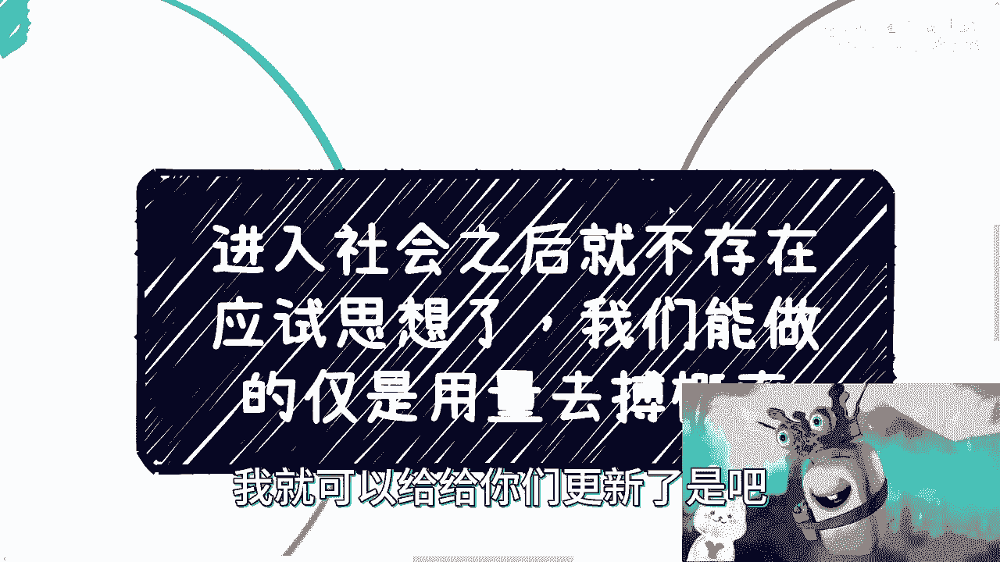

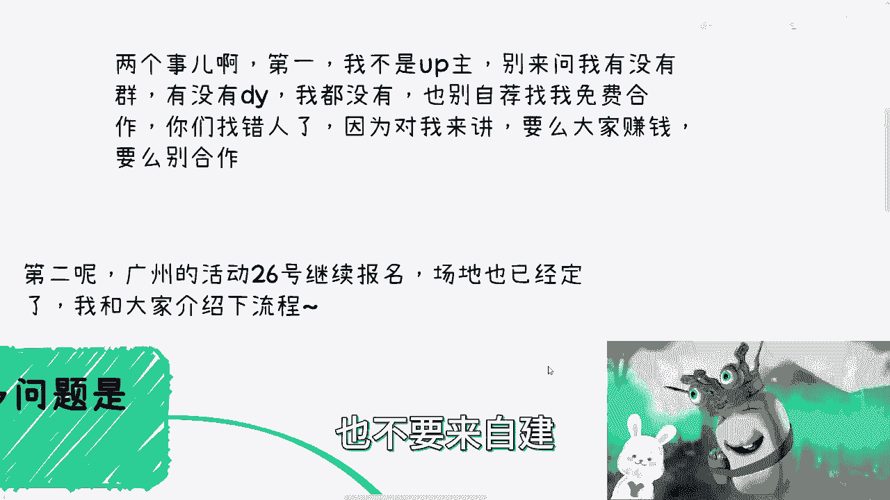

在本节课中，我们将探讨一个核心观念：从校园步入社会后，传统的“应试思维”将不再适用。我们将分析这种思维模式在现实世界中的局限性，并学习如何通过新的策略来应对复杂的社会挑战。

---

## 第一部分：课程前言与活动通知

首先，说明两件事情。

第一，我不是全职的内容创作者。我没有建立任何粉丝群组，也没有运营抖音等平台账号。请不要私信我请求免费合作。对我而言，合作的基础是互利共赢，而非单方面的无偿付出。

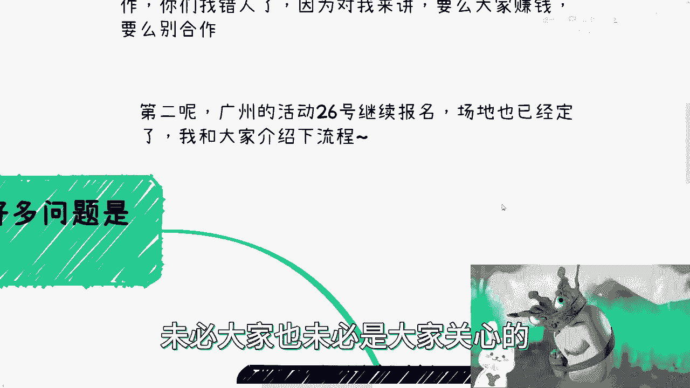

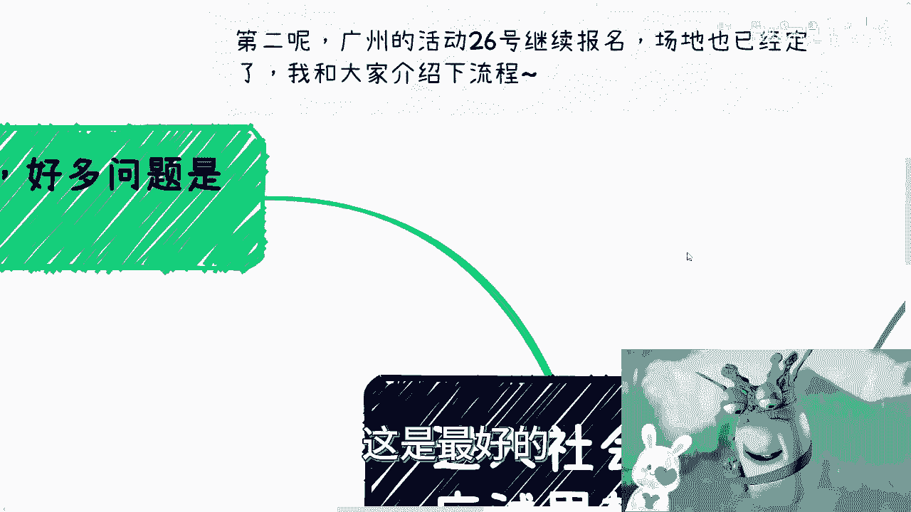

第二，广州于26号举办的活动继续接受报名，场地已确定。

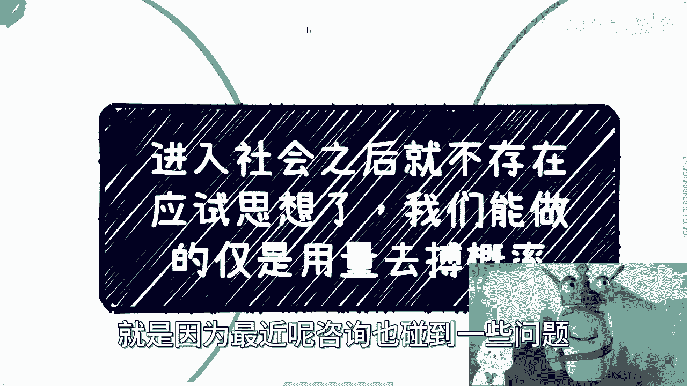

以下是活动流程简介：
*   活动于下午1:30签到，2点正式开始，持续约4小时。
*   我将用半小时左右分享一个主题：**数字经济在Web2与Web3时代的发展与趋势**，旨在为大家补充专业知识。
*   随后有半小时的问答环节。
*   剩余的大部分时间将用于所有参与者之间的自由交流。我认为面对面的深入沟通比单向聆听更有价值。

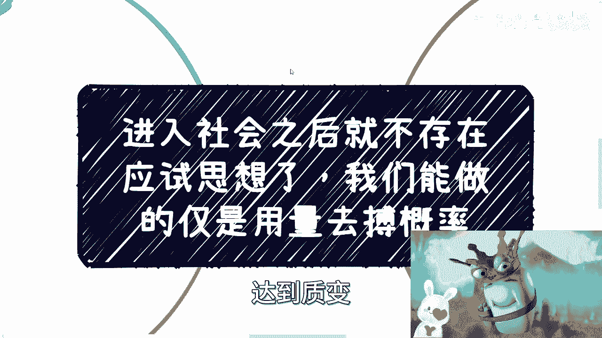

---

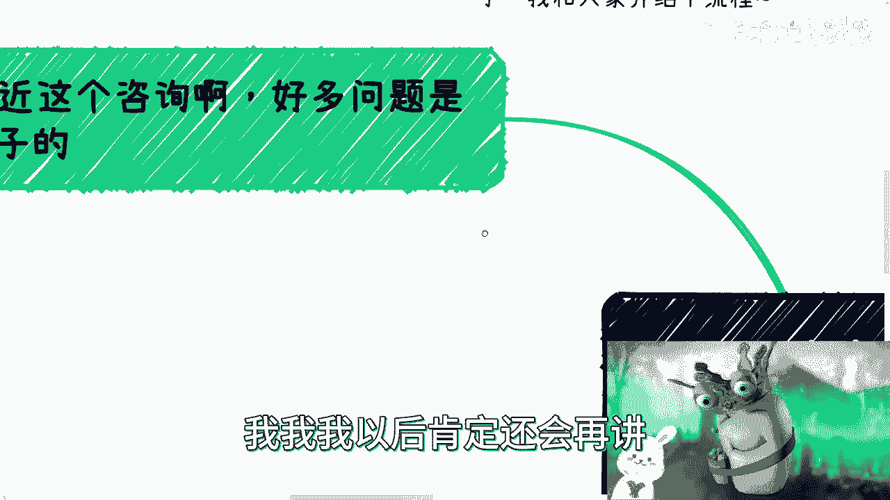

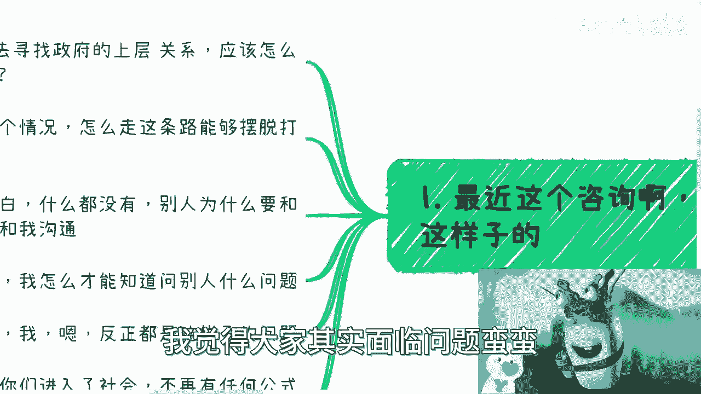

## 第二部分：核心问题阐述——社会没有标准答案

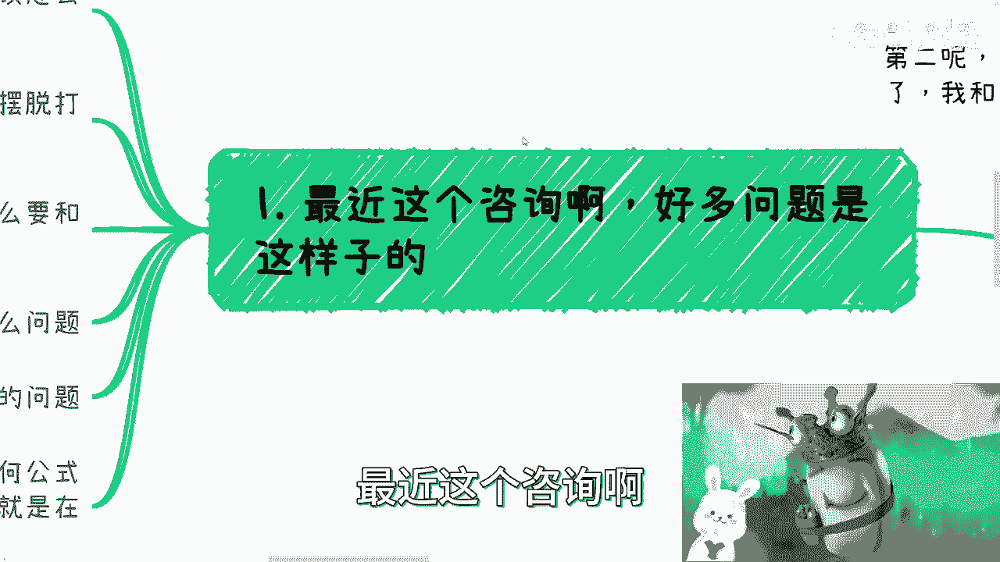

最近在咨询中，我频繁遇到一类问题，其核心都围绕着“应该”怎么做。

以下是几个典型例子：
*   “我应该寻找谁或哪个部门来建立生存所需的关系？”
*   “我本科专业不好，是应该跨专业考研，还是选择其他路径来摆脱打工困境？”
*   “作为小白，别人凭什么要与我合作或沟通？”
*   “我应该如何知道该向别人提出什么问题？”

更极端的问题是：“有没有什么方法能保证我在两三年后获得稳定的两三万元月收入？”

我希望观看本视频的各位能建立一个核心思想：一旦你决定踏入社会，并尝试跳出单纯的打工路径（例如从事自媒体、创业等），就必须明白，**不会再有任何像考试公式一样确定无疑的方法论**。

如果我声称拥有这种“保证成功”的公式，那便是在欺骗大家。即使你愿意为此付费，它也对你毫无实际帮助，因为现实社会并不按此逻辑运行。

---

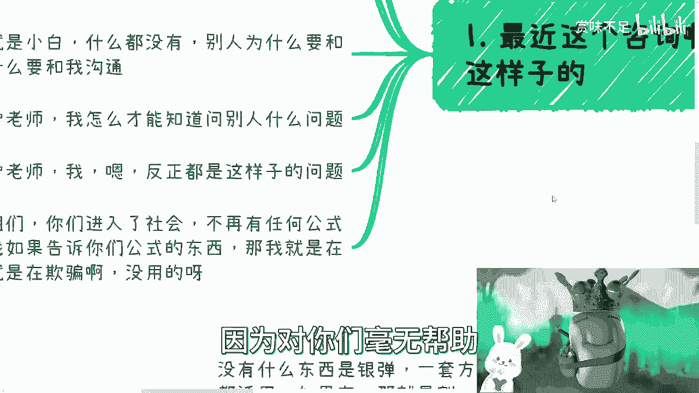

## 第三部分：以自媒体为例，拆解“应试思维”的陷阱

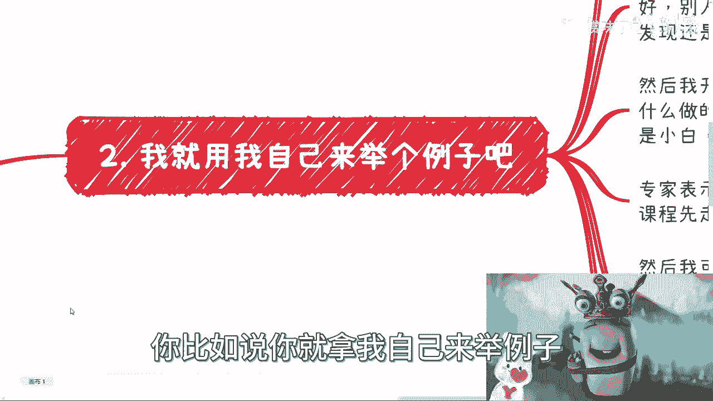

以我制作视频为例。有人可能问，为何要如此频繁地更新？能否减少？

我们可以模拟一下“应试思维”下的操作路径：
1.  减少更新频率后，发现视频没有流量。
2.  开始反思：是否内容不好？标题不够吸引人？没有贩卖焦虑？
3.  去模仿其他有流量的作者。
4.  模仿后依然没有流量，陷入焦虑。
5.  四处寻找“专家”咨询：“为什么我没有流量？我应该怎么做才能有流量？”
6.  “专家”可能会告诉你，因为你“不懂套路”，并推销价值数千或数万元的课程。
7.  你或许会购买一些廉价课程，得到一堆资料，但这就像从网上下载了无数电子书——大多数人既不会看，看了也未必能学会。

**关键在于，这整个思考过程建立在错误的假设上：即存在一个“因为做了A，所以必然得到B”的因果关系。** 在社会实践中，这种确定性几乎不存在。

例如，你知道宴请某位领导并送上礼金可能有助于后续合作。但这绝不意味着“宴请+送礼”就等于“获得合作”。这只是一种增加概率的行为，其中涉及大量无法公式化的细节、时机与个人互动。你、我、他都可以请客，但结果可能截然不同。

**因此，试图寻找一个“应试教育”般的标准流程来应对社会问题，是无效的。因为我们所处的环境不再是考场。**

---

## 第四部分：什么是可行的策略？——用量变搏概率

那么，是否存在可行的方法？有，但**这些方法不能保证单一行动必然产生特定结果**，而这正是社会的本质。

有人会问，是否存在“做了就有结果”的方法？理论上存在，例如动用强大的家庭关系或资源直接促成事情。但如果你不具备这些条件（正如绝大多数人一样），那么这些方法便没有讨论的意义。

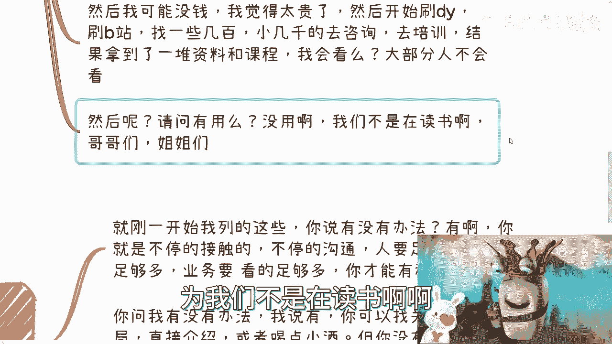

对于之前提到的那些典型问题，真正可行的方法是：**通过大量的实践、接触和沟通来积累经验与可能性。** 核心公式可以概括为：

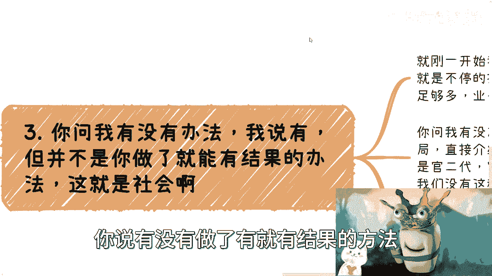

**成功概率 ≈ 有效行动的数量 × 行动质量**

这需要你接触足够多的人，参与足够多的会议，分析和尝试足够多的业务，从而形成自己的认知与资源网络。这绝非一两次尝试后就说“我不行”便能达成。

例如，有朋友咨询如何像我一样做咨询和分享，问有什么技巧。我的回答是：我主持过的小型会议（约100人规模）至少有1500场，大型会议（500-1000人规模）也有十几场。**技巧就是先去完成这个数量的积累。** 没有人一开始就能做得完美，都会经历被质疑和否定的阶段，但不能因此急于求成。

---

## 第五部分：必须摒弃的两种错误观念

在采取行动前，必须从思想上清除两种谬误：

**1. 不存在“银弹”（万能解决方案）**
即不存在一套放之四海而皆准、适用于所有人的固定方法论。社会是复杂多元的，不存在“找谁一定有用”或“哪个部门一定有效”的固定答案。不同地区、不同领域的规则和人际关系网络千差万别。

**2. 战术必须服务于战略，并持续积累**
做事情需要在战略上保持清晰，并通过战略来反推和指导具体的战术行动。

一个常见的错误是：战略上宣称“我要自由、要高性价比地赚钱”，但战术上却立刻回头去“找个工作”或“考个研”。除非你能明确解释这份工作或这个学位如何直接、有效地服务于你的终极战略（例如，积累特定行业知识、人脉或启动资金），否则这就是战略与战术的脱节。

在过去的市场环境中，或许允许人们用较长时间缓慢调整或试错。但当前的竞争环境与时间窗口，已不再允许这种“先随便做做，以后再改”的策略。**我们需要让每一步行动都有沉淀，每一次战术选择都与最终战略强相关。** 如果战略频繁变动（例如这两年想进大厂，过两年想逃往外企，再几年想回老家），最终结果将是毫无积累，一事无成。

---

## 第六部分：重新定义你的价值坐标系

最后，我想分享一个观点来帮助大家重塑认知。在咨询中我常这样说：在我眼中，许多外在标签（如名校学历、大厂光环、公司规模、企业性质）的差异并没有想象中那么大。**更本质的区分是阶层与认知的差异。**

学历、留学经历等，在真实的商业与社会协作中，很少能直接兑换为资源或机会。它们可能是一块敲门砖或一个过滤器，但绝非成功的保证。不要将自己困在这些“应该”拥有的条件所编织的幻想中。

社会不会因为你“应该”获得什么而给予你什么。它只回应你实际创造的价值、抓住的机会以及构建的关系。

---

## 课程总结

本节课我们一起学习了如何告别无效的“应试思维”，并拥抱社会的真实生存法则。

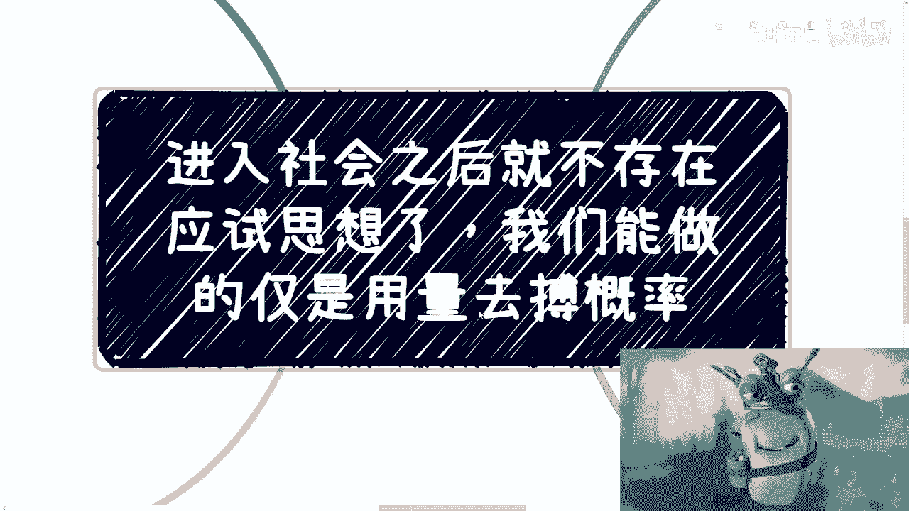

我们明确了：
*   **社会问题没有标准答案**，不存在“因为A所以必然B”的简单公式。
*   **可行的策略是“以量搏概率”**，通过持续、大量的有效行动来提升成功机会，并接受过程中的不确定性。
*   **必须摒弃寻找“银弹”和“战术脱离战略”的错误观念**，确保每一步都为目标积累力量。
*   **需要重新定义个人价值**，认识到学历等标签的局限性，专注于提升实际解决问题的能力与资源整合能力。

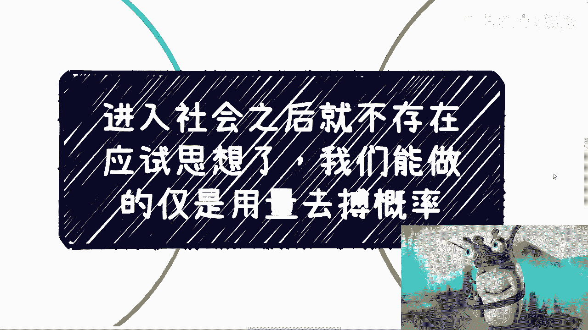

希望你能想明白这些道理，并快速行动起来。用行动去搏击概率，无论结果如何，这个过程本身必将为你带来宝贵的收获。

---