# 进入社会之后，我们可以受委屈，但事不过三 - P1 - 赏味不足 - BV1Hz4y1A7yA

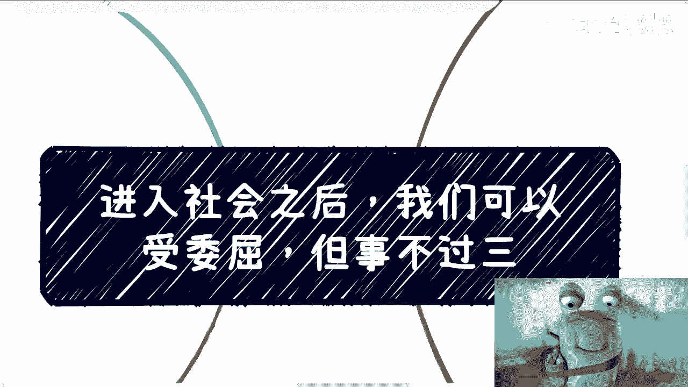

大家好啊，我们今天来讲的这个内容呢是进入社会之后嗯，我们可以受委屈。

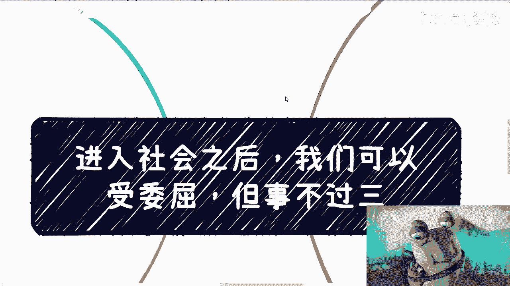

但是我觉得事不过三啊，主要为什么呢，待会再来说啊，我先给你们插两个叫什么插两个话题啊。

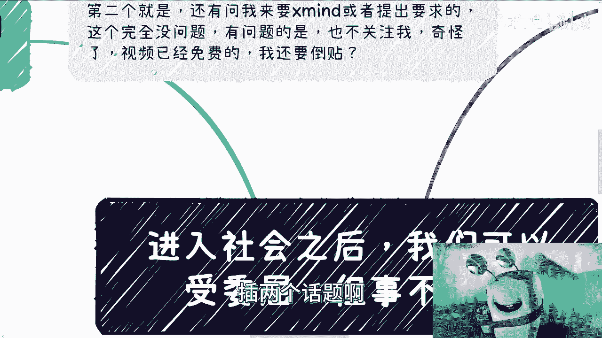

嗯嗯先说几个有趣的事情啊，我每天都会在朋友圈呢，评论区呢看到过有有人过来留言啊，就说自己是普通人啊，说普通人这也不行，那也不行对吧，那我就在想了对吧，就是嗯你到底想怎么活，这个是你自己的事情啊。

你要觉得你是个普通人，你又觉得普通人这也不行，那也不行，那你就觉得自己不行，那不行，也不代表大家大家不行嘛对吧，那你不行，你在这秀什么存在感呢，是不是我就觉得很神奇啊，就是就是这个那个年纪也不小了对吧。

都怎么教育出来这么这么一种生物的，也非常令人很神奇对吧，首先这是第一个啊，那第二个呢就是说还有人问我要X提出需求的，我觉得这个完全没有问题，我也很欢迎大家来问我要这个东西或提出需求，是不是。

但是问题是很神奇的，就是他也不关注对吧，那对我来讲我觉得很奇怪对吧。

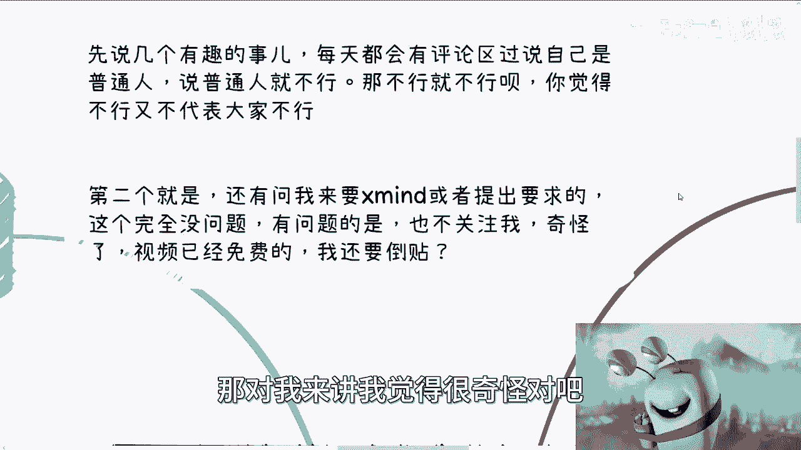

你视频已经免费了，你还要我倒贴，那我怎么可能这个允许这种事情发生呢。

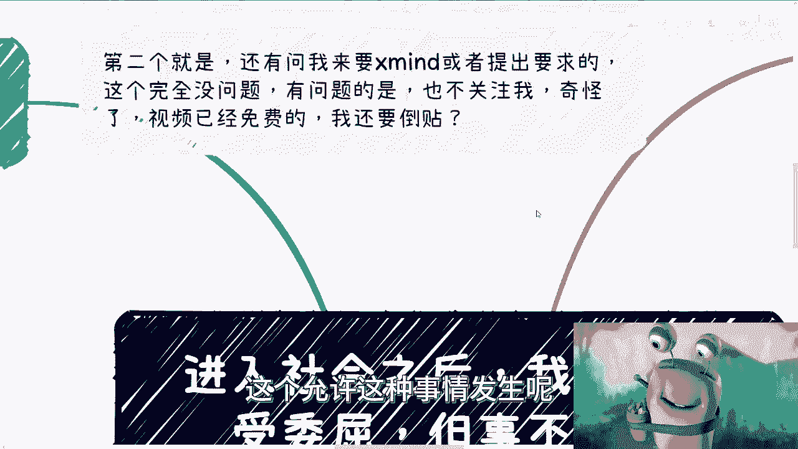

对不对啊，好，那么我们回归主题啊，首先啊为什么会说这个问题啊，因为最近聊下来呢，被PUA的案例太多了，多到我都已经看不下去了。

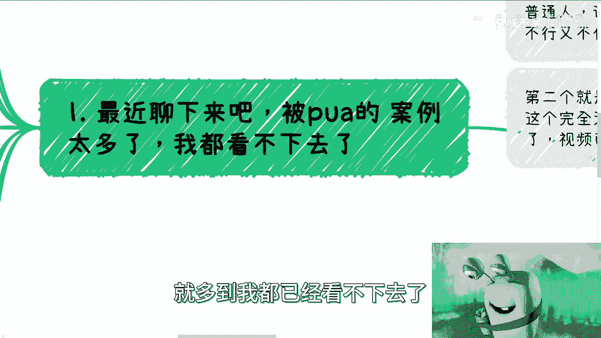

就到处都是PUA，而且PUA到，就是说属于自己那种难以自拔的程度。

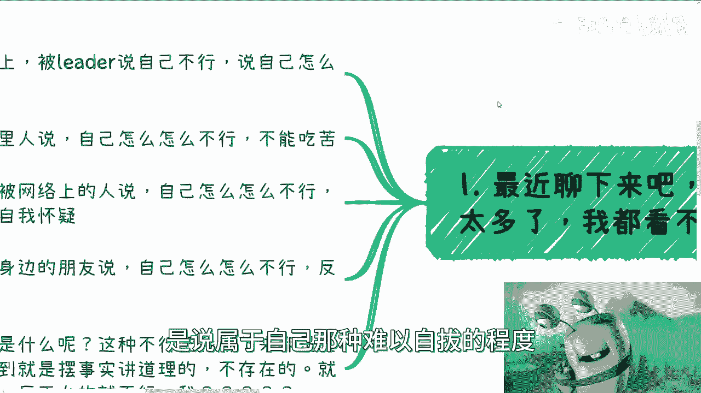

你们看啊，我总结了一下，就有的呢还是在职场上被leader说自己不行啊，说自己怎么怎么不好，而且呢还要什么劝退啊。

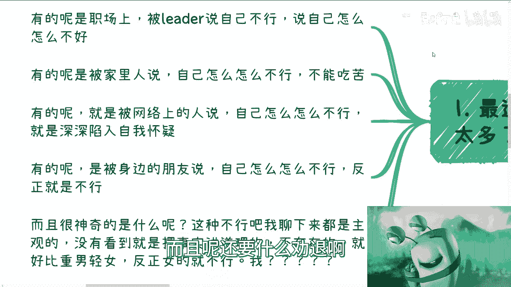

那有的人呢是在被家里人说啊，父母说对吧，兄弟姐妹说说自己怎么怎么不行啊，不能吃苦，有的呢是在被网络上人说啊，说怎么怎么不行啊，深陷入深深的自我怀疑，有的呢被身边的朋友说啊，自己怎么怎么不行啊。

反正就是不行啊，那个朋友懂得也不懂的对吧，而且最神奇的是什么呢，是我聊下来呢，我就发现了，就是你要说他不行吧，那我说你不行对吧好，那你总归不行，你得有事情不行啊，你得有现象不行啊，你得有东西不行啊。

对不对，你不能说这个人说你不行就不行啊，是吧啊，你要摆事实讲道理吧，对吧好，我问下来都不存在的，就没有哪个摆得出事实，讲得出道理的对吧，他就好比什么呢，他就好比说来听女的对吧，反正女的就是不行。

哎她管你啊，哼对吧，我不管事实，对吧好。

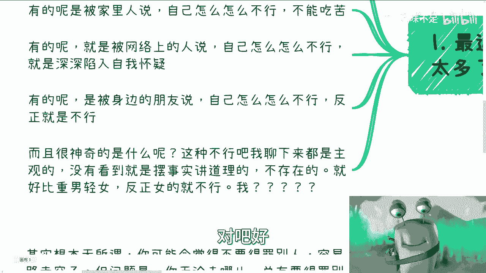

那么这是第一个啊，第二个啊，我们来看啊，我列了几个点啊。

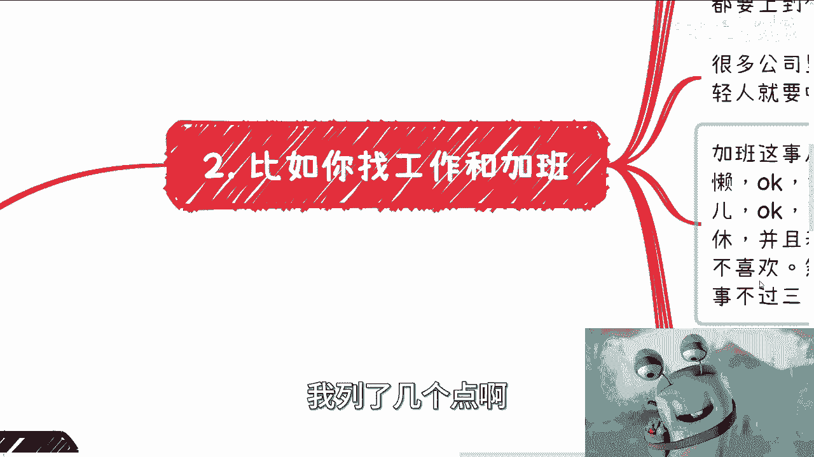

比如说呢你找工作和加班对吧，你看啊合同呢可能会很长啊，但是呢我觉得很多人你得明白，就是你不懂，你就问，因为这是你的权利，那当然了，你说你碰到我对吧，你说你不懂，你问我，我可以不回你，为什么，因为我不回。

你也是我的权利啊，但是你跟公司签合同不一样啊，你跟公司签劳务合同，你是乙方，公司是甲方，你是甲乙双方，你就有你的权利对吧，哦那你就要么就不要钱，要么就说公司就表示我就不要你对吧，既然说难听点。

公司已经给你说offer，那就说明你开始进入了你的权利环节，对不对，好我们就说啊，没有任何法律条款和规则去说，某一份合同一定要怎么写怎么写怎么写，没有的啊，没有任何东西。

就是说也没有任何东西说是谁说了算的，就是他合同上写任何东西，也是要有有法可依的对吧，你任何合同上都行，你要有依据，所以说你不懂的，你可以问对吧，因为你不懂很正常，你问出去这个hr不懂。

那就说明他这公司不行对吧，那么这第一个第二个我发现一些小伙伴啊，还有个特点，就是他拿到offer来，他不知道怎么拒绝啊，就是感觉那种就是说好像我对方给你发offer吧，就好像有点道德绑架你。

我不知道大家怎么会这么想呢，你知道吗，就是就是你是来争取自己利益的offer意味着什么，offer意味着他对你的认可，但是接下来是你选择权啊，不是说他发给你offer，你就得去啊，对不对，那么你想啊。

PAPACKAGE是什么，加班到底怎么定义，加班怎么计算，股票有没有怎么归属对吧，你都是得写在合同上的，你要说不写，那你问为什么不写，你得你作为一个成年人，他作为一个甲方，他总给你一个理由吧对吧。

给你个说法吧，而且要说的你要你要认可吧对吧，唉我发现很多人做事情是这样子的，就是你跟他签合同嘛，他好像是那种被迫啊，然后呢又感觉好像哎呀自己很不情愿，哎那不情愿，你别签呐。

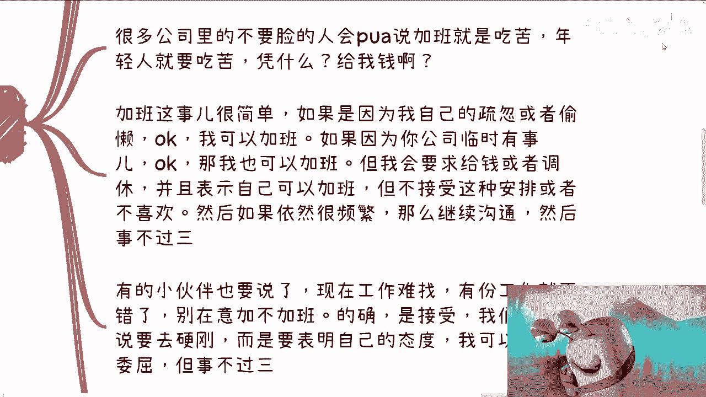

对吧，然后他会跟你说，哎呀我不懂得怎么拒绝，哎呀，我怎么样怎么样怎么样，那你怎么样怎么样，那是你的事情，你不能怪到人家头上了，对不对啊，然后很多公司里呢我跟你讲不要脸的人，他会这么说的。

他会告诉你PUA啊，PUA告诉你什么呢，就是加班就是吃苦啊，年轻人就要吃苦，那他妈凭什么啊，哪条法律哪条规则说他妈的年轻人就要吃苦了，对不对啊，然后加班这事我跟你讲很简单。

就是如果因为我自己疏忽或者偷懒对吧，因为我自己的问题，OK我不管是因为生病还是因为什么原因，主要是因为我的问题，OK我可以加班，没问题，我是我可以不要钱，对不对，但是如果因为你公司临时有事情。

临时加出来的问题，那OK我也可以加班，但是我会来要求给钱或者调休，同时我表示虽然我可以加班，但是我不接受你们这种的安排，对不对好，那如果依然后面再继续频繁的加班，那我觉得很简单，事不过三。

我再跟你沟通沟通不了，那我辞职对吧，或者沟通不了，我先不辞职，我打110，凭什么你给我个说法就这么简单，怎么来呢对吧，好然后有的时候把你咬出来，他说现在工作难找啊，有份工作就不错了。

别在意加班加加班不加班，的确我接受啊，我们不是说我们碰到问题一定要去硬刚，而是说我们要表明自己的态度对吧，我可以受一次委屈，但是事不过三，就这么简单啊，你要怠慢强制我加班的，或者要用这种形式开除我的。

给我小鞋穿的，OK很简单，我该录音录音，我该录像录像，我就曝光，我该报警报警，怎么了呢，我维护自己的利益不行吗，对吧，我不是没有给过大家台阶下，对不对，没毛病啊，嗯但你不能默默接受啊，你甚至你不能说啊。

自己在那边想卧槽，他妈是不是我不我不对，为什么大家都接受加班，为什么我不我不接受，我是不是有毛病，这他妈的就绝了，你知道吗，对吧好，那比如我跟别人谈商务啊都一样，我一般都是那个说话的人。

我就问能赚钱吗对吧，你要说服我能不能赚钱，不能那就别谈浪费什么时间，对不对啊，那说好的时间呢，就是说给钱就给钱，你要拖，那也可以很简单，一次两次我可以跟你沟通，第三次不沟通了，直接律师函，对不对。

要么就直接报警，就这么简单，没什么屁话的对吧，另外就是这种事情拖拖拉拉，每次比如说承诺的很好的，饼画的很好的，但是落地不行的对吧，那其实你想想，如果我合作对吧，那等于前面两次就等于我吃亏嘛，对吧。

因为因为你整个事情都在浪费，我时间都在往后拖嘛，那我我我认为我受委屈嘛对吧，但是因为大家没有落地，因为大家没有落地，所以对大家来讲其实都是浪费时间，但是这种事情你没有办法，因为你没法去预知一件事情之前。

或者在这件事情真正落地的时候，他到底怎么样对吧，你没有办法的，所以有很多时候你该吃的亏还是要吃的对啊，所以呢我现在对所有人都是一个态度，就是你跟我谈就谈赚钱的事情，不赚钱就不要谈对吧。

那然后我就告诉你们，果然就是世界一下子就很亲近对吧，而且我就很空，为什么，因为所有事情过来，我跟你们说，真的赚钱的东西，整个沟通从头到尾不超过20分钟的，就这么简单，结束了啊，好然后好。

然后我们继续来说第三点就有很多想法呢，嗯就是说是不行啊。

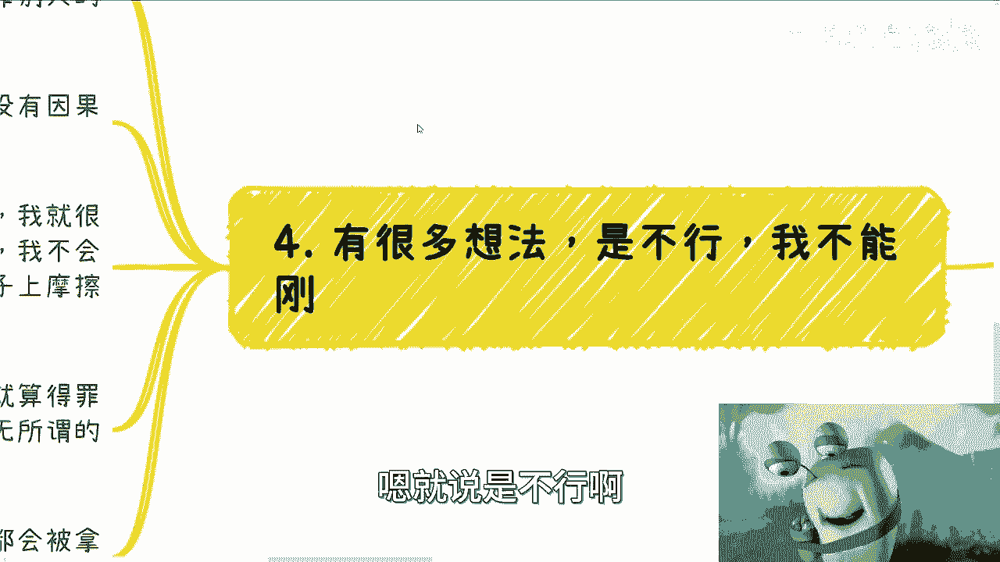

但是呢我不能刚什么意思呢，就是说其实我跟你讲根本就无所谓，因为为什么，因为你可能会觉得比如说不要得罪人，而容易路走走窄了对吧，或者很多人怎么倚老卖老来跟你说，哎呀你这样不行的，现在环境不好对吧。

你这样得罪你的领导对吧，然后怎么在行业里混不下去的，但问题是你要明白一点啊，你无论去什么地方，中国这么大，地球这么大，你无论去什么地方，你总会得罪得罪得罪别人的，而且甚至很有可能你不主动得罪别人。

还会觉得你得罪别人对吧，就该锅往你头上扣的，还往你头上扣，而且你要明白，你不得罪并不代表你能得到什么，你得罪了也并不代表一定你们就反目成仇，对不对，这两者都没有任何的因果关系。

就像以前我小伙伴让我去跟领导谈生意，是一样的，我之前在北京，我就这么跟你们讲，唉说到这个，我跟你讲，真的人也是一把泪啊，一把泪回头我再跟你们说啊，我真的没人谈生意对吧，我就很不喜欢这种装逼的领导。

对不对，然后呢，我小伙伴就跟我说，要我去，我说你要我去啊，你想清楚我就跟他说，我说你想清楚，你要我就可以的啊，我说我去了，我不会顾及你们两方任何一方面子的，什么意思，就是我就指着他鼻子骂对吧。

我说我不管对方是谁，我肯定天天把他按在桌桌子上摩擦的，我跟你讲原话，我就这么说的，对不对，为什么，因为我很清楚一点啊，你爱跪舔是你的事情，我不跪舔，而且很简单，跪舔并不能让我们能赚到钱，你要今天跟我说。

我跪舔能赚到100万，没问题，我跪舔对不对，但问题是事实上大部分情况你跪舔，你也赚不到钱，你也捞不到好处，不跪舔就算得罪了又怎么样呢，地球不转了吗，啊缺这个人他妈的能怎么地呢，啊他一手遮天吗，对不对啊。

所以说我们就说啊，就说如果有人跟你说，哎呀你你以后在行业混不下去的，你以后这个这个这个得罪别人怎么样怎么样的，你格局就要大，什么意思，你要是连这种东西得罪了，你都活不下去，你以后还做什么东西啊。

你你还怎么做的，对不对哦，我连一个人都不敢得罪哦，我连这个人也不敢得罪，那个人也不敢得罪，你还做什么事情，为什么，因为你只要往大了做，我不管你赚不赚钱，你只要想往大了做，你总有就是大家有相互竞争关系的。

或者说大家怎么样子的，你得明白啊，你得清楚啊对吧，就不是说你要你你要去给对方穿小鞋，或者你要背后去捅他，或者你要去什么造谣诬告或者怎么样子，而是说你不要去care这些事情。

你越是care你的格局也就那么大了对吧，所以说本质上是需要改变的，只有自己，如果所有的我们刚刚说的，你不你不敢跟别人谈，你不会拒绝对吧，你甚至会觉得哎是不是我自己有毛病对吧，或者怎么样，那我跟你讲。

一切都是你的软弱自己造成的，你的软弱无论到哪都会被别人拿捏，为什么人性就这个样子的呀，你怎么办呢。

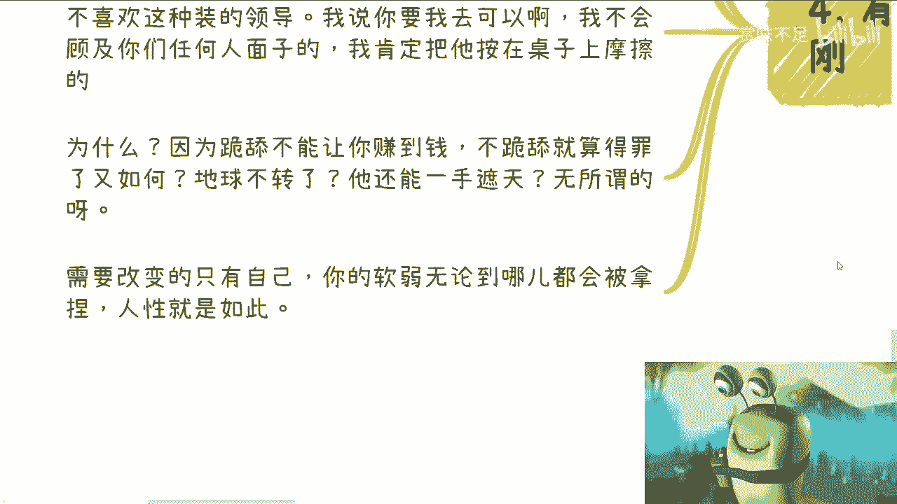

对不对对吧，这就像什么，我跟你们讲，这就像你今天跟别人谈生意，你明明已经吃亏了，你明明已经是自己不自知的情况下，已经是被别人坑了对吧，那我说不好听点，如果我在场，我作为第三方，或者我跟你们同样是合作方。

我可能会提醒你一嘴，但是你想想看，你碰到别人，碰到外面谁来提醒你，对不对，因为什么，因为人性就是如此啊，大家能占便宜就占便宜啊，我哪怕占一毛钱是一毛钱，那为什么，因为大部分的人格局不会很大呀。

他格局就这么大，怎么办呢，对不对，没有办法的，我们在外面合作，我们在外面遇见人，我们总归默认是碰到都是，你不能默认碰到都是精英的，你不能默认碰到都是格局很大的人，不可能的好吧，所以我就觉得吧。

其实最近聊下来，我就发现其实很多人他不是技能上有问题，他不是技术上有问题，他不是学历上有问题，他是自己就没有一个很完善的，最最基本的一个一个一个怎么说呢，一个一个做人的一个尺度，或者说一个在社会上。

就是就是走下去这么个尺度，它没有这个度在那个地方，然后永远都是逆来顺受，那不行哦，那不行好吧嗯行嗯，就这么着啊，嗯反正大家有什么问题，有什么牌不知道怎么打的对吧，有这种商业上不知道怎么做的。

或者或者说未来这个路不知道怎么走的，你们整理好好吧，我们在做咨询，随缘啊。

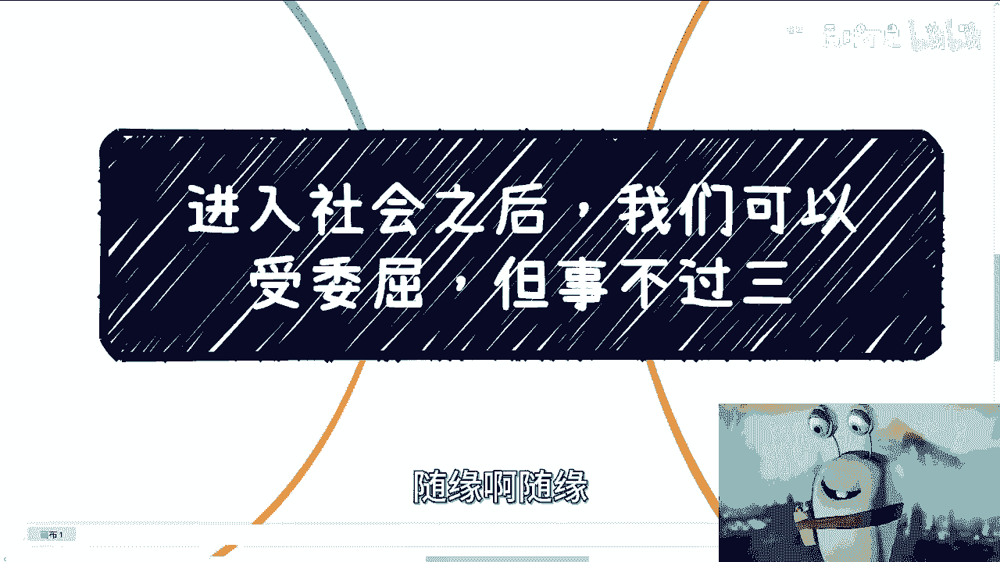