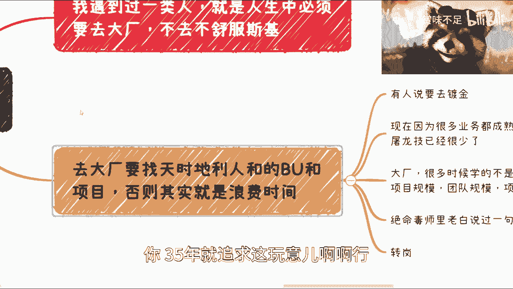

# 职业选择指南 P1：大厂还是小厂？ 🤔

## 概述

在本节课中，我们将探讨一个困扰许多求职者的问题：职业发展初期，应该选择进入大公司（大厂）还是小公司（小厂）。我们将分析两种选择的利弊，并提供一个清晰的决策框架，帮助你做出更适合自己的选择。

---

## 核心观点分析

上一节我们概述了课程主题，本节中我们来看看关于选择大厂的核心观点。许多人持有一种执念，认为职业生涯中必须进入大厂，否则人生就不完整。这种想法需要被理性审视。

所有事物都有其时代周期。就像20年前月薪8000元非常可观，而今天可能只是普通水平一样，“大厂”的价值和内涵也在随时间变化。大厂本身及其能提供的价值都在不断演变，但许多人并不关心这些变化，只是盲目追求“大厂”这个标签。

如果你决定进入大厂，它无疑会带来帮助，但这需要一个重要的前提条件：**你需要找到一个天时、地利、人和俱佳的业务团队和项目**。你必须明白这个道理，否则可能就是浪费时间。

---

## 选择大厂需要避免的误区

以下是选择大厂时常见的几个误区，我们需要逐一辨析。

1.  **追求表面福利，忽视核心成长**
    如果进入大厂后，你只在一个边缘业务部门，那么你可能只是享受了更好的办公环境、下午茶、夜宵和打车补贴。如果你职业生涯的黄金三到五年只追求这些，那格局就太小了。

2.  **为“镀金”而“镀金”，忽视实质内容**
    “镀金”的前提是加入好的团队、参与好的项目。如果没有这些，你所谓的“大厂经验”只是一个空壳。随着时间推移和年龄增长，这段缺乏实质内容的经历在面试中的加分项会越来越弱。

3.  **误以为大厂仍有大量独家“屠龙之技”**
    过去大厂有价值，是因为很多业务只有大厂能做，有巨大的学习空间。但现在很多业务已经成熟，真正核心、能积累顶尖经验的项目（“屠龙之技”）已经很少。在一个数万人的金字塔里，只有极少数人能接触到这些核心项目。

---

## 进入大厂的正确目标

那么，进入大厂的正确目标应该是什么？上一节我们指出了误区，本节我们来看看应该追求什么。

进入大厂本质上不是为了那个光环，而是为了**学到在小厂无法获得的东西**。你需要将几年的工作经验内化，形成自己的认知和能力，而不是仅仅把“我在大厂待过”当作一句空洞的炫耀。

在大厂，你应该追求的是：
*   **大规模项目的运作经验**：学习如何管理、协调超大型项目。
*   **复杂团队的管理与协作**：体验跨地域、跨国团队如何高效合作。
*   **超长流程的规范与优化**：理解在人员众多的环境下，项目流程如何设计与管理。

不要单纯地认为进去只是为了“积累技术”，这远远不够。

---

## 决策的核心逻辑

这个逻辑类似于美剧《绝命毒师》中老白对儿子小本说的话：读大学的意义不仅在于那一纸文凭，更在于向用人单位证明，你是一个**遵守纪律、能静下心来完成一项长期任务并取得结果的人**。

同理，大厂经历的价值，在于它向招聘方**潜在地证明**你可能具备小厂员工所缺乏的某些特质，例如处理复杂问题的视野、规范的工作流程意识等。然而，这只是一个“敲门砖”。如果在面试中你无法展现出这些特质，那么你的大厂背景也就失去了意义。

当然，找到“天时地利人和”的项目需要机遇。这里的关键策略是：**先占坑**。无论是考公还是求职，都是先获得位置，才有后续的机会。但请注意，“占坑”之后绝不能躺平。如果进入一个舒适区后就停止成长，那么未来发展的责任需要自己承担。

---

## 保持开放与变化的思维

我们讨论了具体策略，现在让我们从更宏观的视角来看待这个问题。当下的时代处于一个过渡期，给出“学历一定重要”或“大厂一定好”这种绝对结论是没有意义的。

但人们的选择逻辑往往是一致的。就像有人抱怨HR用学历筛选人不合理一样，我们自己选择大厂的原因也无非是觉得它“更牛”、“更稳定”，而嫌弃小厂“风险高”、“钱少”。我们需要尽量理解对方的立场，避免双标。

**最重要的是，观念一定要与时俱进。** 我们今天（例如2023年）的认知，到2025年或2030年可能就会过时。我们的思维模式深受父母、前辈和过往经验的影响，但其中很多观念可能已经不再适用于快速发展的当下。社会在进步，我们的关键认知也必须随之更新，不能停留在过去的经验里。

---

## 总结

本节课我们一起学习了关于选择大厂还是小厂的决策思路。

我们首先分析了盲目追求大厂标签的误区，指出必须找到核心团队和项目才能真正获益。接着，我们明确了进入大厂的正确目标是获取小厂无法提供的规模化、规范化经验。然后，我们揭示了这类决策的核心逻辑类似于一种“能力信号”，关键在于入职后的持续成长。最后，我们强调了保持思维开放、与时俱进的重要性，因为任何选择都没有绝对答案，必须结合时代背景和个人规划来考量。

记住，选择本身不是终点，如何在选择之后持续学习和成长，才是决定你职业高度的关键。