# 选择大厂or选择小厂？ - P1 - 赏味不足 - BV1oY4y1Q71k

嗯好大家好啊，那个我知道啊，就刚刚因为也有很也有很多朋友看到我，B站发了一个状态对吧。

就是我说今天晚上呢，其实我跟一个体制内的朋友也是朋友推荐吧，介绍我聊了很久，我觉得我悟了啊，我又悟了，我我吐一样了啊，然后但是这个东西呢，我我没法在公这种公开平台上跟大家讲好吧。

回头我嗯反正我会融入到后面的内容里面好吧，我只能这么说啊，这个我就不能跟大家说，你看啊这个话是我讲的对吧，那那不行啊。

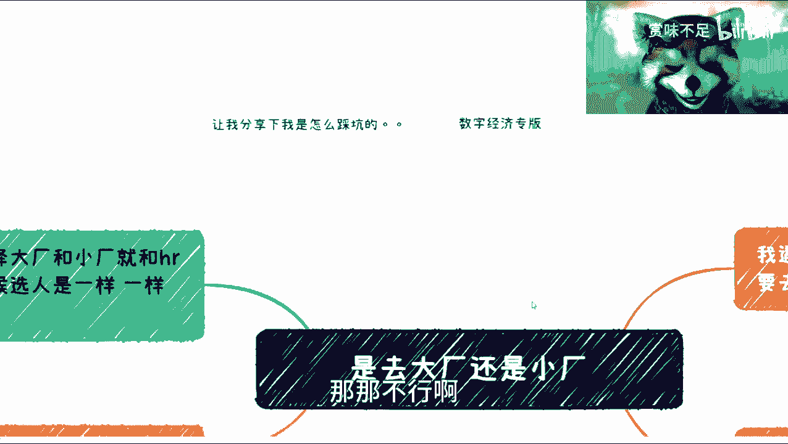

是这样子的啊，就是然后那个前之前的那个评论我看了一下。

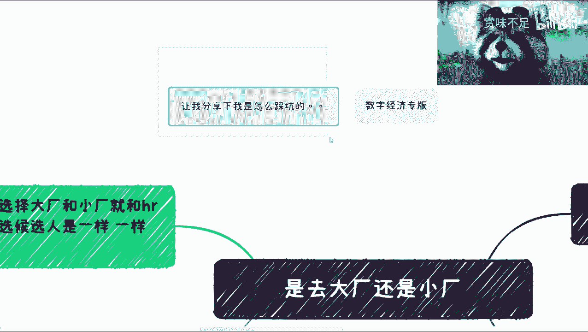

就是有朋友说这个关于我什么踩坑呢对吧，就是因为我以前也是个菜逼，当然我现在也是个菜逼是吧，呃这个呢我觉得我哎也没什么好说的，以前的事也没什么好说的，我觉得我可我我可能会说一下。

就是我现在做的事情跟看待问题的一些看法，一些方式好，大家可以参考哦，另外一方面呢，就是说我会开一个数字经济的专版，我统称先叫数字经济吧，好吧，数字经济，然后这个东西呢我可能会想一下。

我怎么去说这个东西啊，就是，可能会挂过前两天发的那个数据大数据局呃，大数据数据局对吧，然后可能还会跟其他各个行业来说一下，这个数字经济的一个情况，包括呃可能比如说就业啊，民生啊对吧。

但是这块东西呢因为现在也比较早也比较早。

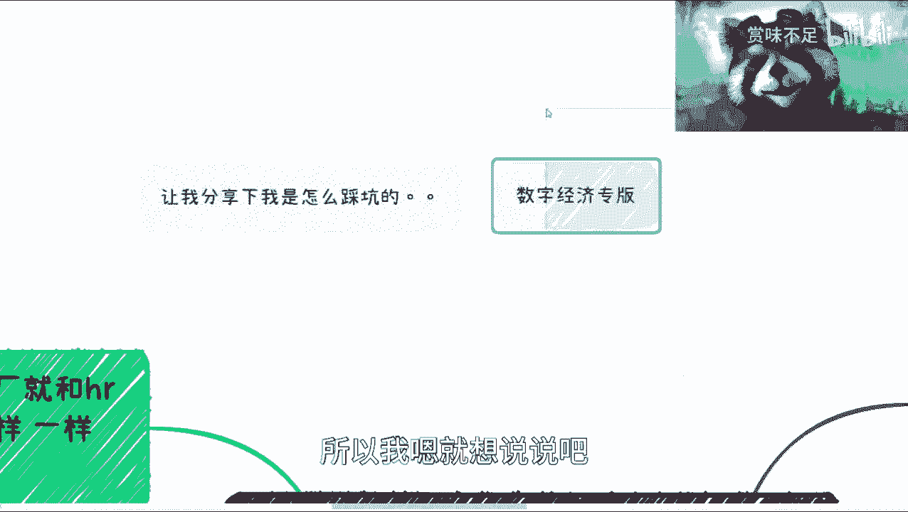

所以我嗯就想说说吧，说说我想管吧，嗯但这期呢我觉得是这样子的，这期我主要是会说一下，就是因为很多人会纠结嘛，就是说啊我到底是去大厂还是去小厂对吧。

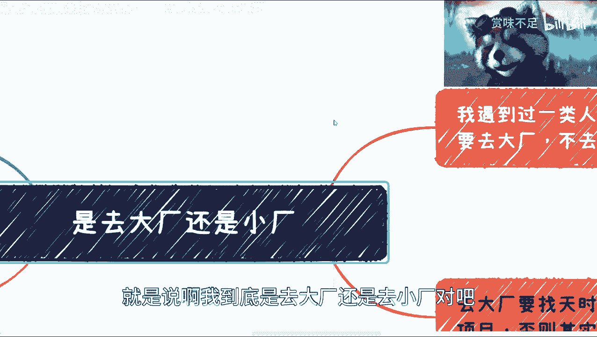

我觉得这个是很纠结，我上期也说了，嗯我说一下吧，就是这个点是这样子的，第一呢我其实我遇到过一类人，而且其实蛮多的，嗯我表示其实嗯我就不是很赞同，为什么呢，因为他们就觉得呢，我人生当中必须要去趟大厂啊。

我不去就不舒服对吧，我必须要吃，我也不知道他们去了干什么是吧，就是我每次我会问他们，我说那你们去了干嘛呢对吧，他说我就要去啊，这就是我的执念，我不去就不叼我，这就很对吧，哎呀我也不知道为什么。

但是呢我跟你们说啊，这个事呢是这样子的啊，就是呃所有的事情呢，它都是有个时代周期的对吧，这个就好像什么呢，就是我们举个例子啊，这就好像你比如说20年前对吧，你说我这个月薪是8000块钱对吧，那很牛对吧。

没问题啊，这个20年后对吧，8000块钱，那那可能就是一般性啊，一般性啊，那么你说这个事情你怎么去看待呢对吧，就是八八千块钱，你从面上面来讲，就像我觉得很多人说这个大厂是一样的，就是我们说好大厂也好。

BT也好，它只是一种说法，一种称呼对吧，你说它内部在变化吗，一定在变化啊，包括大厂本身的这个给予大家的价值，也一定在变化，但是呢我觉得就是很多人他并不并不care对吧，他就觉得。

我他妈就必须要去，那我也无解了是吧，然后呢我觉得这一点呢我跟大家分析一下啊，就是去大厂呢，我觉得你如果要去哪，你说去了之后有没有帮助，我觉得百分之1万有啊，但是它有一定的区。

有一定的这个一个一个前提条件是什么呢，就是你缺大厂，其实你得找到一个天时，地利人和的业务团队以及项目啊，你一定要明白这个道理，否则其实就是浪费时间，为什么呢，因为很简单的，你去大厂嗯。

你比如说一个大厂几万个人对吧，你过去你去了一个边缘业务方，一个项目方，那你过去干嘛呢，你过去就说嗯我心情蛮好的对吧，我pk就蛮好的对吧，我福利蛮好的啊，下午有下午茶喝对吧，晚上还有什么夜宵对吧。

什么打车还有补贴对吧，你要是追求这个呢，我觉得啊也不是不行啊，也不是不行，但是你你说你吃大厂，我打个比方，你大部分人可能也就，我估计也就做个35年对吧，你35年就追求这玩意儿啊啊行。

那那我也不说啥对吧，你就这格局啊啊呃我这个地方分区问一下啊，第一呢我觉得有人要去镀金，镀金的前提是什么呢，镀金的前提是你得有一定的就是说啊好的，就我这边写的好的团队，很好的项目，因为你没有好的团队。

好的项目，你其实镀金镀不了金，因为你镀的无非就是你有一个大厂的经验，但是呢随着时间推移，你很有可能在面试的时候，你还是过不了面试的，你会发现，而且随着你年龄的增增长。

其实这个经验对你来讲是越来越没有帮助的，也就没有帮助吧，就越来越嗯，这个这个不是那么大的加分项啊，这是第一个，第二个呢就是说我们也一定要明白，以前大厂为什么这么有价值，是因为有非常多的业务。

小厂是做不了的，对不对，那么你只有去了大厂，你才有很大的学习空间啊，但是当下情况我相信大家也都明白对吧，就算你们比如说还没毕业，或者来说可能这个这个这个工作呃，这个做的时间还不长了，但你们一定会明白。

就是说现阶段的很多业务其实都成熟的对吧，就是我们今天还在，我还在重庆跟他们开玩笑，我说现在什么情况，就是没有困难，要制造困难对吧，没有需求，制造需求对吧，没有bug，我们制造bug是吧对吧。

但是呢你说现在真正好的项目及屠龙记，已经很少了，也就是说你现在去，你能积累到真正核心的经验和核心的项目，我不是说没有，但是很少，也就是说一个金字塔里面6万人，10万人能真正获得屠龙之技的。

能真正体验好的项目的，就那么些人对吧，那你说你进去你能学到什么呢对吧，那这是第二点，第三点呢我觉得这个大家去呢一定要明白，就是你去本质上不是为了镀金，因为你去你一定要学到东西啊对吧。

你把你这个你你把你这个这个这个叫什么，就是说比如说几年的工作经验，要融汇到你这个人里面对吧，这就好像我今天来给你们讲视频的时候，我总不会跟你们说，来那个我以前在大厂，我很牛逼，好一句话结束了有用吗。

没有用的对吧，没有用的，我一定会我一定要把这个就是说所见所闻对吧，我的这个成长，我所跌过的坑，我要把它总结出大，总结成大家能理解的语言对吧，然后呢能表达给你们什么，你们才能明白我，否则我就跟你们说。

我在大厂，我很牛逼，你们就当我是吧啊，然后这是一年啊，然后呢，所以说我觉得大家都明白，就是说在大厂里面啊，我们要的是什么呢，是在小厂没有办法得到的一个整体的经验对吧，包括项目规模。

比如说你项目规模大了之后，到底怎么来运作的一个大的团队对吧，一个不同的可能甚至在不同的地域，不同国家的团队对吧，然后呃由于这个这个人很多，那么他们项目流程拉长之后，什么样子的，你得去学习这些东西对吧。

不要一味的跑进去说好，我是来积累积累这个这个这个技术的对吧，你这看脸并卵啊，连冰冷，然后呢我觉得这个地方呢我就是想到了，就是之前绝命毒师里面老白说的那句话嘛，就那个小本对吧，小本一开始就问他。

他说他说我为什么要去读大学是吧，然后那个老白就回他，他说你一定要明白，读大学不是说你这4年拿了个学历对吧，这不是重点，重点是他老白当时怎么说呢，老白说的是你是会告诉你的用人单位，你是一个遵守纪律对吧。

以及能静下心来读书，能够读出一个结果的这么一个人对吧，其实你们要明白，就是说他很多时候不管是我们说呃读书也好，还是说是工作也好，你要的是什么，他都不是这么一个结果，包括很多人觉得你大厂出来。

他还是就是潜台词，为什么hr觉得你好，或者来说这个人觉得你好，给你个面试机会，是因为他觉得你可能会拥有这一部分，小厂没有的东西，但是一旦你面试过程当中，让他们觉得你没有这个东西。

那你在不在当场who care对吧，who care啊，然后当然了，也有很多人说，那你天时地利，人和这个东西不是你想要就要的对吧，好没有问题啊，没有问题，我告诉大家，所有东西都一样的，先占坑你。

你不包括考公也是一样的，所有事情全部先占坑啊，你先占完坑才有机会啊，才有机会，你不占坑，什么机会都没对吧，我觉得这就是这一点，但是呢你不能说啊，那个陈老师说的对吧，这个事情先讲课好，你就记住这句话啊。

然后你是占坑，占完坑哎，进去之后发现嗯这生活蛮舒服的对吧，这工资也蛮舒服的，好躺平，这后面的事我不背锅啊。

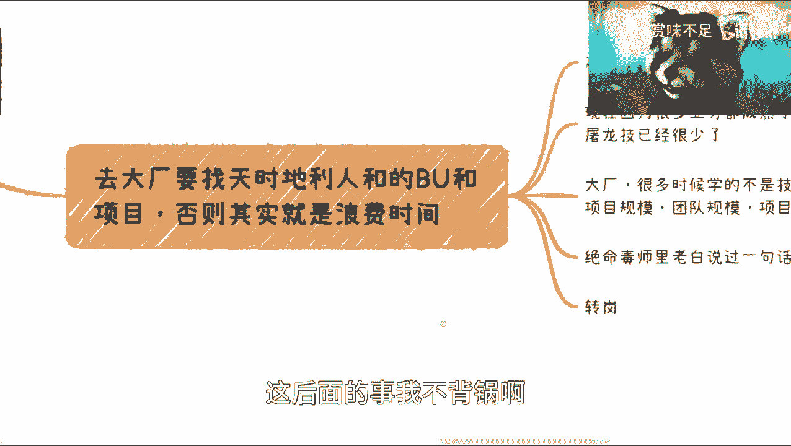

跟我没有关系啊，哈哈对吧，然后呢就是呃当然在这个地方呢。

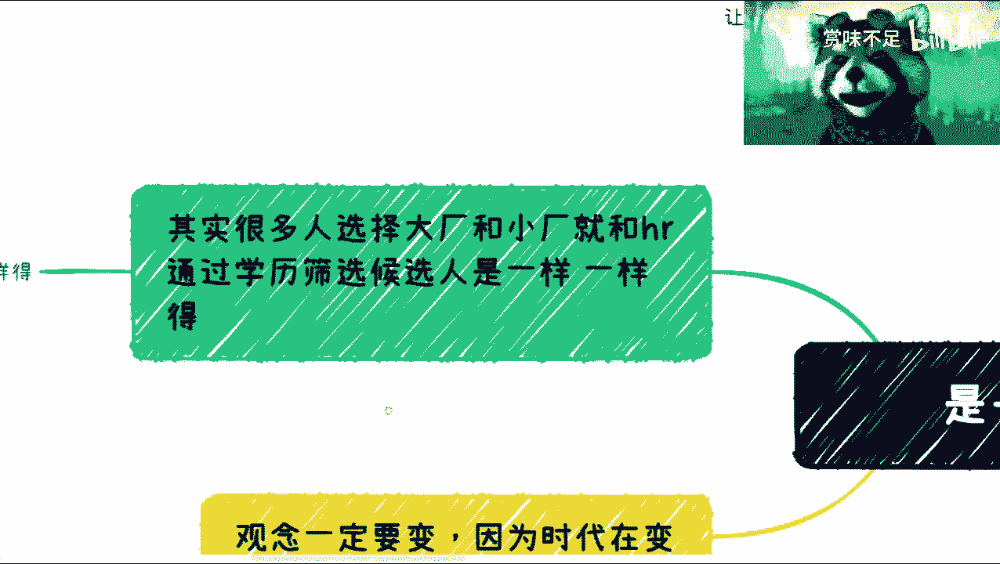

我也提一点，就是说当下它是一个就是说嗯，时代的一个过渡嘛对吧，咱说了这么多期了，咱不能来说学历重要或就学历一定重要，或者一定是这个这个这个这个工作经验重要。

或者一定大厂好，一定小厂好，这种结论是没有意义的对吧，但是呢你会发现就是当下呢它还是一样的，就是说你大家很多人会抱怨说，哎呀hr怎么通过学历筛选候选人是吧，这个这个学历好的人未必牛逼，一些原因不好的人。

未必这个这个这个不咋地对吧，但是你其实选择大厂小厂的时候，所有人思维跟hr是一样的，你会发现就是你为什么选择大厂啊，牛逼对吧，你为什么不选择小厂啊，风险高，给的钱少不是一样的吧。

我跟你讲人和人都一样对吧。

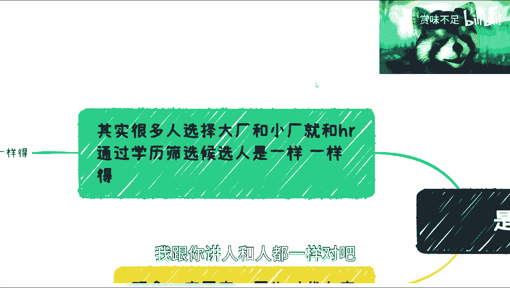

就不能不能双标好吧，不能双标，我们尽量的站在对方角度好吧。

这个啊思考问题啊，然后呢对吧。

就最近也跟我也有人跟我说嘛，就说找对象什么对吧，找对象这个我跟你讲跟找对象一样一样啊。

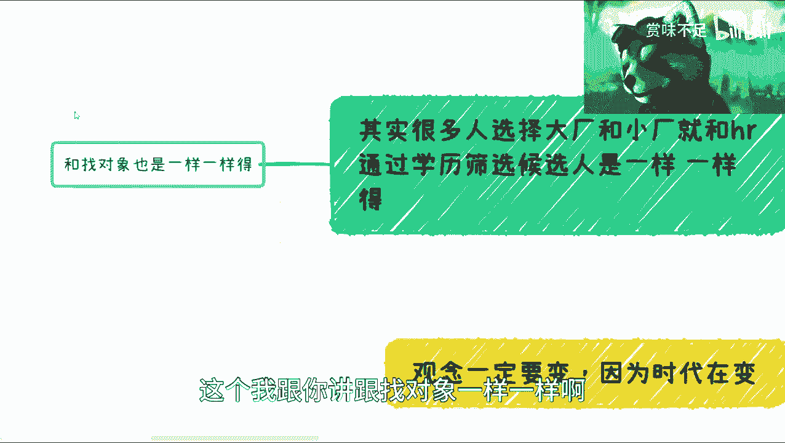

一样一样的，这个回头我再说啊，我觉得这个我也单独拎出来好吧，找对找对象。

我是不是要帮帮大家相亲了，我就想是吧，然后呢我觉得是这样子的，你们一定要明白一点，就是观念一定是要变的啊，因为我们每个人所受到的教育，所所所所就是就是就是身边的朋友啊对吧，你的所见所闻那都不一样。

但是你们一定要明白就是什么呢，就是关键所有东西一定是要变的，呃我们讲出来的东西，就比如说我今天2023年3月15号对吧，在这个叫什么315的时候，我讲出来的东西在当下也许是对的。

但是你放到2025年或2030年，很有可能就不对了，或者说不叫不对就过时了，你知道吧，这所以说这就好像我们父母那一代，我们教育我们可能说啊，你看啊铁饭碗对吧，什么什么啊，计算机这个这个这个赚钱好赚对吧。

这个这个薪资高对吧，然后呢呃这个什么房地产有福利对吧等等等，就是你说他们说的对吗对的。

但是时代是在变啊，就是我们也许潜移默化受到了很多的影响，但是你们一定要明白，那些影响很有可能都已经过时了，你知道吗。

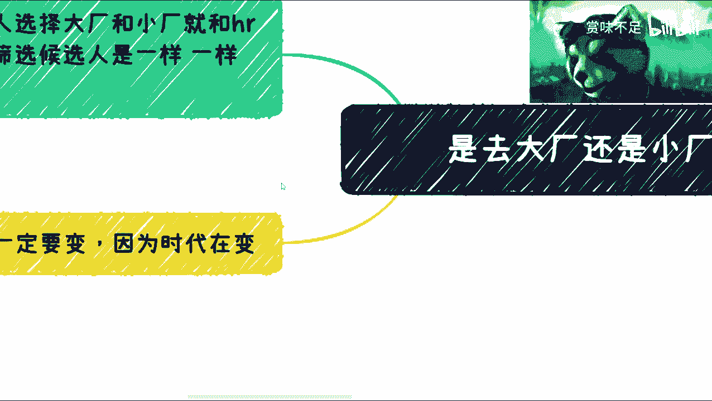

所以你不要就是说就是说因为我最近过渡下来，我就发现了，就是大家都是年轻人对吧，虽然我可能不是年轻人啊，就大家都是年轻人，但是大家的思维模式就让我有种感觉，就有种让我在感觉我跟你们父母在沟通。

也可能没这么老吧，就是在跟你们就是上五届甚至上上十届的那种，这种这种学姐学长沟通的感觉，就是就是社会在进步，时代在进步对吧，但是这个大家关键没有在进步，这点还是让我唉就比较那个嗯好吧。

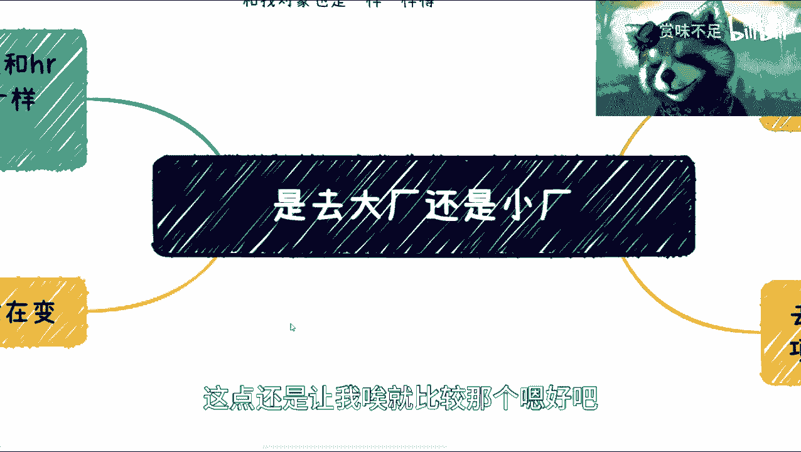

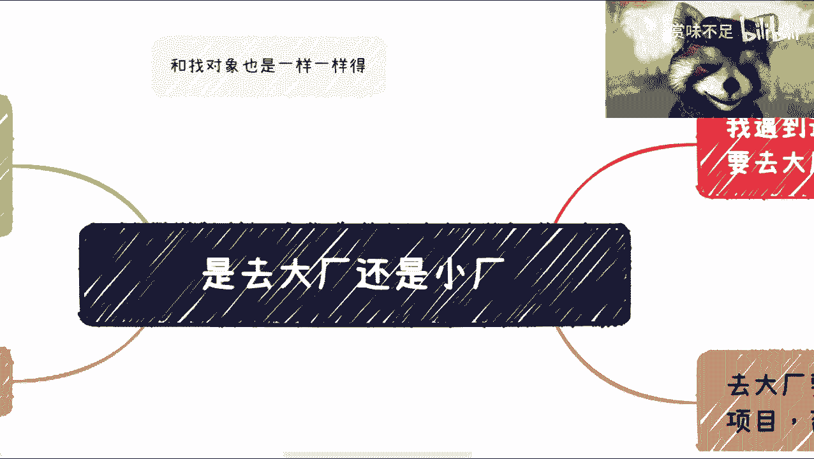

OK啊，然后我我觉得这个问题我先讲到这儿好吧，然后呃我想去在嗯开一个。

就是说那个分享我怎么踩坑的，因为这个事儿呢，就是说我不把我以前的这个故事讲了，这不long long story好吧，回头大家要是有机会线下见到我，我可以线下跟大家讲好吧。

