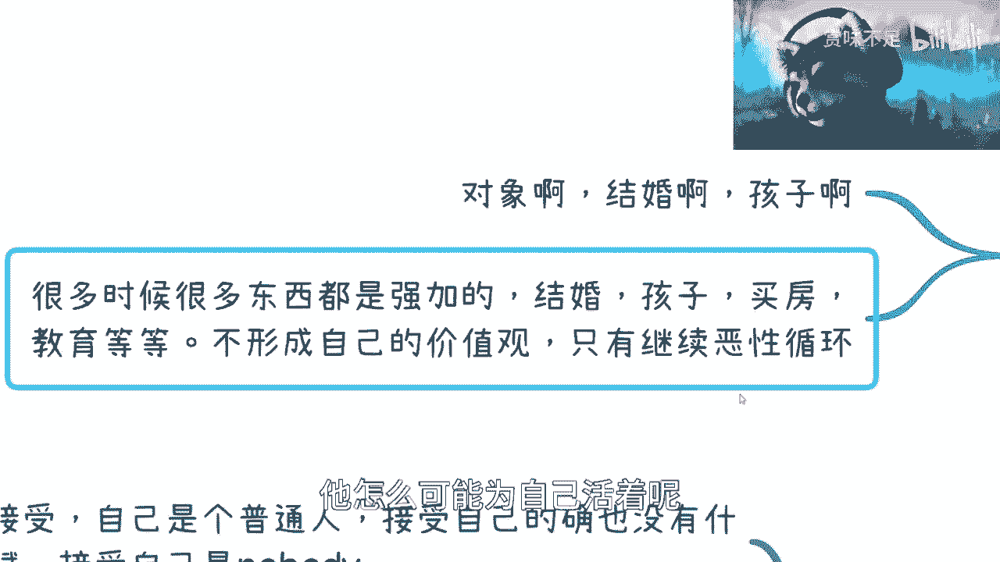

# 选择平淡和折腾都行，核心是为了自己活着 - P1 - 赏味不足 - BV17P411S7Sz

哈喽大家好啊，这个双休日好是吧，看我带了个耳机哈。

这两天呢就看了一下啊，就是这个沟通下来呢，我觉得呃因为大家其实还是想做副业的嘛是吧，除了副业以外，反正核心就是多赚点钱是吧，但是呢我觉得就是说这个事情里面呢，嗯我们讲的是一个起点和一个终点嘛。

但是这个当中其实还有很多细节，所以我就把它慢慢慢慢，到时候拆开来对吧，第一个呢就是说平淡啊或者是折腾，总归我们是二选一的，但其实呢嗯你说是说二选一，但是你比如说平淡里面怎么个平等法对吧。

折腾怎么个折腾法，你肯定里面还得会分对吧，其实没有这么容易啊，而且我觉得其实嗯我跟大家沟通下来呢，我就觉得呃其实很多时候呢我们很多人啊，就是就是可能也是脑子一热对吧，觉得我要折腾。

但其实你们也不见得一定适合折腾，所以说在这个地方呢我就说一下啊。

首先呢就是平淡这件事情不是躺平，也不是摆烂哦，一定要明白这是两件事，比如很多人说我选择平淡了，我就躺平了对吧，我就什么都不管了，那也不行对吧，然后呢其实选择呢我觉得平淡跟折腾。

很多人都有。

对吧很多人都有，但是问题是对吧，往往是一个中间状态。

就是说你要真正做到其实蛮难的啊，我在这个地方给大家列一下。

首先第一个呢就是我们选择平淡对吧，打个比方全平台，第一点呢就是你自我接受对吧，你说自己是个普通人对吧，接受自己也的确没什么天赋对吧，接受自己是个nobody，这个事呢就跟我当时一毕业的时候对吧。

我记得我有一天站在十字路口啊，然后我就在想啊，我呢这个既没天赋技能树对吧，也没有任何的一技之长啊，然后谁也不认识对吧，就按照三体里面火鸡的认知，我可能连只火鸡都不如是吧，那但是呢对于我来讲呢。

因为我属于一开始就觉得就说我不想接受，反正我不管我就不想接受对吧，我要接受呢，我就也躺平了是吧对吧，那这是第一个，那那也不是说躺平吧，就打打工对吧，就平淡一点也没什么不好对吧。

第二点呢就是啊不去讨好别人对吧，也不要为别人的眼光所烦恼，更不要为这种就是互联网里面的，各种各样的这种这杂音对吧，就看到花花好像人家成功了啊，我同学成功了对吧，我成了你们没卵用，我跟你们讲啊。

那这个时候呢你小伙伴就要问了，他说吕老师是不是普通人，很多人都很难做到这一点，因为本质上我觉得就是这个没有选择平淡，你知道吗，就是说什么意思呢，就是说其实很多普通人，他是很难不讨好别人的对吧。

也很难不为别人的眼光所烦恼，他总归还是会就是说啊这个叫什么焦虑，焦虑这个对吧，想想那个对吧，其实内心波动还是有的，不管他表面上能不能表现出来啊，但是呢我觉得就是说这件事情就是什么呢。

就是如果你还不能做到这一点，那就说明你其实没有接受自我，你也没有真正选择平淡，你知道吗，就是你还是在这还是在那边做斗争呢，啊就是你最多就是说你的这个语言上，不停的在pua，觉得啊自己要去选择。

但其实你还是会care，但是你一旦care，我跟你讲，你的就很多事情就不行了，就就就你可能做判断啊，做选择可能都会就就走上错的那个那个选择，然后还有一点呢就是说啊你不要去羡慕别人，你知道吗。

就是因为我身边有非常多的案例是呃人很强的，然后人能力也很好的，然后想法也很好的，但是正因为他是其实不停的去性命捕猎任，所以呢就是说做的选择会比较偏颇，然后就就一直也不走自己的路。

因为哎呀很多时候就是当局者迷嘛，你知道吧，就是你走着走着走着呢，可能你觉得哎呀好像我没什么积累对吧，好像我就是一直在这个就沿着别人的路在走，但其实等你回过头去看，已经35年已经过去了。

或者甚至10年已经过去了，这个时候就比较烦了，你知道吗，那这一个另外一个呢就是你也不用有太多追求，就是说呃你选择了对吧，你说你选择了这个平淡，那你就不要有太多想法啊，我就想着说我要这个我要那个对吧。

然后你想嘛很多时候就是因为你要了很多对吧，然后导致了你内心的不平静，导致了你要各种焦虑啊，各种烦，其实你要知道所有的情绪在比如说当下，打个比方啊，比如说你们跟我见面对吧，然后聊了半个小时。

当下你觉得都没有问题，你知道吗，就是但是问题在于这些情绪它是24小时，可能24小时乘365天伴随整理的，那么这个就很有问题，因为他只会就是他只会拖延你拔剑的速度，你知道吗，哦那么这个是那个。

然后还有呢就是这不是躺平啊，千万记住就是平淡，你也是要去就是该学习学习，该争取争取该怎么样怎么样，只不过就是说你要在你的，就是就符合你的这个当下能力的这个框框内，对吧，或者说符合你自我认知的框框内。

让我去做一些争取啊，去做一些进步啊，这样子，然后就是不是眼不眼高手低啊，因为你过于的就是自我，这个夸大或者自我妄妄自菲薄，我觉得都是不好的啊，好吧，然后我觉得这个是第一个吧。

然后第二个呢我们讲个故事对吧，就是我以前嗯折腾一段时间之后，就是其实大家也都知道嘛对吧，就是有些小伙伴知道我以前是做什么的对吧，我以前这个跟清华大学出版社对吧，合作也也有个十几年了对吧。

就我以前其实后悔过，就是我有时候觉得很累对吧，然后就想着说爱打打工不开心吗对吧，或者不打工随便做点什么对吧，满足当下的一些这消费需求不就好了嘛对吧，就就非要去想着什么什么房子啊，消费啊对吧。

一个人活着蛮开心的，你知道吗，就有时候会会想啊，就是你会想着说，如果我不折腾，可能我比如说很多时候是另外一种生活啊对吧，另外一种样子啊，或者怎么样子，其实都都有可能的，我觉得这是第一个啊。

然后第二个呢我觉得就是说如果不折腾呢，其实我觉得这样可能也不会焦虑啊，也不会想太多，因为嗯很多时候要知道啊，就是你知道的太多，你看到的太多，其实也只会让你更焦虑的越多。

因为你会发现你跟别人的差距越来越大啊，而且很多时候这个大是没法弥补的，嗯我最早其实我最早认知到自己，就是说完全这没有天赋，没有普通，就是只有普通人的，这个点是在于就是我以前视频里面有提到过。

就是我第一份工作的同事，就是他是当时谷歌办全球开发竞赛，就google code jm嘛，就google code jam全球应该是前20，还不是前25的，反正一个开发。

然后我就觉得因为他年纪没比我大几岁啊，就真的加大几岁啊，最多55556岁吧，了不起，然后我就觉得这种人，就是这不是我这辈子的问题，我下辈子都不能赶得上，就我那个时候其实就就我刚毕业出来。

我就已经清楚的认识到我是我是一个垃圾对吧，我我没法跟这种人去相提并论，就人家是有天赋技能的，我是没有的，那如果我没有天赋技能，其实我就会觉得我肯定是不适合，就是说去就因为在我看来。

我我去单单纯纯去打工或者做什么，我是很难去做到一个就是金字塔上层的，就我我可能一毕业时候就已经认识清楚了，所以说这也是为什么我一毕业就会选择说哎，我可能在外面折腾折腾点东西啊对吧。

折腾点副业或折腾点别的，因为我已经知道，至少我当下这条路不适合我，那别的是不是适合我不知道啊，那我得出去浪啊对吧，你不出去折腾，你怎么知道这个哪条路适不适合你啊，是不是，那这是第一个，最后一个呢。

就是说对从我个人来讲呢，其实可能很多时候啊就是说我想平淡，但是呢我可能又不甘心于平淡，你知道吗，所以说真正的平淡是平淡不下来的，那自己可能接受不了自己这种状态，就是你让我去好好打个工对吧，然后平淡的做。

那先不说这个最后会不会被优化，或者最后会不会被淘汰掉，这个咱先不是说啊，就真的这么做呢，可能我觉得你让我嗯因为我以前读书的时候，我就最大的愿望什么，就是下午六点钟回来开始打开ps 4 ps 5对吧。

就开始玩，一直玩到晚上都开心了是吧，但是嗯你要说现在真的啊，比如说到今天是如果是这样的话呢，那当然了，今天其实我现在白天也每天在家打游戏是吧，但是呢就是说你要真的说啊，这个打工对吧。

然后每天晚上回来打游戏的，那我其实可能就会更焦虑对吧，因为因为因为很简单，因为以前不懂嘛，那现在可能就会觉得说啊，这个工作不一定保得住啊对吧，那如果那个做不下去了，那我是不是某一天就就找不到工作了。

对吧，什么样子啊，这个是二啊。

然后哎呀我我这个三啊，三在这里说折腾啊，折腾呢就在这地方说的，比如说副业啊，创业啊对吧，赚快钱啊，我觉得都算折腾啊。

呃但是呢就是你会发现有一个点吧，就是折腾也好。

平淡也好，你得自己就是真正的找到你自己明白的那一点，你不能follow别人，你知道吗，你比如说呃就像你你平淡也好，你选择折腾也好，如果你只跟随别人，我跟你讲没有用的啊，你早晚都会。

就是就其实其实你你就这么说吧，就是说你感觉你在往前走，其实你感觉你在进步，但其实你还在原地踏步，就没有用的，你知道吗，那这是第一个，第二个呢，你会发现往往折腾呢真的很少说是能赚到钱的。

因为这个就跟这个投资曲线是一样的，就是你今天赚到钱没问题的，但是你要从你这个长时间来看，很有可能比如说你今天是赚到钱了，半年后你又投资又亏进去了对吧，最终可能你的总的就是亏钱，跟贷款可能也会数不胜数。

真的就是你一定要清楚，在这件事里面，尤其是尤其是用钱，因为很多时候很多时候就是你们看啊，所有咨询我的时候啊，我私下跟他们讲的时候，我你你你但凡咨询过我的人，他们心里都清楚。

就是我可能在一个小时两个小时的时间里面，我会起码有过三四次，五六次，七八次不停的跟他们强调说，在未来的3~3~5年里面，你一定要抓住现金，你千万千万不要就是觉得说啊，我今天看到个东西对吧。

比如说这个刘老师做了个项目，我觉得特别牛逼是吧，然后就像救命稻草一样对吧，然后就觉得哎呀，我手上反正有个闲钱，10万块钱，15万的投进去不行的，我跟你讲，千万不要啊，没有。

就是就是当你觉得一个东西是救命稻草的时候，我给你讲，大概率99。9999999%，就是骗人啊，然后这是一个，然后那个折腾吧，呃我觉得很多人呢又不是那种豁得出去的，你知道吧。

就是说他有他有那种就是说想折腾，但是呢他又不愿意，就是呃，我们说就说他又不愿意，把自己的整个三观跟价值观放到一个，真正的就符合这个世界规则框框里面的，这么一个方式。

他就是说还是把自己封闭在这个象牙塔里面，那你就会发现就是很多人，我发现有些小伙伴跟我咨询的时候，也是他要折腾，但是他又豁不出去，你知道吧，他就觉得啊这个我帮他已经框好了，我说哎你看商业这个世界规则。

可能是这个边边框框在这个地方，他说不行啊，我做不了对吧，那你又豁不出去对吧，你也不是很自律，你也不能说啊，就是比如说折腾啊，不是折腾那个咨询我的时候对吧，大家很认真的咨询完了啊，就感觉嗯躺平了是吧。

你又不豁不出去，你又不很自律，就是上不上下不下你，你还憋着他，真的你你要第一步，就是先先就是强迫自己去那个做到这些，因为所有的人折腾的，他都是人家都是说就是不择手段对吧，豁得出去的，然后非常自律的。

你连这些都做不到，你跟人家怎么去拼了对吧，怎么去pk呢，是不是，那那只是一个，然后很多时候呢我跟你说不是要自私啊，我跟你说很多人分不清楚啊，他就觉得啊这个我要自我对吧，我要自私，不是的，我跟你说。

很多时候不是要自私，需要让你自己有能力去判断，就是别人说什么，是别人说什么，你得自己去判断，你不能像个长长墙边草一样去去倒对吧，然后很多人又又就很喜欢那种二二极管嘛，就是他就觉得啊，你既然这么说了。

那我就要自私对吧，自私就是我什么都听不进去也没用的，你知道吗，就是不管你走哪个极端，你都是没法进步的，你一定是要就走到一个一个正常的道路上面，你知道吗，就是说你你听各种小道消息，就是你会发现啊。

就是如果你没有自己的判断能力，不管你是去躺，就是那个平淡也好，还是选择折腾也好，你还是不知道方向在什么地方，你还是会去听各种小道消息，其实这种时候你会发现你依然是个韭菜，你知道吧，就是就像我说的。

你你感觉你在折腾，你感觉哎，我是不是在我现在主页外面开一条副业对吧，我好像很牛逼是吧，怎么样，但是没卵用，我跟你们讲哦，然后折腾本身呢，我跟你说，你的朋友一定是越来越少的，因为很简单嘛。

就是你正在希望让自己，从那80%的群体里面脱离出来，前往那20%的人群，那么这个时候你身边的朋友从八二原则来讲，必定是80%为多的，不可能有多少是20%的，剩下20%里面还有多少人能够认可你。

剩下跟你交心的就更加少了，所以说你会翻新越来越少对吧，而且我跟你说，由于时代时代的发展，你们父母要理解你更困难，更不几乎是不可能的啊。

然后就是这里就是呃回过头来讲，这个是四啊，四回过头来讲就是说呃平无论啊，你们记住，无论是平淡也好，折腾也好，都是为了做自己，是为你自己活着的，你知道吗，就就简单来讲，就是说你会发现有很多的选择。

你是很无奈的对吧，包括你当下想过自己的生活，你也很无奈的，那其实你无论是选择a还是选b，还是选择一些其他的导入，你就是为了让你更好的去做选择，为了更好的去就是活着。

为为自己活着，不是为别人活着，你说很多人纠结于的是这个活着的意义，其实我觉得意义不是很重要，因为并不是每个人都能寻找到意义的，但重要的是什么呢，你要为自己活，而不是而不是为别人活。

更不是为更不是为了别人的价值观或者眼光活，你知道吗，就是因为啊因为很多这种事情吧，就是属于那种你跟他讲的时候呢，大家都很懂对吧，那你碰到这个事情的时候呢，就是就脑子不清楚了对吧。

就是那种就是为别人加班啊对吧，为别人的眼光啊啊，就他觉得我比如说我今天做了些什么事情，我就担心他好像啊，这个是不是会我觉得我怎么样怎么样，那别人觉得你怎么样无所谓啊，能觉得你怎么觉得你好。

觉得你坏怎么了呢，中国14亿人，他妈全球这么多人呢，都觉得你好，觉得你坏吗，无所谓啊，你知道吗啊，这是第一个就是第二个呢，就是如果你们选择平淡对吧，活着啊，不是不是不是这里啊，我比如选择了平淡对吧。

选择了折腾，最终还是身不由己，那可能你就说这两个都不适合你啊，你可能有别的一些道路，就是因为这两个只是极端嘛对吧，这当中可能还有一些就是这是平衡的地方，但是平衡了之后，前提是你得自己认清楚自己对吧。

那么可能中间某些平衡的情况是你适合你的，那么你就需要去探索这个属于你自己的路，你知道吧，这个是第二个，第三个呢就是说你本身就是开心对吧，能自己做选择，而不是说面对很多无奈对吧，你明明想选a。

你非要选b对吧，那你也没办法对吧，很多时候呢我跟你说，你觉得累对吧，觉得焦虑对，你可能会问你自己为什么做这些对吧，包括加班啊，应酬啊，喝酒啊对吧，这个你图什么，我跟你讲，这个时候呢你就是更要想明白。

就是说你当下也许啊，我们说你当下觉得哎我自己没有能力对吧，我自己还呃不够强势，怎么样怎么样，但是我跟你讲这些都不重要，重要的是你一定要自己做出的选择，因为你要这么想，你人生的每个阶段。

你你相教育你的参照物不一样，你都会觉得你不够强势，你能力不够，没有能力够的那一天呢，没有你足够强势那一天的对吧对吧，你要想就是一山更比一山高，哪里有自己强势的那一天，就算今天马云都不会觉得自己很强势。

他照样有人比他更强势，对不对，所以说呢，这个事情，就是说你就是你不要去管你自己到底怎么样，而是说你一定要让自己在当下就做出改变之说，我一定要做出个选择，这个选择就是我他妈就不加班对吧。

我就不应酬怎么了呢对吧，我不加班，找不到工作吗，那找不到工作的确是我的问题，那我得抢就强大我自己对吧，那我不应酬怎么了呢，我他妈绕过你啊，绕过你地球不转了吗，我难道找别人不能合作吗，对吧。

就是很多时候是有选择的，而不只只不过就是说你在用一些外界的这个，价值观在p v你自己啊，当然了，最后呢就是说你别觉得这个年龄大不大，我跟你讲没有什么年龄大不大的哦，就是唉就是你要用我话来讲吧。

就是你今年20岁也好，40岁也好，60岁也好，很大的一个问题在于你得让自己活明白，如果你活不明白对吧，或者你最后都不是为自己活的，等到你，比如说这个折腾不动了对吧，精力不够了，身上落了一大堆病对吧。

或者怎么样子，你剩下的只有后悔，我跟你说，很惨的很惨的，然后呢这个事儿呢，我觉得啊，就是说这个折腾或者来说这个平淡的事情啊，就其实适用于所有人所有的事情，就比如说你找对象啊，结婚啊，孩子啊其实都一样啦。

就是你你自己去想，你到底是想要什么样的对吧，你想要什么样的婚姻，你想要什么样的呃，怎么怎么样的这个孩子的教育对吧，因为很多事情都一样的，就是你要的高，但你又够不到，那你就会焦虑，你就会很烦对吧。

那你要的你你索性可以都不要对吧，那你还要逍遥自在是吧，但是问题是就是说你得看你自己到底想要什么，要记住啊，不是你父母想要什么，不是你朋友想要什么，也不是网络告诉你想要什么。

就是所有东西都是很多东西都是周边的，加强加于你的，你别老觉得这些事情，你的认知就是这个世界的，就固有的三观不存在的啊，这个世界的确有它的边界，也有它的规则，但是不是你们听到这个样子的啊。

你们要自己去摸索，一定不是这个样子的哦，就是或者这么说吧，你们所听到的那些，都是80%的老百姓摸索出来的，而这些老百姓摸索出来的东西，是无法让你们突破你们现在的阶层的，你们一定要明白这一点，你知道吗。

所以说呢就是说包括结婚啊，孩子啊，买房啊，教育啊，就是你要去摸索形成自己的价值观，而且你要为了你自己活着，你要就是自己通过一些实践，通过一些沟通，最终来确定确定你的价值观，而然获取去实施去往下走。

否则你想想看，很多时候都是别人强加于你的，你在强加于你的孩子对吧，那么他只有就是你们的整个生活，只有一个恶性循环，因为你没有为自己活着，他怎么可能为自己活着呢。

对不对，嗯行吧，我看看我录了多久啊，嗯差也差不多好吧，然后那个反正一样的好吧，大家就是这3年吧，我觉得就这3年吧，大家多多多积累积累啊，多这个探索探索摸索摸索啊，然后有任何创业上的任何的呃。

这种叫做职业发展啊，包括其他的方面，反正你们也可以私信好吧，私信我咨询我，反正b站都是同一价格好吧行。

