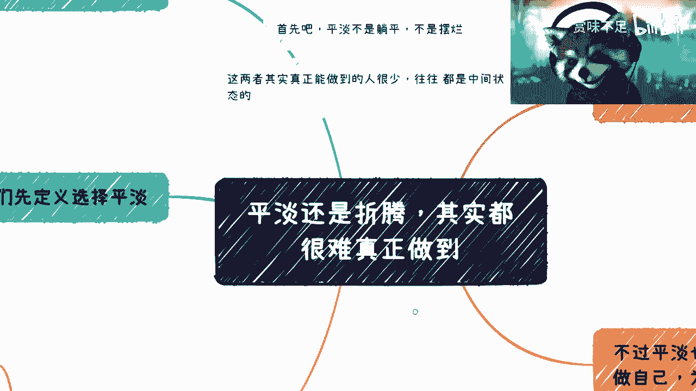
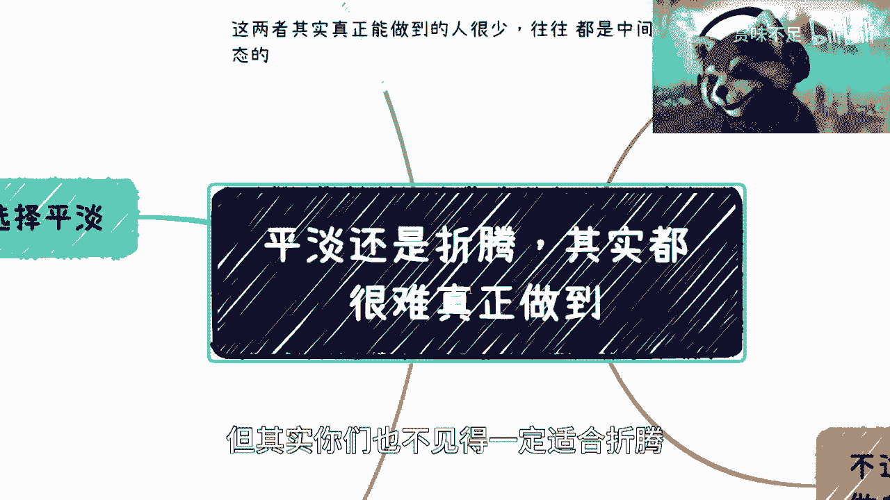
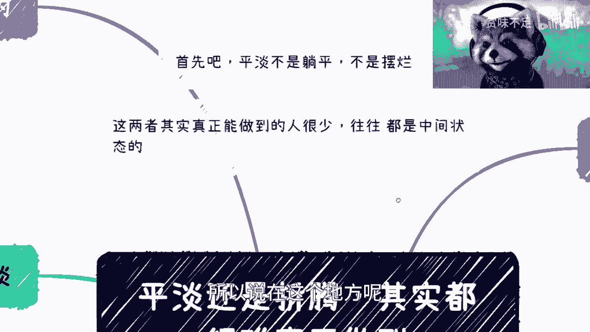
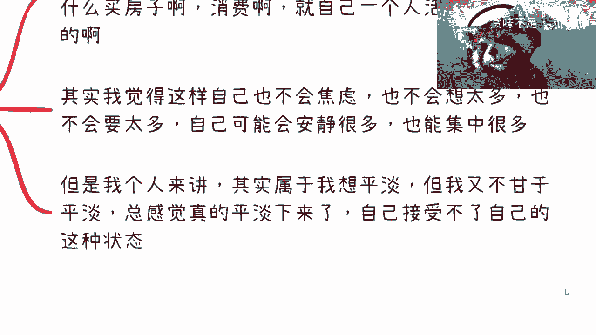
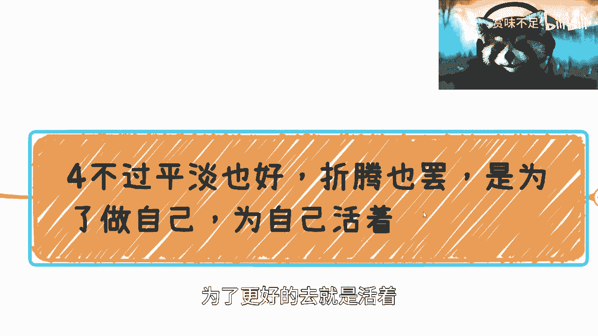

# 选择平淡和折腾都行-核心是为了自己活着---P1---赏味不足---BV17P411S7Sz_not





在本节课中，我们将探讨一个核心的人生议题：如何在“平淡”与“折腾”两种生活态度之间做出选择。我们将分析这两种选择的真实含义、所需的心态以及最终目的，帮助你理清思路，找到真正适合自己的生活方式。




---


## 一、起点与终点：选择的本质

上一节我们提到了人生选择的起点和终点。本节中我们来看看“平淡”与“折腾”这两个看似对立的选择，其本质是什么。

很多人认为这是非此即彼的二选一。但事实上，无论是选择平淡还是选择折腾，其内部都有更细致的划分，并非一个简单的决定。

**核心公式：**
```
人生选择 ≠ 简单的（平淡 或 折腾）
```

---

## 二、理解“平淡”：绝非躺平

很多人将“平淡”误解为“躺平”或“摆烂”，这是完全错误的。真正的“平淡”是一种主动选择的生活态度，它包含以下要点：

以下是选择“平淡”生活需要做到的几点：

1.  **完全接受自我**：承认自己是个普通人，接受自己没有非凡的天赋，接受自己目前可能是个“nobody”的现状。这是心态的起点。
2.  **摆脱他人眼光**：不刻意讨好他人，不为别人的评价而烦恼，不被互联网上的各种成功故事和杂音所干扰。如果做不到这一点，说明内心并未真正接受“平淡”，仍在挣扎。
3.  **停止羡慕他人**：许多有能力的人，因为总是羡慕和追赶别人，反而走上了不适合自己的道路，多年后才发现积累错了方向。
4.  **降低过剩欲望**：选择了平淡，就要控制不切实际的欲望。过多的“想要”会导致内心焦虑和不平静，这些情绪会长期消耗你的精力。
5.  **保持积极行动**：平淡不等于不作为。它意味着在你的能力认知范围内，持续学习、争取和进步，做到脚踏实地，不眼高手低。

真正的平淡，是在认清自我后，一种内心平静、目标务实、持续精进的生活状态。

---

## 三、为何有人无法“平淡”？

理解了平淡的内涵后，我们来看看为什么对一些人来说，选择平淡如此困难。



1.  **心有不甘**：许多人内心并不甘心于纯粹平淡的生活。即使理智上想选择平淡，情感上也无法接受那种可能缺乏挑战和变化的状态。
2.  **认知带来的焦虑**：当你知道得越多，看到与他人的差距越大，且这种差距难以弥补时，更容易产生焦虑。例如，意识到自己在某些领域毫无天赋，可能促使你放弃“打工晋升”这条路，转而寻求其他可能性。
3.  **安全感的缺失**：即使想过平淡的打工生活，也会担忧未来的不确定性，如失业风险，这种不安全感会让你无法真正平静下来。


因此，无法平淡往往源于内在的不甘、认知冲突或对未来的忧虑。

---

## 四、理解“折腾”：副业、创业与风险

现在，让我们把目光转向“折腾”。这通常指副业、创业、赚快钱等主动寻求变化和突破的行为。

选择折腾，意味着你主动跳出了舒适区。但这条路同样有它的逻辑和陷阱。

以下是关于“折腾”需要明白的几点：

1.  **必须源于内在驱动**：你的折腾不能是盲目跟随他人。跟随别人的道路，最终很可能发现自己在原地踏步。
2.  **认清赚钱的概率**：折腾很少能稳定赚钱。这类似于投资曲线，短期盈利不代表长期成功，总账亏损是常见情况。**核心原则：在未来3-5年，务必抓住现金，不要将任何项目视为“救命稻草”。**
3.  **需要“豁得出去”**：想折腾，就必须愿意打破原有的三观和舒适区，将自己置于真实世界的规则中。如果既想折腾，又不愿改变，自律性也不足，结果往往是“上不上下不下”。
4.  **培养独立判断力**：折腾不是要变得自私，而是要培养独立的判断力。不人云亦云，也不走向“什么都听不进去”的极端。没有自己的判断，你依然会是信息的“韭菜”。
5.  **接受朋友变少**：折腾是一个试图从80%的群体迈向20%群体的过程。你的观念和行为会发生变化，导致与多数旧朋友渐行渐远，同时，家人也可能更难理解你。

折腾是一条孤独且需要强大内心和行动力的道路。


---



## 五、核心目的：为自己而活 🌟

无论平淡还是折腾，都只是手段，而非目的。本节我们来探讨所有选择的最终指向。

**核心目的公式：**
```
所有选择（平淡 / 折腾 / 其他） => 为了“为自己而活”
```

1.  **活着的意义在于“为自己”**：人生未必都能找到宏大的意义，但重要的是为自己而活，而不是为别人的眼光、价值观而活。别人的评价无关紧要。
2.  **探索属于自己的道路**：如果觉得平淡和折腾这两个极端都不适合，你可能需要寻找中间的平衡点。这需要你更深入地认识自己，探索独一无二的道路。
3.  **拥有选择的权利**：感到累和焦虑时，要问自己为何如此。无论是加班还是应酬，重要的是，这是否是你**自己的选择**。你可以选择“不加班”、“不应酬”，但前提是你要为这种选择带来的后果（如提升技能、寻找新机会）负责。永远不要用外界的价值观来PUA自己。
4.  **年龄不是限制**：无论20岁、40岁还是60岁，关键是要“活明白”。如果始终不是为自己而活，等到精力衰退时，留下的只有后悔。
5.  **应用于所有人生大事**：这个原则同样适用于找对象、结婚、教育子女等。你需要想清楚自己**真正**想要什么，而不是父母、朋友或网络告诉你该要什么。形成自己的价值观并去实践，否则生活只会陷入恶性循环。

你所听到的多数建议，都来自80%的普通人，这些建议很难帮你突破现有的阶层。你必须亲自去摸索、实践，形成自己的生存哲学。

---

## 六、总结与行动建议

本节课中，我们一起学习了“平淡”与“折腾”两种生活态度的真实内涵与要求。

我们明确了：
*   “平淡”是积极的自洽与精进，而非消极躺平。
*   “折腾”需要内在驱动、强大执行力并接受孤独。
*   无论选择哪条路，**核心都是为了“为自己而活”**，形成独立的价值观，并拥有做出选择并承担责任的勇气。


**行动建议：**
在接下来的时间里，建议你多积累、多探索、多摸索。对于职业发展、创业或其他人生困惑，可以积极寻求咨询和交流，但最终的决定，请务必基于你对自己的清晰认知。


请记住，你的生活，主角是你自己。