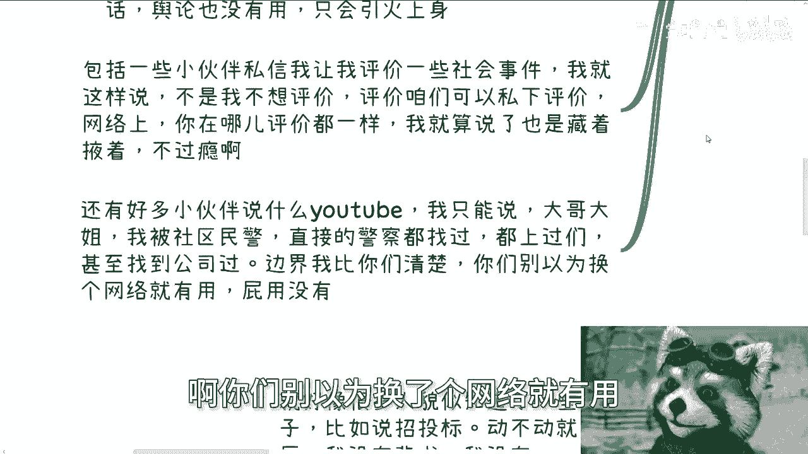
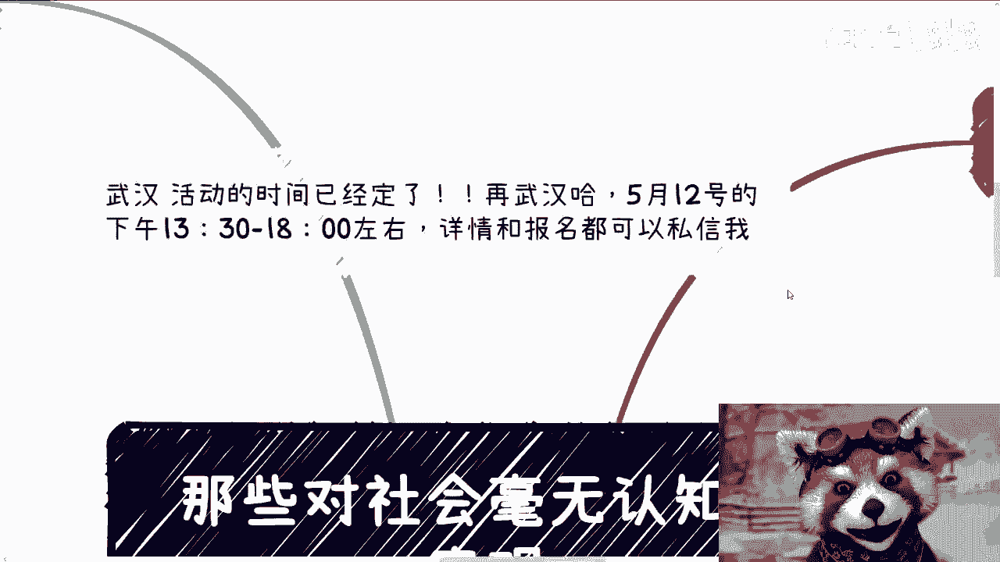
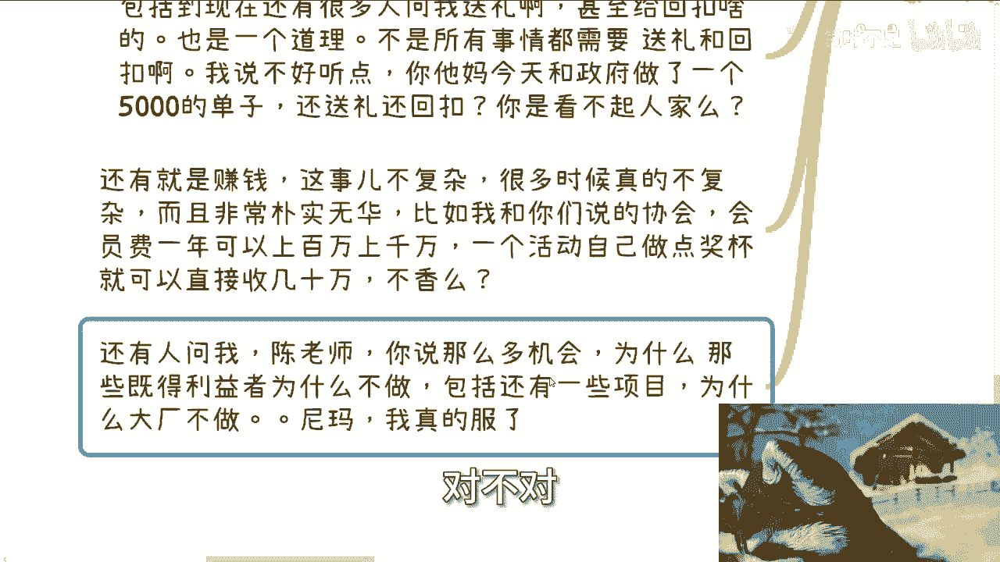
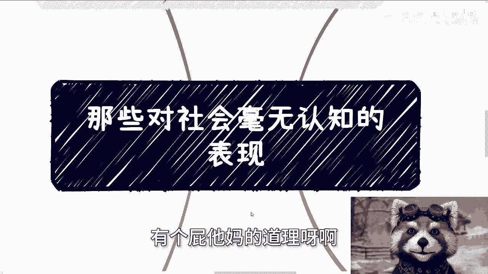
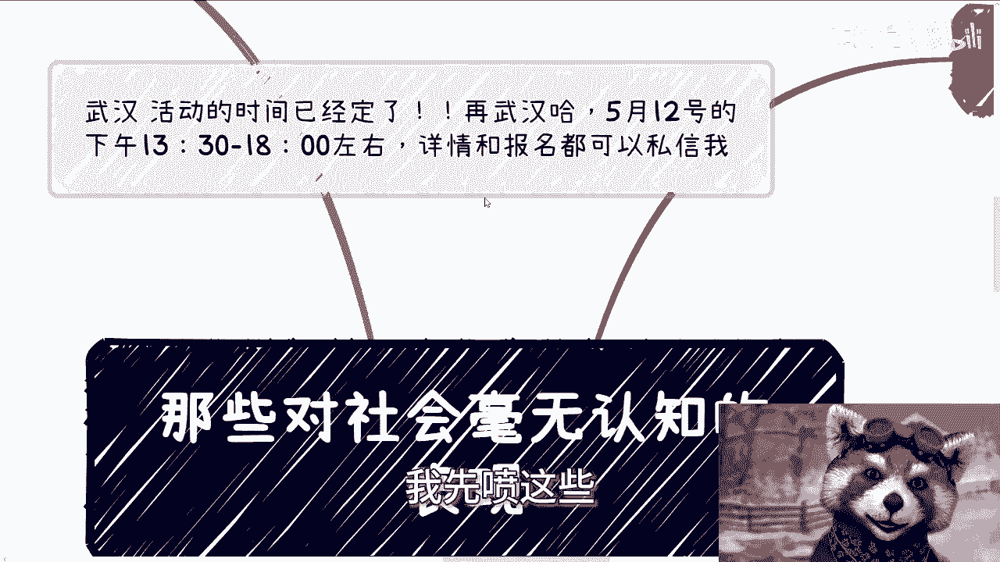

# 那些对社会毫无认知的表现 - P1 - 赏味不足 - BV1uz421D7hL

啊大家好啊，武汉的活动时间已经定了好吧，在武汉，在武汉5月12号，12号下午01：30到六点左右好吧，详细详情和报名你们可以私信我啊，然后今天我们来讲的呢叫做什么呢。

叫做那些对社会毫无认知的表现啊。

我也是一时兴起啊，呃我跟你们讲，我写这个x MAD真的很随意，但是我发现就算很随意，也他妈的是真东西特别多，他妈真的喷不完，你知道吗。

就真的我跟你讲好多好多根本说不过来啊，你比如说很多年前啊，就大概三个人吧，就我以前同事啊，但可能呢好久好久不说话了啊，突然之间找我啊，虽然不是不是借钱，但也很让人无语，就是一些比如说跟我说啊。

陈老师我被被被骗了对吧，p two p啊，或者一些项目欠款啊对吧，让我帮忙散播一下，希望舆论能有一定效果，我跟你们就这么说啊，先不说找我说的时候，就他们没有没有给我证据啊，他妈的屁证据没有啊。

我们以前认识过，就就就就或者怎么说呢，就说难道我们以前认识过，我就会相信你们一面之词吗，那不可能啊，对不对，另外就是说我真的能让他们拿出证据，拿出来都是些什么鬼啊，啊你们知道怎么拿证据吗。

我就跟你们这么说，你们去公证处走一遍公证好吗，你比如说上海，我们之前走公证3000块钱一次对吧，你们去走一遍公证好吧，学习一下，真的就感觉就是说在社会上面每走一步都要教，你知道吗，就唉就很无语啊。

另外就是就算有证据啊，事情来龙去脉相对比较复杂的话，舆论也没有用啊对吧，我帮你去发那关我吊事啊，啊我发现就是找我的人，根本就没想过他妈关我吊事啊，对不对，而且最离谱的是什么，你找我做事情，你要找我帮忙。

你也不给钱对吧，就不知道大家怎么混社会的啊，然后包括一些小伙伴私信我，让我评价一些社会事件，也是的，我就这么说，不是我不想评价，我很想评价好，但是评价咱们可以私下评价你，网络上你在哪评价不都一样吗。

对吧，你让我评价，那我也是藏着掖着，这不过瘾啊，那有啥好评价的是吧，然后还有小伙伴说了什么，发YOUTUBER对吧，那有那我给你只能说大哥大姐啊，我被社区民警找过，我直接被警察找过，我都被上过门啊。

甚至到公司找过任何的边界，跟文跟一些语言上，跟一些内容上的边界，我比你们清楚好吗啊，明白吗啊你们别以为换了个网络就有用。

妈的屁用没有啊，屁用没有。

第二问我学历问题的，我跟你们说，你们知道吗，在社会上学历意味着什么，我跟你讲，你不知道啊，你们不知道，我们来推一下逻辑，你就知道了，首先社会上的人，大家认识，大家接触都是有目的性的，你们看电视剧那么多。

自然知道权势和利益，对不对，那只有权势和利益对吧，你告诉我就是说啊，陈老师，我们今天在社会上碰到一些人，他们不是为了权势跟利益，那他妈都是在过家，家，都是些垃圾，对不对，那你跟我说什么了。

你跟我说垃圾有什么好说的呢，对不对好，然后另外呢就别跟我说交朋友，我跟你讲，你只要但凡去赚钱的，没有什么朋友不朋友的，只有纯权势跟利益，你要过家家，那是你的事啊，别人管不了，你就这么简单，没人为你负责。

只有你自己为你自己负责，对不对，好，那么只要你能满足对方的利益跟权势就行，就能合作，我告诉你，没人关心你的学历，你我跟你说，这么说，你不要去想，就说啊，陈老师说没人关心啊，那个人说有人关心你自己去。

你自己去做一些项目，到社会上去去认识一些人，去做做项目看看对不对，在那边想有什么用啊，啊我妈奇了怪了对吧，我早就跟你们讲了，你们去认识这些人，看看谁没事情做，在社会上跑上来，哎你什么学历。

你什么学校大哥，是去做项目的，不是去应聘的，你知道吗啊，好当然啊，你们在社会上还是会发现，别人关心你学历的时候，我跟你们讲不是没有的啊，不是没有的，比如说你找工作，你应聘岗位对不对，比如说你要去学校。

政府做一些汇报或者咨询或一些演讲的时候啊，比如说你要被包装到某些政府项目，或者说某些这种呃，类似于这种组织类的项目里面，你会发现别人会问你一样好了，重点来了啊，记住啊，重点来了，大哥大姐啊，你们要明白。

要你们学历的时候，你们并不能因为要你们学历就得出学历很重要，这么一个结论，明白吗，听得懂吗，啊你们思考一下啊，我告诉你为什么，因为要你们学历的时候，都是因为需要你们去做工具人的时候。

你明白吗啊比如说你应聘的时候啊，他们要的是你当工具人，比如说你要去做些汇报的时候，他也是需要你当工具人，比如说把你包装到某个项目当中去的时候，还是工具人，你懂了没有啊，你懂了没有。

就是说你都已经要去做商业了，你都要去赚钱了，为什么要做工具人啊，而且我告诉你，中国满地都是工具人，他妈的缺你这工具人了吗，对不对，你不要以为你说二陈老师，我现在不打工了对吧。

我现在好像要要有商业思维对吧，然后他妈的你还在做工具人，你跟打工有什么区别呢，然后还在那边纠结爱创创生，那他们问我要学历，我妈也是搞笑了，真的我跟你讲，真的就就怎么说呢，就是人是要学会变通的。

人是要学会去判断的，你懂吗，你不是死板的说哦，这个地方要嗯很重要，那地方不要嗯不重要，有毛病吧啊另外还有一点记住，需要你一些证明的时候，还说明另外一个问题是什么，那就是你的关系不够硬，或者根本没有关系。

而且说明你积累的关系的手段和渠道，还不够高明，你明白吗，不是的缺学历，你懂了没有啊，懂了没有啊，大哥大姐啊，第三不知道别人要啥，我给你讲啊，到今天为止，可能一些小伙伴啊听我视频的。

他应该知道社会上很多组织和一些人，他是KPI导向的，但这些并不够，因为KPI导向这几个字还是虚的，你还是需要去了解它到底什么KPI，然后他到底要什么对吧，它导向是导向什么样的一个结果对吧。

这你们要去了解，但是你要明白，无论对方怎么包装，对方心里面就是要钱的，你懂吗，就是无论对方跟你说什么样的话术，都是只要钱，别的不要的，谁他妈要别的东西啊，你不能，那不好意思，我就要钱对吧。

那无论谁都一样，当然你碰到就像我说的，你碰到的人里面可能有些人在过家家，那那是因为他们自己在过家家对吧，那那就说明你的社交还没有突破，一般老百姓的瓶颈，那请你继续社交，继续去突破好吗啊，不要去。

因为那些碰到一些对你价值不高的人，就就觉得哎呀好像他妈的，好像这些人也跟我大差不差，那跟你大差不差，关，你吊事啊，对吧啊，而你要知道别人要啥，不是只有通过这个特定的人才知道的，比如说一些组织，一些机构。

你们大可以包装一个业务去找商务，去找销售，多谈谈，一个不行，就找两个，两个不行，找三个，对不对，你多找找啊啊，旁敲侧击去了解，别动不动就跑过去，别动不动就上门，没有用的，你是个老百姓，第四也是也是真的。

我他妈喷喷的喷不动了啊，第四就是纯粹的二极管思维，就是这就好像我们很多人知道了一些词，就他妈乱用啊，就他妈乱用啊，我举个例子，比如说招投标啊，动不动就问我哎呀，我没有学历，没有背书，我没有叉叉叉。

招投标怎么做，然后包括就是说他跟别人聊的时候，别人也会问他，那屁都没有对吧，你学历也不够对吧，你怎么做招投标，别人反驳他的时候，他貌似还觉得很有道理，哎我真的我真的气笑了，你知道吗啊，大哥大姐。

这个社会很复杂，你们真的去了解一下，你们就会明白，或者你们不了解好了，我就这么问你们，中国这个国家是他们每一步都要招投标的吗，你们自己去问问看是吗，啊，你但凡觉得这个国家所有的业务都是招投标的。

真的气笑了啊，哪他妈这么多招投标的项目啊，我告诉你们剩下很多不招投标的项目，我们老百姓能做的多了去了，你别知道个词就他妈乱用，懂吗啊，还有就是做项目，我跟你讲项目与项目之间差别大了去了，什么意思。

意思就是同样是做政府项目，高校项目，你一个5万的单子，一个50万的单子，一个500万的单子，从流程上可以天差地别，从你打理关系的角度也是天差地别，能一概而论吗，啊哦你今天跟别人在那边聊聊一个项目。

然后人家有的人跟你说，哎呀这东西很简单，有的人跟你说这东西很难，你学历不够，你认知不够有意义吗，所有的前提条件都不搞清楚，有什么好聊的啊，有什么好聊的，真的你唉气笑了，真的气笑了。

你包括现在还有很多人问我送礼啊，回扣啊，我跟你讲也是一个道理啊，不是所有的业务都要送礼跟回扣的，大哥大姐，你听得懂吗，你别知道个事就他妈乱做啊，我说的不好听一点，你今天跟政府做了一个5000块钱的单子。

还送礼吗，还还还回扣吗啊你要是真的去送礼去回馈，我跟你讲，你甚至你甚至会让人家政府觉得他妈，你在黑他们啊，怕不是在嘲讽人家，真他妈搞笑哦，还有就是赚钱，我跟你讲，这事真的不复杂，很多时候它不但不复杂。

而且非常的朴实无华啊，你就比如我跟你们说的协会，协会就单纯收会员费，一年可以上百万上千万，一个活动自己做点奖杯，一个奖杯可以收个6000块钱到1万块钱，他也可以直接收几10万，不香吗对吧。

然后每次说到这个东西，就有人问我，那陈老师为什么他们有人会付呢对吧，按照你这个说法，他妈的傻，他们又不是，这是这问题还用问吗，啊我他妈奇了怪了，哎，大哥大姐，你们想想看一个协会在当地有多少家企业啊。

有多少家企业啊，他一个会员啊，会员差不多大概在多少，比如说50加到80家，我就这么问，是不是，的确不是，但是总有吧，啊，哦一个协会挂着政府的title，去薅个50加到80家的的羊毛。

正常吗啦哎你还来问我，哎呀，为什么他们会复，总有人会付的，这他妈还用你，你还要去想这问题干嘛呢，对不对，这就好像你非要来跟我表达你不是，OK我知道你不是，但是你代表中国所有的人吗。

你代表社会上所有的人吗，啊哥哥，我他妈不明白了，我真的是，对不对啊，你要清高，请你坐站到旁边去清高好吗，我觉得就是这样子的啊，还有人问陈老师，你说这么多机会，为什么那么多既得利益者不做。

包括有些项目为什么大厂不做，我又气笑了又气笑了，你知道吗，我就这么跟你讲，大部分的项目它的单价其实都不高，比如说10万20万，大部分的项目它的利润可能也不高，我就真的我知道为什么技校吗。

就是你知你真的知道什么叫既得利益者吗，你真的知道什么叫大厂吗，啊你但凡接触过，你就会明白这些单子他们根本就看不上，好吗啊，他们怎么会去做呢，妈吃饱了撑的哎，我就像我跟你们讲的，他收收会员费不香吗。

他他有非常多躺着赚钱机会不香吗，他为什么要去做这些呢，做这些对他来讲用费时又费力，投入产出比又不高，就像我说的性价比不高，他为什么要去做呢，对不对，你包括非常多的项目，我之前就跟你们讲过了。

你比如说阿里也好，百度也好，他们的销售低于150万的单子不会做，为什么，因为150小于150万的单子，他们没有提成，大哥们对不对。

就是你你们对吧，对这个社会一无所知。

然后被别人一些非常空的话就套进去了对吧，人家就问你诶，那那那那个他们有可能就说了，哎那那这些单词为什么大厂不做，你们想诶有道理啊，为什么大厂不做，有个屁他妈的道理呀，啊哎哟我妈服气了。

我真的是对不对，你你我告诉你们啊，我不管你现在多大，我也不管你学历多高，我也不管你到底读了多少年书，就算是读了50年的书，工作50年，你对社会还是一无所知，你明白了没有，你明白了没有啊。

这跟你去大厂去小厂没有关系，只有读书跟打工的经验，你明白了没有啊，你对整个社会，对整个政府，对整个运作关系一无所知，你懂吗啊，然后然后大部分很多人呢还他妈的不服气，还要还自己，就觉得自己很懂，你懂啥。

对不对，真的我觉得他妈很很无语，你知道吗，然后还有很多人动不动跟我谈什么道跟术，没有什么好谈的，你跟我谈什么道跟术啊啊你我跟你讲，你你去多找多认识一些有钱人，你去多认识一些既得利益者。

你去多认识一些有政治地位，社会地位的谁，他妈跟你谈这些有的没的搞笑了。

真的是好吧啊行，那就这么着，那个哎我先喷这些妈能喷的多去了。

我跟你讲啊，然后那个武汉活动好吧。

就先这么定啊，然后你们要报名的私信我好吧，然后剩下的话就是职业发展，社会职业发展，然后那个商业发展啊，然后合同啊啊啊股权啊对吧，融资啊，包括各个方面啊，包括你现在手上有什么牌对吧，包括你最近碰到一些。

比如说职业规划上的一些问题，好吧，你都可以整理好，整理好，我们在私信呃，走咨询啊。

