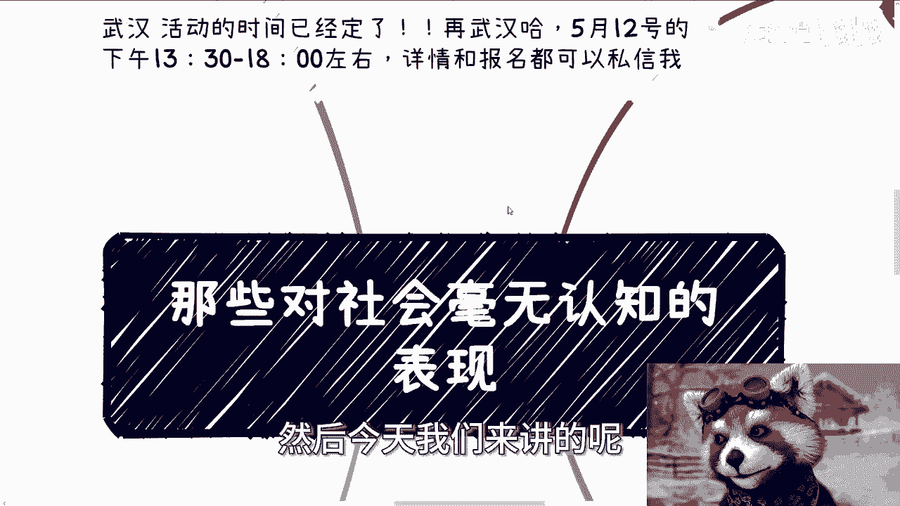
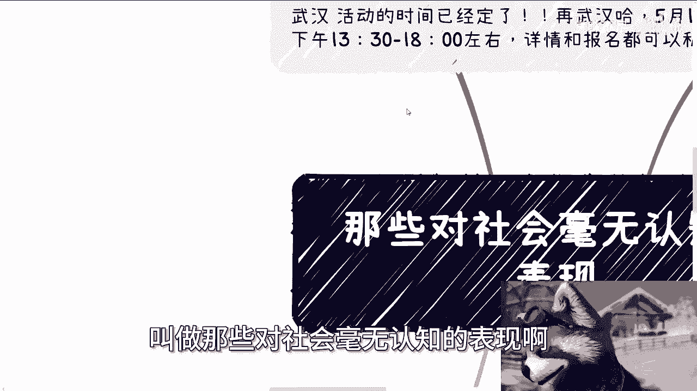
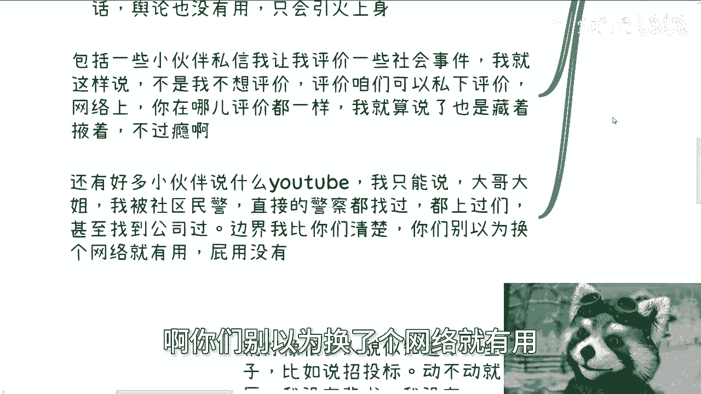
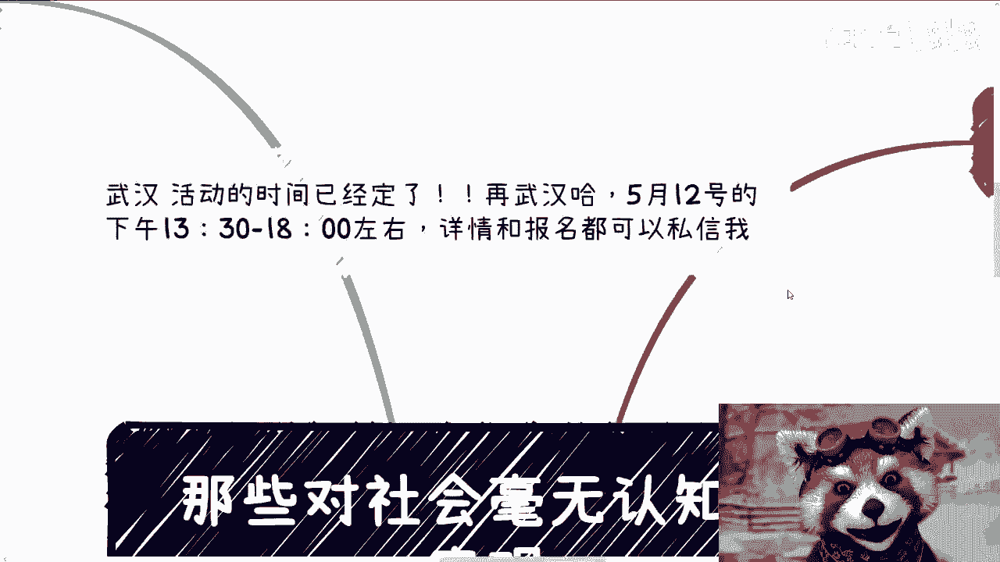
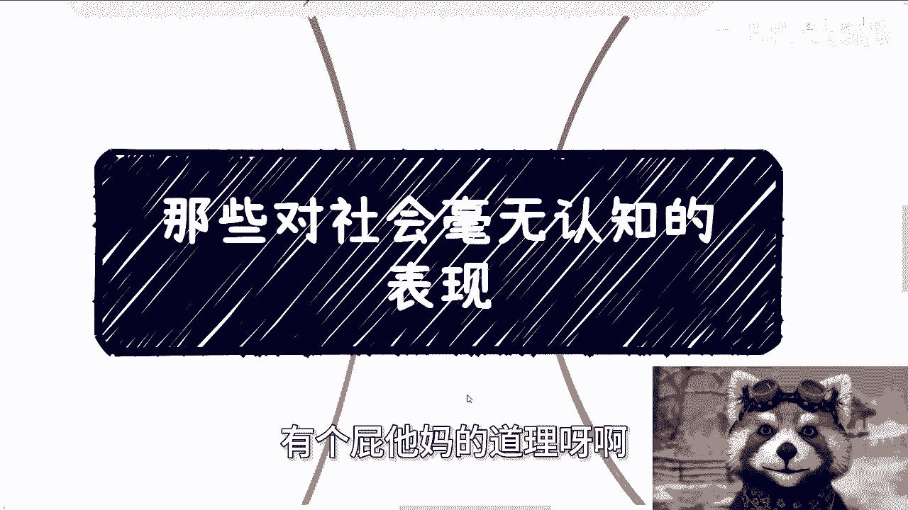
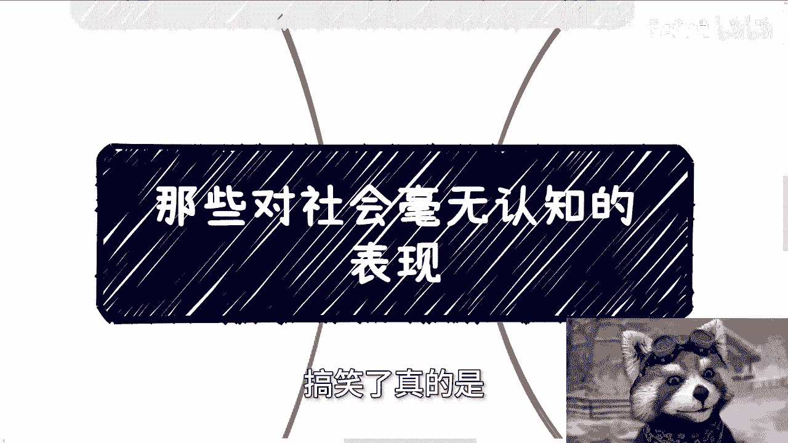
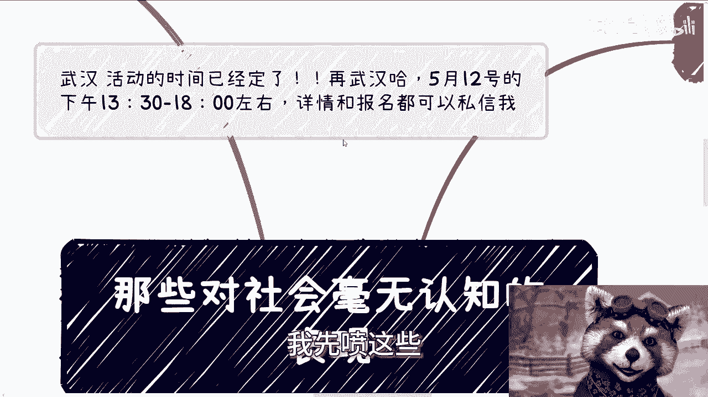
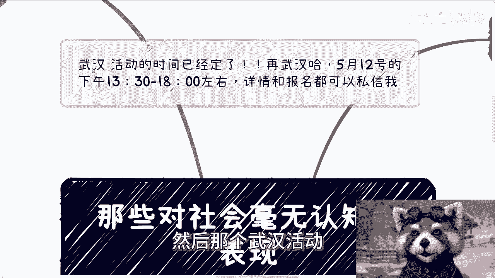

# 那些对社会毫无认知的表现---P1---赏味不足---BV1uz421D7hL

在本节课中，我们将要学习一些在社会中常见的、缺乏基本认知的表现。这些表现往往源于对现实社会运作逻辑的误解或无知。通过剖析这些具体案例，我们可以更好地理解社会的真实规则，避免在人际交往和商业活动中踩坑。

---

## 一、缺乏证据意识与边界感 🤔

上一节我们介绍了课程主题，本节中我们来看看第一种常见表现：缺乏证据意识与边界感。

许多人遇到问题时，会本能地向他人求助，却忽略了基本的社会规则。例如，有人会因P2P或项目欠款被骗，在没有任何证据的情况下，就希望他人帮忙散播舆论。在社会中，仅凭一面之词无法取信于人。有效的证据需要经过公证等法定程序，例如在上海，一次公证的费用可能在3000元左右。即使有证据，如果事情本身复杂，舆论的作用也有限。

更重要的是，请求他人帮助时，需要意识到这“关我什么事”。找人帮忙却不考虑对方的立场和利益，甚至不支付任何报酬，是缺乏社会认知的表现。同样，在网络上请求他人评价敏感社会事件时，也需要理解内容监管的边界。无论使用哪个平台，监管的实质都存在，并非换个网络环境就能规避风险。

---

## 二、对“学历”作用的误解 🎓

上一节我们讨论了证据与边界，本节中我们来看看对“学历”价值的普遍误解。

社会上的人际交往大多带有目的性，核心是**权势**和**利益**。在纯粹的利益合作中，没人关心你的学历。人们关心的是你能为合作带来什么价值，而不是你的毕业院校。

当然，在特定场景下学历会被要求，例如：
*   应聘岗位时。
*   向学校或政府做汇报、咨询、演讲时。
*   被包装进入某些政府或组织类项目时。

以下是需要理解的核心逻辑：

**当对方要求你提供学历时，往往意味着你需要扮演“工具人”的角色。** 无论是打工还是创业，如果核心角色仍是工具人，其本质区别不大。更重要的是，这种要求恰恰暴露了你的**关系不够硬**，或者积累关系的**手段和渠道不够高明**。问题的关键不在于缺少学历，而在于缺少足以绕过这些形式要求的社会资本和运作能力。

---

## 三、不理解他人的真实需求 💰

上一节我们澄清了学历的误区，本节中我们来看看如何洞察他人的真实需求。

许多组织和个人是KPI导向的，但仅知道这个词还不够。你需要深入了解对方具体的KPI是什么，最终导向什么结果。无论对方如何包装其话语，其核心需求通常都是**利益（钱）**。这是商业社会的基本逻辑。

了解他人需求的方法不限于直接询问。你可以通过包装业务、与不同公司的商务或销售人员多次沟通来旁敲侧击。不要轻易直接上门，作为普通个体，这种方式往往效率低下。如果你的社交圈里都是“过家家”式交往的人，那说明你尚未突破普通老百姓的社交瓶颈，需要继续拓展和提升。

---

## 四、简单的“二极管”思维 ⚖️

上一节我们探讨了如何洞察需求，本节中我们来看看一种僵化的思维方式：“二极管”思维。

这种思维表现为知道几个术语就生搬硬套，缺乏具体问题具体分析的能力。例如：
*   **关于招投标**：认为所有项目都必须走招投标流程。实际上，中国有大量业务并不通过招投标进行，普通百姓能参与的非招投标项目很多。
*   **关于项目难度**：忽视项目规模（如5万、50万、500万）带来的流程和关系打理上的天壤之别，笼统地讨论项目“简单”或“难”。
*   **关于潜规则**：认为所有业务都需要“送礼”或“回扣”。实际上，小额业务（例如一个5000元的政府订单）这样做可能适得其反，让对方觉得被冒犯或嘲讽。
*   **关于赚钱模式**：质疑一些简单模式的可行性。例如，一个挂靠政府头衔的协会，向50-80家会员企业收取会费或活动费用，是完全正常且普遍的商业模式。总有人会为此付费，不能因为自己不会付费就否定整个模式。
*   **关于“为什么大厂不做”**：用大厂或既得利益者不做某事来反证某事不可行。这忽略了不同体量主体的**性价比**考量。大厂销售可能对低于150万的订单没有提成，因此根本不会关注。很多利润可观但单价不高的项目，正是大厂看不上、而适合中小玩家切入的机会。

---

## 总结 📝

本节课中我们一起学习了四种对社会缺乏认知的典型表现：
1.  **缺乏证据意识与边界感**：求助时忽视证据和对方立场。
2.  **误解学历的作用**：将“工具人”场景下的要求误读为学历的普遍重要性，忽视了社会关系和运作能力的核心价值。
3.  **不理解他人真实需求**：无法洞察商业交往中对方对核心利益的追求。
4.  **简单的“二极管”思维**：用几个术语生搬硬套复杂的社会现实，缺乏具体分析的能力。

对社会认知的缺乏，与你读书多少、工作年限或在公司大小无关。它源于你对整个社会、政府及多方运作关系的真实逻辑缺乏了解。提升认知的关键在于走出臆想，通过实践去接触、观察和参与真实的社会运作。