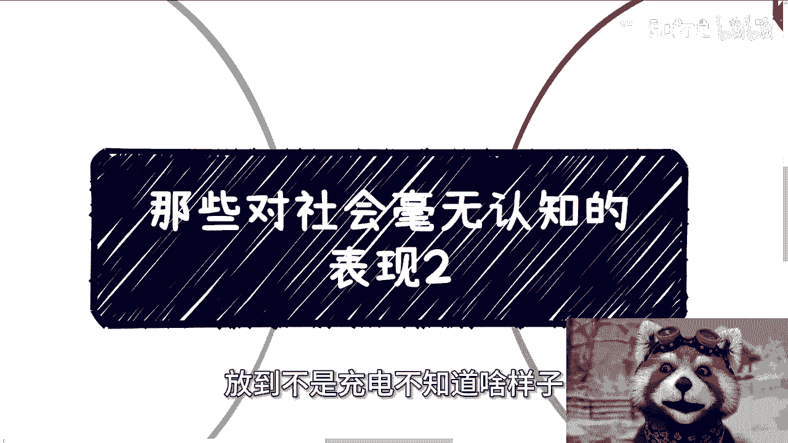
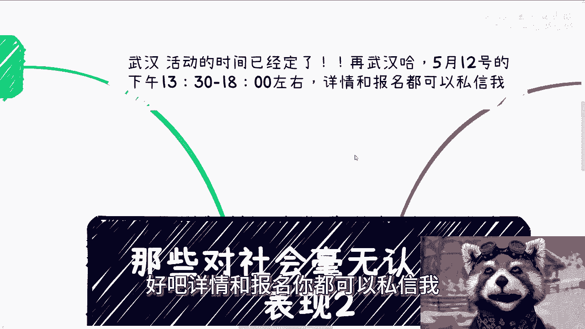
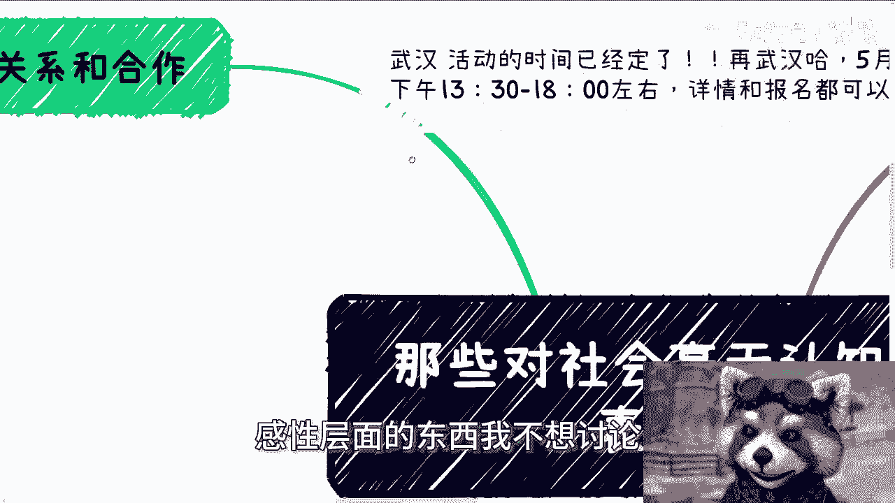
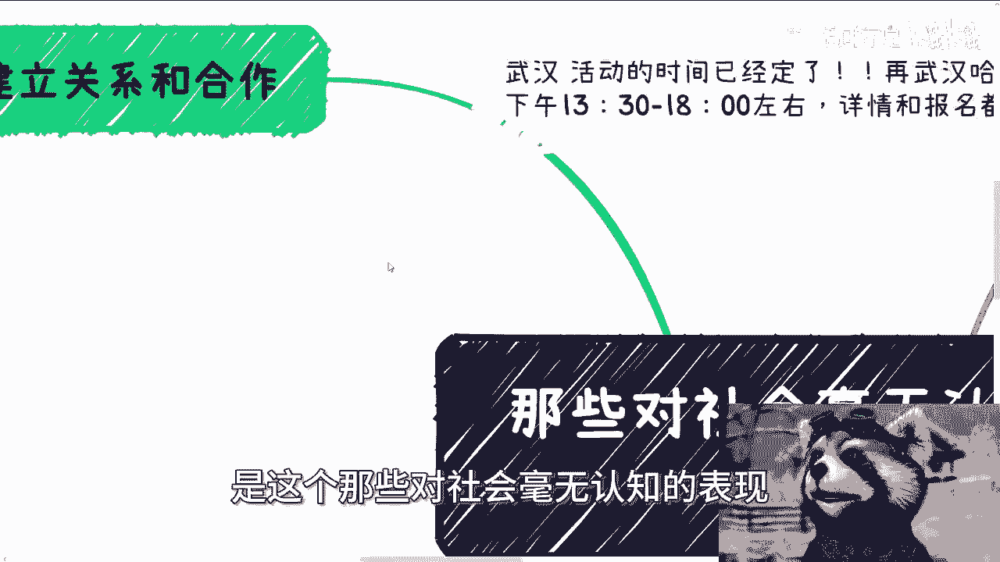
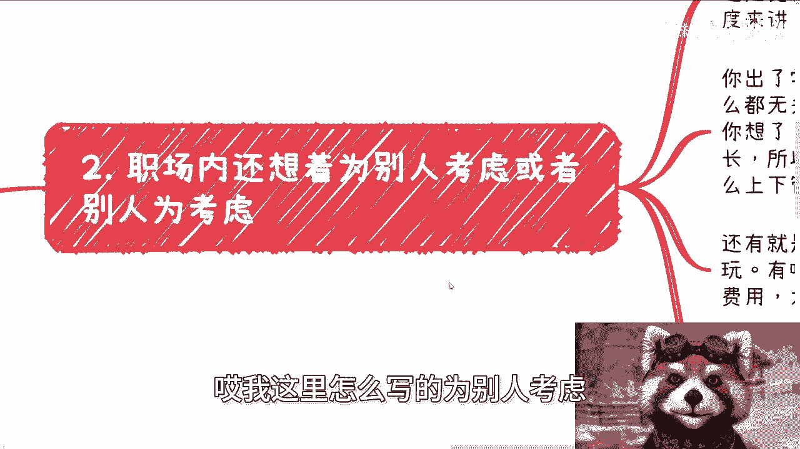
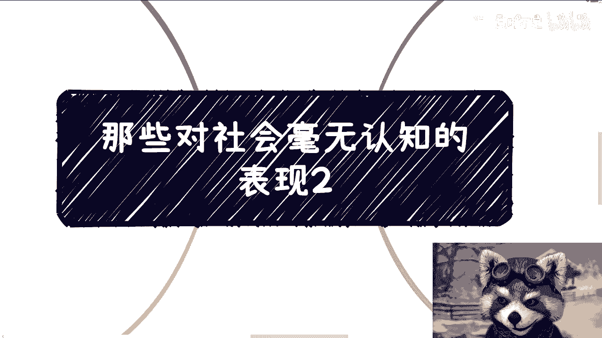

# 那些对社会毫无认知的表现2 - P1 - 赏味不足 - BV14x4y1q7n1

嗯好大家好，今天我们来讲一下同样的啊。

就是还是这个对社会毫无认知的这个表现啊，之前在上一期的那个内容当中呢。

有人还评论评论跟我说，他说他说还好还好，这个内容是在呃充电视频里面对吧，放到不是充电，不知道啥样子。

我说我知道啥样子被喷成狗呗，对吧还是什么样子啊，对吧啊，然后武汉那个活动时间已经定了啊。

5月12号下午01：30到六点左右好吧，详情和报名你都可以私信我哦。

我可以跟你们讲，就这么简单，感性层面的东西我不想讨论。

没啥好讨论的，因为感性这个东西讨论的讨论其实都是空的啊，好。

然后我今天讲的呢，是这个那些对社会毫无认知的表现。

二啊，那么第一个呢叫做建立关系和合作，我就这么说啊，建立关系和合作，很多所谓的建立关系合作跟你们想的不同，我还是那句话啊，真正社会上非常多的事情，他非常的朴实无华，没有这么简单。

这就像我们刚刚说肥猫还是胖猫的，那个那个事情，你要说骗钱，或者你要说让一个男的为她付钱，她作为一个捞女，你说我你们去看那些截图，你觉得怎么样，你觉得有多大的什么花头吗。

或者有多大的什么什么设个局什么的有吗，没有呀，他也很朴实无华，对不对，当然不同地方关系还是不同的，你和老百姓建立关系，靠的就是感情，大家聊的很好，但往往看不到钱啊，你和商业上的人建立关系，大家就看钱。

别看感情就是感情在钱面前一文不值啊，一文不值，就是大家可以再争吵，再吵再闹，但有了钱，你但凡愿意拉着对方一起做，你们无论对方之前吵得多么厉害，你们还是兄弟，就这么简单啊，然后但政府高校我跟你讲真的不同。

就是这里面的一些人呢，或者说供应商的这个销售啊，或者说关系，那就真的不一样了，也就是说你要建立你要合作，要么就是说直接的那种硬关系，要么你就只能陪吃陪喝或者说陪玩对吧，你要让他们每天。

甚至你要让他们每天看到你要刷脸，就是这么朴实无华，没什么东西，你不要来跟我谈技术，别来跟我谈什么东西，没有用的，你明白吗，因为技术是不能来搞关系的，你的学历更不可能来搞关系。

所以就是否则我跟你讲关系打不下来的，你别跑出来说自己什么学历。

什么学校，我跟你讲很丢人，真的很丢人啊。

好第二呃，职场内啊还要想着怎么为别人考虑，或者说这个这个诶我这里怎么写的，为别人考虑。

或者别人为考虑，唉无所谓吧，反正就这个意思啊，就是说很多人呢其实从学校走出来之后呢，还是有情绪的，或者说呢还觉得自己是个人啊，以及觉得别人是个人啊，我跟你们这么说，我们从两个角度来讲，第一你出了学校。

大家都是陌生人，别人做什么你做什么其实都没有关系，大家其实都是没有交集的啊，你可千万别觉得，比如说hr今天说两句好话，就真的是为你着想了啊，好你说你说啊，你说这种人好人有没有有的。

但我告诉你这种好的hr，这种好的人都活不长的啊，就是他们很难在职场上能有很大的这种，经验上的积累，或者怎么样很难的啊，你别问我为什么没有什么东西，为什么啊，所以大部分人经验丰富的。

留下来的都是懂得怎么向上管理，怎么向下管理的，否则他活不到今天的哦，你要明白所有的人活到今天一定有他的道理啊，但是他的道理一定不是说做一个好人，就这句话啊，还有就是说什么和领导啊。

和同事闹矛盾的好也是很好玩的，我就问你有啥矛盾矛盾可闹的，您打份工，每个月给你固定的窝囊废，有什么好闹的呢，大家又不是结婚过日子，你闹啥呢，我就不明白了，有啥好闹的呢，对不对，就是你你我就告诉你。

你但凡格局大一点的，你就会明白你作为一个员工，你有什么好闹的，你闹来闹去，上面就会觉得你是个，你给我滚吧啊，缺你怎么了，公司他妈倒闭了，那奇了怪了对吧，我跟你讲，你闹就是太把自己当个人了啊。

你也太把别人当个人了，然后你可能也不缺钱，你也不缺别的，你又有足够的时间来浪费来闹，那我跟你讲，这就是你在别人眼里的样子，我不管你真实是什么样子啊，你跟我说陈老师，我是一个三观非常正的。

或者说我家里没有钱，who care啊啊，谁关心啊，管你是谁啊，对不对啊，第三会对人区分369等的，我跟你讲，这点也很好玩啊，就进入社会之后呢，我跟你讲，还在乎什么地位，什么title。

什么家庭什么关系的这类人啊，那么这个时候又有人要说了，他说老师你不是说了吗，地位title很重要，家庭很重要，关系很重要吗，我给你讲对对，没有毛病啊，没有毛病。

但是啊但是啊你要搞清楚很多所谓的title，重要关系重要是真的重要吗，并不是他只不过是因为钱让大家绑定在了一起，利益让大家绑定在一起，看上去很重要，我就跟你讲，谁他妈不是演员呢，谁不是逢场作戏呢。

对不对，就是说我们说的重要，是指我们因为在这套规则下，我们不得不觉得它重要，但是他是不是真的很重要，是不是真的很牛逼，你心里有数啊，啊不得自己不把自己骗进去啊，啊所以不要去给别人分档次。

你要注意每个人背后的价值，你你想想啊，你如果只看政治地位高，社会地位高的，但凡你利用不了，或者说我就告诉就不是个人，你也没资格利用别人，你也合作不了，那么这个时候对方地位再高，跟你有有他妈大关系啊。

对不对，而且呢你也不能只看高不看低的，因为你要明白任何业务的合作，第一能愿意跟你合作的，往往都是些跟你级别差不多的，你看不起别人，就是看不起你自己，对不对，第二任何业务的合作，大家都是通力合作的。

什么叫通力合作，就是总有人干脏活累活，也总有人会干一些战略层面的东西，每个人都是有价值的，你看不起人家，如果你现在的级别比人家高，对不对，你看不起人家，等于就看不起以前自己，甚至就是看不起你。

现在自己有什么区别呢，对不对，就是莫名其妙会对什么，哎呀好像对公务员，对那些有政治地位，社会地位人就拍马屁，溜须拍马，对于那些老百姓，对于那些不如自己的就非常不屑一顾对吧，或者说怎么样，我跟你讲。

这种人就他妈啊，好第四就是觉得企业老板什么都不懂啊，我跟你这么说，还有一类人我跟你讲，真的也是绝了，就是他们会觉得自己所在企业里面的管理，是一坨屎，然后反馈问题也得不到解决。

然后就觉得他妈的自己自己是很牛逼的，反馈问题得不到解决，老板都是，我们就说两个点，第一世界就是个草台班子，你觉得你所在的企业管理是坨屎，那我跟你讲，你随便换，你随便换，你去哪都他妈是一坨屎，就这句话啊。

你别来跟我说，你想象当中怎么样，你想象当中怎么样，有本事自己去开啊，对不对啊，这是第一第二其次你反馈的问题，老板为啥会解决，为嘛奇了怪了，你的角度都是打工人的角度，都是执行层的角度。

老板但凡来解决这些问题，公司他妈别做了，工资也别发了对吧，那大家也别干了，这是一回事吗，对不对啊，你不能因为公司不来解决执行层跟底层的问题，就觉得老板呀，你去读也不叫读点书吧，你但凡有点认知。

你就会明白所谓的轻重缓急，对不对，你按照这个逻辑，我跟你讲，所有老板都是，为什么，因为你会发现所有的执行层跟底层里面的问题，都是一坨屎。

而且都是很多遗留的问题，都是非常多的历史问题，你说老板是不懂吗啊对不对，真的我跟你讲啊，你但凡有这种想法的，你自己去做老板，你明白吗，就是我不是说你三观不正，我也不是说你这个事情不对，而是什么呢。

而是你对是对的，但是问题是你对了，你非要去，就是你你要么就有本事自己去改变，你改变不了，你把这个问题甩锅甩到老板头上，然后说老板不懂，那我就觉得他妈是你，对不对，因为你要明白，每个人处在不同的位置。

他做事情不一样对吧，你是不操这个心，比如说这家公司100个人，你是他妈不操心下个月啊，这100个人的工资，哪里人，他妈老板要操心啊对吧，我不是说为资本家说话啊，就是每个人都得去考虑他的问题对吧。

你说你考虑这个问题对你有帮助吗，对你有好处吗，没有吧，那么意义在什么地方呢，啊好吧，然后包括就是说，今天那个晚上咨询的那个小伙伴也是的，我跟你们说，真的很多时候你们就太把自己当个人，你们不是人。

你明白吗，我也不是人啊，我可以明天后天我可以再给你们出一个，就是我们其实不是人，你懂吗，当然你不懂，我跟你们讲了，你们慢慢可能会懂啊行啊。

先这么着吧，然后那个武汉活动好吧，你们要报名的就继续跟我说01：30到六点，然后详情嗯或者是那个报名都可以私信我哦。

然后剩下的就是说职业规划，商业规划嗯，那个股权融资，然后合同啊，分润啊，包括那个商业计划书，包括就是说你们自己有什么牌啊，希望我能够以我的这个视角，或者以我的目前的一些认知。

能够给你们更好的一些发展方向，或者你们自己有什么问题，然后觉得需要讨论一下的啊，你们觉得有必要的话，你们可以整理一下，然后再私信我。

