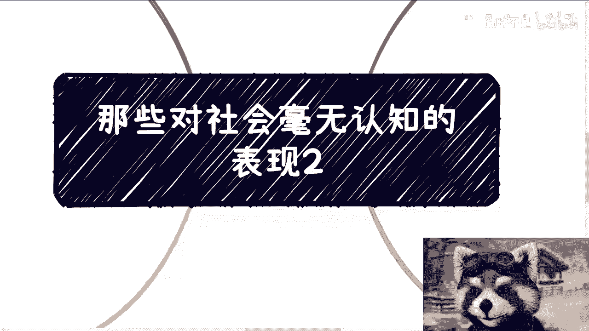

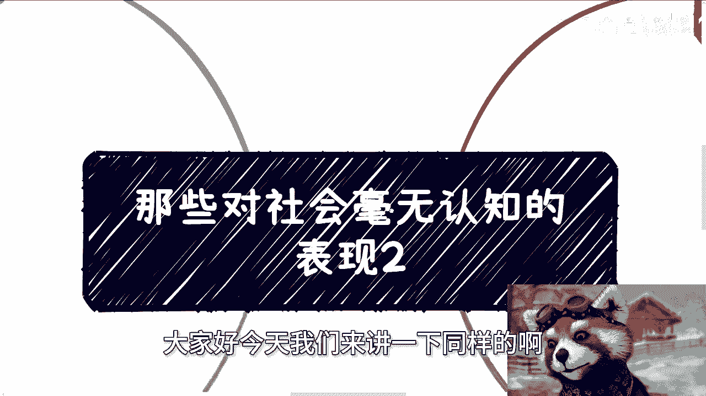

# 课程名称：对社会毫无认知的表现（二） - 第1课 👀

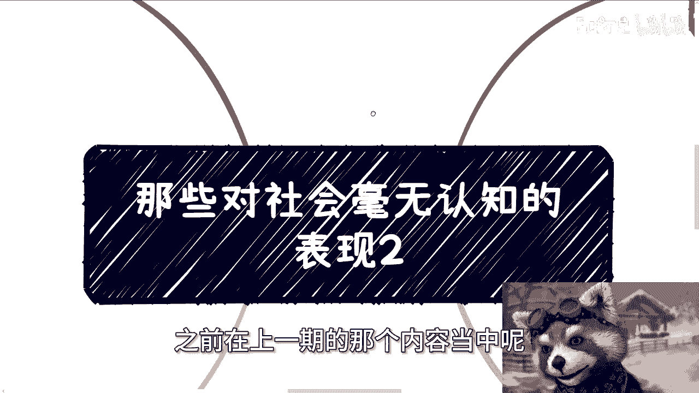

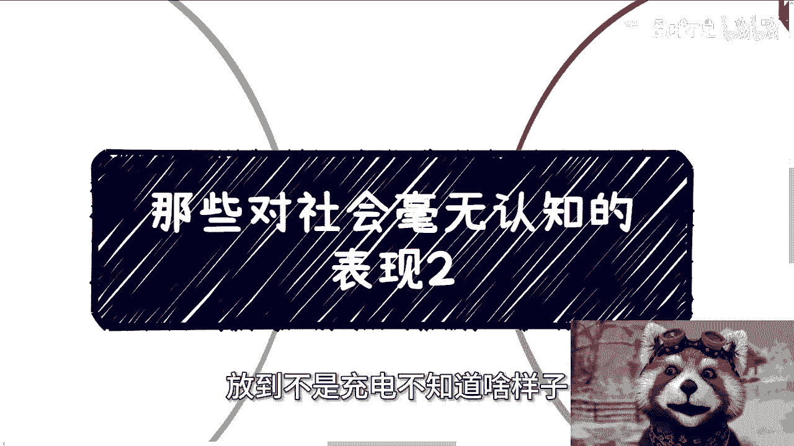

在本节课中，我们将探讨几种常见的、对社会运行规则缺乏认知的具体表现。这些认知偏差往往源于从校园到社会的过渡期，理解它们有助于我们更务实地看待职场与人际关系。

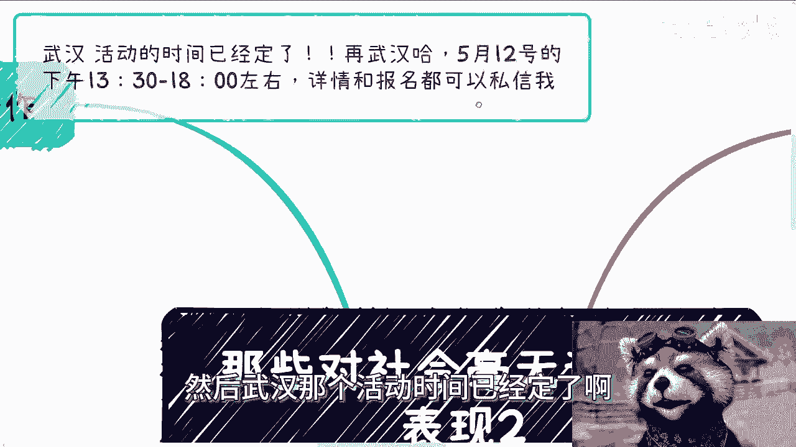

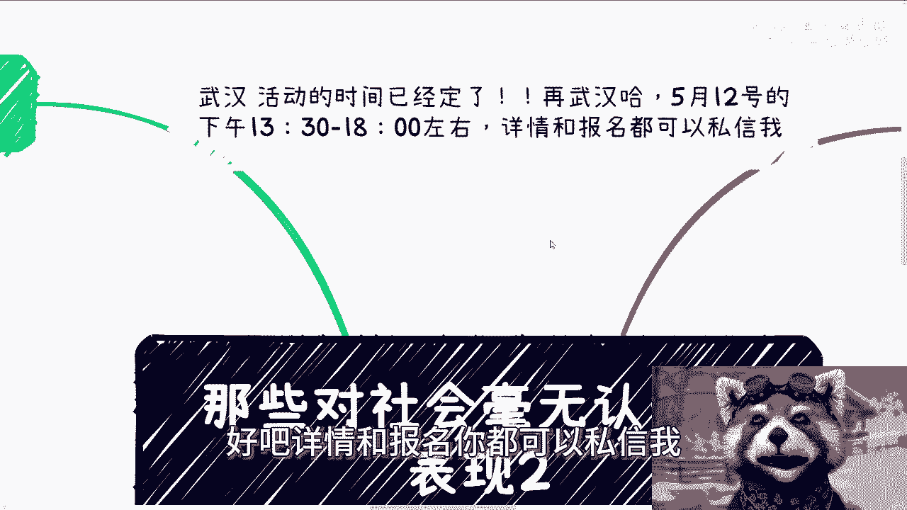

上一节我们介绍了本系列的主题，本节中我们来看看四种典型的社会认知误区。

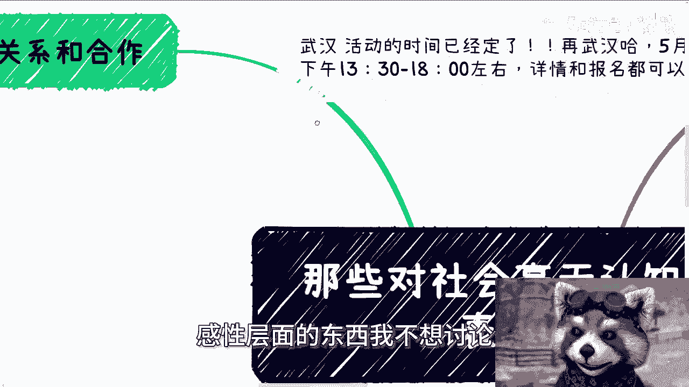

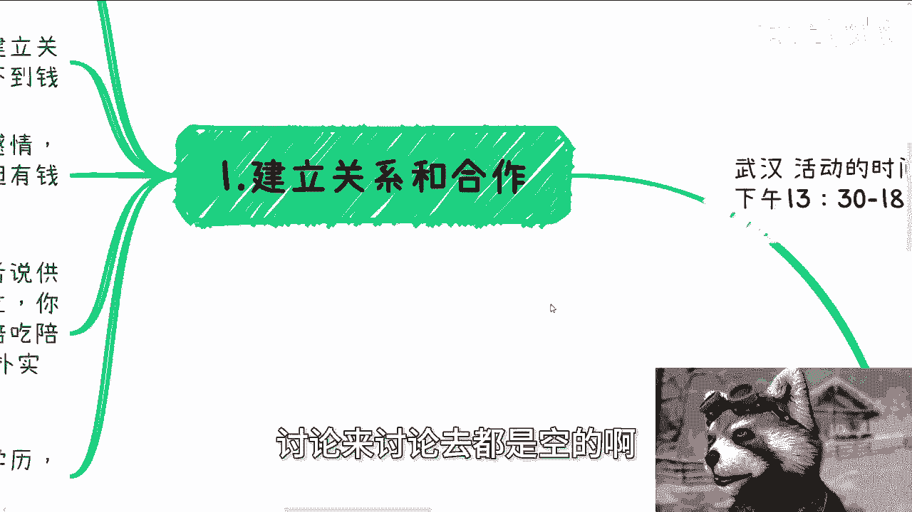

## 1. 对“建立关系与合作”的误解 🤝

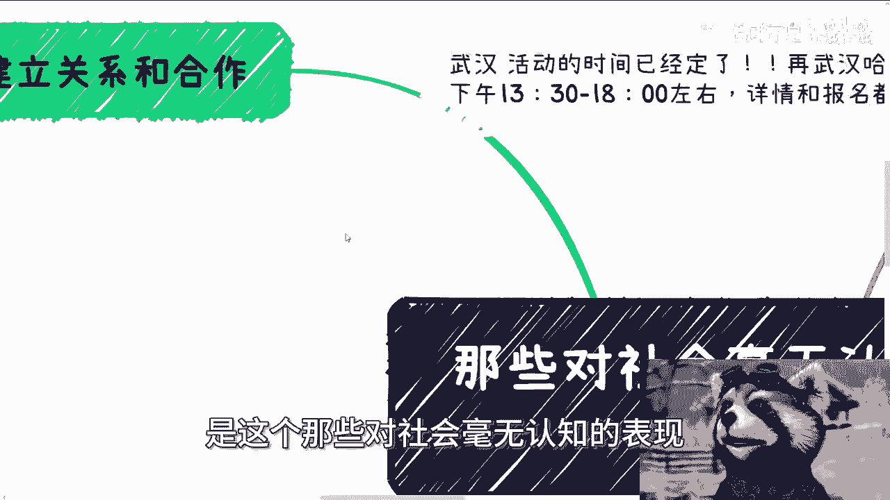

很多人对“建立关系”抱有浪漫或不切实际的幻想。实际上，社会中的多数合作非常朴实无华，其核心逻辑因对象不同而差异显著。

以下是不同场景下建立关系的核心逻辑：

*   **与普通民众**：关系建立在感情和聊得来之上，但往往不直接涉及金钱利益。
*   **与商业伙伴**：关系核心是**利益（金钱）**。感情在利益面前价值有限。公式可以概括为：**可持续的合作关系 ≈ 共同的利益**。
*   **与政府、高校或特定供应商**：关系建立更依赖“硬关系”或持续的“陪伴”（如陪吃、陪喝、陪玩），需要高频次“刷脸”。技术或学历在此类关系中通常不是有效敲门砖。

试图用技术或学历去打通这类关系，往往收效甚微。

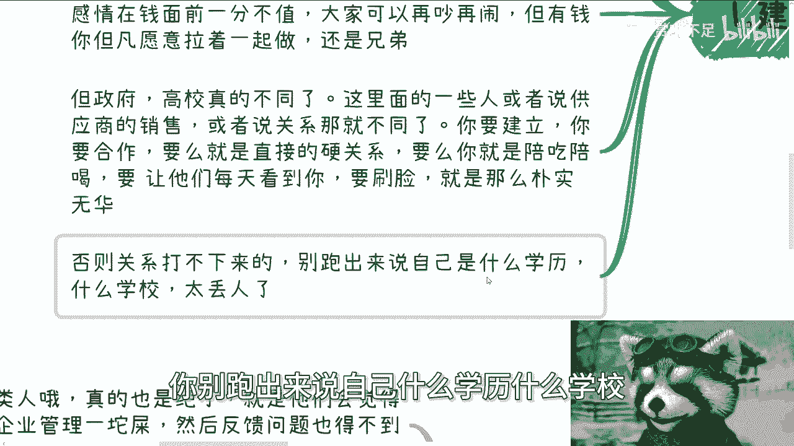

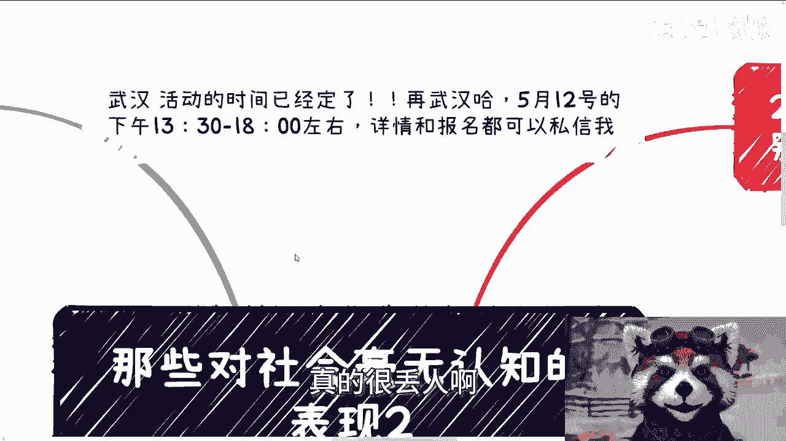

## 2. 过度强调“为他人考虑”或“被考虑” 😓

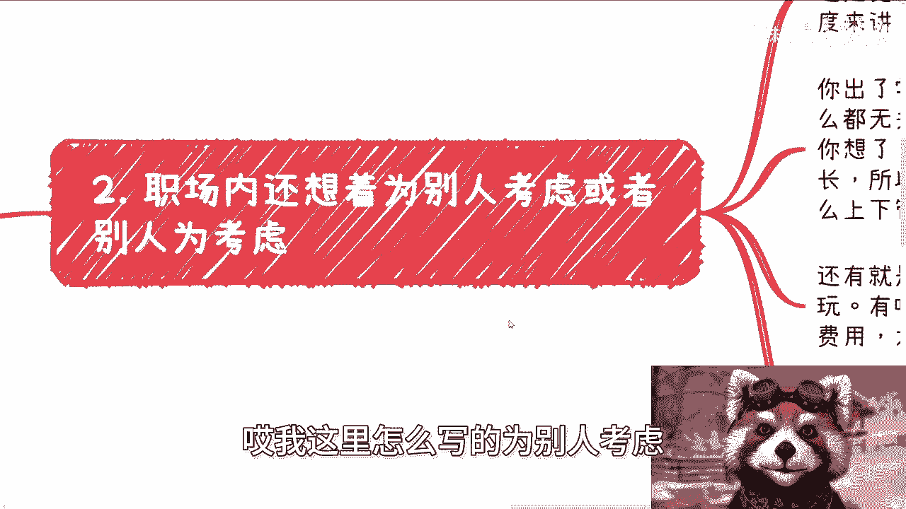

离开校园后，许多人仍带有强烈的“个人”情绪，并期望他人也如此。这在社会协作中可能产生问题。

我们从两个角度分析：

*   **对他人期待的误区**：职场中大部分人是基于规则协作的陌生人。例如，HR的某些“好话”可能仅是职业行为，而非为你个人着想。经验丰富、能长期生存的职场人，通常精通向上管理与向下管理，而非单纯做个“好人”。
*   **职场矛盾的误区**：作为员工，与领导或同事发生激烈矛盾常因“太把自己当回事”。职场本质是雇佣关系，领取固定报酬完成工作。过度纠缠矛盾，在上层眼中可能被视为不稳定因素。代码可以类比这种思维：`if (过度投入个人情绪) { 职业风险增加 }`。

闹矛盾往往意味着你投入了过多不必要的个人情感，并高估了他人对你的关注度。

## 3. 机械地对人“区分三六九等” 🏷️

进入社会后，过分看重他人的头衔、地位或家庭背景，是一种幼稚的认知。

需要厘清两点：

*   **“重要”的本质**：许多头衔和关系之所以“重要”，是因为**利益绑定**和**规则要求**，使人不得不重视。这更像一种“逢场作戏”的社会表演，其内在价值需冷静判断。
*   **合作的价值基础**：有效的合作看重的是**对方能提供的实际价值**，而非虚名。如果你无法利用或合作，对方地位再高也与你无关。同时，任何合作都需要不同层级的人通力完成，轻视干“脏活累活”的伙伴，等于轻视合作本身，也看不清自己的位置。

公式可以表达为：**有效合作价值 = f(实际可交换资源， 协同效率)**，而非简单的社会地位排序。

## 4. 认为“企业老板什么都不懂” 🧐

部分员工因内部管理问题或自己的建议未被采纳，便认定老板无能。这种看法有失偏颇。

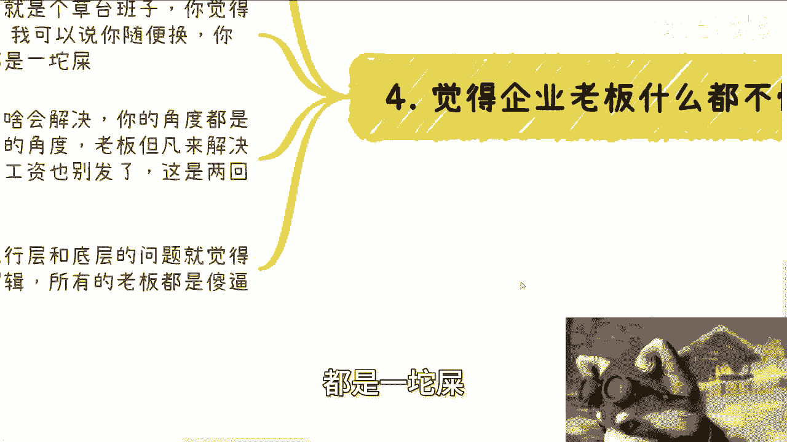

我们从两个层面看：

*   **管理的普遍性**：多数组织的管理都存在瑕疵，即“世界是个草台班子”。觉得自家公司管理是“一坨屎”，换一家往往大同小异。
*   **决策的优先级**：老板不解决某个执行层问题，未必是不懂，更可能是**轻重缓急**不同。老板需要统筹全局，如现金流、发工资等生存问题，其决策视角与执行层有本质差异。用执行层的逻辑去评判战略层的决策，本身就不在一个频道上。

这并非为所有老板辩护，而是指出：处于不同位置，责任和优先级不同。员工认为的“关键问题”，在老板的全局清单上可能排序靠后。

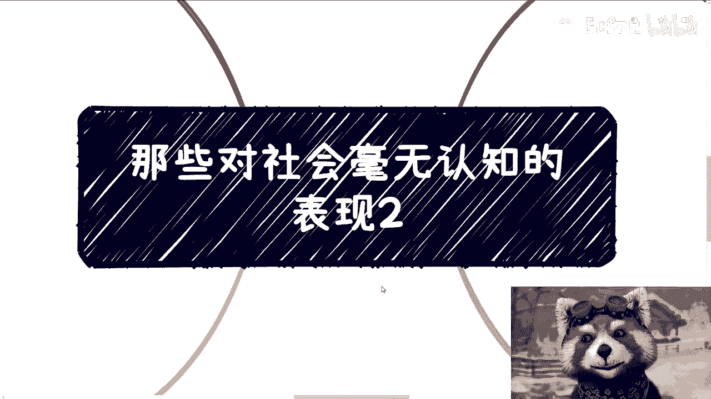

---

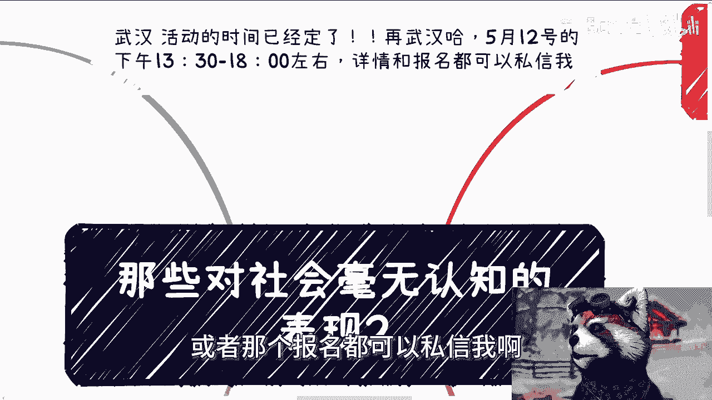

本节课中我们一起学习了四种对社会缺乏认知的表现：误解关系建立的本质、在职场过度情绪化、机械划分人的等级、以及片面评判老板的决策。理解这些，旨在帮助我们摆脱学生思维，以更现实、更高效的视角融入社会协作。

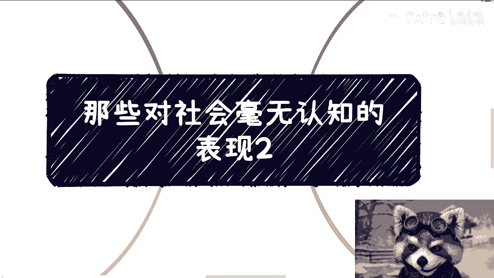

> 武汉活动时间定于5月12日下午1:30至6点左右。详情与报名请私信。
>
> 若有职业规划、商业规划、股权融资、合同分润、商业计划书等问题，或希望从不同视角探讨个人发展，可整理具体问题后私信咨询。