# 那些对社会毫无认知的表现3 - P1 - 赏味不足 - BV1Hb421877r

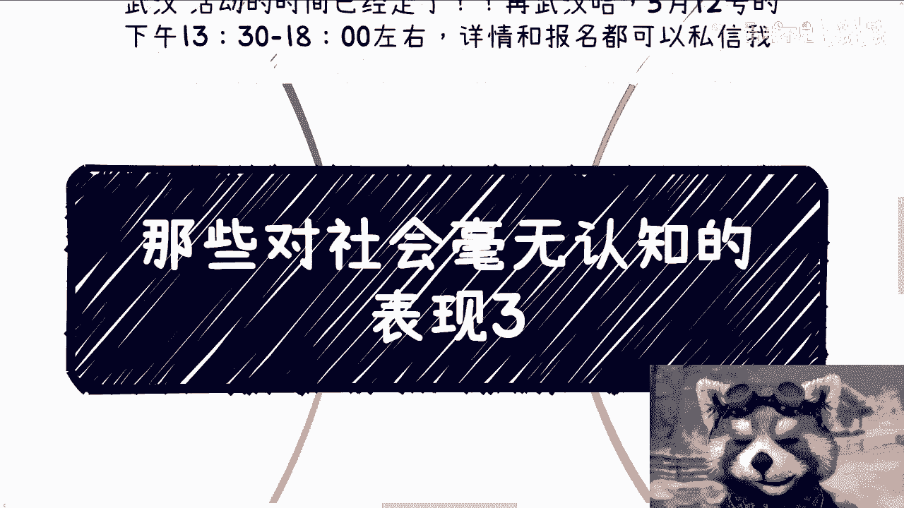

好啊这个今天我们继续来讲啊，这个首先武汉活动时间已经定了好吧，在武汉啊，5月12号下午01：30到呃，呃01：30到六点左右好吧，详情跟报名你们都可以私信我啊，那么今天我们来讲的呢。

是对社会毫无认知的表现，三啊呃OK然后在正式开始之前呢，我也可以说一下，就关于这个最近说这个啊，两两年51万被骗了。

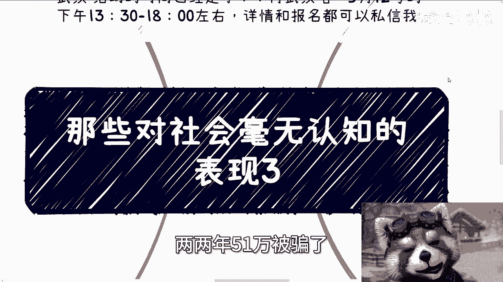

然后自杀的这个事情啊，我跟你讲很简单啊，如果单纯从男的角度来讲，我跟你讲就两个字，活该没啥好说的，有啥好说的呢，你说的再多也是活该，就这句话没啥好说的，你要但凡往前再追溯，那就是他父母教导无方结束了。

那你要从女的来讲，对吧好，你说诈骗也好，你说怎么样也好，怎无怎，你怎么说她都可以，OK我们只能等官方的结论，对不对，我们说什么有卵用啊，对不对，我跟你讲，你们怎么指责他都行，但是你明白没有。

你们怎么指责他，或者你们身边人怎么指责他，网上怎么指责他，都是只能出于道德，我们怎么我们能处于法律吗，我们有这个资格吗，没有不好意思啊，没有不好意思啊，我们很多都只能出于道德对吧，那出于道德没啥好说的。

因为你从感性角度来讲，那大家有啥有就没底了，这个事情对不对对吧，因为你婆说婆有理，公说公有理，那你有啥好说的，对吧嗯好。

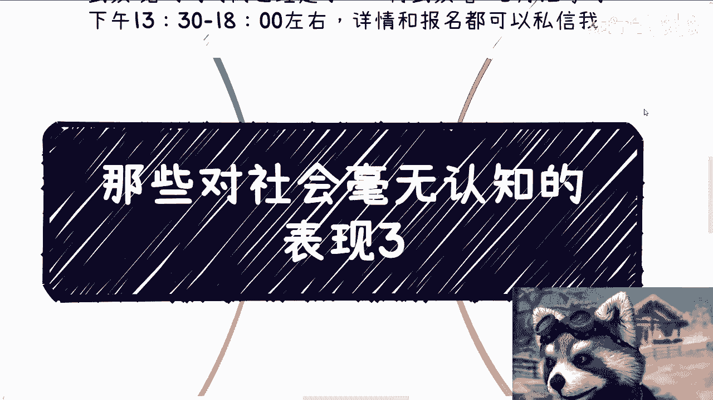

我们今天今天继续呃这个正式来讲这个东西啊，第一额我们说的是毫无认知的表现啊，我觉得第一点是什么呢，就是要明白所有的事情都是八二原则的。

什么意思呢，就是说我不是今天来说幸存者偏差的事情了，而是说大部分的事情，你说有没有可能有的，但是都是少数，不是说有可能就就是片非常大面积的，不会的，你这个思维一定要时时刻刻刻在脑子里面，你明白吗。

就碰到任何的事情，你都要明白，有存在即合理，就是有没有可能存在有，但他比例很少啊，这就好像昨天评论里还有人跟我说了，什么国企，央企，什么学校啊，跟我说什么不产出东西就会被社会淘汰，我他妈都看笑了。

你知道吗，哎呵呵，真的我跟他都看笑了，我不是否认这些地方明白吗，哦我不是否认这些地方有干事情的，国企，有干事件，央企也有干事情的学校多吗啊，问题多吗，啊到整个中国这片土地上去看看有多少。

你们看到的国企央企不是在敛财的啊，有多少学校他妈的不是在敛财的啊，不是一年一年摸鱼在里面啊，你跟我说他妈的什么什么国企央企，什么学校不产生的东西会被社会淘汰我吗，我真的笑了，我跟你说，我们被淘汰了。

他们都不会被淘汰，就这句话啊，我跟你讲，你说这句话的，就是说这句话的人啊，我就这句话，你说这句话的时候，你自己心里得明白，你说这句话意义是什么，不要搞得好像自己多高大上，你根本就不高大上。

你对社会毫无了了解，你就是活在桃花源里的，别人给你伪造的这么一个世界里面，OK明白吗啊好，然后就好像去大厂，去大厂，有的人也能做的很好，去创业公司，有的人也能做的很好对吧，当然他也能做过35岁。

这甚至45岁都能做，55岁都能做，但你真的了解多少呢，你了解过中国整个面吗，你了解过多少城市的从业人员呢，对不对，就是你不能因为你知道了你朋友圈有，或者你怎么样怎么样，你说说我得出一个结论。

大家都能都很好做，大家都未来有很很好的未来对吧，大家都不用担心，35岁你觉得可能吗，对不对，你甚至会用这种东西去反驳别人，来反驳我有意义吗，你想看有没有意义，这就好像我最早的时候，我就和很多人说过。

你爱做不做，你做不做，反正都是你的前途，跟我吊关系，对不对啊，包括什么呢，哎呀做电商赚钱，做直播赚钱，做叉叉赚钱，你看到过多少案例对吧，你看到过多少案例就能得出来这个东西能赚钱，这个结论来啊。

你看到过多少成功案例，多少失败案例就能得出这个赚钱结论来。

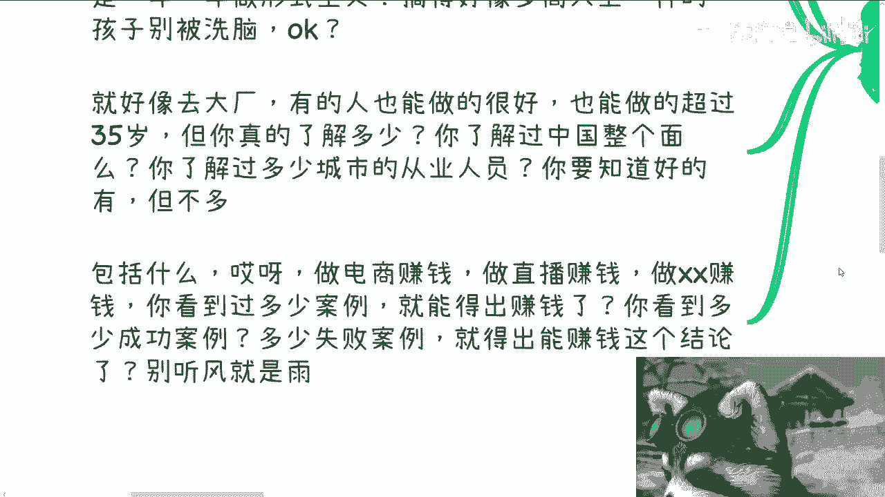

我跟你讲都是他妈的听风就是雨啊。

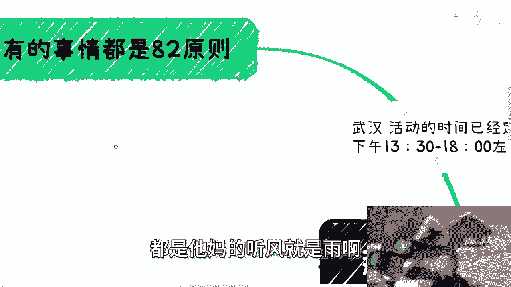

这就是对社会毫无认知的表现之一啊，表现之二是什么呢。

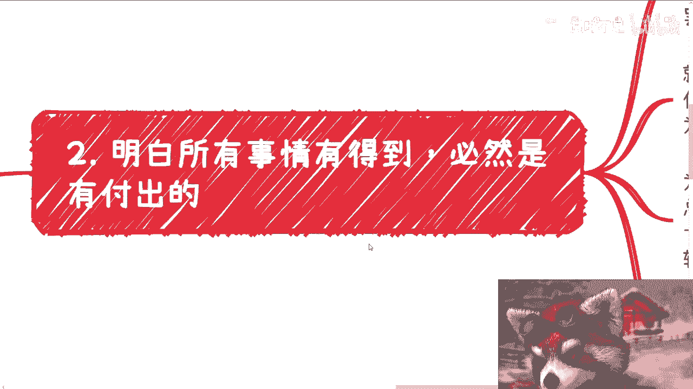

就是一定要明白啊，任何的事情，任何任何的事情，他都是有平衡的，用大白话来讲，就是天上不会掉馅饼下来，如果就算今天掉了下来，一定是有道理砸到你的，什么意思呢，它砸到你也就意味着一定会有后续的需要。

你付出的地方，只是他妈的，你现在不知道对不对啊。

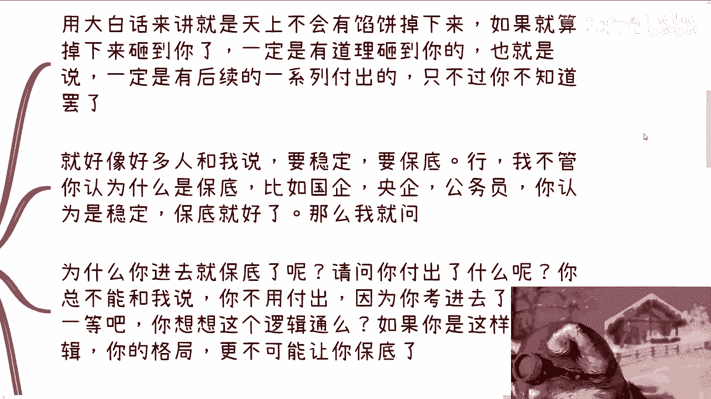

而不是说很多人就是很多人很搞笑的，就是哇我认为天上是有，天下是有这个免费的午餐的，这就好像很多人跟我说，他说要稳定要保底行啊，我不关我不关心你到底认为什么是保底，比如说他们有很多人跟我说。

国企央企公务员，你认为是稳定的保底号，那么我就问你啊，我就问你为什么你进去就保底了呢，哎请问你付出了什么呢，啊国家为什么要养着你呢，哎你给我个结论呀，到底对不对，好，我不关心你现在怎么回答我啊。

你总不可能跟我说，你不用付出，因为你考进去就是高人一等啊，你要是用这个逻辑来回答我，你想想看啊，第二点这个逻辑本身就是不通的，第三点你要是但凡这样的格局，这样的逻辑更不可能让你保底了，你明白吧对吧。

但是如果不是这样子，你想想看原因是什么呢，啊你有没有想过啊。

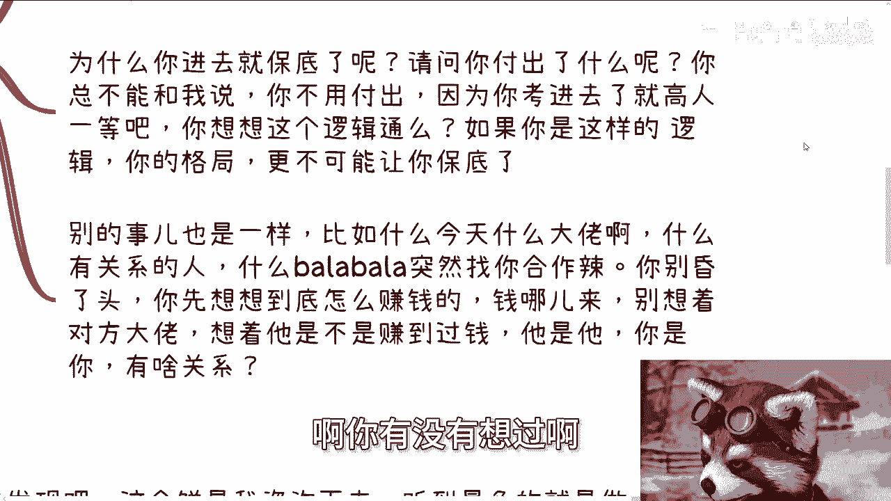

就是很多人可能会觉得哎呀稳定，很多人可能觉得哎呀怎么样子，嘿那我就问了，你付出什么了，你不要来告诉我，你付出了什么努力，付出了什么时间，那不好意思，大家都付出了努力，付出了时间，那为什么你有保底呢。

对不对，或者我再退1万步来讲，为什么公务员，或者你们觉得国企央企就有保底呢，有没有可能这个逻辑本来就不通呢。

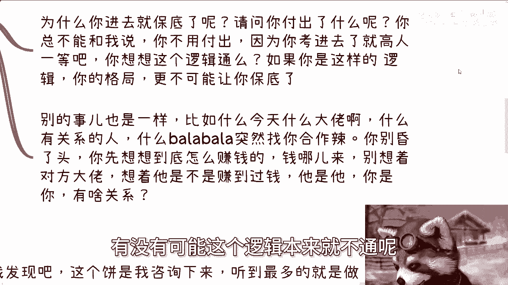

啊有没有想过啊，对吧啊，别的事也是一样的，比如说什么今天什么大佬啊，什么有关系的人啊，什么巴拉巴拉巴拉，突然找你合作了对吧，你别昏了头，我我跟你讲，你先想想到底怎么赚钱呢，钱从哪来。

别就是顾着就是说哎呀对方是个大佬，想着他是不是赚过钱，我跟你讲，对方他妈赚过一个亿，对方就算去纳斯达克敲过三次钟，他妈跟你都没关系，跟你吊关系啊，哦你能得出来的结论，难道你因为他赚过钱。

你就能得出来结论是你跟着他就能赚钱。

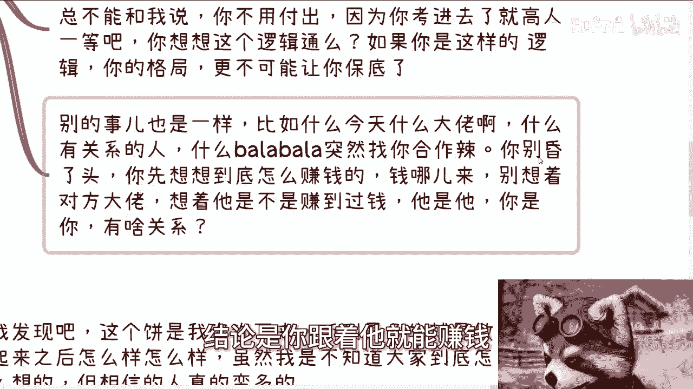

是有因果关系吗，啊我跟你讲，就他妈奇了怪了。

对不对啊，所以说你要明白事情他都是有平衡性的，就是你要得到必须要有付出，这付出是什么呢，你有没有想过。

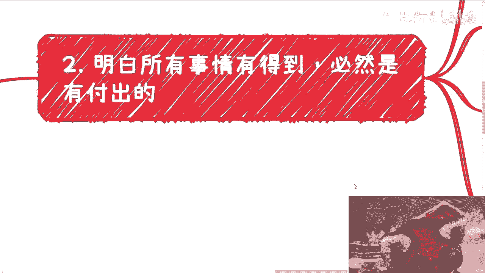

对吧啊，好第三啊，就是千万别相信什么，做起来之后我跟你讲这事情，真的我他妈又急气笑了，你知道吗，就我发现啊，这个饼啊是我咨询下来听到过最多的饼，而且这个饼是真是让我匪夷所思的。

就是明明我觉得大家应该不会吃这个饼，唉你会发现我的吃的人还真的多啊，你就比如好多开发就跟我说，他说现在跟别人合作啊，做一个项目或者一个一个一个系统，我打错了，他说一个项目或者一个系统。

我说那你现在开发给钱吗，他说不给，那我说那你为什么要做呢，哦他说合作方是这么跟我讲的，他说未来如果有流量了，做起来就分钱，卧槽卧槽，我满头的问号，你知道吗，嗯这个饼他妈都能吃，我他妈就真不理解啊。

真不理解啊，然后还有电商也是的，合作方说什么，现在就是帮着做自媒体平台做什么，比如说tom或者还说那个亚马逊独立站对吧，哦然后呢他画的饼是这样子，他说如果未来做起来了，有流水之后就分润。

嗯我他妈又满头问号，你知道吗，哎现在人都这么好骗，原来哦嗯还是我太有良心，对吧啊，然后呢最后啊说真的我跟你讲啊，这种饼是我看过最没有营养的，但是呢你信的人真的多，而这也就是我说的中国老百姓。

大部分他根本就没有分辨能力，你们仔细想想看一个问题啊，我们国家本科跟硕士比例，占整个老百姓的比例能有多少，能有多少，对不对，那大部分比例硕士的人都他妈容易被骗，他妈的老百姓就更别说了，对不对对吧。

我当然我不是说硕士跟本科就一定比，剩下的老百姓，或者说没有读上本科跟硕士，这个人聪明对吧，或者怎么样子，但是你从比例上面来讲对吧，你从概率学角度来讲，卧槽那他妈就更没分。

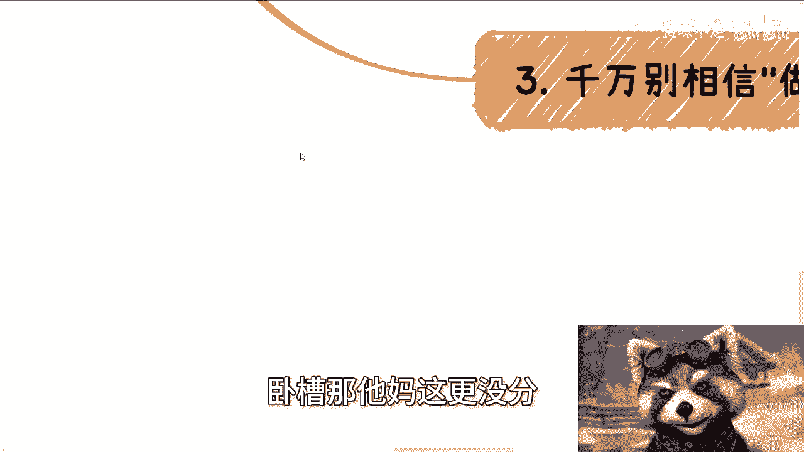

更没有分辨能力了，你说对不对啊，好第四我跟你讲，第四也是最最重要的一点。

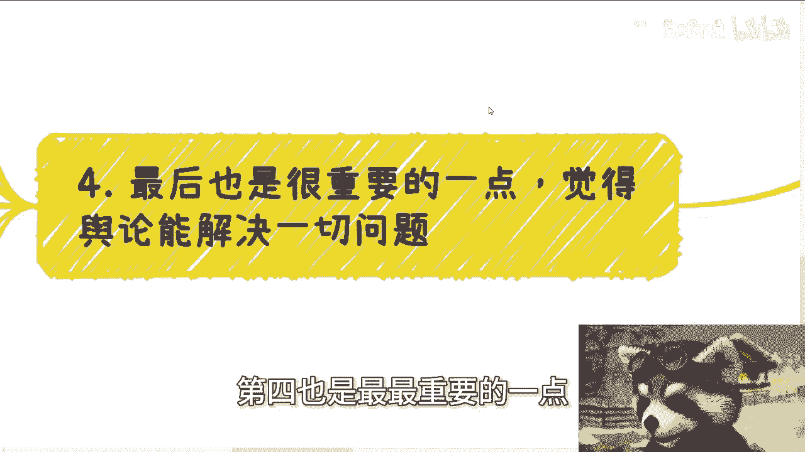

就是觉得舆论能解决一切问题，我跟你讲，这他妈这他妈就是呵呵，这他妈就是你们最大的误会，你知道吗，就是我跟你讲，这就是最的想法，你要是觉得舆论能解决一切，那么我就告诉你，作为老百姓的，你作为老百姓的。

我作为老百姓的，我们今天就不会这么难，你明白吗，你明白吗啊，9960007以及所有的工作，跟我们息息相关的工作问题早就解决了，那我请问你解决了没有啊，解决了吗啊你们去想想看，跟你们有关。

跟我有关舆论的事情多了去了，很多敏感的，我就不能说你们想想看解决了没有对吧，什么意思，意思就是很多事情能解决，是因为事情本来就要解决，或者来说撞到了枪口上，或者来说他原本就不地位就不是那么高。

它可以被解决，而他妈不是因为舆论，你懂吗，舆论有或没有，他都会解决，要不解决再多的舆论有用吗啊，有什么用啊，卧槽我跟你讲，拥有这种想法的人真的是巨婴中的巨婴，就是对整个国家一点都没有了解啊，我跟你讲。

这都是玩笑话，大家说说娃娃的，别当真，你懂吗啊，说白了这就跟报警是一样的，这个是每个人的公民的一个权利，你可以去发视频，你可以去发小作文，你可以去发瓜，没有问题，但是能不能解决是看事情本身的。

绝对不是看你掀起的浪有多大，你记住没有啊，你别把自己太当一个人啊，你能解决一些问题，并不是因为你是个人，也不是因为你发了这个问题，而是这个事情本身就要解决了，你只是一个被当枪使的人，你懂不懂。

只是杀鸡儆猴，和舆论没有任何他妈的半毛钱的关系，你懂吗啊，如果舆论今天能解决一些问题，怎么了，想翻天不成啊，啊你想想可能吗，啦真的我跟你讲这种事情。

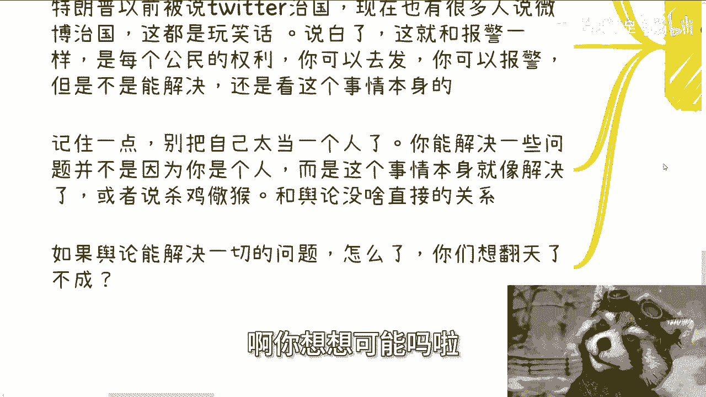

真的就是哎就我都不知道怎么去描述它，你知道吗，就既然有很多人会有这种错觉，就是好像好像舆论能够去推动一些事情，哼真的太把我们当个人了，你们是人吗，啊我们我是人吗，哎真的我跟你们这么说啊，你是不是人啊。

你多跟政府啊，多跟那些有政治地位，社会地位的人打打交道，你就知道你是不是个人了啊，真的不用我给结论，你们自己去打打交道，打完你就知道你是不是个人了啊，啧啧还舆论呢拉倒吧啊哦对。

最后我提一点那个那个你们可以看一下我微博，最近那个上海这边呃，昨天有一个当官的啊，然后什么出口骂人啊，然后说什么呃，说对方什么保安工作不保怎么样，你们可能也会觉得这个事情跟舆论有关。

但是你们仔细想想看这个事情，如因为现在还没有定论啊，如果这个事情后面能被处理，也是因为他出言不逊，也是因为他的态度嚣张跋扈而导致的，是因为这件事情本身它的性质就放在这个地方，跟舆论没有关系，发酵不发酵。

他都要被处理，你明白吗，不是说啊我们今天一定是说哎呀，好像就是一定要啊，发出来怎么样怎么样，我刚刚说了，发出来就跟你报警一样，是你的基本权利啊，你能掀起多大的浪，跟最终的那件事情，你你要明白。

社会运作规则是规则，法律是法律，舆论是舆论啊，你说能有多大关系，好吧行啊。

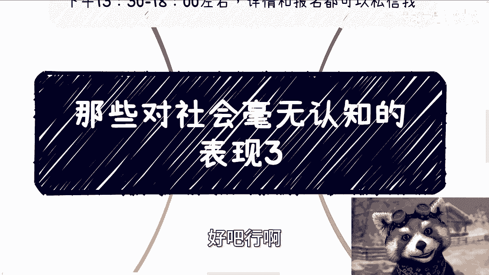

那就这么着啊，呃武汉这边的活动好吧，要报名的继续报，然后剩下的话职业规划，商业规划啊，然后股权啊，融资啊，期权啊啊什么什么商业计划书啊对吧，合同啊啊包括你们手上有什么牌嗯，嗯希望从我的这个视角。

能够给你们提供一些更多的这个支持，或者说更多的一些规划路线的话啊，那么你们可以整理好问题。