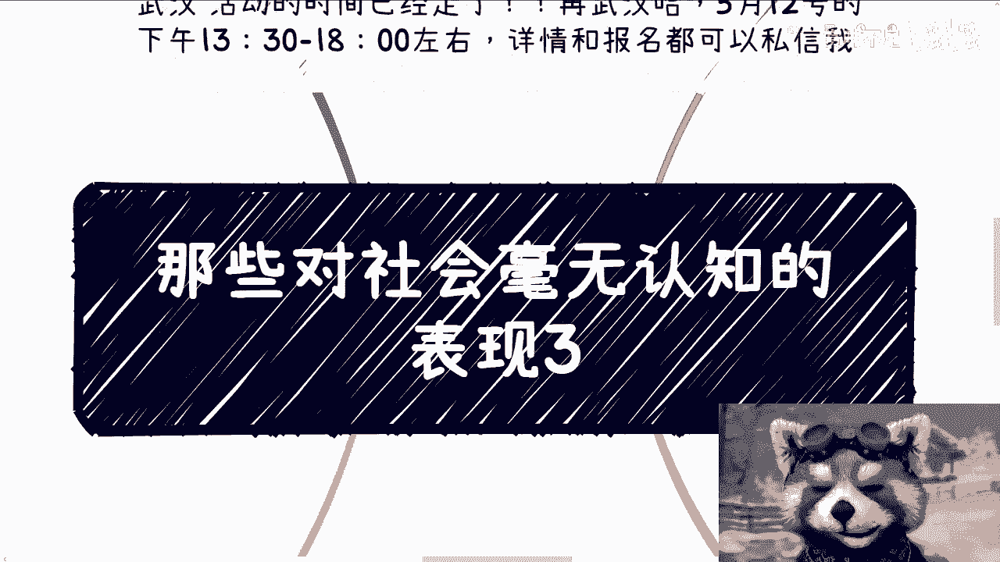
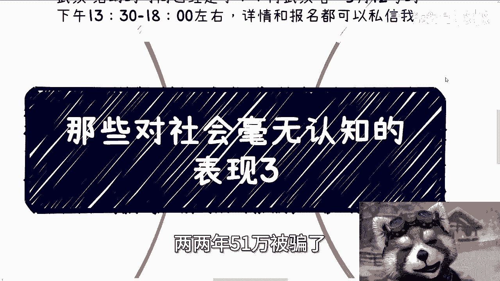
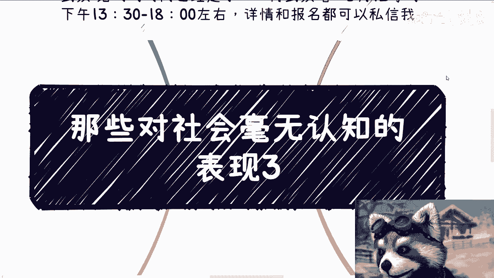
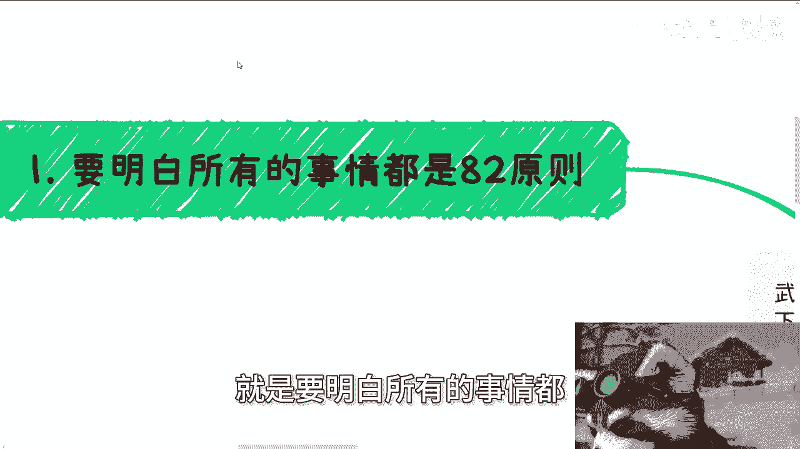
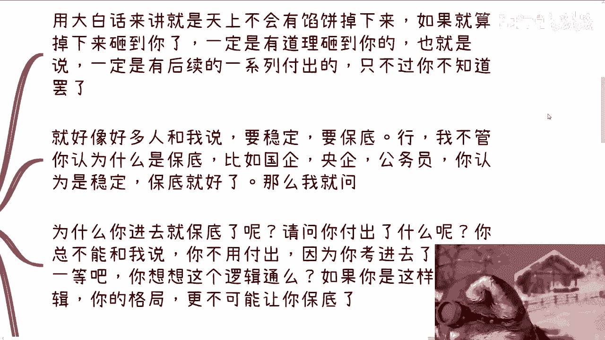
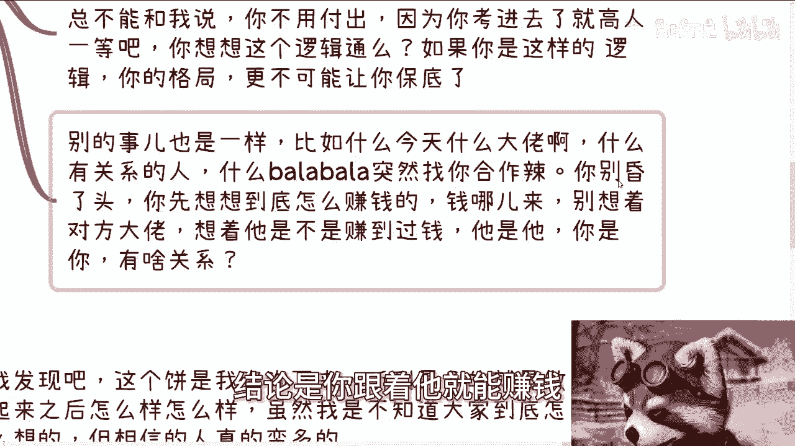
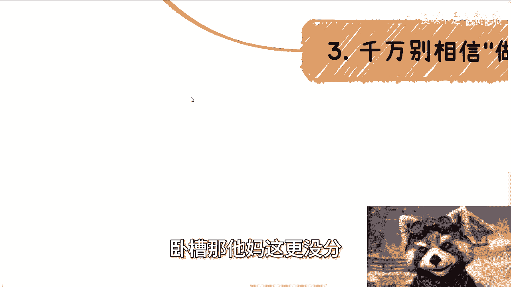
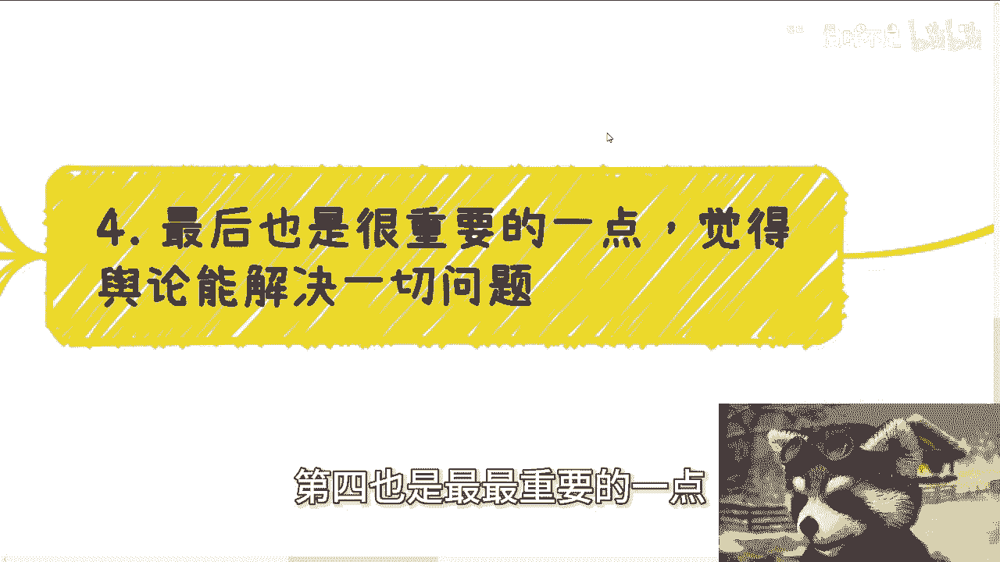
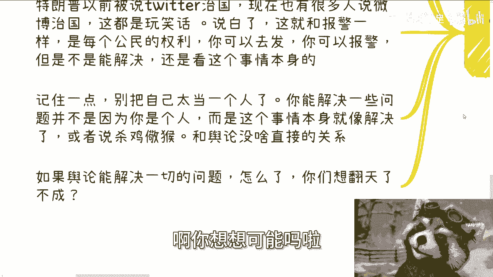
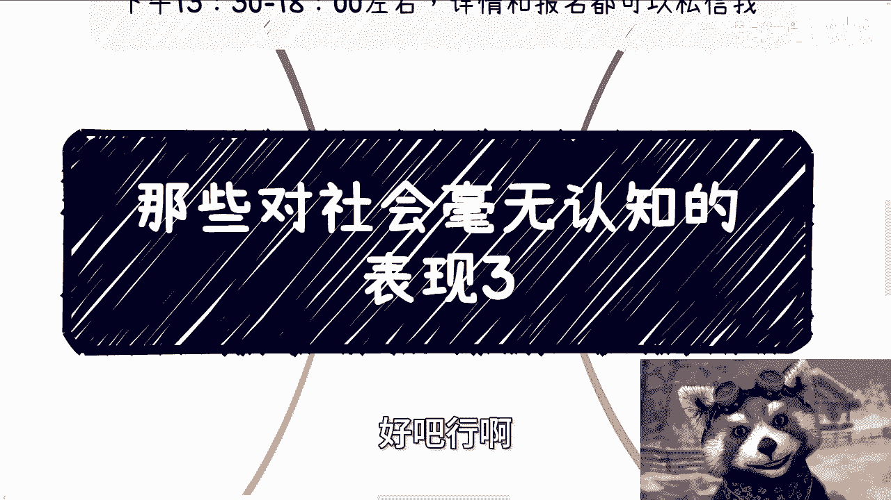

# 课程名称：对社会毫无认知的表现（三） 📚





在本节课中，我们将探讨几种对社会运行规律缺乏基本认知的典型表现。这些认知误区常常导致人们在职业选择、商业合作和社会事务判断上做出错误决策。理解这些核心原则，有助于我们更清醒地看待社会现象，做出更理性的判断。

上一节我们介绍了对社会缺乏认知的一些基础表现，本节中我们来看看几个更具体、更常见的思维误区。



## 1. 忽视“八二原则”的普遍性 📊



对社会缺乏认知的第一个表现，是不理解“八二原则”（或称帕累托法则）在社会事务中的普遍性。这个原则指出，在许多情况下，大约80%的结果源于20%的原因。用更直白的公式描述就是：

**结果 ≈ 20%的原因 + 80%的次要因素**

这意味着，大部分事情的成功案例或理想状态只是少数，而非普遍现象。你不能因为看到个别成功案例，就推断出该路径对所有人都可行。例如，认为进入国企、央企或学校就能获得稳定“保底”工作，这种想法忽略了这些岗位的稀缺性和内部竞争的真实情况。同样，看到少数人在电商、直播领域成功，就认为这些行业人人都能赚钱，也是犯了以偏概全的错误。

以下是基于此原则需要警惕的思维：

*   将小概率事件当作普遍规律。
*   用身边或朋友圈的个别案例来推断整体趋势。
*   用幸存者偏差下的成功故事，来反驳普遍存在的困境（如“35岁职场危机”）。


## 2. 不理解“平衡性”与等价交换 ⚖️


上一节我们强调了概率思维的重要性，本节中我们来看看另一个核心原则：平衡性。对社会缺乏认知的第二个表现，是幻想存在无需付出的收获，即“天上掉馅饼”。



任何事物都遵循平衡法则。要获得某种利益或保障，必然需要付出相应的代价。这个关系可以用一个简单的等式表示：

**获得 (Gain) = 付出 (Cost) + 风险/机遇 (Risk/Opportunity)**


如果看似有“免费午餐”或“稳定保底”砸中你，你需要立刻思考其背后的代价或隐性要求。例如，认为考上公务员就等于获得了无需持续付出的终身保障，这种逻辑本身就不通。国家提供岗位，必然对从业人员有持续的绩效和贡献要求，绝非一劳永逸。


以下是常见的“失衡”思维误区：



*   相信存在无需对应付出的稳定保障或巨大利益。
*   被合作方过去的成功光环迷惑，认为跟随其就能自然获利，而不深究当前合作的具体盈利模式和自身需要承担的成本。
*   接到“大佬”或“有关系”者的合作邀请时，只兴奋于机会，不冷静分析利益来源与自身需要投入的资源。


## 3. 轻信“做起来之后”的承诺 🎨

对社会缺乏认知的第三个突出表现，是轻易相信“未来画饼”，尤其是在商业合作中。这是一种极其常见却缺乏基本商业逻辑的陷阱。

其核心模式是：合作方邀请你**现在**投入时间、技术或劳动（如开发系统、运营电商），但**不支付当下费用**，承诺未来项目有收益或做大规模后再分红。用伪代码表示这个陷阱逻辑：

```python
if 项目未来成功:
    你可能获得分成
else:
    你已付出的时间与劳动成本归零
# 注：项目成功的定义和分成比例往往模糊不清
```





这种模式将全部前期风险和成本转嫁给了执行方，而承诺方却无需当下付出。许多开发人员、电商运营者容易陷入此类陷阱，反映出对商业风险和价值交换的基本认知不足。

## 4. 高估“舆论”解决问题的能力 📢

对社会缺乏认知的第四个，也是危害性极大的一种表现，是过度相信舆论能解决一切社会问题。这是一种严重的认知错位。

必须理解一个基本现实：**舆论是公民表达诉求的权利和途径，但并非解决问题的决定性力量。** 社会问题的解决，根本上依赖于法律、规则、行政体系以及事件本身的性质。舆论有时能起到加速、曝光或监督作用，但前提是事件本身符合被解决的客观条件（如撞上政策风口、涉事方地位允许被处理等）。



许多与大众切身相关的问题（如某些工作制度）长期存在，并非因为没有舆论关注，而是因其解决涉及复杂的系统性调整。认为“闹大了就能解决”，是将复杂的社会治理简单化、情绪化。个人在舆论事件中，有时只是恰好扮演了“触发点”的角色，而非推动解决的“主力”。

---

**本节课总结**



本节课我们一起学习了四种对社会缺乏认知的典型表现：
1.  **忽视“八二原则”**：误将少数案例当作普遍规律。
2.  **不理解“平衡性”**：幻想无代价的收获，忽视等价交换。
3.  **轻信“未来承诺”**：在商业合作中接受不合理的风险转嫁。
4.  **高估“舆论力量”**：错将表达权利当作解决问题的万能钥匙。

理解这些原则，有助于我们穿透表象，更理性地分析职业选择、商业机会和社会事件，避免因认知不足而做出错误决策。核心在于建立概率思维、等价交换思维，并认清个人在社会运行体系中的真实位置和作用。