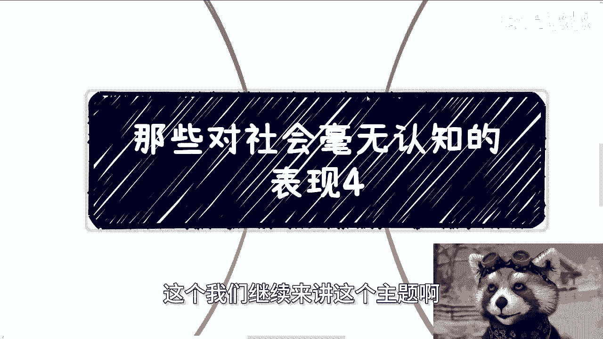
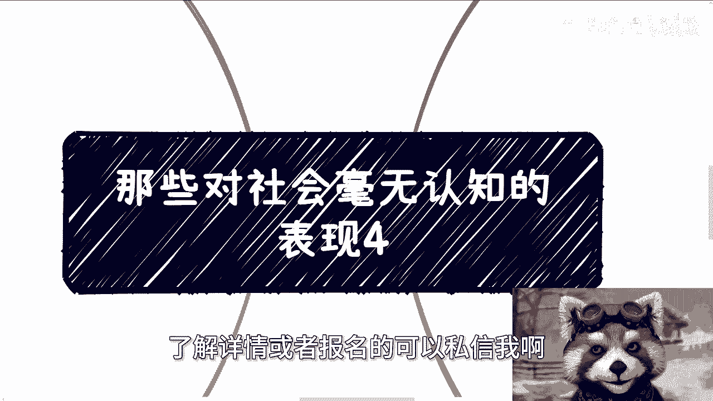
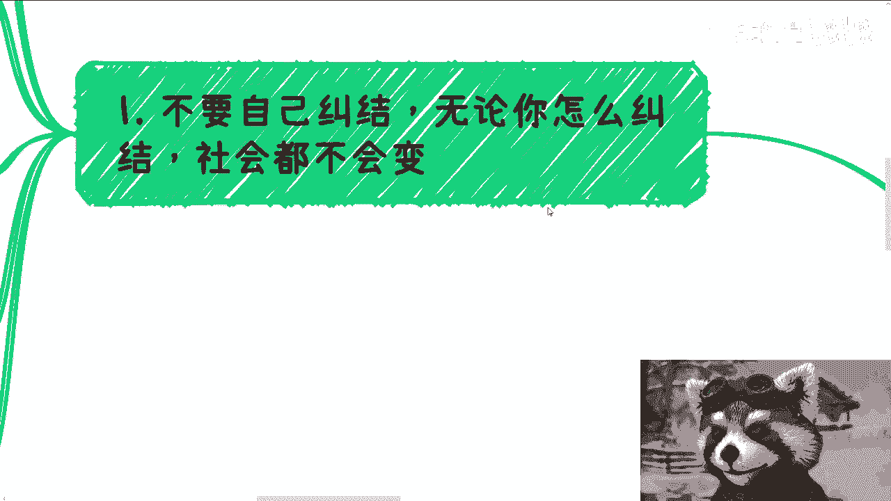
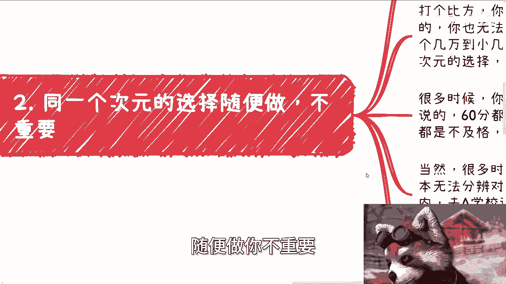
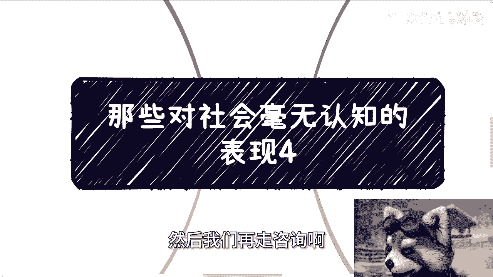

# 那些对社会毫无认知的表现4 - P1 - 赏味不足 - BV1ui421k78o

好大家好，这个我们继续来讲这个主题啊。

首先武汉活动已经定了啊，我这边忘记写了啊，无所谓啊，我跟你们说一下，反正5月12号好吧，下午01：30到六点啊，然后武汉到时候有空的好吧，大家来报名啊，呃可以私信我和呃。

呃这个了解详情或者报名的可以私信我啊。

那么今天我们继续来讲呢，对这个社会毫无认知的表现，四啊呃今天可能比较抽象啊，这个大家我不知道能听懂多少啊，第一呢就是不要自己纠结啊。

你你要你永远要明白一点，就是无论你怎么纠结，社会都是不会变的啊，就是说你格局放大，什么叫放大，就是不要因为任何事情去消耗自己，比如什么家庭啊对吧，就是有的人跟我说什么跟跟父母闹矛盾了对吧。

然后大家会很不开心了，对吧啦吧啦吧啦吧啦，那我不你要这么想啊，我不管你开不开心，谁会管你开不开心呢，对不对啊，然后呢对吧，你你开心好不开信号，然后呢社会会变吗，它不会变，就是你开心好不开心好。

你只会浪费你自己的时间对吧，然后你浪费自己的时间，是你会沉浸在里面，你会怎么样怎么样，你你会觉得啊就是你你就是这个世界，就像钢之炼金术师里面说零就是一，一就是零对吧，就是说就是说你呃好像是说一是世界吧。

还是世界是一啊，反正就这个意思啊，但是你要这么想，就是不管你自己到底觉得你多伟大，或者是你怎么样，但是我们的确影响不了整个大大环境，对不对，那么你除了浪费自己时间，除了在那边内耗以外没有用。

所以说你这种这个情绪，你只会在最后让自己成为，99%的这种消耗品当中的一员都没了，你还能干嘛呢，对不对，那首先这是第一个，第二个任何事情再怎么难，过去了，就是过去了，你不要让过去影响现在。

更不要去影响未来，就是说没有人能预测未来是什么，你比如说高考你没考好，然后你父母就PUA你啊，你未来没了，你未来一片黑暗对吧，你比如说考研，你没考好好，身边的人也觉得一片黑暗对吧。

比如说你找工作没有找到个好的好，你妈你身边的人又觉得我，你以后赚不到钱，我他妈奇了怪了，这是怎么了呢对吧，我跟你讲，还是那句话，我不管你是相信玄学还是不相信啊，我也不关心你，是听他们的，也好。

不听他们的也好，但凡你只要受到这种东西的影响，我跟你讲啊，你这些东西你只要会受到他们的影响，那么你就会成为99%这种消耗品，招用一元，就我们不用管，你当中到底经历了什么，不重要，反正你最后就是消耗品。

你自己要想的是什么，你自己要想的是，你到底想不想去想办法去成为那1%的人，或者说想不想突破这个瓶颈，你要但凡不想，那你设置都不用内耗，有啥好内耗，我他妈摆烂不行吗，对不对，诶，我妈奇了怪了对吧。

你你过去过去了怎么了呢，怎么了呢对吧，你跟我说有因果关系好，那有什么因果关系呢，那照你这个说法，所有好学历的人都能赚大钱，所有学历不好的人都赚不到大钱，是不了，你到时候看看是不了，对不拉你。

你既然没有这种因果关系，你为什么要去，哎呀，我的妈，这真真真的啊，然后就是说呢，随便你因为什么原因，你格局都要放大，你要明白啊，除了你自己，别人都干涉不了你的未来，但是你会被影响到，你知道吗。

只有你会被影响到，那么你自己被影响到之后，那么你就会去影响你自己的判断选择，然后甚至自暴自弃，那么这个时候你的未来一定会被影响，因为你自己影响他，不是别人影响他对吧。

但是你最后可能会归咎于别人影响他对吧好，那当然啊，我知道很多小伙伴都要说了啊，道理都懂啊，但很难做到，我跟你讲也是一样的道理，什么意思呢，你说你很难做到，你很难做到，就是大部分人的常态。

如果你也很难做到，那么你只会成为99%消耗品当中一员，不就这么简单吗，对你有啥好想的呢对吧，你无论我不管你今天有什么样的理由，你你最终不就这个结果吗，对吧，你纠结也好，不纠结也好。

你哪怕能够花一天的时间跟我在那边讨论，这有什么用呢，我跟你讲啊，没有办法的配件问题，你多问问你能不能准确的去解决，不能就不要纠结，继续寻找解决的方案，如果那个找不到，那就算了对啊。

当然你寻找方法也得有足够的格局，而不是说赚牛角尖，你明白吗，就像好像我们说的，你说有很多人可能高考没考好，或者现在可能有些有些这个呃这个学历啊，或者其他各个方面不如人意的对吧。

那你要寻找的方式在这个社会上很多很多，而不是就钻牛角尖说哎我就要去拼学历。

我就要他妈不拼了，死命就得去拼，那你怪谁呢。

对啊，然后第二点是什么呢，就是同一个资源的选择，随便做你不重要。

真的不重要，什么意思啊，当然也不是说随便做，就是不能太纠结啊，你要纠结的应该是不同次元的选择，什么意思呢，打个比方，你比如说你选择A和选择B，从行为上来讲都是打工啊，你也无法积累自己的关系。

或者说你积累出来的都不算关系啊，然后钱的话呢，也就差那么个几万到小几10万这个样子，或者小十几万这个样子，你可以纠结一下啊，但是我告诉你，这还是同一个次元的东西，不用太去看重对吧，你要是告诉我。

你就差这几万或者小几10万，那我跟你讲，你也不用再来讨论，你也不用再去想了，你这辈子就这样了，你明白吗，你格局就这么大，你能成什么事啊，我跟你讲，很多时候你面临的选择都一样的。

也就是我说的60分都不到的选择，无非就是40分和50分的区别，反正都是不及格，你非要分个好坏出来，你让我说什么呢，对吧，就就就你真的就是你在我看来都不及格，有啥好选对吧，或者在社会看来都不及格。

有啥好选的，当然啊，很多时候你会发现问题其实根本不在这里，在于哪里呢，在于你根本就无法分辨哦，对未来造成的影响是什么，比如说你说陈老师，我要出国还是在国内去A学校还是去B学校，去A公司还是B公司。

选择A专业还是B专业，唉你想想看啊，你说你面临这些选择，你根本无法判断出未来的影响是不是次元诶，是不是一个次元的，那么上面这些东西就等于白说，对不对，好好好，那么我就问你，你有没有想过一个问题。

你都没法判断，那就说明你根本就不了解，对不对，那就说明你根本就没有足够的信息，对不对，那就说明现在就像，就像一个就是很无知的婴儿，对不对好，那么就说明你根本就没有能力去突破这个次元，对不对，对不对啊。

你如果来说你根本就没有这个能力，反而你跟我说哦，我选择A或选择B我是能够突破的，这他妈就是个悖论，你想想看有没有这种可能性啊，没有的啊，根本就不存在，你明白吗，你还纠结个屁对吧，第三最难的就是圈子。

别的其实都还好，什么意思呢，就是进入社会之后，你会发现我跟你讲别的都不重要，真的都不重要，只要你有足够多的经验，你会发现这些东西都不重要，重要的只有圈子啊，当然你可能通过这个点啊，你可能会跟我以前一样。

有一定的自我怀疑，怀疑什么呢，怀疑就是说是不是自己有问题，为什么怀疑自己有问题啊，就是因为碰见人总是不靠谱，或者说总是性格不合，或者说做事情观念不合，或者说啊可能就他妈没什么不合，就纯粹觉得对方是啊。

我跟你们这么讲，不用怀疑，为什么，因为我们生活生长的圈子就是如此，我们的投胎就投成这个样子，我们一开始接触的大面积就是如此，我跟你讲，这不是我们的问题，这是老百姓的通病，你没什么好去怀疑的啊。

所以你要做的一切就是，拼了命的去脱离这种低级的圈子，去切入到别的选择，然后积累属于自己的业务，赚到属于自己的那部分钱，那么当然这个时候又有人要说了啊，他说那是不是考公务员就有优势，我跟你讲啊。

这事就跟你跟我说，你去做销售是不是有优势是一样的，你要明白一点啊，首先你们只不过是觉得貌似这个岗位或者方向，比普通老百姓或者普通的岗位离得比商啊，就是比商业来的呃，就离商业比较近，或者离赚钱比较近。

对不对，但是问题是你用膝盖想想想看啊，你要做，你要是做销售或者公务员就能够进圈子，那他妈今天中国的圈子也太不值钱了，或者说这圈子也太好进了，你觉得可能吗，对不对，没有可能的，你要进圈子。

最终还是看你的价值，不是看你的这个身份，你单纯说我就是个基层公务员，或者你是个销售，这种身份没有用的。

就是都是寄人篱下的，你懂吗啊，然后最后一点也是很重要的，叫做分不清虚和实啊，就是说这事儿你得分清楚，你分不清楚，你看问题，看社会，看事物，你甚至都会颠倒，什么意思啊，就是社会层面，什么叫实。

所谓实就是赚到钱，就是实合法和V就是实，别的都是虚的啊，当然你可以不这么认为，可不可以可以，那是你的事情，但你不能用你的想法去左右社会，不能用你的想法去左右所有的人对吧，你但凡分不清楚，你说你跟我说。

你说妈的这些赚钱的人都是很实的，然后不屑一顾，没问题啊，你可以觉得大家都很虚，你也可以觉得大家都是，没问题的，结果呢我就告诉你这些虚的人都能赚到钱，你一个识的人不行，然后呢搜对不对啊。

你用自己的实去社交，去积累关系，去沉淀，最终说别人不认可，或者说最终自己还赚不到钱，被别人当枪使，被别人当工具人用，然后开始抱怨，但你有没有想过一个问题，很多这些事情并不是大环境造成的，是你自己对吧。

不会变通造成的，你要你在社会上你要明白一件事情啊，我们大部分人啊，大部分人大部分普通人做的几件事情是什么，第一你要先活下来，第二你要融入这个社会，了解它的规则，第三等你了解完了，有立足之本了。

你活下来了，你再去考虑对跟不对好。

再去考虑你怎么改变，你不要上来就跟我讨论怎么怎么对跟不对，或者你甚至自己跟自己在那边说，哎我觉得这个事情不对对吧，我觉得这个事情怎么样，随便你，我跟你讲。

我跟你讲真的随便，你就是嗯就像我一开始说的，你纠结也好，你判断对跟不对也好，你去想那些有的没的也好，你去就是就是就是就是去遵循那些人家说啊，这个学历很重要，或者怎么样，很重要的那些话也好，随便你。

你无非只会成为那99%当中的一员，就这么简单，这些东西都不重要，因为，干嘛OK好，然后武汉活动好吧，报名继续报啊，然后那个呃呃商业规划，职业规划啊，然后分红啊啊啊合作啊对吧，融资啊对吧。

包括商业计划书啊，啊包括你们手上有什么牌啊对吧，希望通过我的这个视野，通过我的一些认知，能够给你们去做更好的规划的好吧，那么你们也可以整理好自己的问题。

