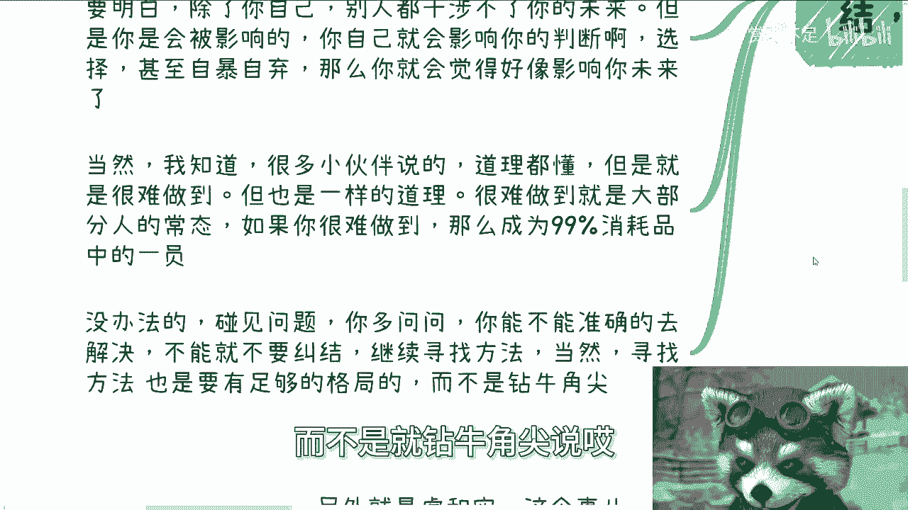
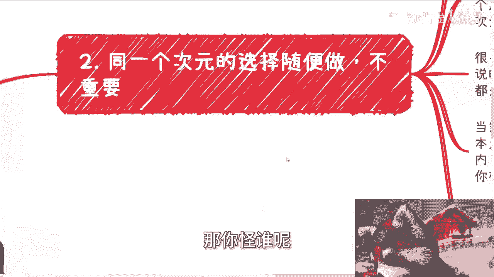
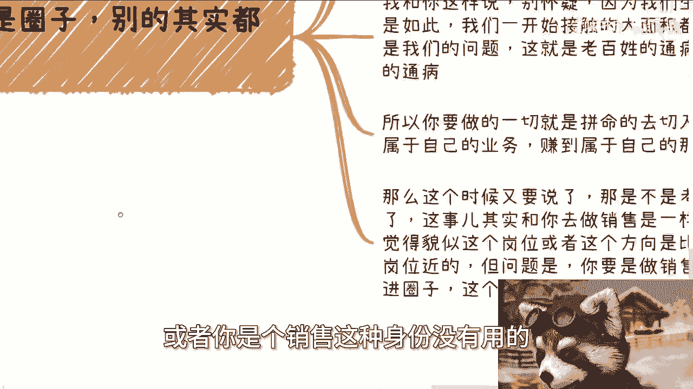
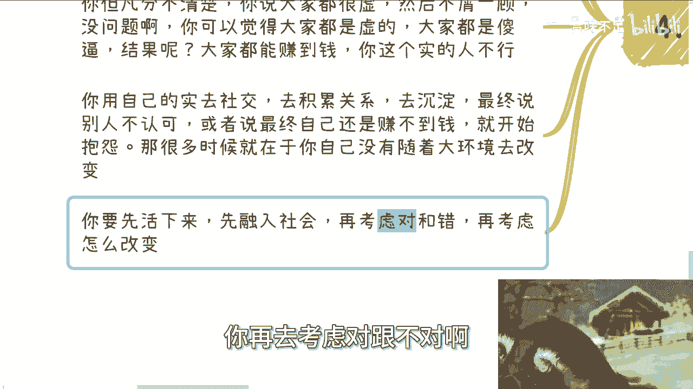
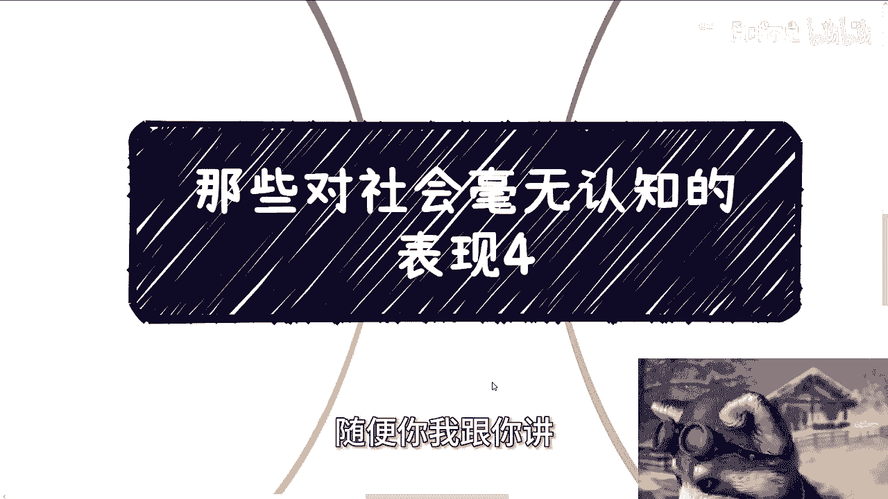

# 课程名称：对社会毫无认知的表现（四）- 第1部分 🧠

在本节课中，我们将探讨几种对社会缺乏深刻认知的具体表现。这些表现往往阻碍个人成长与发展，理解并避免它们，是提升社会适应能力的关键一步。

---

## 1. 停止无谓的纠结与内耗 🛑

上一节我们介绍了课程主题，本节中我们来看看第一个表现：过度纠结与自我消耗。

无论你如何纠结，社会都不会因此改变。格局放大的含义是，不要因任何事消耗自己，例如家庭矛盾或个人情绪。你的开心与否，社会并不关心。社会不会因你的情绪而改变，你只会浪费自己的时间并陷入内耗。

这种情绪最终只会让你成为那**99%的消耗品**中的一员。任何事情一旦过去，就让它过去。不要让过去影响现在，更不要让它影响未来。没有人能准确预测未来。例如，高考、考研失利或求职不顺，都不意味着未来一片黑暗。

关键在于，你是否会受到这些负面观点的影响。一旦受影响，你就可能滑向那**99%** 的群体。你需要思考的是，是否愿意努力成为那**1%** 的人，去突破瓶颈。如果不想，则无需内耗。

除了你自己，别人无法干涉你的未来。但你会被外界影响，进而影响自己的判断、选择，甚至自暴自弃，最终你的未来确实会被影响——但这影响源是你自己。

很多人会说“道理都懂，但很难做到”。这本身就是大部分人的常态。如果你也“很难做到”，那么结果就是成为那**99%** 的一员。这没什么可多想的。

以下是面对问题的正确思路：
*   遇到问题，先问自己能否准确解决。
*   如果不能，就不要纠结，继续寻找解决方案。
*   如果找不到，那就暂时放下。
*   寻找方法时要有足够格局，而非钻牛角尖。

例如，学历不理想时，社会上存在许多提升路径，而非只能钻牛角尖地“死磕学历”。

---

## 2. 同一层级的选择无需过度纠结 ⚖️

理解了停止内耗的重要性后，我们来看第二个表现：在同等价值的选择上过度纠结。

对于同一资源层级的选择，不必过于纠结。真正应该纠结的是不同维度、不同层级的选择。

举例来说，选择A工作或B工作，本质上都是打工，都无法积累有效资源或人脉，薪资差距也仅在几万到十几万之间。这属于同一层级的选择，无需过分看重。如果只纠结于这点差距，那格局就太小了。

很多时候，面临的选择在本质上都不及格（例如40分和50分的区别），都属于**不及格（<60分）** 的范畴，没有必要费力区分优劣。

问题的核心往往在于，你根本无法判断不同选择对未来造成的维度性影响。例如，出国还是在国内、选A学校还是B学校、去A公司还是B公司。

如果你无法判断，那就说明：
*   你根本不了解这些选项。
*   你缺乏足够的信息。
*   你目前没有能力突破现有层级。

既然没有能力突破，却幻想通过选择A或B就能突破，这本身是个悖论。在这种情况下，纠结毫无意义。

---

## 3. 圈子的价值远高于其他 🎯

在厘清选择纠结的误区后，我们进入第三个关键点：圈子的重要性。

进入社会后，你会发现许多东西都不再重要。只要积累足够经验，你就会明白，真正重要的是**圈子**。

你可能会因此自我怀疑：为什么总是遇到不靠谱的人，或总是观念不合？无需怀疑。这是因为我们出生和成长的初始环境便是如此，这是许多人的共同起点，并非个人问题。

因此，你要做的就是**拼尽全力脱离低级圈子**，切入更优质的圈子，积累自己的业务与资源，赚取属于自己的财富。

有人会问，考公务员或做销售是否更有优势进入圈子？这就像认为某个岗位离钱更近一样。但请思考：如果仅凭公务员或销售的身份就能轻松进入核心圈子，那这个圈子也太不值钱了。

进入圈子的核心是**你能提供的价值**，而非你的表面身份。一个基层公务员或普通销售，如果无法提供独特价值，依然是寄人篱下。

---

## 4. 分清社会的“虚”与“实” 💎

最后，我们探讨一个至关重要的认知：分清虚实。

在社会层面，所谓“实”就是指**赚到钱**，合法合规地赚到钱就是“实”，其他多为“虚”。你可以不认同，但你不能用个人想法去左右社会规则。

如果分不清虚实，你看待社会、事物的角度就会颠倒。例如，你可能鄙视那些“虚”但能赚钱的人，坚持自己“实”的处事方式。结果往往是，那些“虚”的人赚到了钱，而你却不行。

你用自己“实”的方式去社交、积累关系，最后可能不被认可、赚不到钱，甚至被当作工具人，然后开始抱怨。但有没有想过，这或许不是大环境的问题，而是你自己不懂变通造成的？

在社会上，普通人需要按顺序完成以下几件事：
1.  **先活下来**。
2.  **融入社会，了解规则**。
3.  在活下来并有所立足之后，**再去思考对错与改变**。

不要一开始就纠结事情的对错。无论你是纠结、判断对错，还是盲信“学历决定论”等观点，如果分不清虚实、不懂变通，最终很可能只会成为那**99%** 中的一员。

---

## 总结 📝

本节课我们一起学习了四种对社会缺乏认知的表现：
1.  **无谓纠结与内耗**：社会不因个人情绪改变，停止内耗，聚焦解决方案。
2.  **过度纠结同级选择**：在同一维度选择上不必费力区分，应关注能否实现层级突破。
3.  **忽视圈子的核心价值**：脱离低级圈子，凭价值而非身份进入优质圈子是关键。
4.  **混淆社会的虚实**：合法赚到钱是“实”，先适应规则生存，再求发展与改变。

理解并避免这些表现，能帮助你更清晰地认知社会，做出更有效的决策。