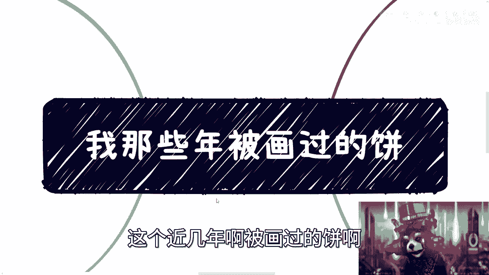
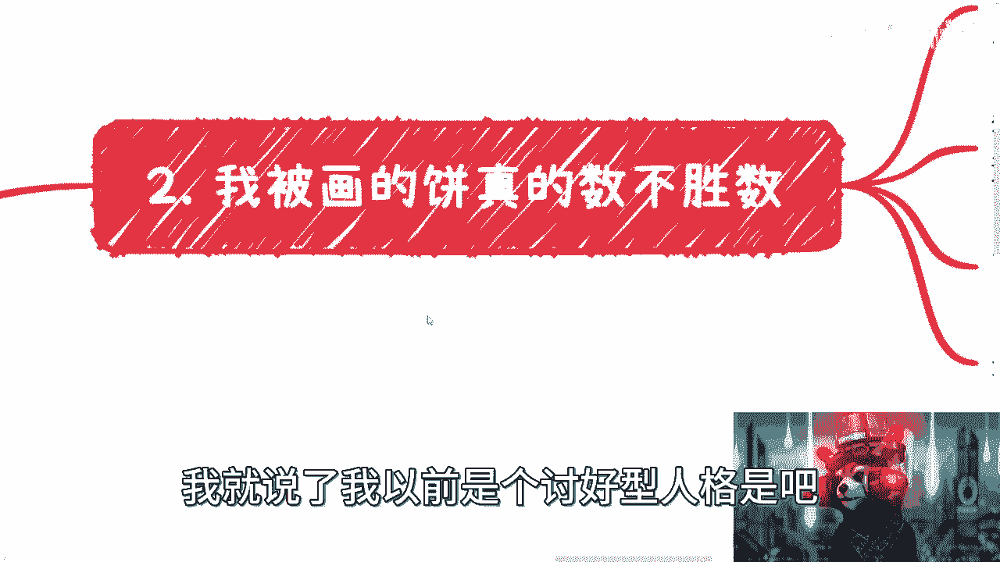
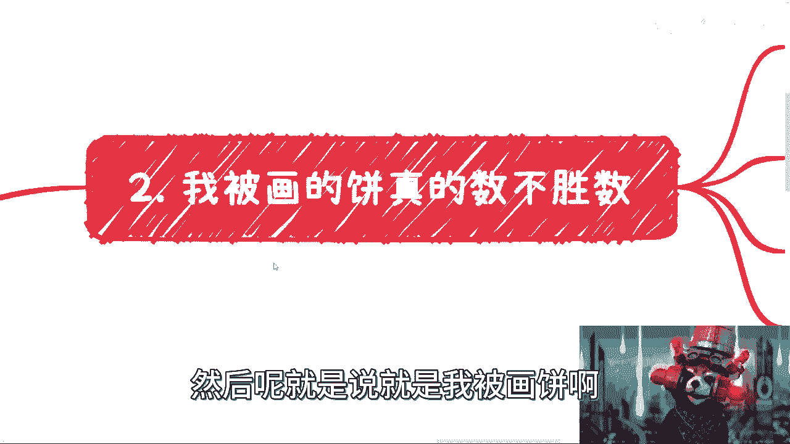
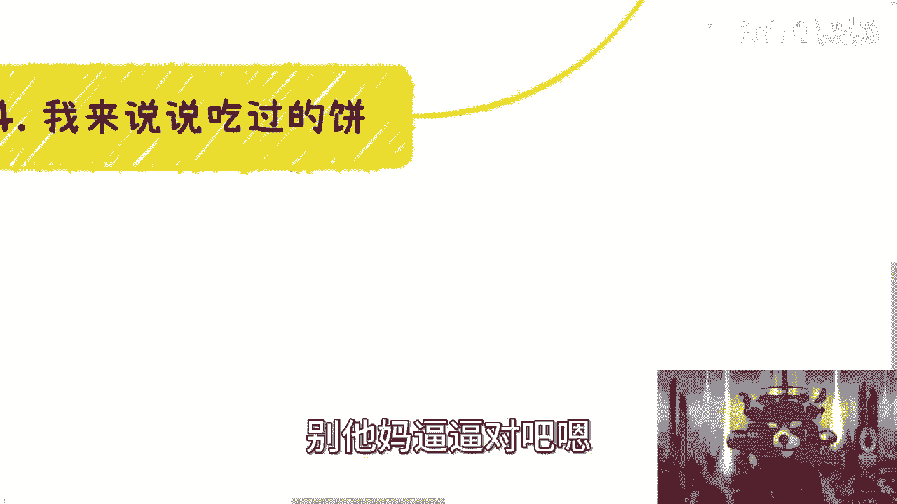
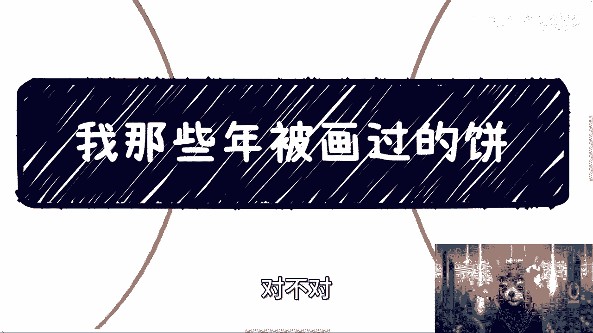
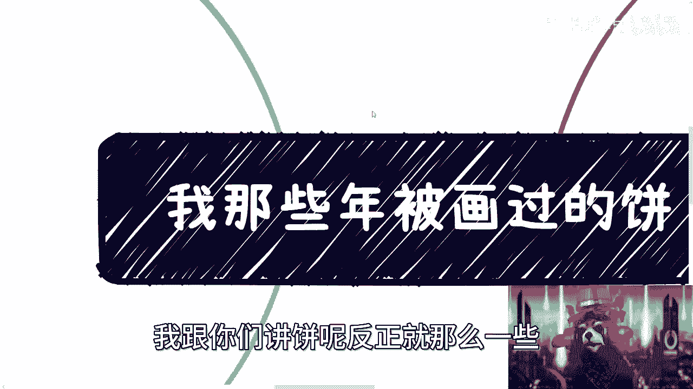

# 课程：那些年我被画过的饼 - P1 - 赏味不足 🥧

在本节课中，我们将一起回顾和分析作者在商业与个人合作中遭遇的各种“画饼”经历。通过剖析这些案例，我们将学习如何识别不切实际的承诺，并建立一套保护自己免受欺骗的实用原则。

---

## 课程概述与开场白

作者以轻松幽默的方式开场，预告了未来录制游戏视频的计划，并分享了近年来在商业合作中被“画饼”的经历。他首先澄清，分享这些扭曲的社会现象，是为了让大家了解现实并学会应对，而非宣扬这些行为本身。

---

## 价值观澄清与背景介绍

上一节我们介绍了课程的开场，本节中我们来看看作者对自身价值观的澄清。

作者提到，曾有评论认为其视频内容“虚”或“价值观不正”。对此，作者明确表示：他所讲述的内容**仅用于描述这个扭曲世界的现实**，目的是教会大家如何应对，**并不代表他认同或宣扬这些行为**。他希望大家能保持初心，分辨清楚。

> 核心观点：描述扭曲 ≠ 认同扭曲。

---

## 个人性格转变：从轻信到警惕

在澄清了基本立场后，我们来看看作者个人心态的转变过程。

作者自称过去是“讨好型人格”，容易相信他人，甚至因未及时回复消息而自责。那时，他对别人描绘的蓝图充满憧憬，常常“用爱发电”，幻想即将“财务自由”。

然而，多次希望落空、“一地鸡毛”的经历，彻底改变了他的态度。现在，他对未经证实的信息持高度怀疑态度。

以下是作者总结的当前处事原则：

*   **信任凭证**：只相信具有法律效力的文件，如**红头文件**或正规的**官方合同**。
*   **行动前提**：要求对方**先支付报酬**或提供明确的付费合同。
*   **质疑人脉**：对声称“认识某某大佬”的说法一律存疑，认为这通常是“狐假虎威”。
*   **关注实质**：不关心过往“战绩”，只关心当前合作**如何赚钱、赚多少钱**。
*   **拒绝白嫖**：将不付费就索要详细方案的行为视为“白嫖”。

当然，作者也提到两种他愿意“用爱发电”的例外情况：一是思路清晰、态度认真的请教者；二是资金有限的高校师生（出于支持教育的目的）。

---

## 常见“画饼”类型案例分析

了解了作者的原则后，本节我们通过具体案例，来看看几种典型的“画饼”套路。

### 1. 伪装淡泊，实则牟利
有人合作时声称“不在乎钱、不图名”，但使用手段排挤他人后，自己便开始“赚钱割韭菜”。这揭示了**言行不一的虚伪性**。

### 2. 虚构人脉，狐假虎威
许多人吹嘘自己在各部门都有“硬关系”，上下都能“搞定”。但作者经验是，**真正有实力的人往往低调**，四处炫耀的大多是拉虎皮扯大旗的骗子。验证方法很简单：**`查证(声称的人脉) == 空集`**。

### 3. 空谈项目，不见落地
对方描绘前景宏大的项目（涉及高端品牌、前沿科技等），并让你不断进行免费咨询、输出方案（“用爱发电”），但始终没有合同与资金到位。这本质是**榨取你的智力劳动**。

### 4. 滥用头衔，混淆视听
利用名校（如MIT、北大）或权威机构的名头进行包装，但实际参与者可能与项目领域毫无关系。关键在于**核实头衔与项目的相关性**，而不仅是头衔本身。

### 5. 利用权威，逃避支付
以“政府/大国企项目”为名，要求先出方案，却拒绝签订载明金额、付款时间的正式合同，仅提供无实质约束力的“框架协议”。作者的观点很明确：**`合作价值 > 0 且 正式合同 == 空 ? 拒绝合作 : 继续推进`**。

### 6. 许诺空头股权与职位
通过许诺“股权”、“法人代表”、“VIE架构”等听起来很厉害的权益来画饼，但**不涉及任何即时现金报酬**。需要警惕：注册公司成本低，法人可能担责，股权可能一文不值。

---

## 核心原则总结与课程结尾

回顾了这么多“画饼”案例后，我们来总结一下最核心的防御原则。

作者再次强调，在当下复杂的环境中，**“先看到钱（或具有法律效力的支付承诺）”** 是一条能避免内耗、减少弯路的实用原则。这并不是提倡唯利是图，而是一种高效的筛选与自我保护机制。

> 最终建议：对于所有“饼”，坚持 **“无证明，不行动；无实质，不轻信”**。

---

本节课中，我们一起学习了多种商业“画饼”的常见手法，包括伪装淡泊、虚构人脉、空谈项目等。更重要的是，我们建立了一套以**要求实质凭证（合同、预付款）和关注当下变现路径**为核心的防御策略。希望这些经验能帮助你在未来的合作中更好地保护自己的权益，直击核心，减少无谓的消耗。