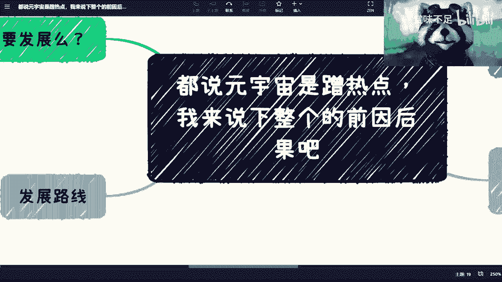
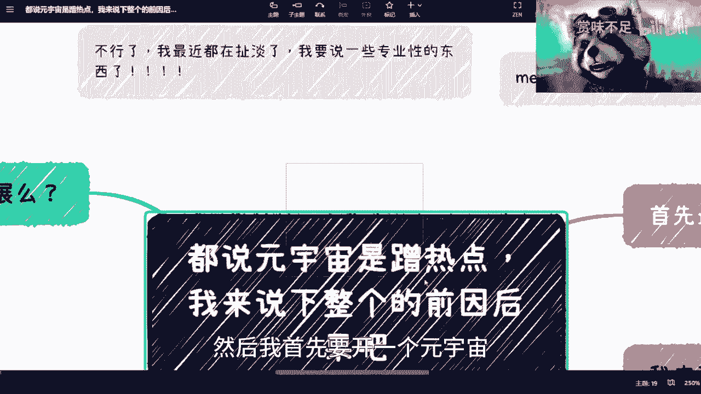
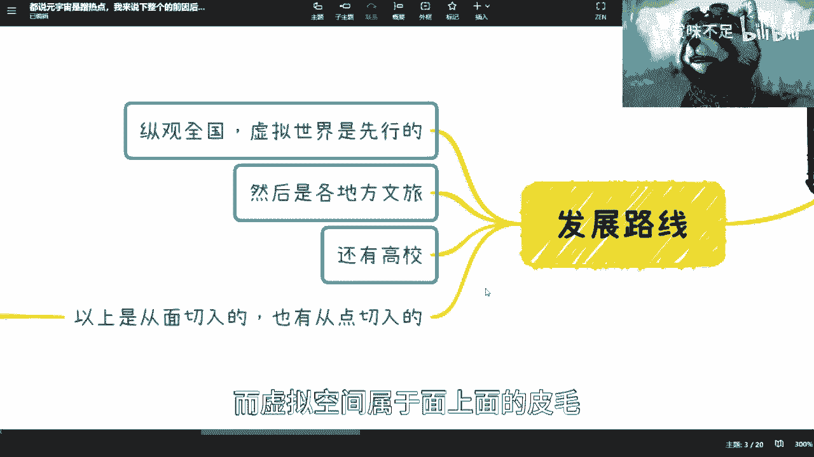
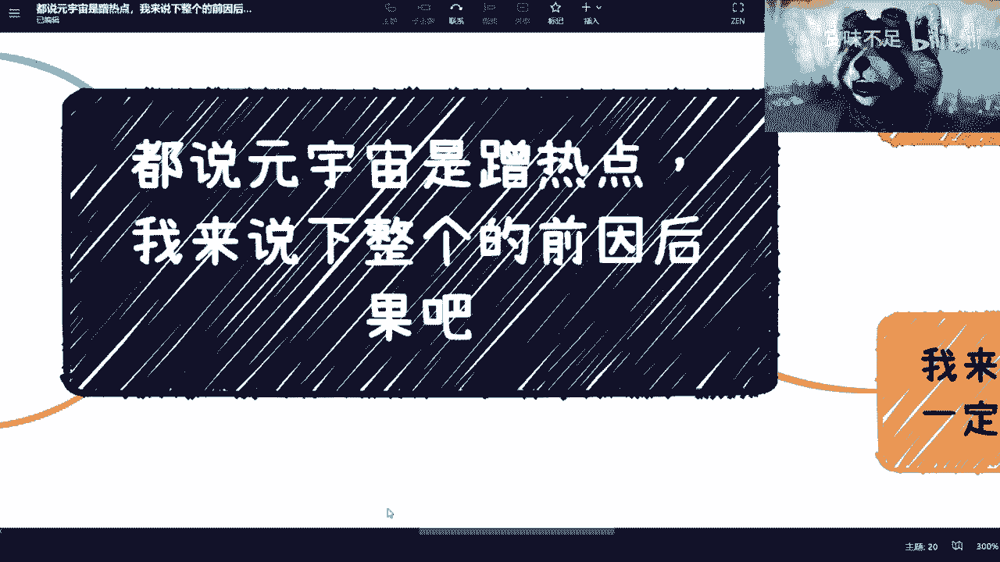
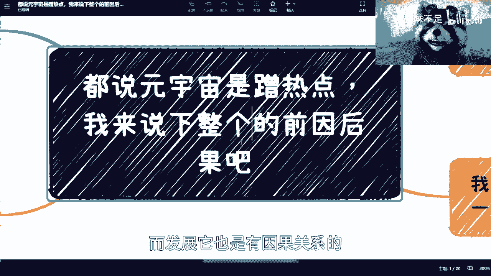
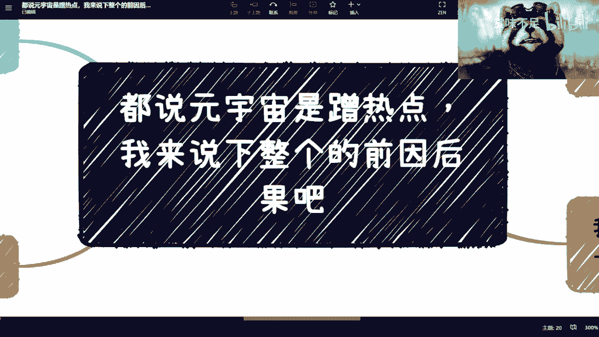

# 都说元宇宙蹭热点，我要专业的说下前因后果 - P1 - 赏味不足 - BV1No4y1s7aa

好了我要来讲正事了啊，我觉得我最近扯淡扯的太多了，我要讲一些专业性的东西来体现出我的专业性。

这个不能老是扯淡是吧，呵呵呃，然后我首先要开一个元宇宙。

一开始的这么一个内容，这个内容呢呃你我可以我敢很有自信的打保票，你们在网上找不出任何一个是跟我观点一样的，为什么，因为没有人综合的和我一样，这么的贴近行业和政府。

就这么个情况好吧，然后呢有很多人一定会说matter对吧。

就facebook的事，这个我下次单独再跟你们说这个事情，这个事情不是你们你们面上看到这个样子的，好吗啊。

ok那首先是这样子的，你们先等着慢点喷我啊，等等听完我讲的。

你们再喷我好吗，第一源于一本书叫雪崩，我就不废话了，这个词所有人都会说对吧好，然后我这边推荐一个动漫对吧，就是这个边缘行者啊，我觉得这个就是也是拍的非常好的，然后呢能给大家展示一个真正的一个未来的。

这个赛博朋克的这么一个样子啊，但是我这个地方提一点这个动漫，我建议大家看之前可以先做一下心理准备，因为这个动漫看的看的非常的压抑，我觉得看完后劲很足啊，我有一说一啊，你看完不开心，别来找我啊。

然后呢关于我说一下这个前因后果，首先呢我要说一下国内做元宇宙的原因啊，但不一定对啊，你们听姑且听之啊，好吧姑且听之啊，首先元宇宙是一个综合体，你知道吗，就是说工工业互联网，物联网对吧，通信设备。

区块链源，云计算，a r v r大数据等等等，其实都是可以涵盖率里面的对吧，这毫无疑问啊，好，第二如，既然这些上面这些乱七八糟的东西都要发展，对吧，那么我们说无论哪个国家在这个世界里面。

它也是一份子对吧，那么他去切合一个全球的一个方向，我觉得这也无可厚非啊，这点没什么可说的啊，也没什么可喷的啊，我觉得这也正常啊，然后呢嗯还有一个关键点是什么呢，就是是这样子的，你们要明白一点啊。

咱们客观的说啊，普通老百姓和政府的地方，政府里面的那些叫做执行层，或者地方政府的那些官员，你说他们会对有很多技术，有就是那种具象化的认知吗，不会你明白吗，就比如说你问他，你说物联网他知不知道知道。

那你问他物联网怎么发展，他肯定不知道啊，你问他区块链是什么啊，这三个字我看到过的，你问他这个东西是什么，他也不知道对吧好，我跟你们讲，为什么要谈元宇宙，是因为元宇宙对于普罗大众跟政府官员来讲。

他比较好理解，你们明白吗，就是，就是就是就是给予一个比较方便的方向对吧，而不是说就说我给你们解释半天的一个方向，虽然大家的目标虽然是一样的，但是就是就好理解会好很多，你们明白吧对吧。

首先这个是一个大前提，你知道啊，那么接下来有人问他说元宇宙还要不要发展，那我跟你讲废话，当然要发展，为什么，因为本质上还是那句话，叫不叫元宇宙不重要，你知道吗，因为元宇宙为什么这么叫。

他可能只是因为matter或者最早的时候，海外它叫memetaverse，然后就就就转到，比如说啊translate就翻译到中文，可能就叫这个名字，就叫什么不重要，你知道吗啊。

然后呢就是说它所有的其实都是基础设施，就是元宇宙里面所提到的其实都是基础设施，就是你谈或不谈他都要发展的，嗯对吧好，这是第一点啊，第二点既然没有一个明确的定义，那么其实所有的东西都可以往远处上面靠。

这也是为什么很多人会觉得，元宇宙在在是一个伪命题，或者是一个蹭热点的东西，是因为它本身没有一个明确的方向，而且它本身就是个集合，就我们从软件角度，它叫集成平台对吧，他只有一个集成产品。

那你说他作为一个集成产品，你总不能说它的集成的这个子类是网啊，它是在往它集成子类上靠，这个也不合适对吧，因为他本来就是个机身产品，你不能说它是靠，对不对，好这第二点第三点，为什么a r vr谈的最多。

minecraft这种弹的最多，你们想想看，为什么，很简单，是因为还是回到那句话，是因为普罗大众麻瓜以及政府的那些官员，他们是不懂原理就是什么的，但是他们虽然不懂，但是他们要做吧，对不对，好。

那怎么做呢，为了说服投资人，为了说服就是c端对吧，用户你你认为韭菜也可以，那他一定要去说对方听得懂的话，对不对，好，那对方听得懂是什么元宇宙，不好意思，听不懂a r v i听得懂吗，哦这个我懂的对吧。

穿戴式设备啊，虚拟空间啊，呸虚拟现实对吧啊，然后minecraft minecraft更懂了对吧，我给你录段视频，你这小朋友都在玩是吧，为什么是因为他要用对方理解得了的语言，你知道吗。

那为什么你们再仔细想想看，为什么这个地方的物联网啊，通信设备啊啊通信设施啊都要的区块链，也要云计算，也要大数据啊，为什么他们不说呢，因为他们说了，对方理解不了啊对吧，你怎么理解，你怎么你你你哎发呃。

费口舌跟人家去去争论对吧，这就好像我现在跟你们讲这个谚语，就如果啊我跟这个网上所有的视频讲的一样，你们肯定喷我啊，陈老师牛扯淡对吧，你在蹭热点是吧，但是我要告诉你们的是事实是怎么样的啊，你要明白。

包括facebook这个回头再说好吧，然后我跟你们讲发展路线为什么会这么发展，基于这个前提，那那那看好基于这个前提，发展路线怎么发展的呢，纵观全国虚拟世界是先行的，为什么，因为这个好理解啊对吧。

而且这个用很多游戏的技术好实现啊，我就换层皮怎么了呢对吧，我以前叫我以前叫游戏，我现在叫元宇宙怎么了呢对吧，那我跟你讲是因为为什么，是因为这个就上下文是这样子的，你知道吧。

二为什么各地方文旅厅会这做的比较多，是因为文旅它是一个就是营销的地方，它是一个需要旅游需要流量的地方，那他肯定你说他蹭也好对吧，或者说由于疫情对吧，大家出不了门，你说文旅厅要去做虚拟的元宇宙的。

这个叫什么旅游景点，我觉得也make sense对吧，就也合理嘛对吧，你也不能说他蹭啊，当然他有蹭的嫌疑是吧，好那第二点，第三点就是那些高校，高校我跟你讲也跟疫情有关，你可以你去看港中港中大对吧。

还有m i t他们做了那个也不叫做了吧，就他们在那个mcraft里面做了一些，这个毕业典礼对吧，我觉得也一样，就是你说他蹭吧，我觉得有那么一两成对吧，但是八成呢还是因为这个疫情的关系，大家没法毕业啊。

呸大家没法毕业典礼是吧，那这个我觉得这个这个你也合理啊对吧，你不能硬碰人家是吧，好然后最后一点是什么呢，我看我讲了几分钟，哎，你看这个这个就很好，我很短就能讲完，大家我跟你们讲。

我讲的你们一定听得懂对吧，因上下因果关系，我就帮你分析清楚了啊，我跟你讲最后什么意思啊，以上这些都是从面切入的，也有从点切入的，我告诉你们从点切入是什么东西，你们就知道了，叫数字藏品。

你知道吧啊这个叫做以点切入，为什么呢，因为很简单啊，数字藏品也是虚拟的，它也是元宇宙里面的一个原子化的产品，那当然了，先不说是数字藏品好不好，大家先不要说他割不割对吧，或者运营模式怎么样。

我们从客观的角度来讲，这个东西以后我跟你们讲，你们还会打交道的啊，不会没有的，还会打交道的，只不过他以后可能不叫藏品，它以后叫数字资产，或者呃数字数字化的数据对吧，或者说数据数字化对吧等等等。

就很多别的名词对吧，那这个东西为什么要有，是因为整个元宇宙的这个生态里面，或者未来网的生物，未来互联网的这个生态里面，他一定就会有这个东西啊。

他一定就会有这个东西，就是就是我跟你们讲，为什么啊，是因为我们现在说的互联网其实他没有，就是就是它更多是一个这个基础设施嘛对吧，就是它没有达到一个，就说就说我完整的一个世界。

或者完整的一个经济模型或者完整的一个生态，它没有，你知道吗，那如果我们说假以时日以后有了，那么这个世界里面的东西它其实也应该有版权，也应该有产权，也应该有归属对吧，也应该有对应的这些货币。

也应该对应有经济模型，对不对，那如果来说我们说现实生活当中，你今天有一个鼠标对吧，比如说我现在拿了个鼠标，这鼠标是我的对吧，我有发票啊，我我有我有购买记录或者怎么样，那么在法律上他是说保护的，对不对。

那么我们说在元宇宙里面，他肯定或者说在未来的虚拟空间里面，他一定也会有一个东西是对应要对应到产权，对应到版权，对应到资产，对应到任何东西，只不过这个东西当下他还没有定义，因为它还不完善。

你知道吗，所以说呢就是说就是说还是那句话，就是你会发现其实这边的发展路线都是，只不过在未来的这个虚拟世界里面，是在嗯就是摸了些皮毛，就实现了一些皮毛哦，然后呢，数字藏品呢是属于就是说就点上面的皮毛。

而虚拟空间属于面上面的皮毛。

但是无论是点或者面，它都没有涉及到其这个世界的本质哦，核心就是我们刚刚说的经济系统啊对吧，包括这个这个这个这个这个嗯版权啊对吧，这个产权啊对吧，资产啊他都没有碰到。

为什么呢，因为两方面吧，一方面就是说法律的确可能现在不太完善对吧，大家也不看，不敢乱动对吧，这个第二方面呢也的确啊，就是说哎我为什么会录这个视频，就是因为我希望能跟大家讲清楚，就是这就是客观的看待他。

不要老是说到区块链就是骗局，不要说到宇宙就说蹭热点，你知道吗，就是这是有因果关系的，而发展它也是有因果关系的。

所以我跟你们讲，就是就是为什么你说没有人往下做，就是因为大众跟政府官员的认知就停留在表面。

你让他们怎么往下做，你知道吗，就这其实是变成了一个恶性循环，好吧好，那我就说到这儿好吧，你们听完了，你们再喷喷我啊，你们但凡在网上能看到任何一个，跟我观点一样的，我真的我很有自信，我跟你们讲。

唉真的操碎了心，就这么着吧好吧，回头后面我会把嗯，我想想对，我后面会把哎其实元宇宙也算在数字经济里面，我再把数字经济会会会会会慢慢展开的好吧。

