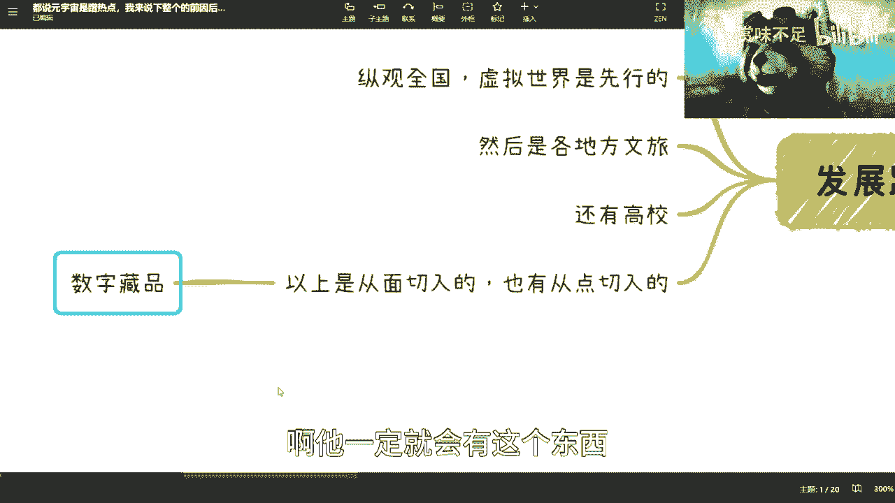

# 元宇宙课程 01：前因后果与本质剖析 🧠

在本节课中，我们将专业、客观地探讨元宇宙概念兴起的前因后果，分析其背后的技术本质、发展动因以及当前实践的特点。我们将摒弃情绪化表述，专注于事实与逻辑。

---

## 概述：为何要谈论元宇宙？

元宇宙并非凭空出现的概念。其兴起是多种技术发展、社会需求与传播策略共同作用的结果。理解其“前因”，才能看清其“后果”与未来走向。

## 元宇宙的起源与概念载体

上一节我们概述了课程目标，本节中我们来看看元宇宙概念的源头。

元宇宙（Metaverse）一词源于尼尔·斯蒂芬森的科幻小说《雪崩》。这个概念为人们描绘了一个庞大的虚拟世界。

在影视作品中，例如动漫《边缘行者》，也很好地展示了一种未来赛博朋克世界的样貌，这有助于公众理解虚拟世界的形态。但需要指出，这类作品情节可能较为沉重。

## 国内发展元宇宙的核心动因

理解了概念的来源后，我们进一步分析其发展的现实驱动力。

元宇宙是一个**技术综合体**。其涵盖的关键技术包括：
*   工业互联网
*   物联网 (IoT)
*   通信技术 (5G/6G)
*   区块链
*   云计算
*   增强现实 (AR) / 虚拟现实 (VR)
*   大数据

这些技术本身就是全球科技发展的重点方向。任何国家参与其中并契合全球趋势，是合理的行为。

一个关键点是，对于普通大众和地方政府执行层面的官员而言，“元宇宙”是一个比单一技术术语更好理解的**方向性概念**。

**公式：元宇宙 ≈ 技术综合体 (IoT + 区块链 + 云计算 + AR/VR + ...)**

与其费力解释每一项具体技术，不如用一个更具象、更易传播的“元宇宙”概念来统摄发展目标。名称本身并不重要，叫“元宇宙”或其它名字均可，其本质是推动**数字基础设施**的全面发展。

## 当前实践的特点与原因

基于上述“易于理解”的前提，当前元宇宙的发展呈现出特定形态。

由于元宇宙本身缺乏精确定义，任何相关技术都可以与之关联。这导致部分人认为其是“伪命题”或“蹭热点”。从软件工程角度看，元宇宙更像一个**集成平台**，而非基础创新。

那么，为何当前实践集中在某些领域？以下是主要原因分析：

因为大众与决策者需要能直观理解的具体形态。为了说服投资人或用户，从业者必须使用对方能听懂的语言进行描述。

*   **虚拟世界/空间先行**：这是最容易理解且技术相对成熟（基于游戏技术）的形态。将游戏“换层皮”称为元宇宙，是实现路径之一。
*   **文旅领域应用较多**：文旅行业需要营销和流量。在疫情等因素影响下，打造虚拟旅游景点具有合理性。
*   **高校用于虚拟活动**：如疫情中的虚拟毕业典礼，主要是特殊情境下的替代方案。
*   **数字藏品（NFT）作为切入点**：这是从“点”上切入的实践。数字藏品是元宇宙中**原子化的数字资产**。无论其当前运营模式如何，未来互联网生态中必然需要处理数字产权、版权和经济模型的问题。数字藏品是这方面的早期探索。

**核心逻辑**：当前发展多从“面”（虚拟空间）或“点”（数字资产）触及皮毛，尚未深入构建这个虚拟世界的**本质核心**——即完善的经济系统、产权规则与法律框架。

## 发展面临的挑战

那么，为何难以深入核心？主要有两方面原因：
1.  **法律与监管不完善**：对于数字资产、虚拟经济等新事物的法律界定尚不清晰，存在政策风险。
2.  **认知停留在表面**：如果大众和决策者的认知仅停留在VR眼镜或虚拟景点层面，就难以推动需要深厚技术和制度设计的底层生态建设。这容易形成一个“认知浅 -> 实践浅 -> 认知无法深化”的循环。

## 总结与展望

本节课中，我们一起学习了元宇宙概念兴起的多层次原因：
1.  它是一个易于传播的**技术综合体概念**，旨在推动底层基础设施发展。
2.  当前实践集中于**易于理解**的虚拟空间和数字藏品，是市场与认知条件下的自然选择。
3.  真正的元宇宙构建涉及复杂的**经济与法律系统**，目前尚处于非常早期的阶段。

我们应该客观看待元宇宙及相关技术（如区块链），理解其发展背后的因果关系，而非简单地贴上“蹭热点”或“骗局”的标签。元宇宙是数字经济发展中的一个重要叙事和方向，其长远发展仍需在技术、法律和应用层面持续探索。

后续课程中，我们将把元宇宙置于更广阔的“数字经济”框架下进行深入探讨。