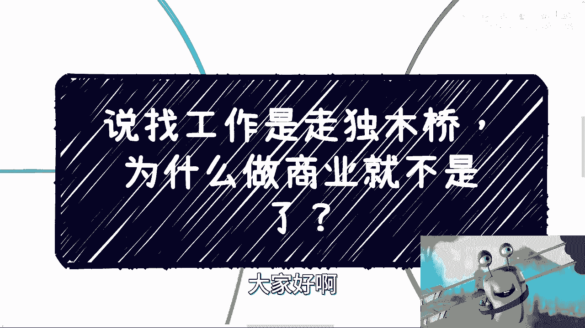
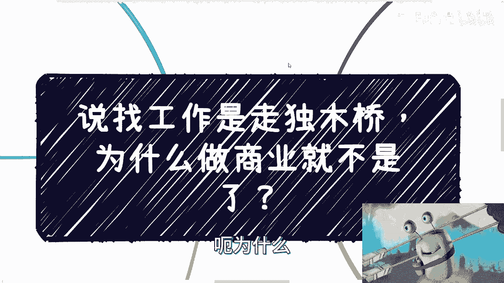
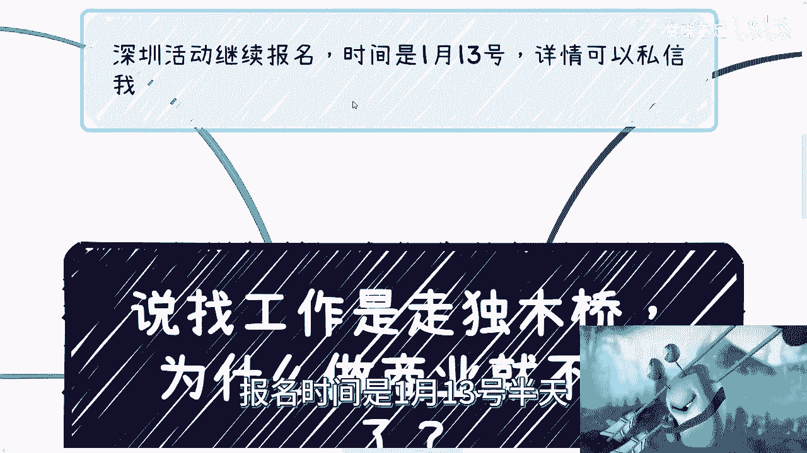
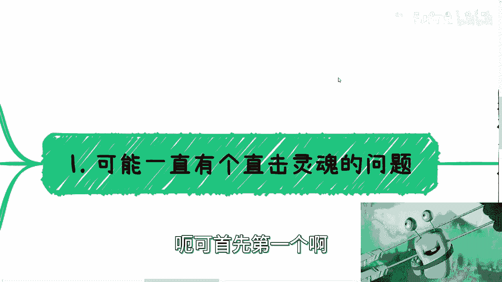
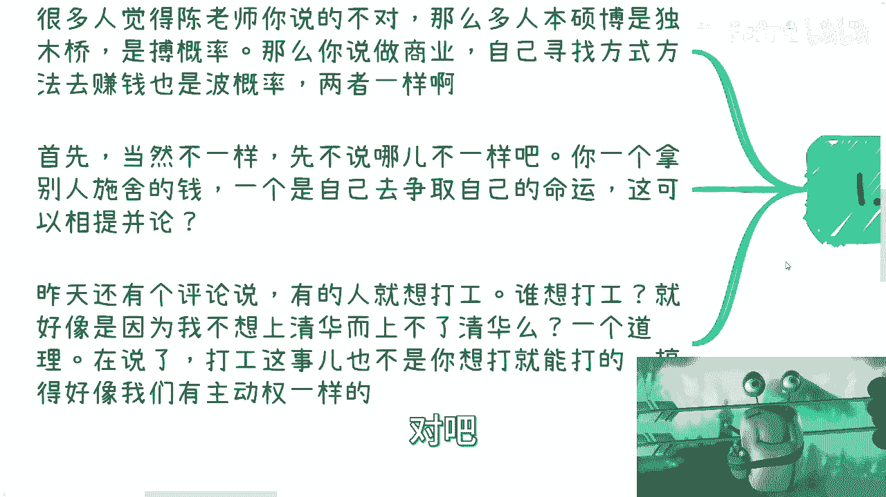
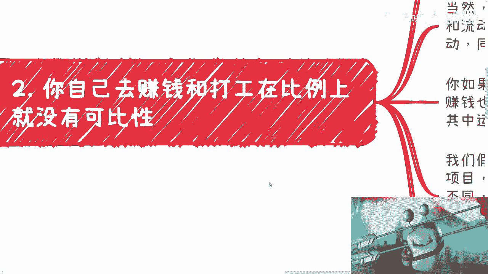
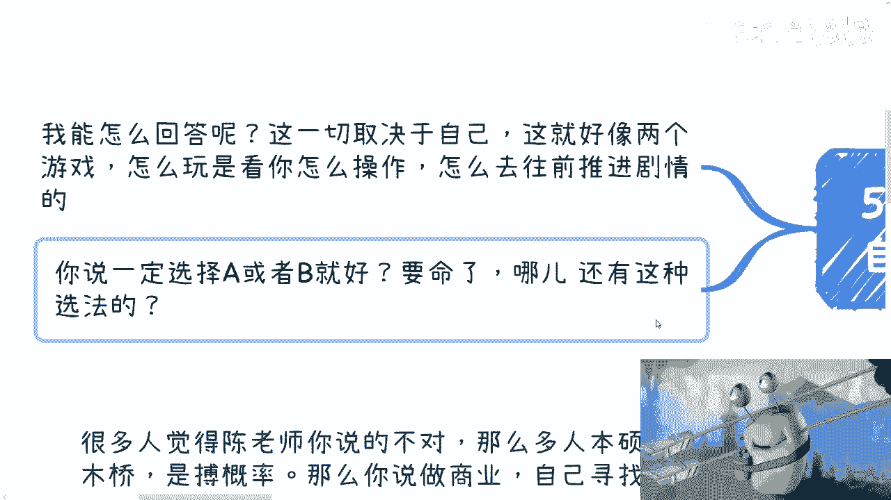
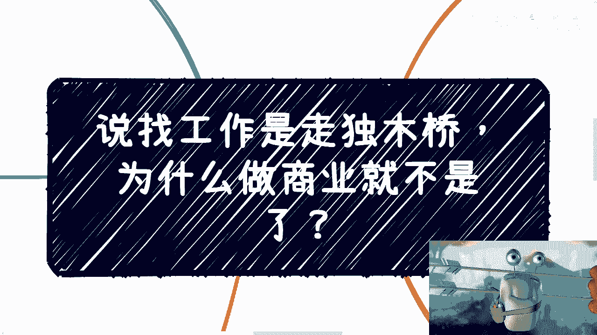

# 课程01：找工作与做商业，为何不是同一条“独木桥”？🚶‍♂️➡️🌉

在本节课中，我们将探讨一个常见疑问：为什么许多人认为找工作如同走“独木桥”，而自己做商业赚钱却似乎不是？我们将从核心差异、机会比例、主动性以及个人心态等多个维度进行剖析，帮助你理解这两种路径的本质区别。

---

## 核心差异：争取 vs. 施舍

上一节我们提出了核心问题，本节中我们来看看两者的根本不同。

打工的本质是获取他人提供的岗位和薪水，这是一种被动的“施舍”关系。无论个人学历多高，在雇佣关系中，主动权往往在雇主一方。公式可以表示为：

**打工收入 = f(雇主决策, 岗位需求, 个人资质)**

而自己做商业或赚钱，是主动争取和创造价值的过程。其核心在于个人对机会的把握和行动的主动性。公式可以表示为：

**商业收入 = f(个人行动, 机会识别, 价值创造)**

这两者在起点上就不平等，不具备直接可比性。

---

## 机会比例：固定岗位 vs. 流动机会

理解了本质差异后，我们进一步比较两者在机会数量与形态上的区别。

工作岗位类似于“一个萝卜一个坑”，总量相对固定且流动性有限。假设社会总人口与岗位数量存在缺口，那么总有一部分人无法获得工作。

而商业机会则不同，它更像随机分布在时间与空间中的节点。以下是两者的关键区别列表：

*   **形态固定性**：工作岗位是固定的；商业机会是流动且随机出现的。
*   **时间分布**：岗位开放有固定周期；赚钱机会可能在全年的任何时刻出现。
*   **获取方式**：岗位需要申请与竞争；机会需要主动发现、讨论与尝试。
*   **创造主体**：岗位由企业创造；机会可以由个人或小团体主动探索创造。

因此，从概率和分布上看，为自己赚钱的路径拥有更多潜在的切入点和可能性。

---

## 主动性：掌控权在谁手中？

对比了外部机会，我们再来审视内部的主动性。这是区分两条路径的关键。

在商业路径中，结果与个人努力、策略、人脉维护等因素有更强的因果关系。你的主动性直接影响了成功的概率。

而在求职路径中，这种因果关系被削弱。高学历、强技术、好性格与最终获得offer及高薪之间，并非简单的线性关系，还受限于市场需求、公司战略等外部不可控因素。

所以，逻辑分析表明，**为自己赚钱时，个人掌握的主动性更强，对过程的控制力也更高**。

---

## 心态根源：渴望与行动的悖论

既然主动赚钱路径有诸多优势，为何选择者寥寥？本节我们来探讨其心态根源。

许多人陷入了“既要又要”的矛盾心态：既渴望更多收入和抗风险能力，又不愿迈出第一步、承担风险或拓展人脉。这本质上是一种希望“不劳而获”或“风险归他人，收益归自己”的想法。

然而，社会上的大多数商业机会和组织，在初期沟通时并没有像求职那样严格的学历或背景硬性门槛。阻碍行动的，往往是内心的恐惧和惰性，而非外部的高墙。这是一个有趣的悖论：**门槛更低的路，反而因为对自我负责的要求更高而吓退了更多人**。

---

## 如何选择：没有标准答案的个人课题

最后，我们谈谈一个常见问题：“我应该继续深造还是去社会锻炼？”

这个问题没有放之四海而皆准的答案。每个人都是独特的个体，而非标准品。选择取决于你自身的性格、风险承受能力、行动力以及对“闯”的理解和技术。

关键在于，你需要把自己当作一个能动的、需要为自己选择负责的“人”来思考问题，而不是等待一个通用的“正确答案”。行动需要策略和方向，而不仅仅是勇气。

---

本节课中我们一起学习了找工作与做商业的核心区别。我们分析了从“被动接受施舍”到“主动创造价值”的本质转变，比较了固定岗位与流动机会的形态差异，强调了个人主动性在商业路径中的核心作用，并指出了阻碍许多人行动的深层心态矛盾。最终，我们认识到，真正的选择权在于把自己视为能动的个体，并为自己的决策和行动负责。