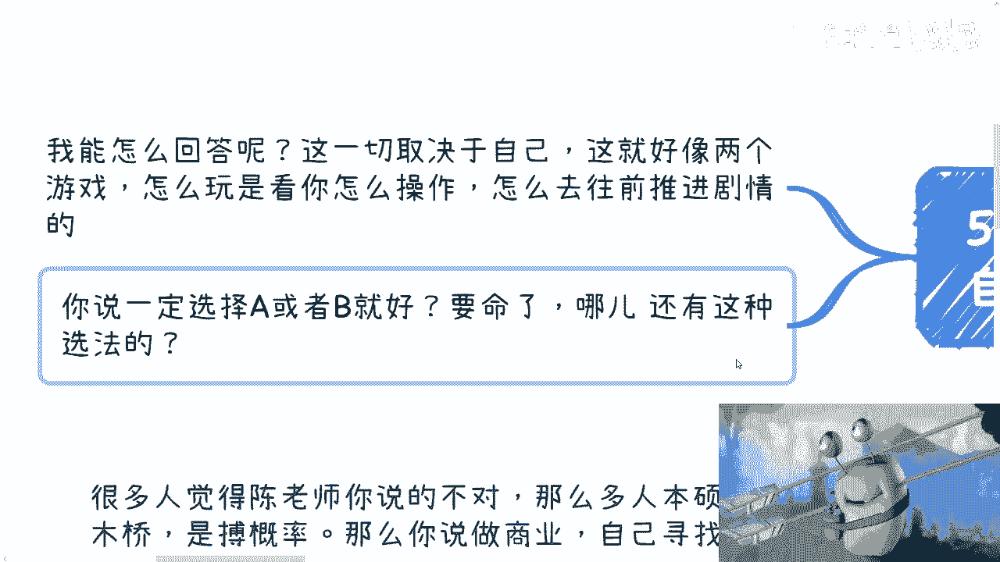

# 都说找工作是独木桥，为什么做商业就不是了？ - P1 - 赏味不足 - BV1de411B7M9

好啊大家好啊。

我们今天来说这个话题啊，叫做有非常多的小伙伴跟我说，找工作是走独木桥啊，呃为什么你去做商业。

你自己去赚钱就不是独木桥了，是吧啊，呃首先啊，那个深圳活动继续报名时间是1月13号半天。

好吧，详情可以私信我嗯，可首先第一个啊。

可能一直有一个直击灵魂的问题对吧，就是说很多人大家觉得陈老师你说的不对啊，那么多本硕博是独木桥，是博概率呃，他说你做商业，你去寻求自己的赚钱方式，也是博概率，两者是一样的，对吧好，乍一听是这么回事啊。

也没毛病啊，但是你仔细想想看啊，首先第一点它核心就不一样，为什么，因为你打工，你去挤那个独木桥，你拿的是别人施舍的钱对吧，我们客观的说好吧，就是你，你你不要就是属于那种自己把自己看得太高。

也不要看的太低对吧，你客观的说，你今天就算是个清北的硕士，跑出去找个工作，不还是别人施舍的吗，有什么区别啊，怎么地啊，你清北硕士我他妈得跪着给你工作啊，啊对吧，没有道理的，因为你我早就说过了。

你一开始就是不平等的对吧，你一个是自己去争取自己的命运，一个是等别人施舍，这可以相提并论吗，没有相提，并没有任何的可比性啊，然后昨天还有评论说他说有的人就想打工，我就这么跟你讲，没有人是想打工的。

谁想打工啊，啊这就好像我不想上清华，是因为我上不了清华，是因为我不想上而上不了清华啊，这一个道理啊对吧，你打工这个事也不是你想打就打的，就当下这个情况有多少人想打他没得打啊。

你搞得好像这打工我们都有主动权一样的，没有啊，咳咳对吧啊。

那第二点你自己去赚钱跟打工。

他在比例上他就没有可比性，什么意思呢，我们这样假设你一共1亿人，总共有5000万的岗位，那么总有5000万左右的人找不到工作对吧，当然工作岗位他是会有波动的，也是会有流动性的啊。

但是工作岗位的波动和流动性本身不会太大，什么意思，就是他不可能每天给你流动一个岗位出来，他不可能每天给你创一个岗位出来吧对吧，同时岗位的流动性，它流程程序也很复杂，你说我要今天创一个岗位。

也不是今天一个岗位出来就能找到人的，我要辞职，也不是说我今天说辞就辞的对吧，你一年这个岗位的流动，这个岗位的开创到关闭它能有多少次，但是如果你自己去开启了一条，为自己赚钱的道路，那说白了你能不能赚钱。

他是看一个概率没有错，他也看一个天时地利人和的比例问题，咳咳咳，而且其中运气也很重要，那我们假设一年当中有5000万个赚钱的机会啊，包括所有的什么项目啊，补贴啊，高校啊啊企业啊，地方政府啊。

他跟但是呢你会发现他跟岗位不一样，因为什么，因为他机会他跟岗位不一样，它不是一个固定的东西，它机会很有可能每一年随时随地都会出现，分散在一年365天当中，而谁能够抓到这个机会也是非常随机的对吧。

你能说哦，任何一个东西这个这个赚钱几乎每年固定的，就这个人赚可能吗，那不可能的呀，说白了就是说岗位它是一个萝卜一个坑，机会不是机会的随机性会非常的大啊，你更别说我们比如说我们想赚钱。

我们大家随时都可以一起讨论怎么赚钱，那当然赚不赚得到，咱们就管它吧，我们也可以讨论这个赚钱的方式也对吧，但是问题是我们总不可能自己组团，然后在那边讨论，然后说哎那个明天阿里给我们开个岗位啊。

明天自己给我们开个岗位，说开就开，可能吧，不可能的呀，他没有可比性啊对吧，那么第三点，你自己赚钱更掌握主动性，而我看来反而更公平，为什么，因为你不先不说大富大富大贵，你赚不赚钱，完全取决于天时地利人和。

取决于你人到底怎么做，你事情怎么做，你关系怎么去拓展，怎么去维护，一切是取决于你的，你要勤奋，总有一定概率能轮到你，你懒那就什么都没有对吧，但工作呢会吗，你想想会吗，你有主动权吗，你越勤奋，女学历越高。

所以别人给你offer，给你岗位，他有因果关系吗，你性格好，对人好，所以别人给你更多的钱，还是说你综合技术越强，别人给你更多的机会有吗，这之间有任何因果关系吗对吧，所以你用逻辑去分析。

你就知道你一定是自己去赚钱，你的主动性是越强的对吧，但是你说哦，那么既然这么说，那为什么这么多人不选呢，那我就告诉你，因为懒对吧，因为你天生就是懒的对吧，天生就是怕风险的，这很正常对啊。

大部分人说哎我不知道自己在干嘛，我不知道自己能干嘛，那我就问嘛，你在工作岗位上面，你就知道你能干嘛啦，你在工作岗位上，你就知道你你你在干嘛啦，你也不知道啊，你只是因为这个岗位给了你每个月的稳定薪水。

所以你假装你知道，但其实你还是不知道对吧，所以第四点我觉得归根结底聊了这么多人对吧，我觉得就是就是客观的说，你也不要觉得也不要觉得好像啊，好像我在吐槽他们对吧，我也是客观的描述。

就是很多人他就是天上想天上掉馅饼，他就是既要又要你知道吧，就是沟通到最后的核心是什么，就是我想要赚钱，但是呢他又会跟我说，我不知道怎么走出第一步，我不知道怎么扩展人脉关系，我怕风险对吧，那你换而言之。

不就是说我在既不想走出第一步，也不想扩展人脉，同时又没有风险情况下面，我想赚到钱可能吗，来对不对，所以我一般都会得出一个什么结论，就是其实很多人他不缺钱，或者说他没有这么大的渴望。

那你问你说是不是希望赚更多钱，他一定回答你试，你是不是觉得未来需要有更高的抗风险性，是的，你是不是觉得工作不稳定，对的，然后呢没有了，然后就是啊我希望有人来带我，凭什么，为什么你头上长角了对吧。

然后他就不行动，就是说他从根源来讲就是不想想着不劳而获，想着风险都是别人的，钱是自己的，那我就刚刚说了嘛，谁不想了呢，对吧，我不上清华，是因为我不想上吗，啊行吧，你但凡只要想有足够的执行力和行动力。

社会上随便跑，随便交流啊，随便你上蹿下跳对吧，什么地方，什么社会性质组织，会在你沟通之前就问你要学历的啊，有哪些社会性组织是因为你学历不够，不让你不让你去了解他，不让你去沟通的啊，哪有这么多的硬性门槛。

没有的呀，对吧，但是正因为这样，他反而吓退了更多的人，哎这就是非常神奇的一个悖论对吧，所以说啊其实很多小伙伴问我，他说他问了，他说我是继续深造呢，还是去社会上锻炼，你们想想看这问题不要问我啊。

问我有用的啦，因为这个问题本身是取决于你们自己的对吧，你就好像这是两个游戏，怎么玩，是看你怎么操作的，怎么玩，是看你怎么往前推动剧情的对吧，哦不是说你每个人啊，大家都是标品对吧。

我不管你男的女的什么什么性格，什么背景对吧，都是标品啊，然后呢我就跟你说啊，一定是深造好啊，一定咳咳咳咳，到社会上去磨练好，他有定论吗，对吧，你就像我会跟他说，我说那你豁得出去，你会闯对吧。

那你就你就你就先去社会上锻炼，那问题是你接下来还得往下去再讨论一层呢，就是你会吗，你觉得你会，但是你觉得你会，你真的会吗，对不啦，就床也是要有技术的，床也是要有叫什么手段的，床也是要有一种。

就是我们说这个这个战术上的一种方向对吧，你不是说硬闯啊。

所以说啊就是说你会发现很多时候，很多时候是这样子的，就是很多人啊他自己标榜自己是个人，你跟他说你你你你骂他，或者你说他不是人，他就不开心了，但是问题是他问出来的问题，他从来没把自己当成一个人过。

哎就是这么奇怪，怎么办呢，啊好吧咳咳OK，那就这么着啊，然后那个，活动报名的私信我好吧，然后那个咨询的你们觉得有必要的，你们整理好问题，我们再约时间好行，就这么着吧。

