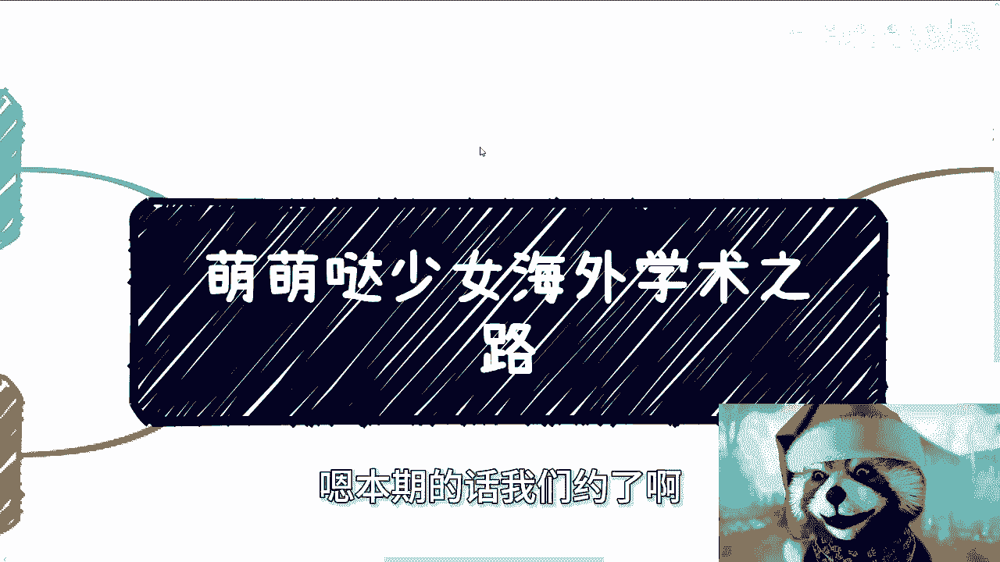

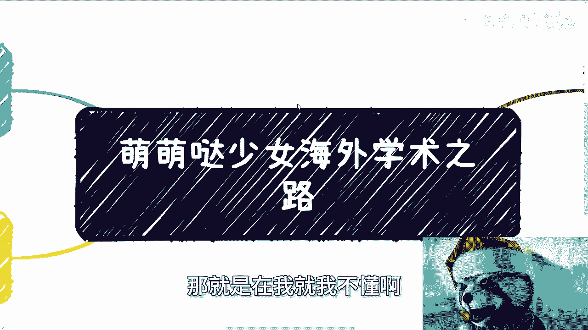

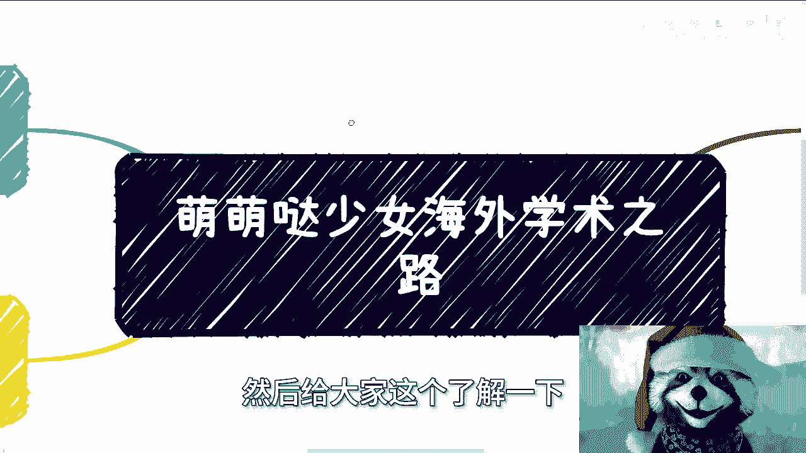

# 课程01：海外学术之路访谈实录 🎓

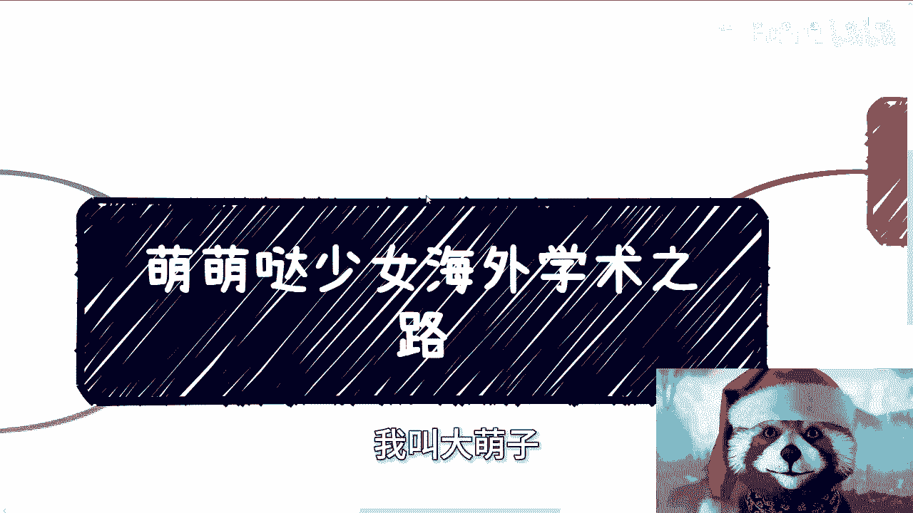

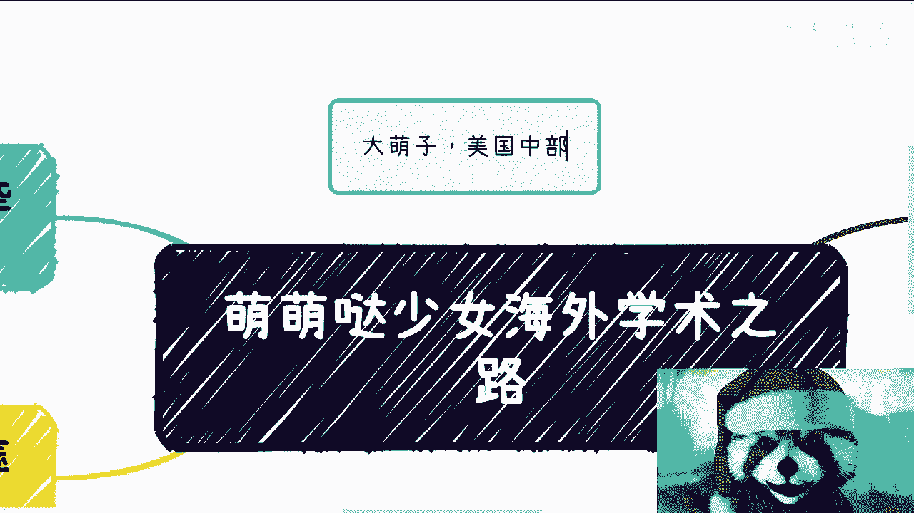

在本节课中，我们将通过一段采访实录，了解一位在美国攻读教育学博士的留学生（大萌子）的亲身经历与见解。我们将探讨中美学术体系的差异、海外留学的建议、学术道路的选择与挑战，以及相关的文化观察。

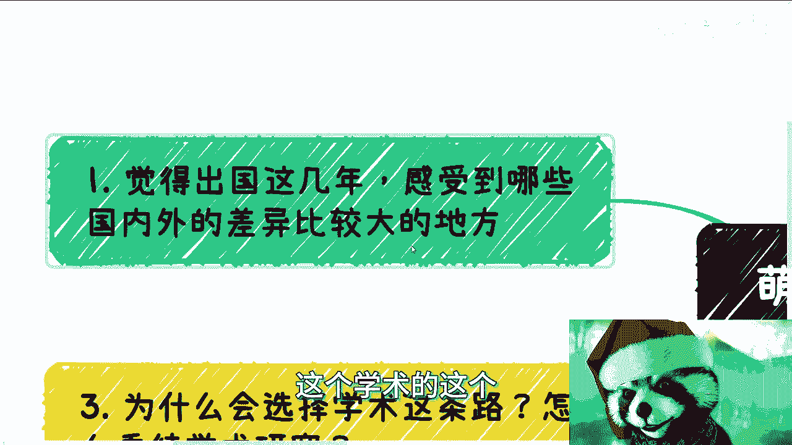

---

## 中美学术体系差异 🏫

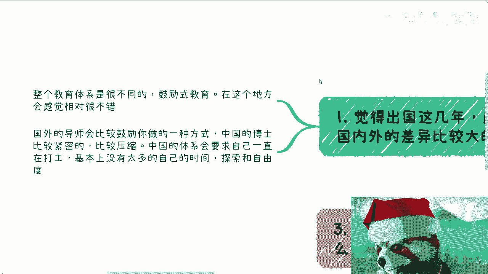

上一节我们介绍了课程概述，本节中我们来看看中美学术体系的核心差异。

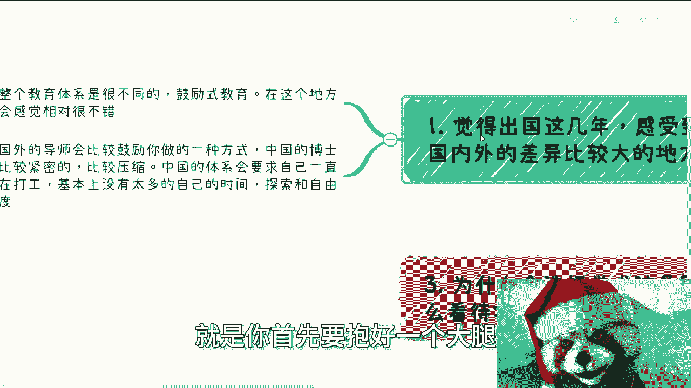

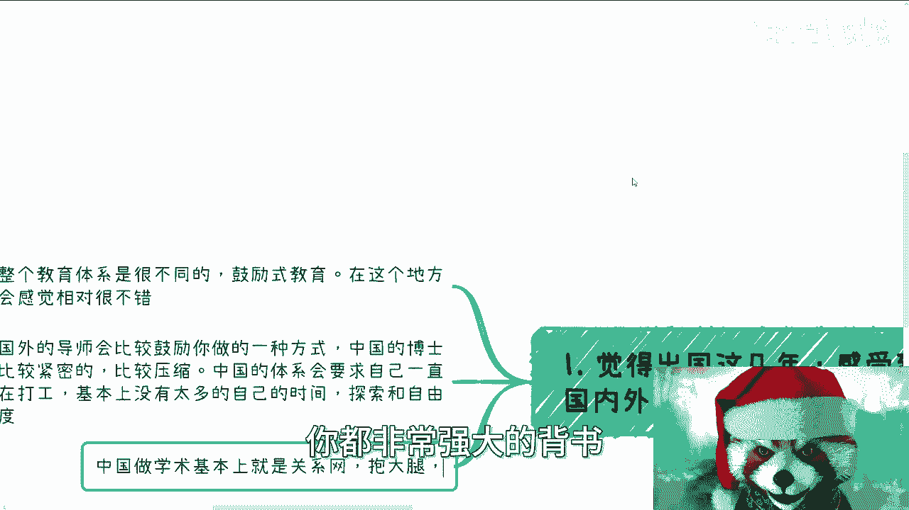

采访中提到，美国的教育体系是鼓励式教育，倡导以人为本，注重培养学生的个性。学生拥有更多自主权去探索感兴趣的课题。相比之下，中国的博士体系更为紧凑，目标是在三到四年内毕业，因此日常节奏更紧张，更像一种高强度的工作。

**核心差异可以概括为：**
*   **自主权：** 美国体系鼓励自主探索，中国体系目标导向更强。
*   **节奏：** `美国节奏 = 更自主、更弹性`；`中国节奏 = 更紧凑、更密集`。

---

## 给不同留学群体的建议 🌍

了解了体系差异后，我们来看看针对不同留学目的的具体建议。

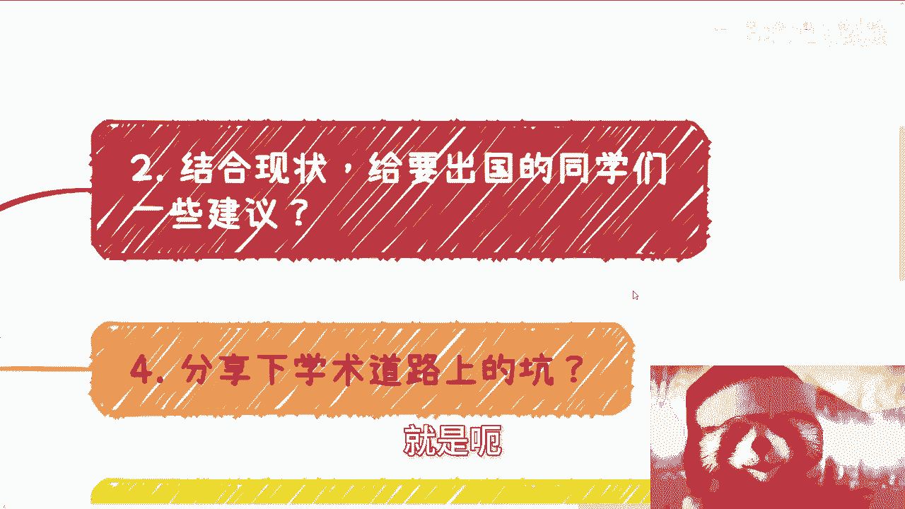

以下是基于不同生活目标和背景的留学路径建议：

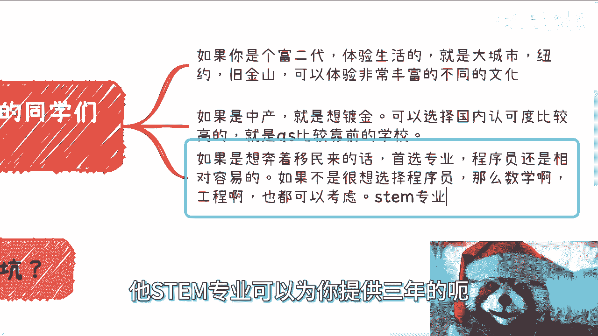

1.  **体验生活型（如富二代）：** 建议选择纽约、旧金山、加州等国际大都市，以体验丰富的文化和多元人群。
2.  **学历镀金型（如中产家庭）：** 建议优先选择国际认可度高、QS排名靠前的学校（如哥伦比亚大学、纽约大学），以便回国求职。
3.  **移民导向型：** 建议优先选择专业而非学校。目前，STEM（科学、技术、工程、数学）专业是相对容易的路径。这些专业的毕业生可获得3年的OPT（Optional Practical Training）工作许可，用于抽取H-1B工作签证，进而申请绿卡。公式表示为：`选择STEM专业 → 获得OPT → 抽取H-1B → 申请绿卡`。

---

## 选择学术道路的初衷与坑点 🚧

上一节我们讨论了留学规划，本节中我们聚焦于选择学术道路本身的原因和需要避开的陷阱。

受访者选择攻读博士的初衷是对国内高强度、长通勤的工作环境感到不满，希望寻求更自主、平静的生活状态。在海外，她感受到了更平等的讨论氛围和相互尊重的工作文化。

关于学术道路上的“坑”，她给出了两点重要提醒：

1.  **谨慎选择导师：** 建议尽量避免选择华人或亚裔导师，因为东亚文化中可能存在较强的功利主义和压榨倾向，这可能影响学生的身心健康和学术体验。核心原则是：`Everything has a price.`（一切皆有代价。）
2.  **身心健康第一：** 在海外读博，发表论文并非最重要，维护好`mental health`（心理健康）和`physical health`（身体健康）才是根本。保持社交、避免封闭自己至关重要。

---

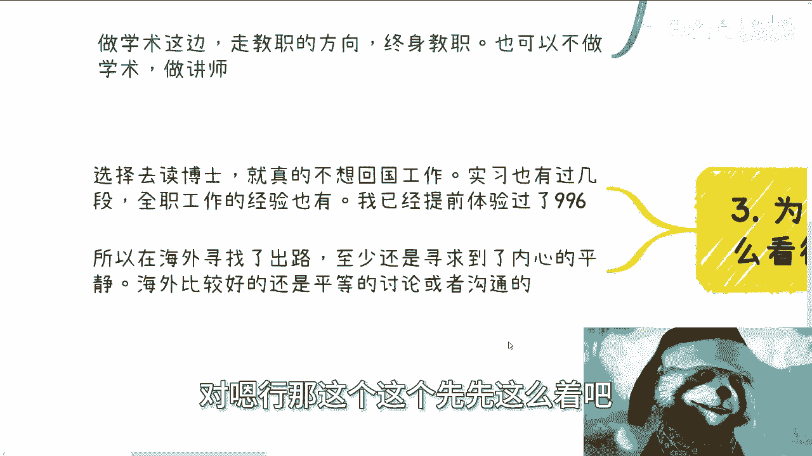

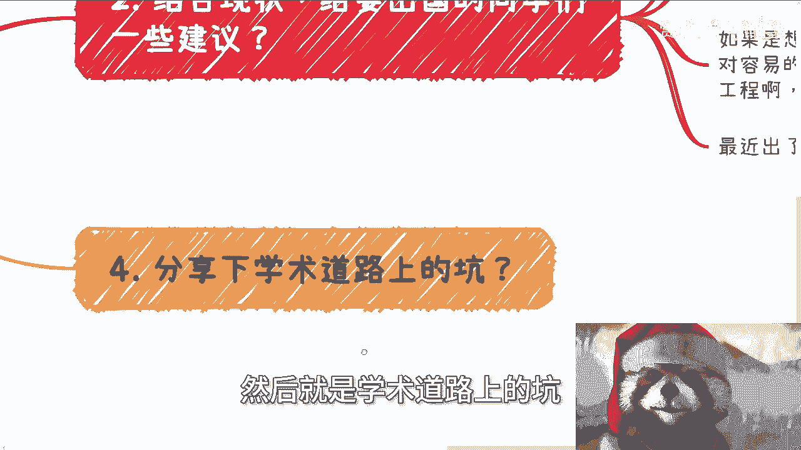

## 学术与职业发展的现实考量 💼

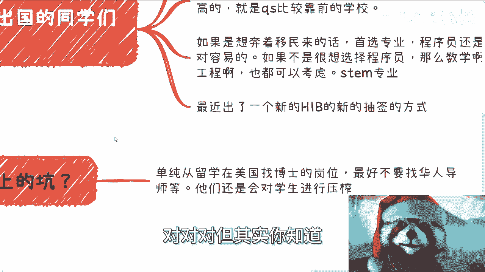

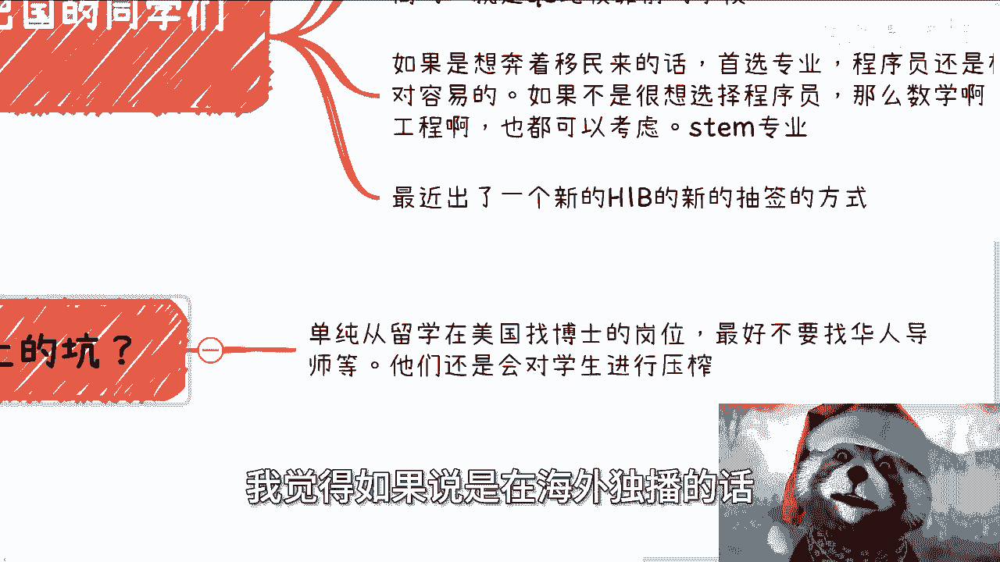

我们探讨了学术道路的挑战，现在来看看学术与职业发展的现实联系。

纯粹通过学术研究“搞钱”并非最佳路径。学术之路更适合对知识有真正热情、能耐得住寂寞的人。如果以赚钱为主要目标，创业或进入高薪行业（如程序员）是更直接的选择。

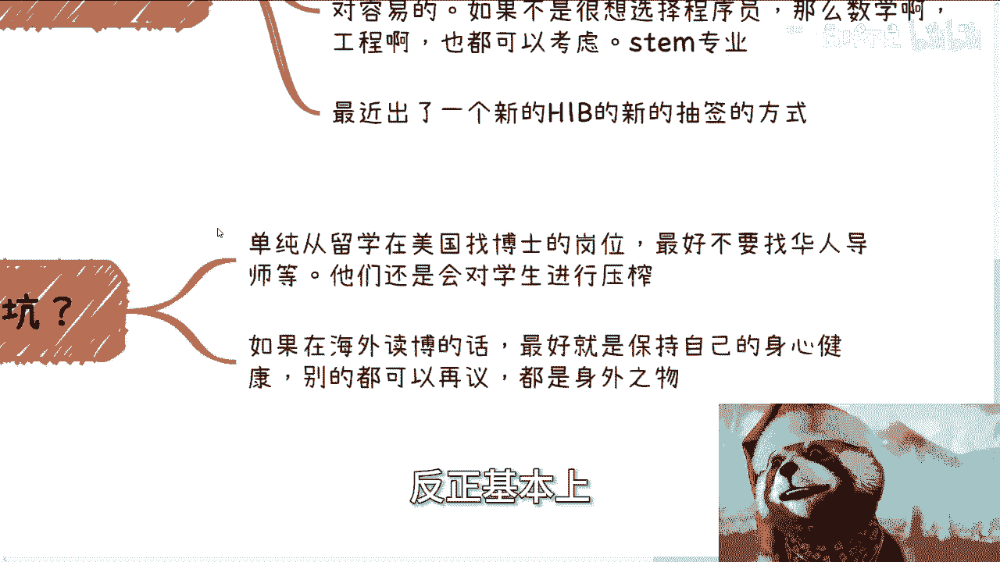

在职业发展上，博士毕业后的常见路径包括：
*   **学术界：** 争取终身教职（Tenure-track）教授。
*   **教育界：** 担任讲师（Lecturer）。
*   **工业界（Industry）：** 进入企业，从事与专业相关的工作。
*   **转行：** 转向编程、用户体验设计等其他领域。

---

## 文化观察与个人感悟 🤔

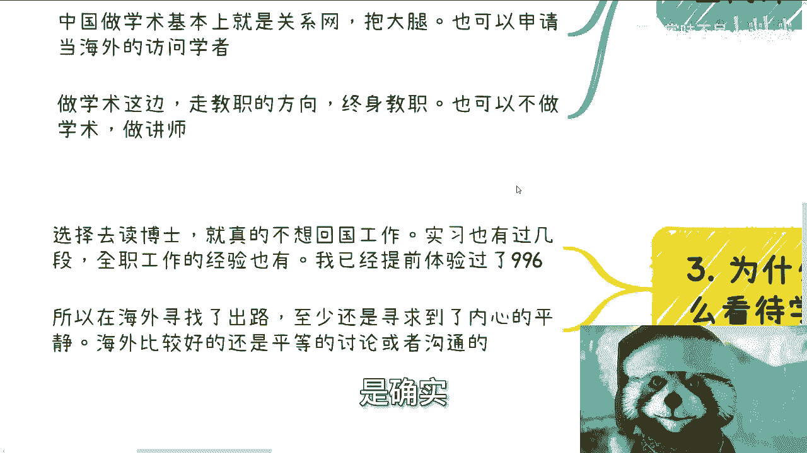

最后，我们来分享一些基于访谈的文化观察和个人感悟。

访谈中提到了一个普遍现象：在国内，无论是寻找学术指导还是日常沟通，都常面临“已读不回”或难以进行平等、客观讨论的困境。这背后反映了中国社会较强的等级观念和资源导向的人际关系网络。

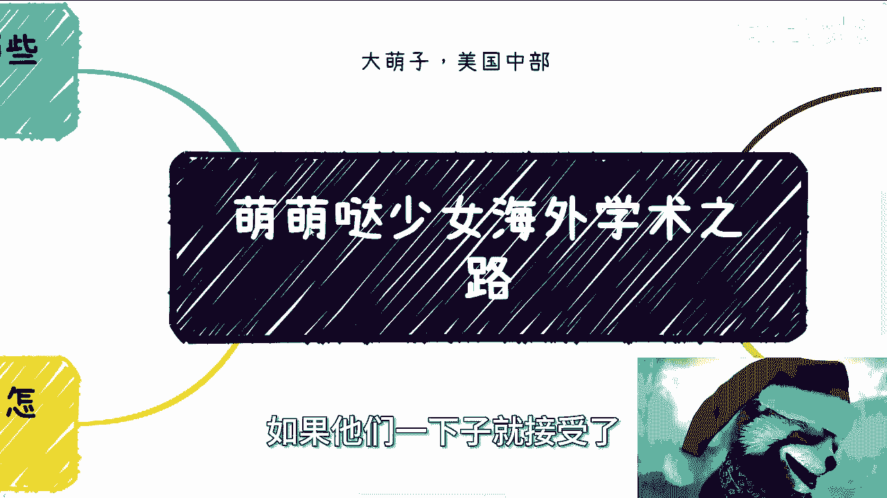

相比之下，美国社会对“平等”和“相互尊重”有更强的制度性保障和文化倡导，使得沟通环境相对更扁平。这种文化差异直接影响了个体的工作与生活体验。

对于国内目前的学术环境，访谈指出存在“重数量、轻质量”的倾向，许多研究像是“生产队的驴”在不停产出，但真正有影响力的成果并不多。

---

## 总结与嘉宾信息 📝

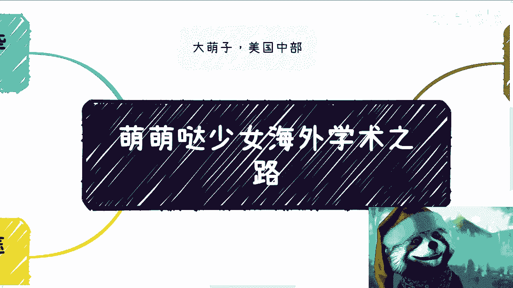

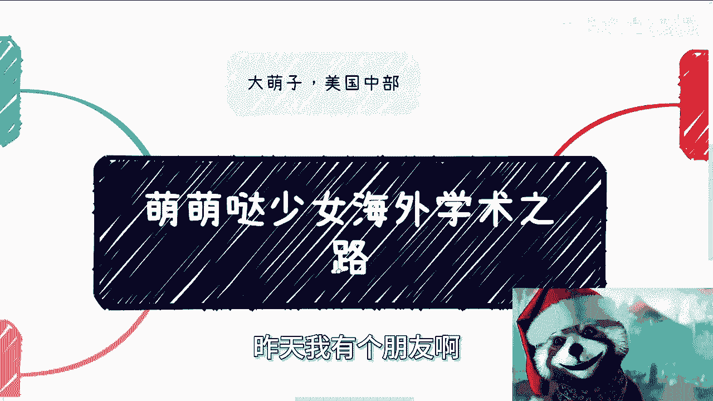

本节课中，我们一起学习了海外学术之路的多个侧面：
1.  对比了中美学术体系在自主性和节奏上的差异。
2.  分析了针对不同留学目的（体验、镀金、移民）的择校择业建议。
3.  探讨了选择学术道路的个人初衷、需要避开的导师选择陷阱以及维护身心健康的重要性。
4.  审视了学术与职业发展的现实关系，以及中美在沟通文化上的深层差异。

**嘉宾信息：**
如果您有留学相关问题希望咨询，可以联系嘉宾大萌子。
*   **平台：** 哔哩哔哩、微博
*   **账号名：** 萧雅萌子
*   **更新频率：** 随学业繁忙程度而定，更新随缘。

感谢大萌子的分享，也感谢大家的学习。