# 采访实录——萌萌哒少女海外学术之路 - P1 - 赏味不足 - BV1aJ4m147y6

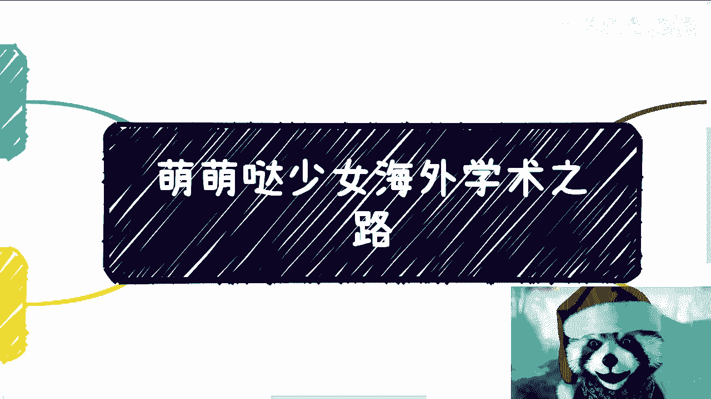

好好好，大家好啊，我们就是之前这个系列已经很久没有更新了啊。

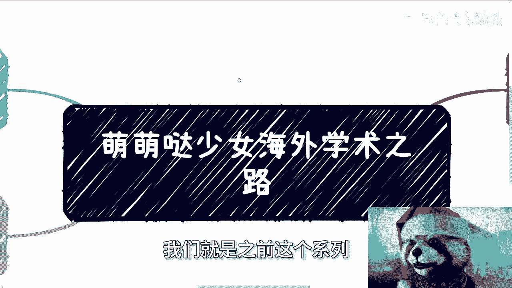

我们这个因为嘉宾都很忙啊，所以我最近基本上也约了一些，就是这周约了，下周也约了啊，也约了嗯，本期的话我们约了啊。

一位就是在海外专门做学术的，那就是在我就我不懂啊。

我作为一个外行，我觉得这个学术造诣非常之深厚啊，那我们这个让哎对。

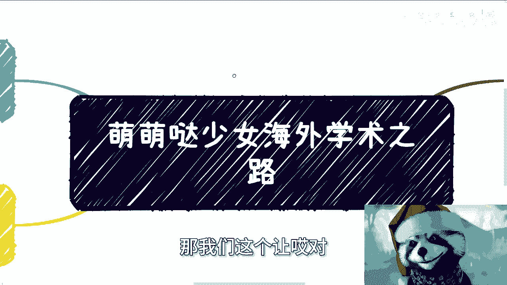

你要你要待会先自我介绍一下，然后给大家了解一下。

然后再开始这个主题吧，你先介绍一下。

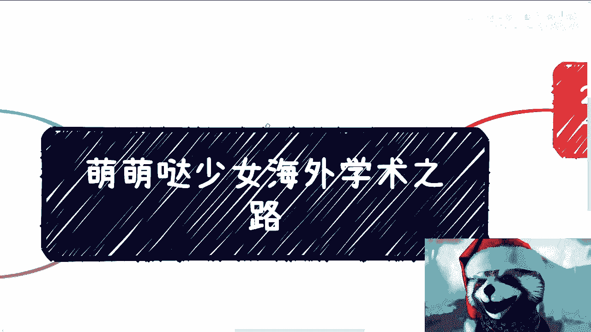

OKOK大家好啊，我叫大萌子，然后我现在是在美国中部这边读教育的博士。

然后现在是博三了嗯，啊这么朴实无华的吗。

那那怎么说呢，咱们整点规模大的。

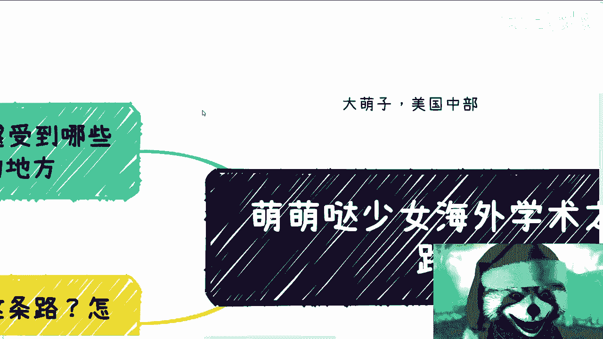

哈哈哈都可以，然后那我们就那个按照。

按照我们之前列的几个方向来跟大家说一下啊，就是因为学术是这样子的。

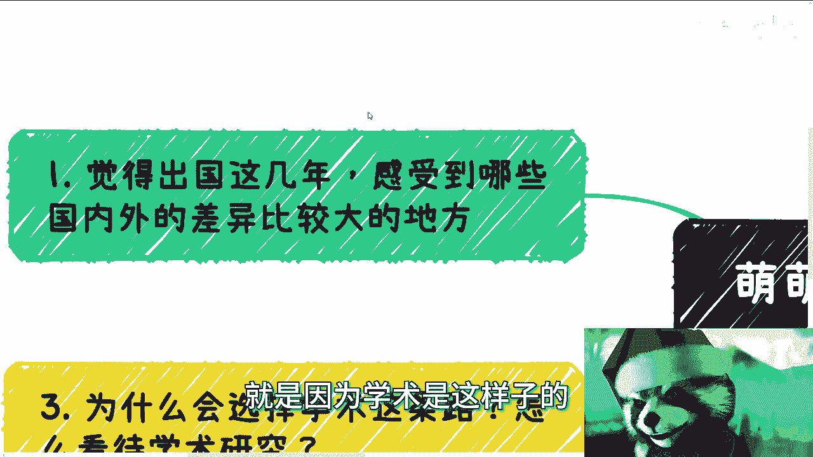

就是呃我我我先说一点吧，就后面反正到时候补充吧，就是嗯因为很多人会觉得，学术可能国内外区别会比较大，反正这个东西我们待会儿看看啊，就是说呃也就四点讲完之后，我们看看是不是能够给大家做做补充。

或者来说是不是能够解答，很多人对于这个国内外的这个学术的。

这个这个差异化的这个认知，这个认识吧，然后第一个的话就是觉得就是你觉得这个出国，这几年感受到哪些，就是呃国内外差异比较大的地方，就是这个不一定，可能也不一定说是这个集中在学术吧。

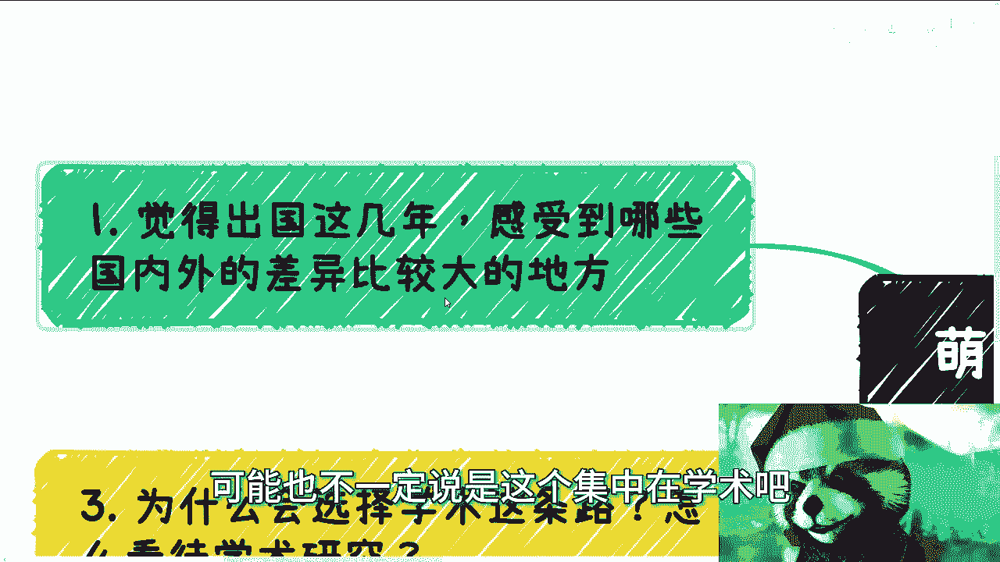

但是以学术为主吧，好吧。

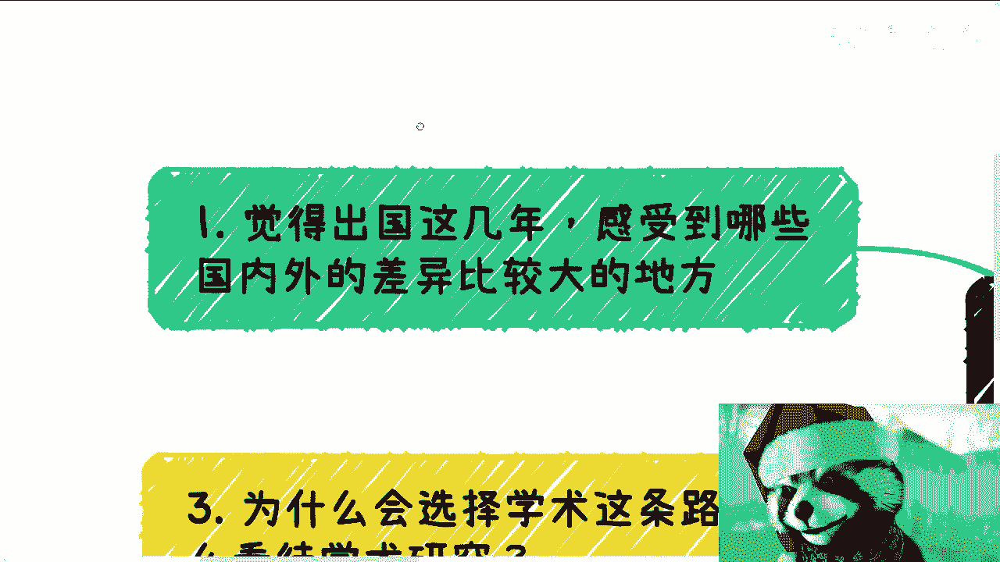

以学术为为主的话，那首先我觉得嗯。

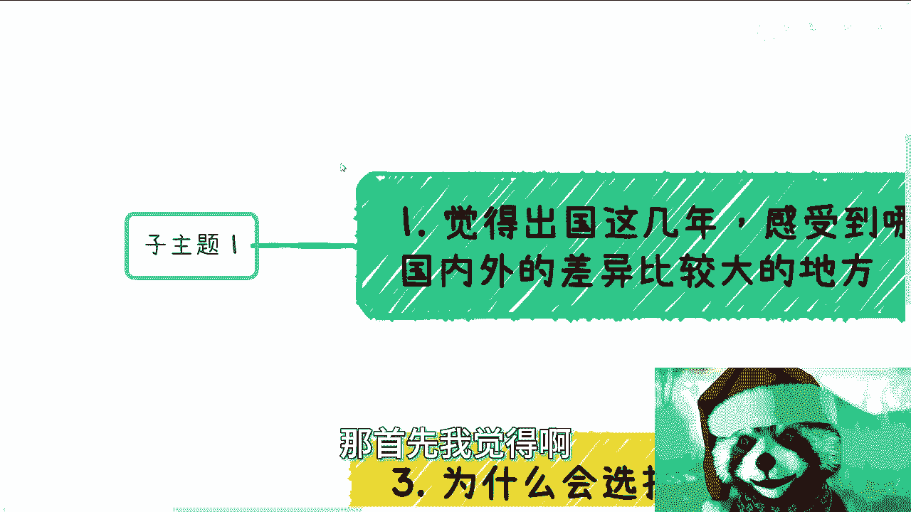

就是整个教育体系肯定是不一样的，因为美国这边他是一个鼓励式教育，然后他是一个以呃以人为本，然后比较呃倡导学生去培，养出自己的个性的一个地方，那么在这个鼓励式教育的这个这个体系之下呢。

其实你在这个地方做学生就是会体验相对不错，那如果说你正好拥有一个呃，也是在这个体系下成长起来的这个导师呢，那那你和他的这个合作，就会比你和国内的这个导师合作要好一点，因为首先就是他会鼓励你去啊。

不管是自己探索呀，还是他去引领你去做一些学术，其实对你来说都是比较呃比较一种，健康的一种成长方式，嗯那么如果是在中国呢，其实呃像中国的这个博士体系，还是比较的intense，就是比较的比较紧密的。

因为所有东西都要压缩在34年这样子，虽然说最近几年呃岩壁的情况也非常之多，但是总体而言，就是大家还是冲着4年这个目标去毕业的，所以在这种情况之下呢，中国这个体系呢就会要求你每一天都在工作。

并且每一天你可能都会觉得自己是一个，打工人一样的存在，所以我我们可以说就是在中国，如果你是在中国读博士的话，那可能你和在企业里做工作的，差别可能也不会很大，嗯那你的工作就是你的学术。

但是如果是在美国的话，那你就会有更多的自主权，去探索一些自己想要的东西，包括你可能会上更多的课程，然后你可能会更有权利，或者说更有自由度去做一些你自己想做的课题，所以我觉得这是比较大的不同的一个地方吧。

OKOKOK对，说到这一点啊，就是就是我问个点啊，就昨天有个那个网上的小伙伴提到了一点，就是说他好像是要写论文，然后要有一些呃就是比如说方向上的指导啊，或者来说就是可能要review一下吧。

但是就是说可能这个学术方向，国内嗯可能做的这种导师不错啊，然后嗯他现在面临一个问题，就是说呃因为我也不是很了解啊，就是他现在面临的问题，就是说他在中国整个上下，因为他作为一个学生嘛。

他从上到下他他也想去找这一类的法律师呃，这个这个研究方向的老师去给他做一些呃，比如说这个review啊，或者给一些指导啊，就是他现在面临的窘境，就是他基本上找不到，就是无论他通过什么方式。

就是线下啊啊网络啊，邮箱啊或者什么方式就找不到，而且就是说就算找到了，那就是后续的过程当中，他给导师发信息啊或者怎么样的，其实基本上也是一个嗯可能微信上说不好，就是已读不回的这种状态。

这种话你怎么看这种。

我觉得其实和中国社会是一个巨大的，人际关系网是密不可分的，因为中国社会是一个强关系的社会嘛，所以在中国做学术的话啊，我说的直白一点，就是你首先要抱好一个大腿。

那如果你选了这个大腿，他自己的关系网不那么强，自己实力不那么强劲的话，那可能你出去的话，你去那working也好，去认识新的教授，然后去合作也好啊，你都不常强大的背书。

所以哦可以说是略有些是一个死局吧，因为你自己还没有强大起来，你的导师也没有很强大，那那在这样子的情况之下，你可能去找别人是有些困难的，但这种情况可能还有一种解法，就是你可以去申请当这个国外的访问学者。

如果你的学员给你的资金比较充足的话，然后去找国外的导师，去进行一个重新的一个关系网的建立，然后看看有没有可能有按照视频一些方向，上面的指导，OKOK那哎哎那个我还有个问题啊，就是就是国内咱们呃。

可能你就是就是因为毕竟你在国内这边，可能近几年也不是特别了解，就是我我先问海外这边的，就是学术这边对于海外来讲，他呃就是如果我要潜心做学术，那后面的发展路线哎，就我们后面有有有会提吗。

我看看结合应该不会，就是海外这边路线之后的话，有哪些比较常见的发展路线嗯，如果你做学术的话，其实在在美国这边最最常见，也就是大家通时的想法，就是你肯定是要走教职的，这个是非常传统的想法。

但是其实美国不这么想的，因为美国每年会培养非常多的这个scholar，就是我们的博士，然后去承担其他的职能，所以说如果你是博士毕业的话，你可以选择在留在学术界，那么这条路就是你可以当啊教授。

也就是你需要去做学术的一个路径，然后tender track我说的终身教职，那么第二个就是可以选择不做学术，但是依旧当一个老师，那就是我们的lecture叫讲师，然后国内也是有讲师的，这个嗯这个职位的。

那除了这个，然后如果你想要去工业界的话，industry的话，你就是看你自己的专业匹配什么样的职位，其实也是和在国内找工作是一个一个意思，就是去找你去拍一个这样的职位。

当然还有一部分的博士他可能会啊转行，像转码呀，然后转那个ux design设计啊，这些全部都是呃大有人在的，所以其实这边的宽容程度还是比较大的，没有说你在这边读了博士。

我就希望你一定会成为一个非常成功的学者，或者教授，这样子嗯嗯嗯OKOK哎，我觉得哎，所以哎，所以就是就是我我以前基本上都非常，这个叫什么，就是粗糙的，反正认为就是学术这个东西。

因为学术的东西还是比较特殊的嘛，就学术这个东西做，而且我身边认识做学术的东西，做学术的人，我基本上就跟他们说，就说你要做肯定就出国做，国内我是不太建议他们做的，就做的，因为什么。

因为就是就是就像我刚刚问你这个问题，在我看来，国内做学术往后走的路，他没什么很常见的这个发展方向，就是如果来说还要继续做手术，那在结束这个关系圈里面，可能也是就就就就搞关系，拉帮结派了。

如果来说这个走那种工作的方式，因为我之前也呃就就去年吧，我连我聊过一些嗯，就是就是就是就是叫做学术博，然后出来找工作的，我可以说就是就是惨的，就是不能再惨了，惨不忍睹，就是那种嗯嗯嗯嗯。

就是就是就是他们相当于就是有种什么感觉，就是说我是嗯博士，然后我做学术博，但是我出来之后呢，就是企业也不认，然后他也不是啊，而且当下这种情况，就是国内也不可能再有企业说哦。

我我给你到企业这边再来做research，也不太也不太现实，然后他们就会觉得你一个学术博，就有种什么感觉，就是你不接触，我也不觉得你有啥表演，对对对，是这样子的，所以也在国内。

大家的认知基本上就是如果你要走学术路径，你去读博士，你毕业之后，最好最好就是一门心思的去奔一个呃，ti track终身制的教授这样子，所以你才会拿到别人应有的尊重吧，可以这么说，终身制终身制的教授。

Ok，但这种教职我总感觉在国内他也会慢慢慢慢，就是说是这么说，但是但是其实他从这个落地角度来讲，他他好像也是会慢慢演变成一种，就是就是叫做KPI导向或者其他导向的，这种，也不会。

也不会是一个潜心让你研究的一个职位呀，对终身制这个东西，它其实呃中国现有的终身制其实是从美国，就是你用过来的，然后美国的终身底部是为了保护学术自由，就是说你作为一个教想去说什么，你就说什么。

不需要管你自己呃的POSITIONALITY，就是你自己的呃位置是怎么样的，但是你看中国的其实是不符合，不太符合中国的这个环境的，首先呃在中国的学术自由其实不太存在。

因为大家基本上都是在做一些比较能拿方便，比较能拿资金的一些东西啊，只是其次中国的这个教授的呃杂活也特别的多，嗯比如说他要供一些行政行政事务呀，还有就是单位里的其他的各种人际关系这样子。

所以如果说你要去做一个纯粹的，那肯定是在呃比较理想的学术殿堂，像类似美国这样子的地方，你可以少一点事，少一点人际上的烦恼，然后去进行研究你的东西，但在中国，因为这个土壤就不太一样，所以确实是比较难做。

OKOK好好，那我们进到下一个对。

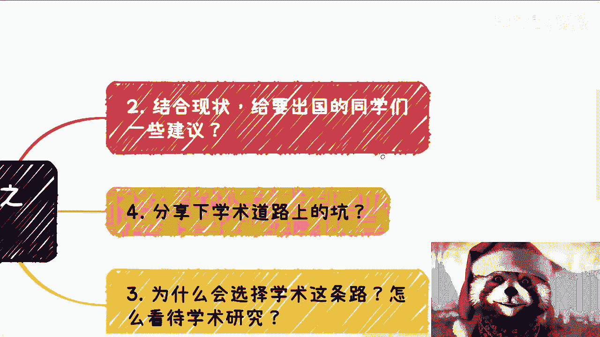

然后第二个我觉得也是可能近几年吧。

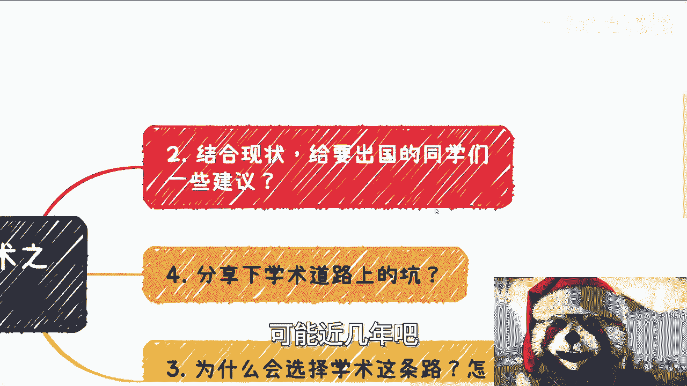

甚至往后几年都是的，就是就是大众现在还是有比较多的。

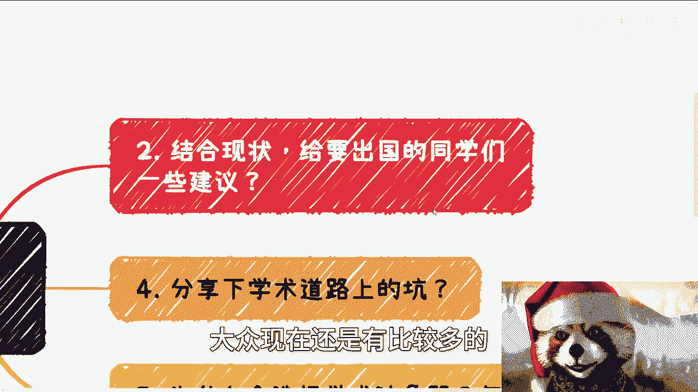

叫什么出国的这种嗯诉求或者想法吧，然后结合当下的这个现状，我觉得这样子吧，就是嗯嗯就是比如说宏观的角度，比如说你觉得能够给他们一些什么建议，然后如果来说他们是出来呃工作的。

然后比如说你觉得以你的这看到的情况，有什么建议，然后最终就是从你的这个主方向上面，就是学术上面如果出来的话。

你觉得有哪些缺点，这样子嗯我觉得就这个方面的话，这个建议可以分成三大类，就是以不同的人，他不同的生活目的来分吧，第一个就是我觉得如果你是一个富二代，然后只想来体验生活的话，体验你这个留学的缤纷多彩。

你可以选择大城市，像美国的话，就是像纽约旧金山，然后加州这样的地方人比较多，你也可以体验到这种丰富的文化，以及非常丰富的人种人群，啊对啊，第二个就是如果你是类似于中产家庭，你只是想来要一个学历。

然后镀金回国再找工作的话，那肯定就是首选国内比较认可的学校，目前的话是国内比较认的，是这个国际上叫做QS的一个学校的排名，所以你可以去看这个QS排名找，比如说前前50的学校，像这种啊哥伦比亚大学。

纽约大学啊，啊哈佛大学这种名声比较响亮的学校，可能是你选择路径上比较不错的一个选项吧，嗯嗯那如果说你是想要奔着移民来的话呢，那我们肯定就是要首选专业，所以说呃目前来说其实呃写代码，然后成为一个程序员。

还是一个相对于其他专业来说，比较容易的一个路径吧，虽然说我们现在是在讲可能转码晚了，转码晚了，但是它依旧是一个非常炙手可热的一个专业，如果说你不是很想要成为程序员，其他的一些工种。

比如说啊ENGINEERINEERING呀，工程啊，然后技术啊，数学这样的东西你都可以去考虑一下，这些专业我们统称为就是stem专业，STEM嗯，这专业有一个什么样子的好处呢，就是说你毕业了之后。

他stem专业可以为你提供3年的呃抽签机会。

然后你抽到的这个签证就叫做工作签，我们叫做HNB，然后你抽到这个工作签之后呢。

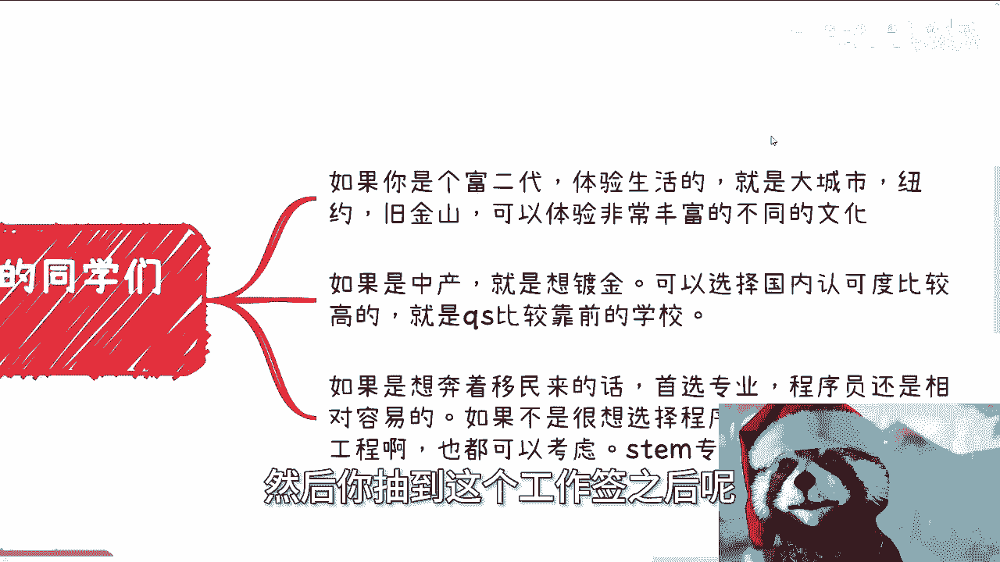

后面你就可以陆陆续续的去申请，你自己的绿卡啊，维持你自己的身份，这样子的话可能对移民相对友好一些，嗯OKOKOK哎，但是但是我最近了解下来，就就美国已经就卷的不能再卷了，然后嗯就是那个工作签。

就像就像我刚刚说的，如果他嗯比如说来了之后他找不到，就是就结束之后他找不到工作，那然后这个工作签再也抽不到的话，基本上就遣送回来了，嗯话是虽话虽是这么说，但是呃我们讲的深一点。

就是有很多别的方式庇护的成长，不是就待在美国，然后打工，我我有很多的朋友也是那种，但在美国，然后在餐厅打工，然后打了7年工，这样子拿到了一些庇护的签证，就是有很多的手段，这是其一。

其二就是最近出了一个新的新闻，是关于HNB抽签方式的改变，以前呢简单来说，就是以前一个人可以拿好几个offer，抽好几次签，那这样的话印度人可能就会有更多的机会，抽更多的钱，因为他们比较嗯有一些渠道。

现在改变了之后，就是一个人只能当充一次钱，所以这个概率上其实就是呃增大了一些，这个是比较向好的一个政策，OKOKOK嗯，康康哦，出来移民，但是但是我听下来就说，这边给出来的情况基本上都还是属于。

就是说嗯家里面可能比较相对还比较宽裕的，这样的情况，嗯是这样子的，如果说就是其他途径的话，嗯实话实说，可能婚姻绿卡婚率是最快的一个途径，但是由于很多人做不到，所以你所以所以如果说是走正常渠道的话。

那肯定就是先要考虑学，比如说学代码这样子的工作，但如果说你想要去走学术途径，拿绿卡的话，其实是一个更漫长，我觉得我个人觉得是一个更漫长，更艰辛的一个过程，因为首先你是否能录取。

这是一个相对概率相对小的一个事件，其次你是否能读完，这个中间可能会经历了非常多的挫折，然后需要最少最少45年的时间，去完成这样的一个学位，再次你完成学位之后，是否能找到嗯心仪的教职岗位。

呃这也是怎么说呢，就每一步都是非常艰难的一个情况，所以如果说是跟黎明来的话，我还是建议去首选一些移民专业，嗯嗯嗯嗯好可爱哎呀。

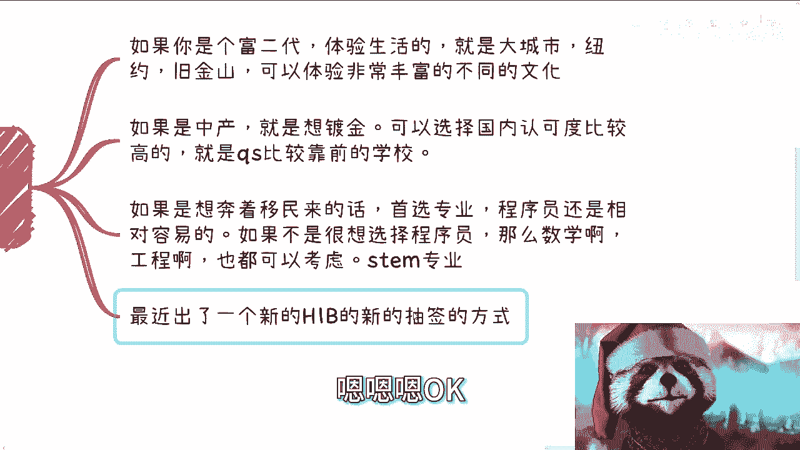

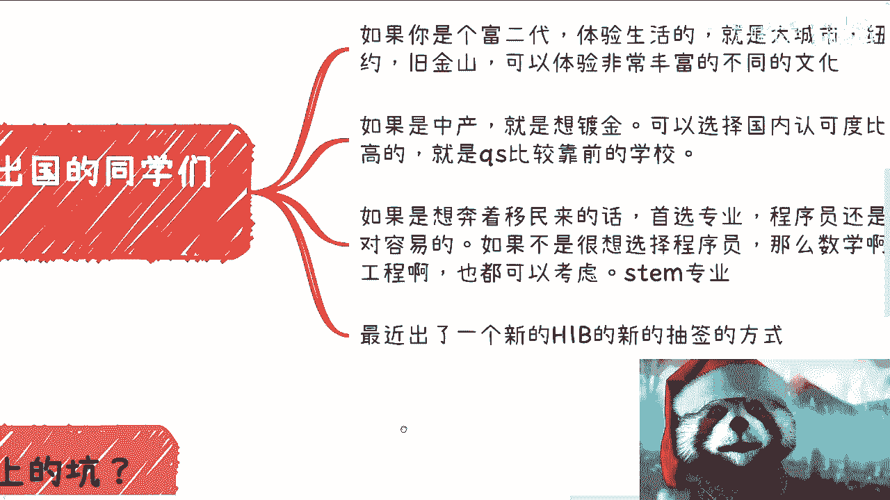

不过中国大部分就是如果真的从基数上来看哦，就是我聊下来，其实大部分人你说他不想吧，他想移的，但是呢他主要面临的问题还是说哎，就就就比如说哎呀，我我这边这个父母在中国对吧，家庭在中国对吧，巴拉巴拉巴拉。

反正就是还是会爱于一些嗯嗯就是这样的，最最终最终就是读完之后，可能就是过来中转站嘛，转个一年，转个两年就转回去了，所以啊其实我个人觉得啊就是转出来转一圈，就是我们俗称的水硕出来转一圈再赚回来。

我实在是觉得唉就现在因为国内不像前两年吧，对海归那么友好，或者这么的怎么样，就这两年就出去赚钱回来，这个精度的感觉意义也不是特别大，就就投入产出比其实已经不高了，就是你他出去可能花的钱很多很多。

那回来之后发现这个卷不动，是所以我觉得因为我们现在都说留学，其实消费他不是投资，所以如果你家有这个让你消费的话，那还是鼓励你出来看一圈，那如果你家真的很窘迫的话，那那你又铁了心要出来。

那你一定就是要铁了心下来才可以，我们才可以赚回本，但我觉得都不是很合适。

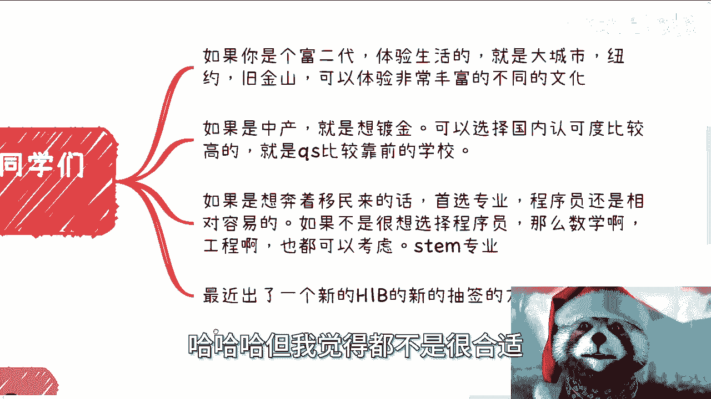

对对对，但不管怎么样吧，我觉得单纯从做这个牛马打工来讲，那肯定还是外面打工来的性价比高啊。

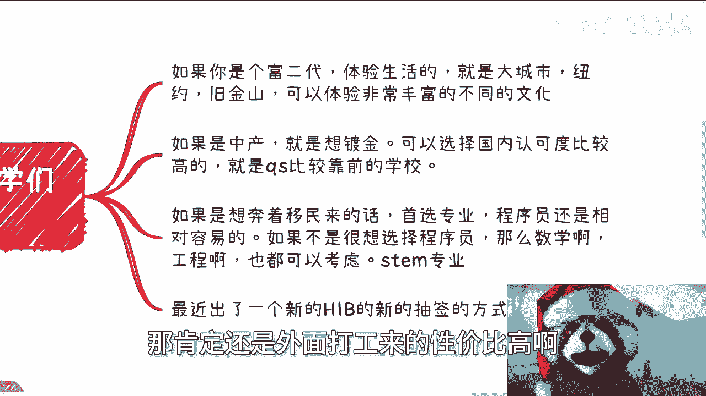

这对这毫无疑问，是的是的嗯嗯OKOK那我们到第三个嗯。

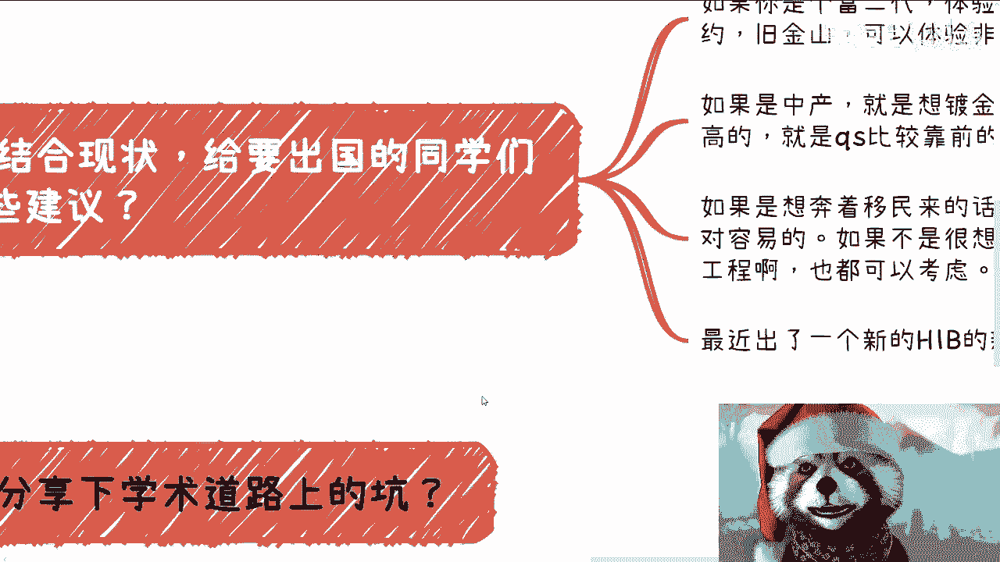

那这个大萌子是怎么会选择，对，我记得我第一次认识你的时候，你还是这个我就对吧，JK小姐姐吃火锅，我实在是没想没没觉得这个会做学术呀，这个与学术格格不入是吧，怎么怎么会选择学术这条路。

然后怎么看待这个学术研究这样子。

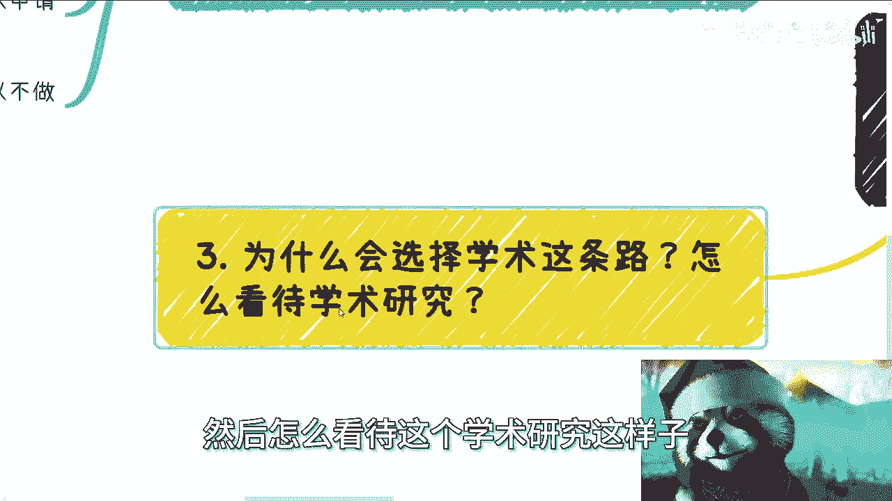

OK那这一趴我就要更加的honesty一点，诚实一点，就是其实我一开始选啊，选择要去读博士，是因为我真的不想要回国工作，哈哈哈对，因为我读，对，我对国内的工作环境还是其实是非常不满意的。

因为我本科4年其实有实习过四五段吧，然后在毕业之后也有全职工作大半年这样子，那我的工作环境就是首先我在北京工作，然后我在五环下去工作，我每天需要坐一个半小时的车去上班啊。

所以每天通勤时间总时长就三个小时，再加上我的公主，又是一个就是乙方服务客户的一个一个，广告策划的一个职位，所以我经常需要加班到半夜三点啊，讲2。3点，然后回回家啊，周末也是需要加班。

虽然那当时还没有盛行996，但是我已经工作大半年中，我已经觉得我自己就是已经失去了活力，身心俱疲，对于我就是人生长度的这个生命体验的话，我觉得非常的不友好啊，然后这颜值也下降了。

所以就觉得最近觉得还是我在国外，还是找找出路吧，那目前来说呢，我觉得我还蛮还是挺满意的，算是过上了我自己，就是比较内心平静的一种生活，因为啊风筝会少很多啊，并且这边的工作文化会好很多呃。

不管你的这个工作伙伴是比你大多少岁的，他们可能都会尝试用一种非常贫瘠的一个态度，然后来去对待和对待你自己的观点，因为大家都是有这个mutual respect，就是共同的自然人的这种尊重，给予对方。

对就是嗯，对这个也是这个也是就是说呃，我跟就是我在很多咨询当中，我跟他们讲的，我说我说我说最最呃他们有很多人问我嘛，他就说海内外的差别在什么地方，我说你从我的认知来讲，我觉得大部就就目前来讲。

最大的一个差异化，就在于说你像昨天那个跟我聊的那个博士，也是的，我就跟他说，我说我说最大差异化可能是在于，比如说你要跟我讨论个问题，我会比较客观的去看待呃你的这个人的价值，或者你要呃做的这个事情的价值。

这个看到的这个本身跟你给我多少钱，跟我们两个的就是说差异有多大，没有任何的关系，但是我说国内现在最大的问题就在于说，因为米香他昨天跟我提了这个问题呢，我当时跟他这么讲的，我说我说国内这个情况。

其实我真的宏观的一刀切呢，无非就两种情况，一种是什么，就是呃因为因为国内，我觉得大部分的一些年纪稍微大一点的人吧，他其实是嗯从内心啊，我是觉得他们可能是有点看不起别人的。

就尤其是自己有了一定的这种地位之后，然后呃我说你这种发给他，比如说让他review或者怎么样的，他他肯定的不，你啊然后我说这是这是第一种，然后第二种是什么呢，就是就是那种就是说可能找他的人太多了对吧。

比如说一天有二三十个人找他，那你可能就是二三十个人里面一个，那对他来讲就是说就是说啊可能都一样对吧，我都懒得看了或者怎么样子，但是嗯但是话虽然是这么讲啊，但是就是说每个人说的东西和他给出来的。

比如说论文啊或者idea啊，肯定还是有差异化的，但是在他们这边基本上就是一刀切了，就基本上就觉得就是说哎反正都一样啊，都大差不差，所以就是嗯就是你包括我前两天那个视频里面，其实也跟他们提到一点。

就是他们现在非常多的人啊，跟我反映一个情况，就是找不到人沟通，就是不管是同龄人不同龄人，同级别的人，不同级别的人，他都没法沟通，因为他就觉得就是说就说我，我不是想要一个答案，我也不是说啊。

好像就是呃呃就这么说吧，就说我既不想要一个答案，我也不想你来，就是就是倚老卖老来教导我，你知道吧，他更想的就是说哎，我们就是能不能正常一点的对吧，能不能就是就是就是客观一点的，然后像一个正常人一样的。

来来来来来来讨论我给我抛出来的一个问题，或者我的一个想法，然后他就会发现，我无论在现实当中还是在网络当中，我都找不到，你去我感觉非常可以理解，我觉得这个就是非常巨大的文化差异。

首先中国是一个非常优纪主义的国家哦，然后其次就是优质主义国家，达尔文社会，达尔文主义，就让所有的人就觉得我手中拥有资源和金钱，然后我才可以证明自己的地位身份，我才有权利去说话，但是其实在美国呃。

因为美国社会的这种就是平等的，这个观念非常的深入，比如说我们不可以去歧视一些其他的人种，如果说歧视的话，那你可能就会被举报，然后你就会被退学，你就会被开除，开除你的工作，这样，所以你大家。

我觉得大家都是有在尝试去理解别人，然后去尊重别人，即使你内心不想尊重和理解别人，也有一些一些制度规定去规划你，让你去尊重别人，这样子，OKOK对嗯行，那这个这个先先这么着吧。

嗯嗯嗯对，然后就是学术道路上的坑。

OK那我真想嗯嗯嗯啊，如果如果说这就是单纯从留学，在美国找这个博士的岗位这一个方面讲的话，首先就是最好不要找华人导师。

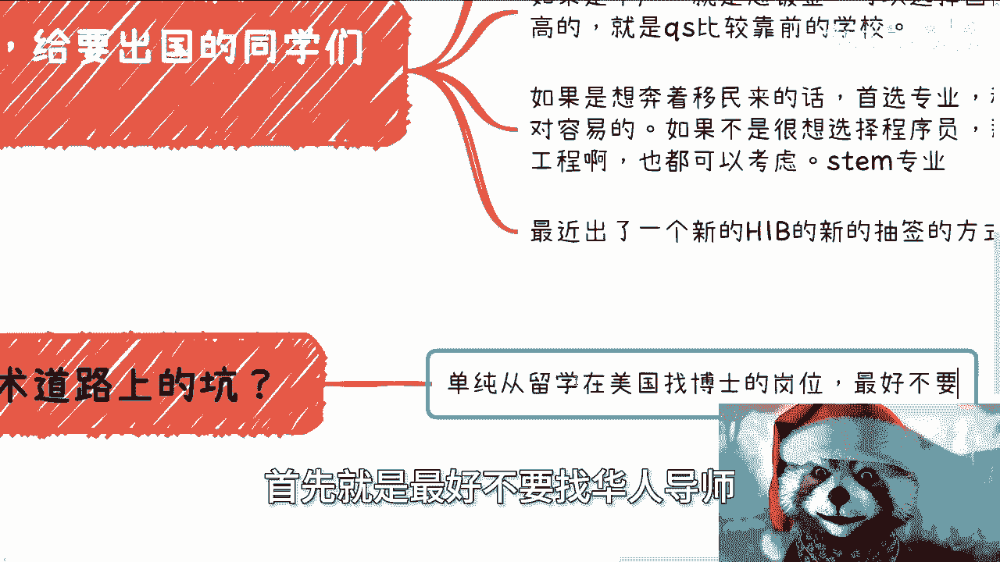

或者说是亚裔导师，就是中国人，韩国人，印度人都首先要避开一点，因为大家也知道我们东亚文化有一些toxic，有一些有毒啊，所以这个导师，他可能就是从功利主义的角度来看，他就是会压榨你。

这也是发现在很多我身边的同学，这身上的经历，以及我身边有一些被压榨的同学，已经处在这个精神崩溃的边缘啊，还有一些在退学的边缘，还有一些在重新申请，所以就很多的抓嘛在这个里面嗯。

但是中国学生因为这个英语的嗯问题，所以就会觉得说我找一个华人导师的，可能沟通起来会方便，但其实你知道就是everything has a price。

就是在这个背后你可能面临的是什么，这个是第一个坑吧，然后第二个坑我觉得如果说是在海外读博的话。

那可能呃我觉得publication的发表可能不是最重要的，最重要的还是保持好你自己的，mental health和physical health，就是身心健康，是你自己照顾好你自己的唯一方法。

除此之外，其他都是可以说是身外之物吧，所以就是就是这么看，就是说就是说至少你你反正读到现在过程当中，应该还算比较顺是吧，嗯对，因为我觉得我比较幸运的是，首先当我的导师是一个非常和蔼的。

60多岁快退休的美国白人教授，嗯男性他就是一个非常有大爱，然后有宽容度，对自己要求比较严格，但是对于学生会比较宽容，和给予很多指导的一个老师，这是第一点，第二点就是我我觉得就是读博还是不要太封闭。

你不要每天坐在电脑面前，然后光研究你那个东西，就是可能social呃，就是社交环境还是非常非常重要的，尤其是呃因为身在海外，你可能一不小心就精神崩溃了，精神不正常了，所以我觉得这个真的很重要，对诶诶。

那说到这个就是嗯，就是还是就我突然想到说那个，说那个就说出来的话，就是就是你你建议那种，就相对来讲，可能啊我们说在因为因为你你到海外去读，其实说白了，我们最终其实还是一个也不叫应试教育吧。

但是本身最终还是要拿一个文凭的嘛，那你见你觉得那种就是可能学习来讲中等，甚至来说偏下的这一类这个人群，就出来就兜一圈，或者说移民啊，或者说这个这个这个这个镀金啊，或者怎么样，你觉得现在这种难度啊。

或者说友好度啊怎么样，对于对于这些学习中等偏下，看你自己的目标吧，如果你的目标，如果你就是消费，觉得留学就是消费的话，那你怎样都可以出来见识一下，开一下眼界，那肯定是OK的。

但如果说你家里真的是有点困难，然后你们家也对于你这个年龄上有要求，比如说希望你啊什么28岁以前成家立业，这样子的话，那可能就不太适合出来读博士，但是硕士是可以考虑的。

OK不过我还是觉得这个反正只要不留在外面，他兜一圈回来，反正蓝并卵，反正基本上对。

因为现在国内就是对留学生，确实是还挺不友好的。

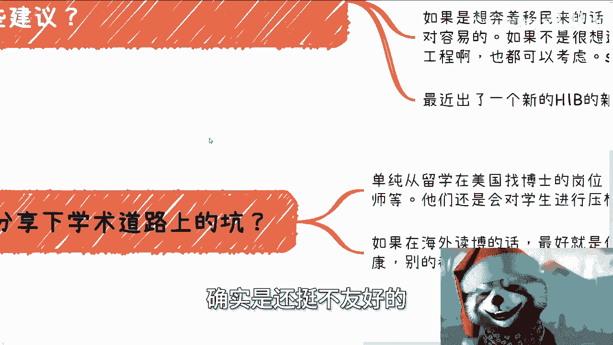

然后像如果你出国，你的目标是进进这个就是带编制的，这个单位的话，那你出国留学，可能还会成为一个比较大的一个缺点，所以就看你自己的目标是什么，如果你是境外外企的话，然后进互联网企业的话。

进金融行业的不可能他会相对有一些优势，但是其实我们说最大的优势还是在于你自己呃，你自己的人脉，然后你自己家庭的资源，然后你自己的本身的这个社会属性，嗯嗯嗯嗯诶我我我还有个问题啊。

就是就是就是学术这边就先撇开你啊，撇开其他人啊，就是就是客观的，如果宏观的来讲，是不是做学术的呃，有没有就是怎么问的，这个问题，就是说做学术的，有没有那种比较大的搞钱的途径啊，做学术的大的搞钱的途径啊。

怎么说呢，就如果你想通过做学术搞钱的话，这一定不是一条很好的路，对对对，就是就是搞学术，其实就是搞个情怀，那如果你去想要去赚钱的话，最好就还是创业，或者说你去做码农，这样子赚钱真的是来的很快。

所以说做学术的话，如果你真的就是没有一颗向往知识的心和，耐得住寂寞等和灵魂的话，那我建议还是不要来做学术，哼嗯嗯嗯嗯OK哎呀，那那那那你这个做学术这么多年，还能保持你现在有趣的灵魂，还是让我比较欣慰的。

那不是有您的陪伴吗，我天天看着你们，哎呀，我天天看你，我不得向上啊，我真的不能给我们小哥丢人啊，是不是是是是是是不是我这个我这一生目标啊，我不是有一个信念支撑着，我。

就是这个成为这个拥有一个美女博士的一个title，其实我怎么着，我也得把这个学学位读下来，嗯一年多了吧，我希望我2025年应该可以毕业，毕业，你后面走的应该就是那个终身教授了是吧，嗯不一定。

我觉得呃怎么说呢，首先就是我刚才讲的终身教授，并不能保证你成为一个呃，看起来相对良好的中产阶级啊，对对，所以所以也就是如果说是从一个人生长度，想要干什么的话，那我肯定是不会首选终身教职的哦。

哦嗯但是很有可能会在学校里做那种管理，管理岗位啊，然后做一些数据啊，什么这样子，那你是不是毕业就毕业，是不是就能回来玩了，我夏天我7月份就可以回去玩啊，我我有暑假呀，寒假呀，暑假有，虽然有。

那前两年这不也没见你回来吗，哦哦哦回来过一次，前两年不是疫情吗，对吧对对对对对嗯，可以啊，可以啊，7月份等你放寒假，暑假回来，到时候叫什么，就是看看吧，看看你在在哪，到时候看看这个线下活动。

可以找你去给我们的这个小伙伴，正好大家也可以认识认识，那必须的，那那你你叫我，我肯定就是立马迅速的，哎哟英文上连连夜连夜包私人飞机是吧。

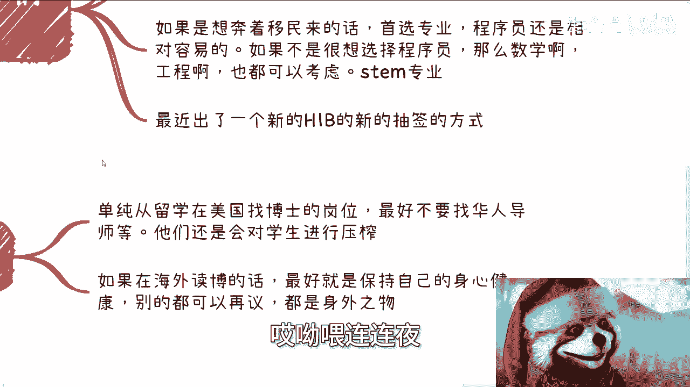

我懂了哈。

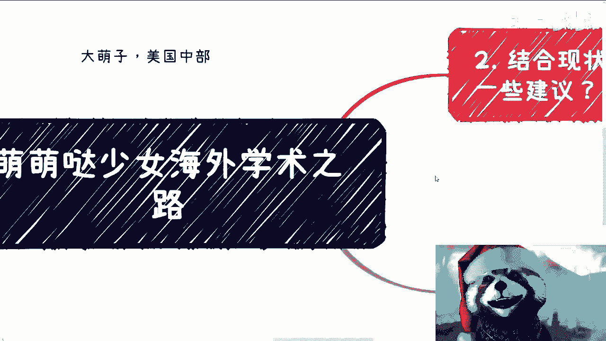

连夜坐火车回来，这得做多久啊，我靠非要要要做完就明后年了，是确实嗯学术转码哎呀。

就真的就是就是国内，反正我现在聊下来就就唉怎么说呢，就是我先提一点啊，就是就是我这个真不是说国内不好啊，但是就是这个聊下来，就感觉真的是国内做学术的，没有一个给我一个怎么说呢。

一个一个一个一个正向评价的，然后嗯嗯就是就是也许他想做，但是他面临的环境就是拉帮结派啊，拉拉帮结派，然后站队，然后怎么样子，然后然后要么就像昨天那种，就是他们也许也想做的，但是他根本就找不到嗯。

就是那种那种那种可以讨论的啊，或者说能够怎么做的这种导师，唉其实我也不知道国内现在这帮这帮人，在在在在怎么说呢，在搞些什么东西，就是就是就是真的，就是说每天就是急着那个申请项目，急着拿基金。

还是说急着拿干嘛，就哎对，就是这样，因为特别特别夸张，就是呃最近几年中国的这个发表物，就publication的数量暴增，但是如果你去看那些citation的话，就是引用呃，你用的话。

那中国的数量就是真的很少，就虽然你发再多的文章，但是没有人引用，没有人看你的文章，然后你的文章质量也不怎么样，这个就是就是跟生产队的驴一样，就在那块儿一篇一篇就给你生产，但是谁又在乎它的质量怎么样。

都是那种怎么说呢，就是优质主义大家都在比拼吧，真的很累，是的呀，就是卷啊，所以所以你知道吗，前两天唉就是就是就是我跟你这么说吧，你说我跟他们啊讲了很长很长时间，讲了很长时间的点在哪里呢。

就是我的point一直是在于说啊，我我我说我不管你们学校里面卷什么东西，我也不管你们到底读出来是怎么样的一个学历，但是你但凡出了学校到社会上，你就不管你愿不愿意，你面对的是资本家，或者你面对的是企业家。

或者你面对的是那些所谓的这个，拥有政治地位和社会地位的人，其实你对他们来讲就是工具人，就是牛马，然后等你年纪大了，那基本上就是被扔掉，然后换一批新的，然后卧槽就依然你去看评论区。

依然还有非常多的人来跟我，就是你在我看来是什么，就是就是就是在给我秀他们在学校里的优越感，但是问题是你在学校里面优越感秀的再怎么样，等你出学校都是nothing啊，就这么一坨屎啊，简直就是哎呀。

我觉得讲不通，真的是没无无无解，真的，因为就是，如果他们一下子就接受了你的这种说法。

那他们之前几十几年几十年的努力，就一下看起来都非常的可笑，你知道吗，对啊对啊，哎，不过我跟你讲，真的有我我，我反而是觉得，就是就是那些就是说家里面经商的，或者家里面真的以前做官员的啊。

或者说家里有点钱的，我我聊下来，我反而是觉得，其实其实他们的呃认知面或者说去看问题呢，相对还是比较客观的，最惨的就是那些就是说明明明明就是说啊，我应该是去做改变的对吧，明明或者说是最需要改变的那批人。

然后呃可能家里面也不是说特别的怎么样子，就是要依靠他未来的这个这个叫什么，就是说呃去赚钱也好，或者自主的能够能够去开拓一些事事业也好，或者说去认知更多东西也好，反而他们不愿意去接受更多的东西。

然后就是看着眼前的东西，然后就去跟别人卷就卷了，这个意义在什么地方呢，实在是对吧，然后而且而且你知道最离谱的是什么，就是还有很多人啊，我真的比例不少，回答我的是什么，就我问他，我说你为什么要出去读个数。

比如说他们要去日本，到美国或者加拿大，我说你为什么要去读，他说我家里面没有硕士，我就想读一个，这是我的执念，卧槽我就在，然后我就问他，我说我说那你家里面是不是很富裕，也没有我家里面很穷的。

那他妈的图啥呢，怎么说呢，就是花别人的钱不心疼吧，对我也觉得就是就是我真的觉得我，我看他们的评论，我就有种什么感觉，反正现在他妈的你也不用出钱，你反正啃你爸妈钱对啊，等他们自己赚钱的时候又赚不上钱。

结果呃自主权也没拿到，钱也没拿上，然后上面要听好老妈老爹的，然后完了下面还要养小孩儿，就悲惨的童年生活就是这样产生的，是啊就非常的离谱啊，就而且而且我跟你说啊，就是就是我聊一下。

我也发现就是他们会有一个思想是什么呢，就是他们会觉得我现在能赚多少钱，我未来就一定能赚多少钱，然后我每但是呢你去问他们，就是我我有时候会比如说细节上面，大家语音沟通说，我就会问他，我说你现在赚60万。

你能跟我保证你未来10年都赚60万对吧，你保证不了，而且另外一方面就是就算能赚60万啊，我我跟他说，我说退1万步来讲，我就算你未来10年能赚，一直能赚60万，你10年加起来是600万对吧，好没问题啊。

没问题，那么我说我跟你说两个点，第一你随着年龄的增大，就像你刚刚说的，就是你上有老下有小，你可以下没有小，但是他你上肯定有老，对不对，好，那我说你给予家庭的时间，给予你父母的这个钱也好。

包括未来大家有些小毛小病也好，你的精力一定不会有你现在20多岁这么充沛，那么等到那个时候，你还能保证你能赚60万吗，对不对，首先这第一点我说第二点是什么，就是你就算跟我说，你10年能稳定赚60万。

我跟你讲啊，这话他们要说我不接地气了，但是但是问题是什么，你就算稳定能赚60万，你600万我跑，我算你10年不吃不喝，什么都不用，你600万，你告诉我就有就有安全性了吗，哦就有就有安全感了吗。

或者有稳定性了吗，我也没看出来呀，你至少拿我一个住在上海的人来讲，我实在看不出来，是的是的对啊，我就哎呀，就是不理解，真的不理解，我们现在生活成本真的太高了，你先说，我就觉得就是如果你是追求一个啊。

比较刺激惊险的人生啊，那你就在国内，在国内一线城市待着，那如果说你想着，那你一定很成功啊，没有没有没有你继续继续，而且你是吕布，你的你的你的那个什么，就是你游戏设定就和我们不一样，那就是如果说你哈哈哈。

如果你想要寻求一个就是舒适，然后安静，然后呃自给自足，然后内心自洽的生活，我觉得就是海外其实确实还挺不错的，是的是的，主要是国内的，国内的人太多了，然后国内的声音也太多了。

就是你没有办法非常的专心去做自己的事情，然后没有办法享受那种非常宁静，平静的那种幸福感，对，所以啊所以就是就是我一直跟他们说，我说嗯就我跟他们说，我说你们现在在国内啊，就跟我聊也好。

或者你他们看到我讲的一些观点也好，就基本上已经算是哎，我真的是觉得我自己也有这个感觉，就是我是觉得10年前呃，其实其实很多东西并不嗯就是说并不那么少见，但是你放到现在，我真的是觉得因为哎呀。

因为现在这种短视频啊和网络上的东西，实在是太过表面或者太过浮躁，就是他们不他们我真的跟他们讲，我说你们就看到我现在这种这种情况，然后我人还在国内对吧，然后呃就就就就感觉像一个bug一样。

在这个地方哈哈哈对，就是怎么说呢，但是懂的人都知道你是靠自己的努力，毕竟我们驴哥李哥是领导。

也不是就是随便传来的啊，你知道吗，昨天我有个朋友。

他7777年的，然后他我跟他认识也快10年了，他忙他的业务嘛，但是他从来没有看过呃，就是他知道我在做视频，但是他还没有看过我做的东西，然后他昨天晚上突然跟我说，他说他说到现在怎么有这么多做。

做了这么多量，他说你怎么你怎么能够，这个母猪是铲视频站视频，然后他就他就问我，他说他说那你怎么能保证在过程当中，就是嗯当然他他那个可能有点上海话的描述，就是我想怎么翻译啊，就是他意思就是说我在做的时候。

怎么能保证当中不卡壳，你知道吧，或者怎么样，我说我说就扯嘛，对不对，我说你就当做把你这个电脑当成一个，怎么下面一群观众，对不对，那有啥卡不卡，卡了卡了就卡了，没卡了嘛，也代表真实，对不对，无所谓的呀。

哎我觉得其实你真的就是你就是有这个天赋，就是有些人你给他训练一辈子，他也训不出来，你现在这种情况真的变异了，变异的天赋点就在这，穷人靠变异，富人靠科技，真的怎么办呢，真的我我我我我我每天都在想这句话。

真的是哈哈哈哈，OKOK啊OK行呀行呀，哎那嗯咳咳咳学术我觉得没问题，然后嗯回头反正时间我看也差不多，反正回头的话就是也可以再看看嗯，就是你你你可以看看从海内外的其他的一些，就包括生活啊。

包括比如说其他你看到的一些现状啊，到时候反正也可以找个时间，我们到时候再再再再看看吧，别的有什么话题可以再说行啊，你你就找我呗，反正我也就是get到你这个聊天的路数了，你这就是瞎扯了。

你这个问的问题和我准备的问题，说什么也没有什么重合的地方很少，但是我也能扯出来哦，那就好呀，咱们就下次再约吧，好的嗯嗯嗯OK那你还有什么要给大家打广告的，或者要说什么吗，啊我在想呢，就是要不然你那个呃。

再在评论区圈一下我的账号，然后如果他们有留学咨询的话，然后去找我哦，你账号哪个账号，twitter微博，我B站也有张2号，虽然没跟我去，我去特别关注一下我，我真的就是很久没更了。

因为我我博一的时候高了一阵，然后哎怎么说呢，我就是我哪都有账号，就我小红书抖音什么乱七八糟的都有账号，微博我也有账号啊，那这个圈微博或者说圈那个哔哩哔哩都可以，都叫萧雅萌子吗。

但是我我更新的频率就是十分，看我的学业繁忙程度，这样子哦，很正常，就看随缘吧，这毕竟也不是这个人人都像我一样，15分钟卷一个视频出来，我跟他们说，我说只要我想我一天给你卷十个都可以，无所谓，对吧哈哈。

反正我不过脑子对啊对啊对啊，就是这样子，OK那你可以嗯，就这样吧，就没什么问题了，那我是不是最后要说一个呀，你就说我的这个账号，你说呗，OKOK然后谢谢大家听我在这唠学术的嗑。

那如果你有一些留学的问题想要咨询的话，可以找到我的账号萧雅萌子啊，哔哩哔哩和微博都有在更新，然后我私信给我就OK了，好谢谢大家嗯，谢谢大家，我们这个再次感谢我们萌萌哒的这个大萌子啊。

就大家大家你看这次没有头像对吧，大家不用担心，反正反正你们去他账号看到都有照片，各种照片萌的一塌糊涂，好的没问题没问题嗯好，那就这么着。

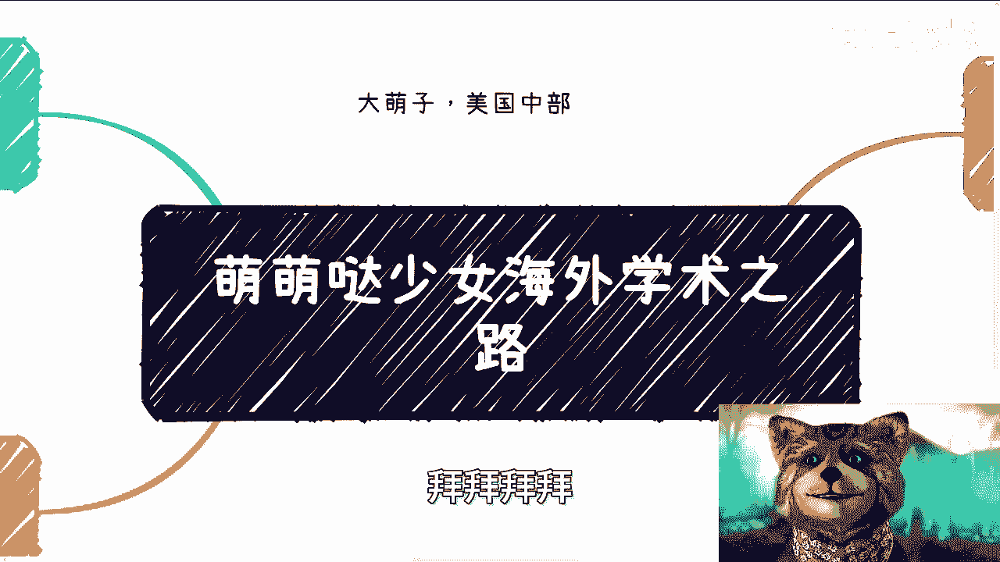