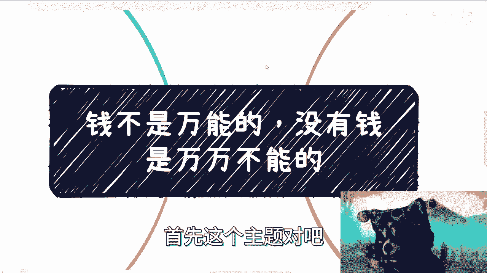
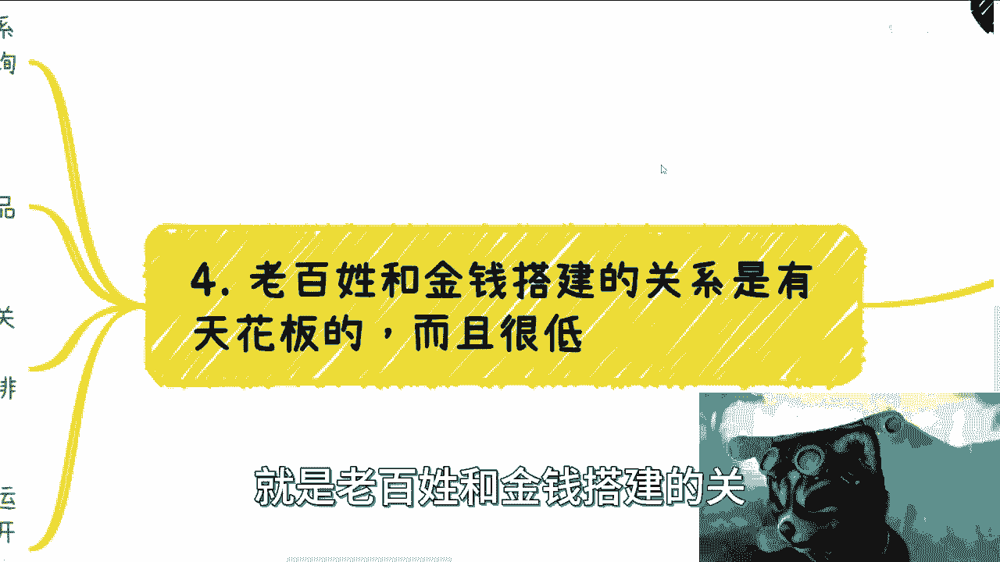
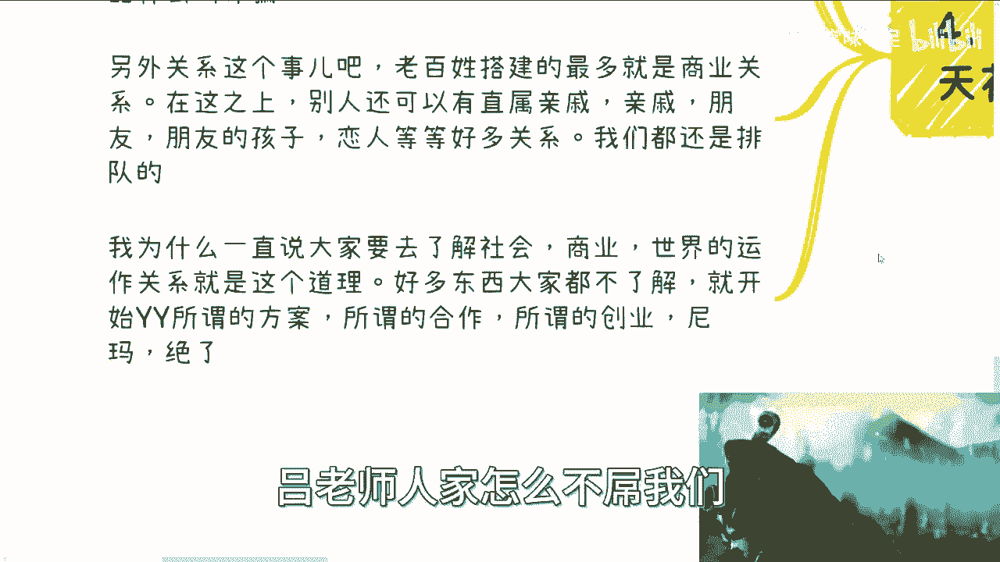
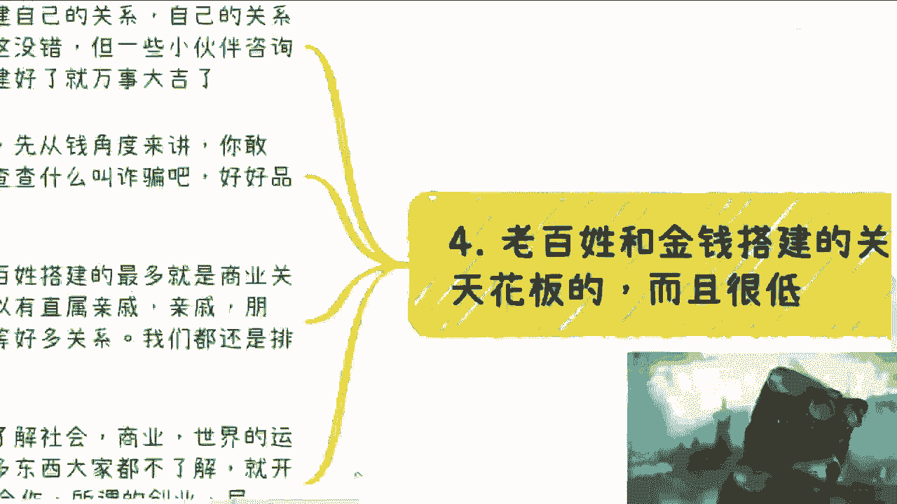

# 钱不是万能的，没有钱是万万不能的 - P1 - 赏味不足 - BV1694y1a7Bg

哈喽大家好啊，这个今天礼拜天呃，30号诶，是30号吗，我约了那个，等一下我看一下啊，30号对。

我约了那个直播啊，大家可以记得订阅一下呃，首先这个主题对吧。

我觉得是个人可能都听到过这句话啊，但是呢啊我在这句话，我在这里也写了，这句话呢都听到过，但真的体验过的估计是少数，而且呢我相信体验过的人呢一定是对社会，对这个世界会有一定的认知。

也就是说嗯我不说多大的认知吧，啊就是会是那种三观重塑的啊。

那种认知好，那么我在这个地方呢给大家细分一下啊。

首先啊你说钱不是万能的，那么我们来说钱什么时候没有用对吧，呃很多人觉得是万能的啊，它更多的指的是物质上面或者有一定的前提的，这种规则，前提条件之下啊，我在这地方先说个前提啊，不要来杠，什么叫来杠呢。

就是你要是跟我说开无限秘籍show me the money哈对吧，打过星际的都知道对吧，你开无限秘籍show me the money，这种不在我们的讨论范围内，而且啊我还是那句话。

你也别show me the money对吧，你但凡有点钱，你敢给啊，别人也不敢收啊，我就这么告诉你啊，那么疫情的时候呢，呃很多人呢他也体会到了钱不是万能的对吧，这个东西我就也不方便展开讲啊。

呃其实本质上来讲，在一定范围内，你只要有一定有一定的量啊，什么叫有有一定的量呢，就是说有一定的竞争者，如果大家都愿意去出钱，都去抢一个东西的时候，那么这个时候钱就没有用了啊，或者说钱就没有那么有用了啊。

而且呢你要你要明白啊，很多时候啊，很多时候呢就是呃我们只要不是竞拍类型的，那么你只能排队好，那么前两天我们说的那个陪诊，对医疗资源永远是稀缺的，那么在医疗这个场景下面，我们就拿上海来讲，抢手的医院。

抢手的医生到处都是排队的，而且你去看好了一排都是几个月之后的啊，而且呢你如果不是上海本地的，或者你没有就是说落户落在这边对吧，你没有原本的这个医疗卡呃，社保卡对吧，或者你不是复诊，就是你是初诊的话。

我跟你讲专家或者主任，包括什么什么那种呃，更高级的这种，你一方面呢很难预约，另外一方面呢就是说它的流程也很复杂对吧，包括有一些就是说你需要有各种各样的材料啊，对吧等等等等等啊。

那么这个时候我就问你钱有用吗对吧，就像我们刚刚说的很多场景，他不是拍卖，你愿意出钱，别人愿意也愿意出，你着急别人也着急啊对吧，那这种场景下面，钱只能让你成为排队的一种门槛，好就是你能不能排你足够。

你愿不愿意出对吧，至于时间我跟你讲，这就真不知道啊，当然有小伙伴要说啊，他说很多时候加钱啊，给的多自然也可以加速，这句话对不对对啊，但是你不要忘记给的多，有一个前提，那就是关系对吧，就是说你给的多。

就像我们刚刚说的，第一你得知道你给谁，你搞得好像你有钱，你在那边说，卧槽他妈的老子有钱，然后呢，你给谁呢，我搞笑了，你知道你给谁吗对吧，这是第一点，第二点是你知道给谁，他愿不愿意收，他敢不敢收呢对吧。

所以说很多时候我们就举一反三啊，就不单单意聊这个地方，很多时候都是一样的啊，那么第二个再比如啊，再比如很多小伙伴啊，这个跟我抱怨啊，小老百姓没有渠道啊，认识不到大佬啊，扩展不断扩展不了自己的关系圈对吧。

好我可以介绍啊，我可以接受集中厅，农业厅，工信厅，或者各学校什么浙大什么教授都可以，富二代，富二代，富二代我都有，没问题，多的是啊啊，当然也不带二代啊，一代我也有对吧。

那么假设我说假设大家愿意出钱请客吃饭啊，我不说多二三十万吧，那我不说多啊，那么这时候呢钱不是问题了，对吧好，那我们组个局啊，我组个局我请过来，你们可以见面啊，你们可以认识，那么当下到了这个节骨眼上面。

钱已经不是问题了，对吧好，那么我就问啊，知道聊啥不啊，知道怎么建立关系，不知道别人要什么不对吧，知道要给多少红包吗，知道礼仪吗，知道后续怎么敢展开合作吗，知道从什么切入点展开合作吗。

知道怎么建立信任关系吗，不知道啊，然后呢，这是钱能解决的吗，不好意思，解决不了，那真解决不了啊，是我跟你讲，很多人呢觉得很看重钱啊，他不管是看我的视频，还是可能比如说看一些身边的人啊，他觉得很看重钱。

但其实你要明白一点，你要能赚钱，钱真的就是个目的，它只是个结果，你懂吗，就是说你是不可能忽略这个过程的，就但凡你不懂这个过程本身你就是赚不到钱的，它是一个相辅相成的一个过程，对吧。

那么三很多时候呢也的确需要钱啊，那么我们再来说啊，钱这个东西最大的优势在于哪里呢，在于避免那些可有可无的矛盾，好在于能够解决你的时间啊，当然了，很多人可能觉得哎呀这个吕老师，你这样说就太不近人情对吧。

好像这个把所有的感情，那个感性方面都说成理性方面，那没有办法嘛对吧，你为了提升效率，你为了节约时间，其实很多时候你就应该理性的看待，没有办法的啊，我相信很多人你都会碰到很多问题，父母之间的，亲戚之间的。

同事之间的对象之间的等等等等等等等对吧，很多矛盾他会让你们比如说感情破裂，也会让我们内耗不已啊，因为我咨询下来，我发现的确是这样子，你包括我也是这样子，以前也是这样子，很正常人嘛对吧。

又不是孰非圣贤对吧，那我相信某些时候呢夜深人静了啊，大家不管是以前还是现在还是未来啊，我相信终究会有一个时刻去想，就如果当时自己有钱，当然我不是说特别多，而是说这个钱是能够解决当时矛盾的，那个资金量啊。

我不管你们当时矛矛盾是多大多小啊，这不重要啊，我们就说如果自己有钱好，那么其实你就会发现，现在可能就是另外一副光景了，或者说以前的很多矛盾其实是可以避免的啊，那么我说的抗风险性其实也是这个道理。

就是很多时候你会发现我们的生活，它是相辅相成的，你以为生活很顺，或者你以为很开心，你以为大家环境很好，或者你以为大家感情很好，我不管这个大家是谁，你跟他什么关系，这不重要啊。

但是其实它本质上是你的资金量，你的也不一定单纯想啊，你的资源，你的钱，你的关系，你的各个东西就是你活在这个世界上，你活在人类社会里面，它有它的规则对吧，那么你大家的资金量啊，关系啊对吧，包括资源啊。

综合起来他有了一定的抗风险性，那么其实也就间接的，间接的其实少了很多的矛盾，你明白吧，包括间接的少了你很多的内耗，或者少了很多东西，是谈到这里啊，我相信有些小伙伴，比如年纪轻的啊，你们年轻气盛。

你们会觉得俗，是我也觉得俗，但我告诉你们，人总归会长大的，人也会慢慢年纪变大，年纪变大了，父母年纪自然会变大，你就会有更多的事情，更多的烦恼要去考虑对吧，那么我只能说很可惜的是，我们活在这个世界。

那不就是俗吗，那怎么办呢，对吧，你要跟我说你出家了对吧，你要跟我说，你这个啊六根清净，那没问题啊，但是能有多少人呢，是吧啊，那么我们剩下不管是去抗争也好，去迎合也好，那我们不得怂嘛，好那么第四点啊。

就是呃关于这一点呢，我还要强调一下，就是老百姓和金钱搭建的关系。

他是有天花板的啊，而且很低呃，什么意思呢，就是说你看啊，我一直跟大家说，要去搭建自己的关系，自己的关系往自己的护城河对吧，这没有错啊，但那一些小伙伴咨询我的时候呢，我也发现诶好像我漏掉了某些东西啊。

就是他们天真的认为搭建好了就万事大吉了，其实并不然啊，还是那句话，先从钱的角度来讲，你敢给别人敢收吗，啊你们去查查什么叫诈骗好吧，你们细细去品品啊，什么叫诈骗哈，这个不方便多讲啊，你们自己想想看。

聪明的人自然会明白啊，另外关系这个事啊，老百姓建立的最多的是商业关系，但是你要明白一点，在此之上，别人凌驾于你的，还有什么可以直树亲急啊，直系亲属吧对吧，你比如说自己的孩子，自己父母对吧。

然后兄兄兄弟姐妹对吧好然后自己亲戚，自己的朋友啊，自己的，比如说闺蜜对吧，发小闺蜜的孩子，朋友的孩子，发小的孩子，包括她的恋人对吧，第三者等等等，这些关系都是凌驾于我们的，你明白吧。

不是说我们千辛万苦搞定就真的搞定了，不是的啊，你一定要明白，就是我们仅此而已，没办法，因为我们是老百姓啊，我为什么一直说大家去了解社会，了解商业，了解世界的运作规则，也是这个道理。

就是很多东西其实大家都不了解你，你你今天硕士毕业，博士毕业，你你就是nothing，你就是nobody啊，你你你你就跟个五六岁的婴儿没什么区别，那五六岁的小朋友吧，不叫婴儿，五六岁的小朋友没什么区别啊。

你如果来说什么都不了解，你就开始跟我说啊，我要开始做做方案了，我要开始做所谓的合作了哦，我要开始去创业了对吧，我要去想想跟别人合作了，你想的有用了，地球不是围绕你转的呀对吧。

你要明白你要做的第一步是什么，是了解这个社会的规则，从而去迎合他，而不让社会迎合，你，可能不来，这不可能啊对吧，所以说你们很多人想出来的所谓的合作，所谓的创意。

所谓的solution就都是属于别人听一句话，听两句话就觉得嗨，这不靠谱，然后你们就会反过来到我这边说啊，吕老师，人家怎么不吊我们。

那废话怎么能吊你们呢。

对不对啊，所以说啊就是我还是那句话，就很多时候啊什么叫鸡同鸭讲，鸡同鸭讲的意思就是说我说了很多事，我说的事情的关注点永远是在A，而大家可能听完之后理解的关注点到了B上面，完了这就叫基础鸭讲。

就包括就是什么呢，就包括比如说这个视频啊，如果你们有幸听完了啊，你们要去想我到底想要告诉大家是有钱很重要，有钱不重要呢，还是一些别的什么事情对吧，那如果你们觉得听完了我是在讲钱这件事情。

那完了你你你们这视频就白看了啊。

行吧啊，就这么着吧啊啊大家一样的好吧，有任何的这个创业的想法或者副业要赚钱的啊，因为工作未来肯定是不稳定的，不靠不可靠的，别想了啊，呃想要抗风险性强的，想要了解更多东西的好吧，你们总结好自己手上的牌。

总结好自己的关系链啊，总结好自己以往的一些经历啊，然后总结好你们的问题列表，呃，可以私信我好吧行。

