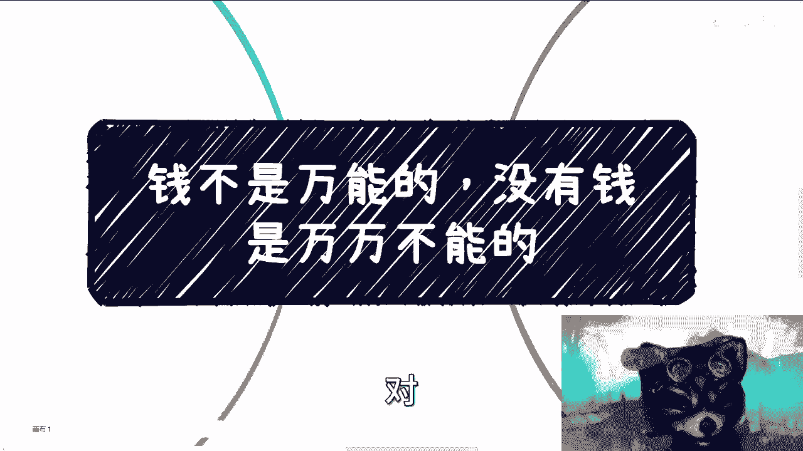
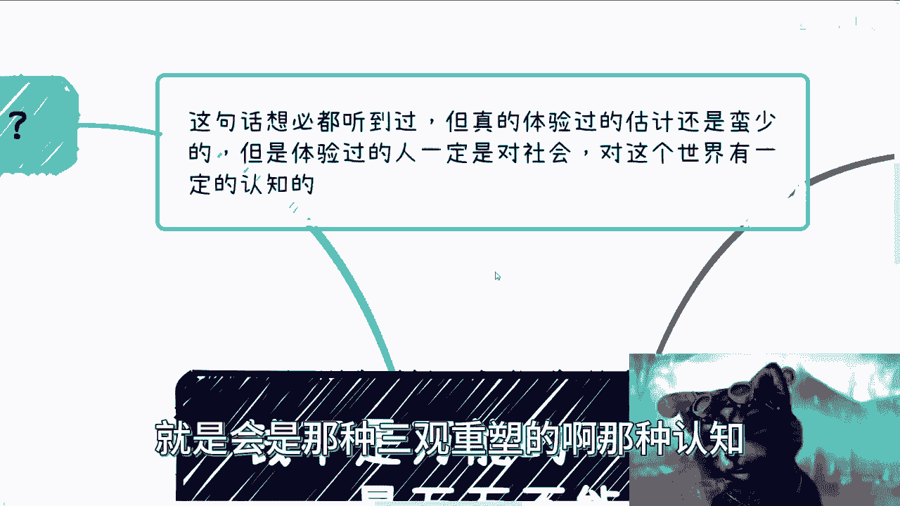
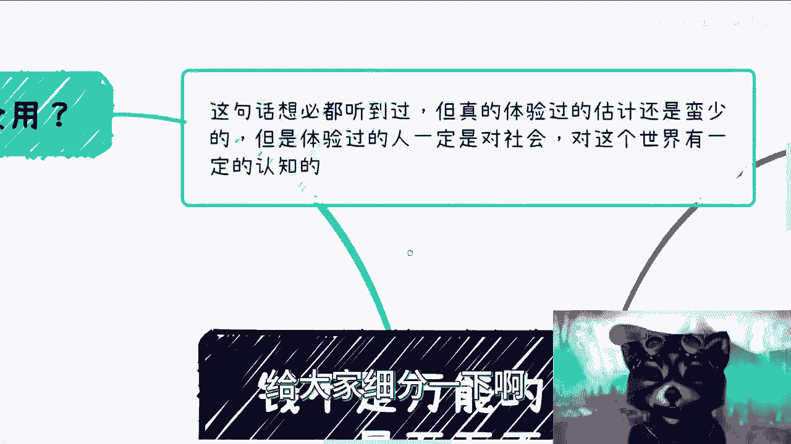
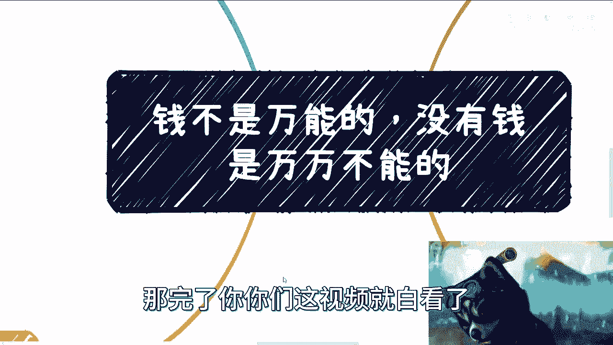

# 课程一：💰 钱不是万能的，没有钱是万万不能的

在本节课中，我们将深入探讨一句广为人知的俗语：“钱不是万能的，没有钱是万万不能的”。我们将分析金钱的局限性及其在现实生活中的核心作用，帮助你建立对金钱与社会规则更清晰的认知。

---

## 钱不是万能的

上一节我们概述了课程主题，本节中我们来看看金钱在哪些情况下会失效。

许多人认为金钱万能，但这种认知通常局限于物质层面或特定规则前提之下。需要明确一个前提：我们讨论的范围不包括使用非常规手段（如游戏中的作弊代码 `show me the money`）获取无限金钱的情况。在现实规则下，金钱的作用有其边界。

例如，在疫情期间，许多人切身感受到金钱并非万能。本质上，当存在一定数量的竞争者，并且大家都愿意出钱争夺同一种稀缺资源时，金钱的效用就会降低，甚至变得无用。

很多时候，获取资源的方式并非拍卖，而是排队。以医疗资源为例，它是永恒的稀缺资源。在上海，热门医院和医生的预约往往需要排队数月。对于非本地居民、没有本地社保或需要进行初诊的患者而言，流程复杂，材料要求繁多，金钱难以直接换取及时的专家诊疗服务。

在这种场景下，金钱只能成为获得排队资格的一种门槛，但无法保证缩短等待时间。有人认为“加钱”可以加速，但这通常需要一个重要前提：**关系**。你需要知道钱给谁，并且对方愿意且敢于收下。

我们可以将此逻辑进行举一反三。另一个例子是拓展人脉圈。假设有人愿意出资组局，邀请各界人士（如政府官员、教授、企业家）见面。当资金到位后，金钱本身不再是问题。

然而，关键在于后续：你知道该聊什么吗？你知道如何建立关系吗？你了解对方的需求、社交礼仪以及后续如何展开合作吗？这些都不是金钱能够直接解决的。很多人看重金钱，但赚钱本身是一个过程，是能力和资源运作的结果。忽略过程本身，就无法达成赚钱的目的。

---

## 没有钱是万万不能的

理解了金钱的局限性后，本节我们来看看为什么金钱又不可或缺。

金钱最大的优势在于它能避免许多不必要的矛盾，并节省你的时间。为了提升效率、节约时间，很多时候我们需要理性看待问题。

每个人都会在生活中遇到各种矛盾，涉及父母、亲戚、同事、伴侣等。这些矛盾可能导致感情破裂和严重的内耗。在夜深人静时，很多人会想，如果当时拥有足以解决矛盾的金钱，如今的境况或许会完全不同。

这里提到的“抗风险性”也是同理。生活的顺遂、人际关系的和谐，本质上建立在个人资金、资源、关系等综合实力的基础之上。这些因素共同构成了你在社会规则中的抗风险能力。抗风险能力越强，间接避免的矛盾和内耗就越多。

有些年轻人可能认为谈论这些很俗气。但人总会成长，需要面对更多现实问题。我们生活在这个世界，就必须理解并适应其规则。

---

## 老百姓与金钱关系的天花板

上一节我们讨论了金钱的必要性，本节中我们需要认清一个现实：老百姓通过金钱搭建的关系存在**天花板**，而且很低。

我一直建议大家要搭建自己的关系网和护城河。但有些咨询者天真地认为，关系搭建好后就万事大吉。事实并非如此。

首先，从金钱角度，你敢于给，对方敢于收吗？这涉及到法律和信任的边界。其次，在关系层面，老百姓最多能建立的是商业关系。然而，凌驾于商业关系之上的，还有直系亲属、亲戚、密友及其社会关系等。这些关系都可能影响甚至否决你辛苦建立的商业联系。

因此，我们必须明白自己的位置。这就是为什么我一直强调要去了解社会、商业和世界的运作规则。许多高学历者对社会规则一无所知，就像五六岁的孩童。如果你在不了解规则的情况下就贸然策划创业或合作，你的方案在他人眼中很可能是不靠谱的。地球并非围绕你转。

你要做的第一步是了解社会规则，并学会适应它，而不是让社会来适应你。很多人构思的合作方案或解决方案，在懂行的人听来一两句话就能判断其不可行，这就是典型的“鸡同鸭讲”——双方的关注点和认知根本不在一个层面上。

包括这个视频，如果你听完后只认为我在讨论“有钱”或“没钱”本身，那么你可能完全错过了重点。

---

## 总结与行动建议

本节课我们一起学习了金钱的双重属性：它既非万能，又不可或缺。关键在于理解金钱在具体社会规则和人际关系中的作用边界。

如果你有创业、开展副业或增强抗风险能力的想法，未来的工作充满不确定性，单纯依赖工作并不可靠。

以下是给你的行动建议：
*   **梳理自身资源**：总结你手中已有的牌（技能、经验、资金）。
*   **盘点关系网络**：理清你现有的社会关系链。
*   **反思过往经历**：从过去的成功与失败中汲取经验。
*   **准备问题清单**：将你的具体困惑和挑战清晰地列出来。

完成以上准备后，可以进一步寻求有针对性的指导。