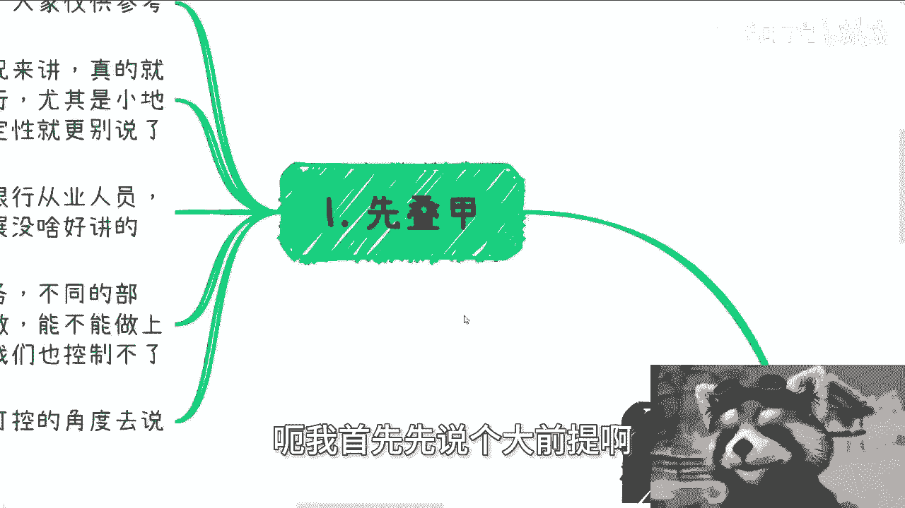
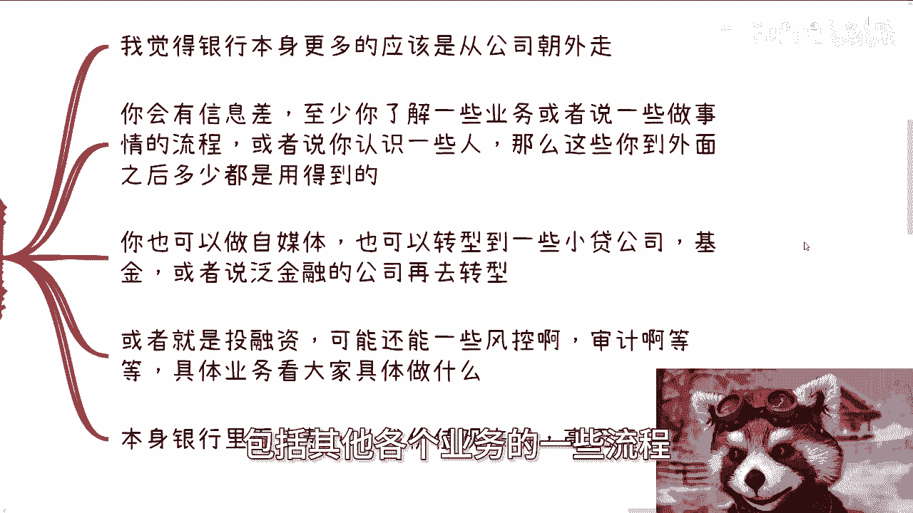
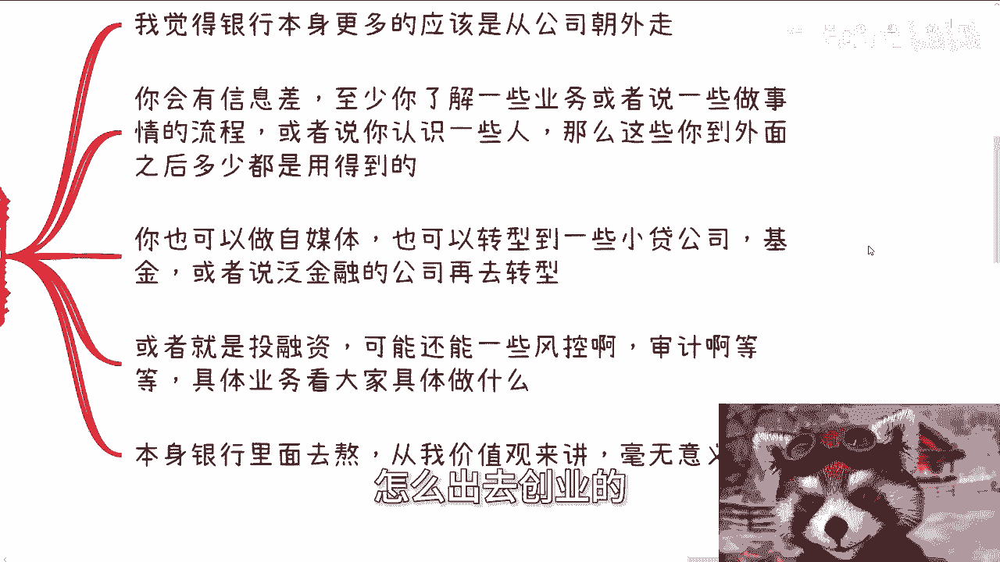
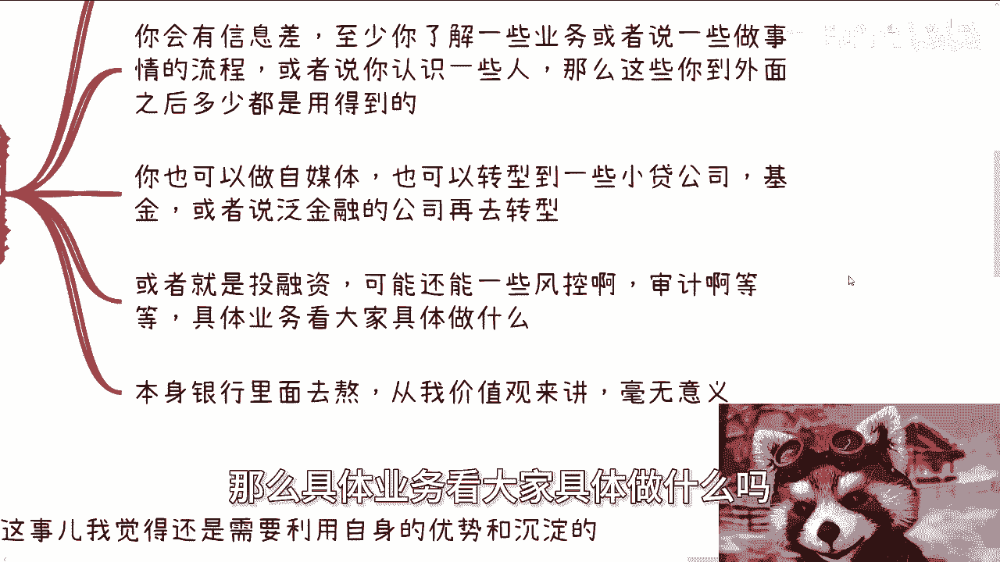
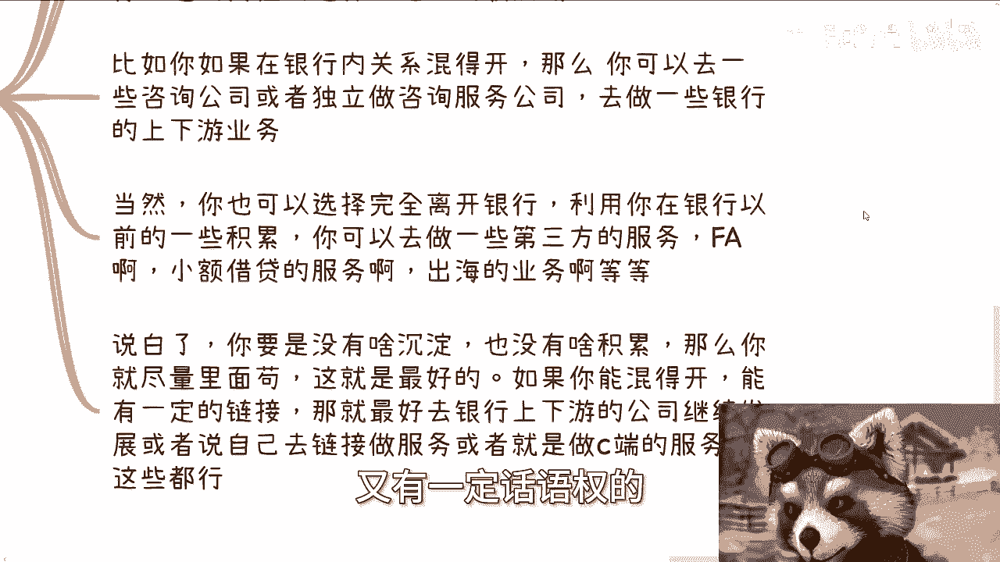
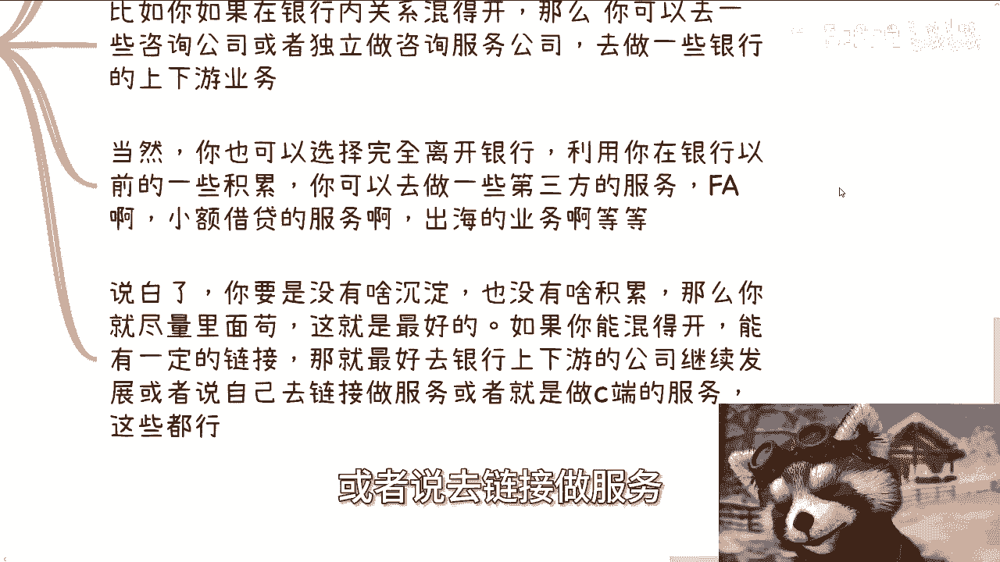
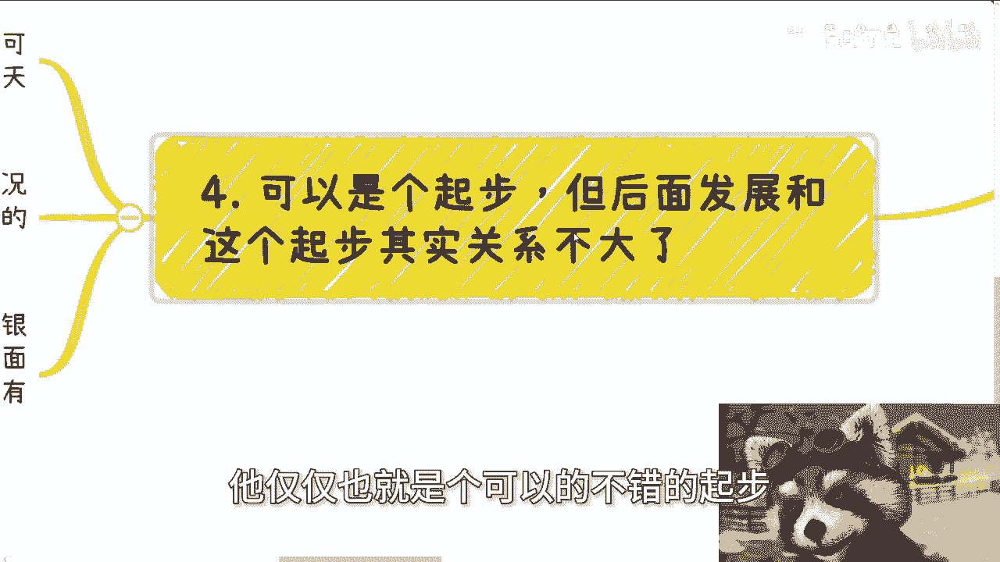

# 银行从业人员的发展 - P1 - 赏味不足 - BV1Zf42197bj

好大家好啊，这个今天又比较晚，因为今天儿童节嘛对吧，昨天儿童节，然后我刚刚做了一件很傻的事情，就是本来那个充电视频已经给你们试复核中了，然后我突然发现好像字幕没加，所以我就把它删了。

那待会再给你们加回来啊。

嘶呃然后今天这个主题呢是有小伙伴跟我提了。

说银行从业人员的发展，呃我首先先说个大前提啊。

先叠甲啊，就是首先我说的也只是我认为啊，大家仅供参考，然后另外一方面呢，就是说我毕竟不是银行从业人员，所以我说的可能很片面啊，如果有相关的啊，有经验的小伙伴，你们也可以在评论评论区说好吧。

也可以分享一下你们的见解啊，反正还是那句话啊，分享归分享，不要喷啊，不要上来就是那种二极管啊，就就没没啥必要，何必呢，对不对啊，那首先我先说我的想法啊，就是一方面呢就是说这几年经济不好的情况。

下面呢呃就我跟一些小伙伴聊下来，除了四大行可能还好一点啊，我只能说可能啊别的银行，尤其是小地方的那些分行，支行额薪资呢也没啥好追求的，稳定性就更别说了啊，至少我们聊下来是这样子的。

所以说虽然吧就说这位小伙伴让我讲讲，银行从业人员的这个发展，但我实在是觉得你在银行本身里面，你比如说不管是前端啊，前台还是说里面的一些呃这个处理业务的对吧，或者说别的一些岗位，其实我个人觉得没啥好讲的。

因为如果在公司里面，你根据不同的业务，不同的部门，我觉得你就顺着现在业务部门往上做，能不能做上去呢，就看你卷的程度，看你运气，这个你也控制不了啊，所以我呢更想来说的是从我们可控的角度来讲，这么来做啊。

我觉得第一点呢就是能扩展方向呢。

基本上都是在公司外，就我觉得银行本身呢，更多的应该是朝公司外去走，因为你可能如果积累的好的话，你能有一定的信息差，因为至少你能了解一些业务，或者说呃包括就是说银行小贷啊，包括其他各个业务的一些流程。

或者说你能够认识一些人，那么这些呢让你到外面呢多多少少都能用得到，那么第二方面呢，你也可以做自媒体，也可以转型到一些小贷公司或者基金公司，或者泛金融的呃，证券公司啊，或者一级市场，二级市场其实都可以啊。

包括就是说我也我之前也见到过一些，从银行出来跟互联网的一些小伙伴，怎么出去创业的对吧。

就各各各自可能负责一部分啊，那么还有就是说或者说去一些投融资啊对吧，可能还有一些风控啊，审计啊等等等啊，那么具体业务看大家具体做什么吗。

因为这位小伙伴问的时候，他只问银行从业人员，我也不知道存的什么业嘛对吧，那本身银行里面去熬呢，从我价值观来讲呢，就就就我价值观啊。

你们无所谓啊，就从我价值观来讲，我觉得是毫无意义的，因为当下银行真的也是一滩一滩死水啊。

一一滩烂泥，可以说啊，那么第三呢就是利用自身的优势跟沉淀。

我觉得这个事呢，就是说你要是说你是银行从业人员呢，我觉得呃你在里面的优势还是有的。

但是你要学会去利用它，你就比如说啊你可以帮助一些晚辈啊，做一些职业规划，也可以帮助他们做内推啊，也可以帮助他们做更好的，比如说行选择银行业或者类银行业，泛银行业的一些岗位的选择，适当的收点钱对吧。

你也可以做啊对吧，这也算是你这个一个一个特点之一嘛对吧，那比如说你如果在银行内关系还混得开，混的不错的，那么你可以去一些咨询公司，或者说呃独立做咨询服务的公司，然后去做一些银行的上下游的业务。

那说白了就是说你在呃银行里面，可能你没有这个呃运气或者没有这个能力，一定做到，就说甲方有有权的那个位置，但是你完全可以去做乙方，但是呢在乙方里面去做一些呃，跟甲方有点关系的。

但是在乙方里面呢又有一定话语权的。

这不不比你在银行里面爽嘛对吧，那当然啊你也可以选择完全离开银行，利用你在银行以前的一些积累呢，你可以去做一些第三方的服务，比如说FA就就就投资类的FA，比如说小额借贷的服务啊，出海的业务啊。

就说白了呢就是说你也不是银行的呃，乙就是你和银行呢都不是谁都不是甲方，谁都不是乙方，大家只是业务合作，而这些业务合作呢，更多的是因为你以前在银银行里面有点积累啊，所以说你可以就是说啊呃结合一些金融。

就是这种金融类或者泛金融类的业务来做合作，那么说白了呢，你要是没有什么沉淀，没有啥积累呢，那么你就尽量在里面苟着，你知道吗，就你就这尽量在里面苟着，然后你说如果从发展角度来讲。

那就尽可能多的跟业务这个叫什么，去做一些跟业务相关的，跟前端相关的，跟客户相关的，那就最好了，那如果你混得开，能有一定的关系，能有一定的连接，那就最好去银行上下游的公司继续发展对吧。

就比如说你要是保险一点，你就去银行上下游的公司，或者说去链接做服务。

或者说做做政企啊，做C端服务都可以，随便你怎么连接啊。

那么第四个呢就是说可以，我觉得银行呢可以是个不错的起步，但是呢呃它仅仅也就是一个可以的不错的起步。

就后面的发展，我觉得跟这个起步其实关系不大了，呃首先银行这个地方呢它起有其特殊性，就是说相对来讲其实还是封闭的，其实在我看来啊，就是很小的一部分人在里面呃，其实可以有沉淀和有积累，但大部分人没有。

那么就一天天这样过去了。

那这句话我翻译一下是什么意思呢，就是你在公司里面，你可能还是个人啊，你出了公司你屁都不是啊，大部分人是这样子啊，就是说你不管是跟客户聊啊，跟别人去聊啊，就别人别人当你是个人啊，但是你离开公司。

别人当你是个屁啊，基本上就这个情况，所以说银行从业呢，我觉得发展很多时候啊，就在你就是看你在职的情况下面呢，你到底能从银行里面了解多少，以及你到底在这里面能积累多少的，这个关系链啊。

以及你到底能有空余多少，空余的时间去了解这个社会对吧，因为你你说我也不可能单纯在银行里面了解啊，就就就就就什么闭门造车对吧，我也不不跟社会接触，那你到时候就算出来，或者说就算想要谋求发展。

你对外界也是一无所知的，所以说我觉得银行呢，可以给你一个不错的起步啊，然后无论你最后跳槽到别的银行啊，还是说去上下的公司，还是自己出来做，这里面的沉淀跟积累一定是有帮助的。

呃但是这个帮助真的就没有你想的那么大，你明白吧，就是说唉就就我怎么讲呢。

就是说还是回到那个观点，就是你要能混得开，你的职级在里面还是比较还是比较不错的话，那么你还是能够做点业务的，但是只要你比如说你觉得哎，我只是在里面做个任个职啊，我只是在里面打个工对吧。

我我只是说跟别人说起来，我只是在某某某银行某某某支行呃，那个工作过，那单纯这件事情本身，你说对你在外界赚钱。

或者对对你在未来的发展有没有什么帮助吗，我就这句话就是有那帮助不大哎，或者有就帮助很微小，就只能这么讲啊，好吧，所以嗯，我所以我你要如从我角度来讲，我就是这么觉得的，因为银行这个地方他天花板不高。

或者说对于大部分普罗大众来讲，它天花板不高，而且要熬，你说这种经济情况下面熬，呃当然啊我还是那句话啊，我只是说我的三观啊，我的这个判断啊，我们你们不要来说对跟错啊，你们要是觉得对。

你们就可以大家讨论讨论错，你们就就拉黑我就可以了，别不要那个逼逼啊，然后呢，就是说嗯就是所以说我不是很建议在里面熬，因为熬这个事情往未来发展，没有人知道未来发生什么事情，熬更多的就是自己拖自己的时间。

自己拖自己的发展啊，所以我就是这么觉得的啊，嗯好吧，然后就是大家有什么，就是就是我也希望就是说真正的从业人员，或者有自己想法的，可以呃多分享分享，也给这位啊，问我的这位小伙伴能能多点就是思路啊。

因为我我在这方面毕竟不专业嘛，啊好吧行啊，那就这么着啊，那个职业规划好吧，商业规划，然后分红啊，呃商业计划书啊，合同啊，丰润啊对吧，包括白皮书啊，包括你们就手上有什么，现在觉得自己有什么牌。

或者你们没有牌的啊，然后你们呃这个希望啊能够通过我的视野，通过我的一些视角，能够给你们一些更多的一些呃，这个贴近于当下社会发展跟经济发展的一些呃，这个建议的，那么你们可以整理好自己的问题跟啊叫什么。

就是个人背景好吧，然后我们再来做咨询啊，然后我每次呢接下来开始我每次都会提一点，就是呃记住一点，我只说我知道的，我也只说我看到过的社会上的事实啊，我不会来跟你们说哪件事情对，哪件事情不对啊。

我呃你们要是来咨询，希望啊我手把手教的，或者希望我我对你们负责的啊，你们就不要来找我。

