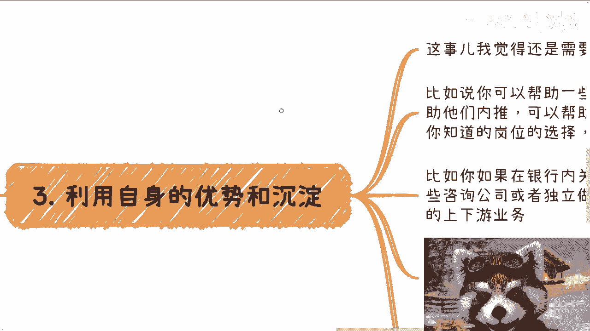
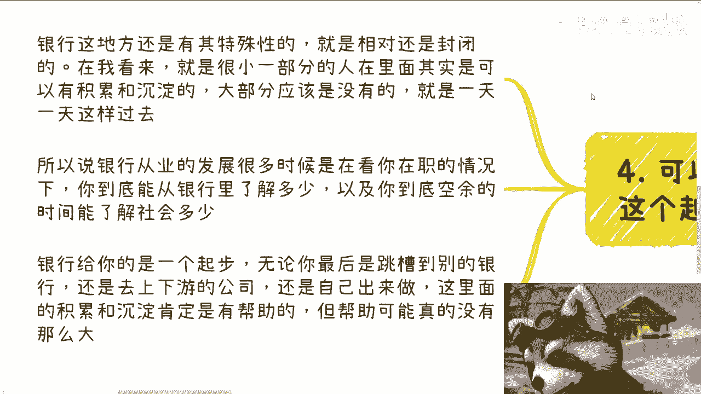
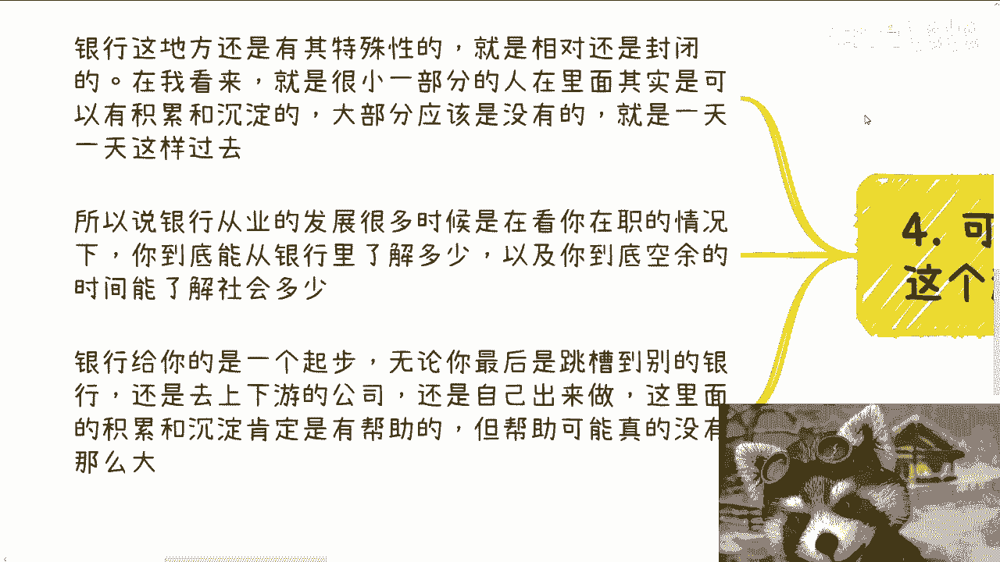

# 银行从业人员的发展路径探讨 - 课程 P1 🏦

在本节课中，我们将探讨银行从业人员的职业发展可能性。课程内容基于对当前经济环境和行业现状的观察，旨在为从业者提供一些可控的发展思路与方向参考。

## 课程概述与前提说明

首先需要明确一个大前提：以下观点仅为个人观察与思考，仅供参考。由于并非银行从业人员，所述内容可能较为片面。欢迎有相关经验的朋友在评论区分享见解，进行理性讨论。

近几年经济环境不佳。根据与一些从业者的交流，除了四大行情况可能稍好，其他地方性银行、尤其是小城市的分行或支行，在薪资和稳定性方面都面临挑战。因此，尽管有伙伴提出探讨银行内部发展，但个人认为，在银行内部，无论是前台业务岗还是中后台支持岗，其发展路径很大程度上取决于个人努力程度、机遇等不可控因素。

## 可控的发展方向探讨

从可控角度出发，银行从业人员的发展更应着眼于银行体系之外。以下是一些可能的发展路径。

### 1. 向公司外部寻求发展 🚀

核心发展机会大多在公司外部。在银行的经历若能积累良好，可以形成一定的信息差优势。例如，你能够了解信贷、理财等各类业务流程，或者积累一定的人脉资源。这些积累在外部的职业发展中都可能发挥作用。

以下是几个具体的外部发展方向：
*   **转型至相关金融机构**：可以转向小额贷款公司、基金公司、证券公司等泛金融领域，或进入一级、二级市场。
*   **投身自媒体或创业**：利用行业知识从事金融内容创作，或与互联网等领域伙伴合作创业。
*   **转向专业服务领域**：进入投融资、风控、审计等相关领域。具体选择需结合个人在银行的具体业务经验。

### 2. 关于在银行内部“熬”资历的看法

从个人价值观判断，在当前环境下，单纯在银行内部“熬”资历以求发展的意义有限。银行体系内部竞争激烈，且整体流动性可能不足。

### 3. 利用自身优势与沉淀 💡

银行从业经历本身具备一定优势，关键在于如何主动利用这些优势。

你可以从以下几个方面着手：
*   **提供职业咨询服务**：利用对银行业的了解，为后辈提供职业规划、内推、行业及岗位选择建议，甚至可以尝试提供付费咨询服务。
*   **转向乙方或咨询公司**：如果在银行内积累了良好的关系网，可以跳槽至为银行提供服务的咨询公司或独立机构，在乙方担任与甲方（银行）对接且有话语权的角色。
*   **开展第三方合作业务**：完全离开银行，利用过往积累从事第三方服务，例如成为财务顾问（FA）、提供小额借贷服务或涉足金融出海业务。这类合作基于你过去的行业积累，双方是平等的业务合作关系。

如果自觉积累不足，一个稳妥的策略是在银行内稳住现有岗位，同时尽可能多地接触核心业务、前端业务或客户相关工作，积累经验和人脉。若积累了一定关系和资源，最佳发展路径是转向银行业的上下游公司。

### 4. 银行作为职业起点的定位 📍

银行可以是一个不错的职业起点，但它也仅仅是一个起点。后续的发展与这个起点本身关系不大。

银行业相对封闭，只有少数人能在此获得深厚的沉淀与积累，多数人可能只是按部就班地工作。这意味着，你的价值可能高度依附于银行平台。在岗时，外界因你的平台而重视你；一旦离开，过往积累的价值可能大幅缩水。

因此，银行从业发展的关键在于：在职期间，你能从银行了解多少行业知识、积累多少有效人脉，以及是否有余力去了解更广阔的社会与市场。如果只是闭门造车，即使未来寻求转变，也会对外界一无所知。

银行经历对跳槽至其他银行、上下游公司或自行创业确有帮助，但这个帮助可能没有想象中那么大。除非你在银行体系内达到一定职级、能够真正开展业务，否则，一段普通的银行工作经历对未来发展的助力非常有限。

## 总结与建议

本节课我们一起探讨了银行从业人员的几种发展思路。核心观点是：银行内部天花板对大多数人而言不高，且需要漫长等待，在经济不确定性高的时期，“熬”资历可能拖慢个人发展节奏。因此，更建议从业者主动利用银行平台积累可迁移的技能、知识和人脉，积极向外部相关领域寻求机会，或基于自身优势开展咨询服务与合作。

---
**附注**：本课程内容基于个人观察与认知，仅陈述所知事实与所见现象，不涉及价值判断。任何职业决策都需结合个人具体情况。