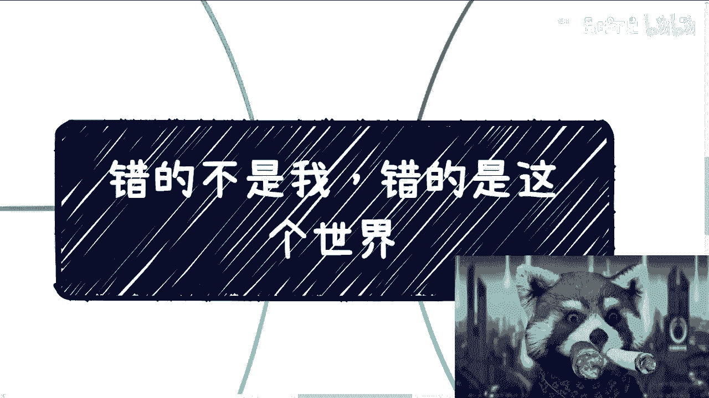
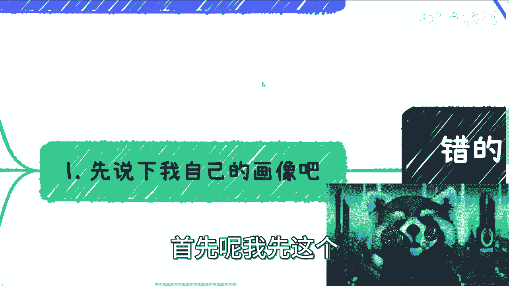
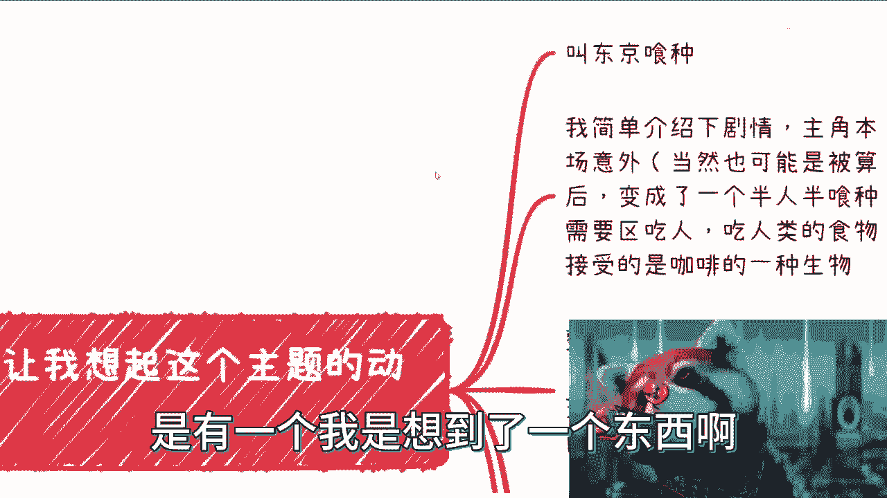
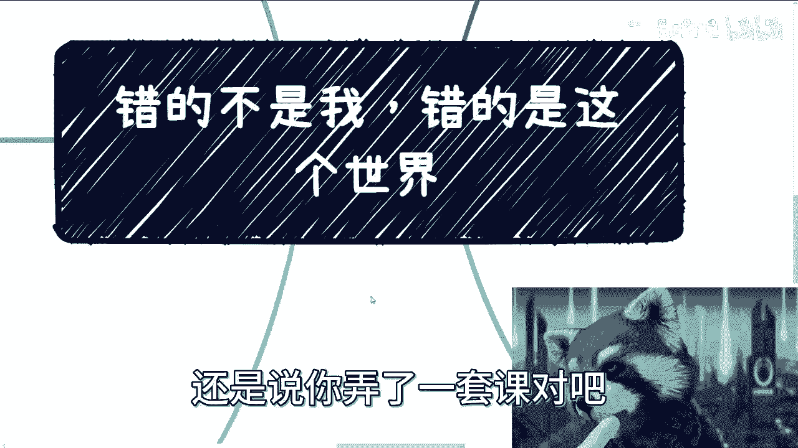
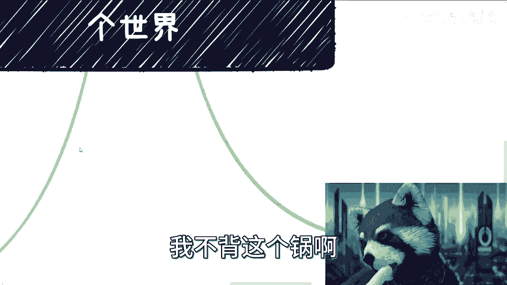
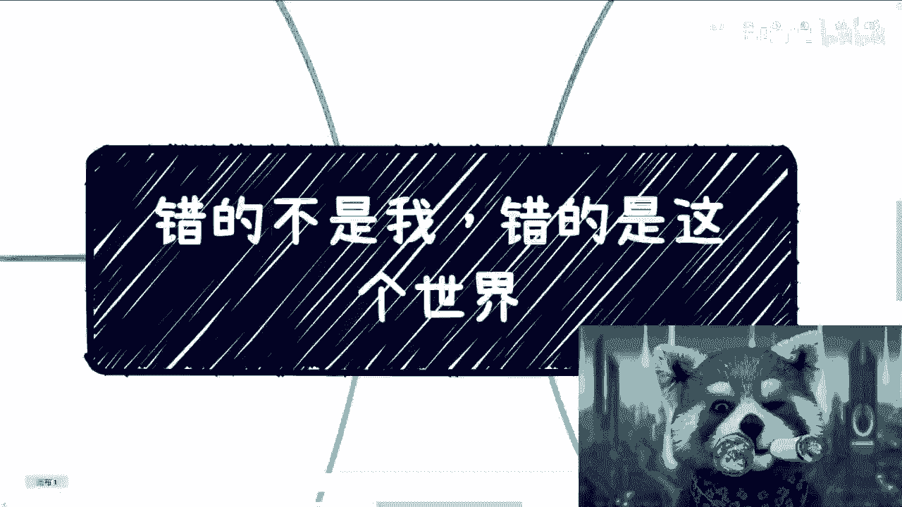

# 错的不是我，是这个世界 - P1 - 赏味不足 - BV1tg4y1K7QQ

好啊大家好，这个嗯我想着还是开一个新的主题出来啊，因为昨天那个主题呢，这个也非常凑巧是吧，就是正好到了170呃，呃后面还会讲，但是我想了一想，我会想一些内容往里面再去加啊。

呃我不知道这个内容，今天这个内容能不能过审啊，我也不知道这个合集能不能过审啊，反正就是我先开个头吧是吧，呃首先这个主题大家也看到了是吧，叫错的不是我是吧，错的是这个世界呃，它会有出处啊。

我都会跟大家这个会介绍一下啊，首先呢我先这个作为一个开场。

我给大家说一下这个自画像是吧，呃大家都知道啊，以前做开发的是吧，然后做了很多年，现在就专门给高校出课程啊，然后NBANBA上课啊，然后是政企的一些咨询啊，主要方向是数字经济是吧。

反正现在主机板厂总归有了，然后我能的在上海，在新天地这边啊，然后从小呢没啥事干是吧，就是游戏动漫啊，别的没什么兴趣爱好了是吧，就是反正读书肯定是读不好的，能的一塌糊涂啊，呃然后全平台是吧。

然后现在在这个喜欢玩些恐怖游戏，但是我其实也很怕啊，但是也可以玩啊，然后动漫动漫嘛就是大家所有都知道的，反正我就是属于那种啊，有了电脑之后，我就开始往前翻是吧，比如说八几年的，几几年的。

七几年的还是往前翻是吧，然后你像奥特曼也是吧，我把奥特曼全部翻了一遍是吧，美少女战士全部翻了一遍是吧，然后最近像尼克斯啊，夏日重现啊是吧，钢之炼金术师啊是吧，各种各样的，当然了。

这个也不是说在B站上就一定要有这些属性嘛，是吧，但是就碰巧那没办法嘛，就喜欢玩嘛是吧，就以前玩的最多的是什么啊，那个暗黑二跟那个机器人大战。

是吧，然后我们来说一下这个主题啊，呃其实这个主题呢是有一个，我是想到了一个东西啊。

叫东京食尸鬼啊，这个这个目前应该已经被禁了是吧，但是如果大家有兴趣去看呢，我觉得大家也可以搜一下啊，嗯这个小熊猫这个啊这个烟有点高嘛啊，等一下等一下让让我调调调整一下啊，好了呃，等一下让我再调整一切。

就是我简单说一下剧情啊，其实剧情是这样子的啊，我觉得主角呢本来是个人类啊，然后由于一场意外，当然也有可能是被算计了啊，导致呢自己就说做了一些手术，然后之后变成了一个半人，半食尸鬼的这么一个生物。

在这部呃世界观里面呢，这个食尸鬼的设定啊，他是需要去吃人的，我自己打错了，大家见谅啊，无所谓哦，对你说到这个啊，我还特别喜欢看魔法少女哈哈各种魔法少女，你知道吗，嗯需要去吃人类啊，然后吃人类。

然后呢他去吃一些人类的食物，就比如说什么啊，汉堡啊，或者正常的一些东西啊，他就会觉得非常的嗯恶心啊，啊我终于知道了，我终于知道了我的这个小熊猫，完了我我我我知道为什么了。

因为前两天被我在那边乱改他的这个属性啊，等一下啊，等一下啊，我把这个东西关掉，靠他妈的垃圾，我终于知道为什么了啊，这样对诶，唉好像也不行啊，算了无所谓，就是，就是说啊就是说啊这个他会觉得恶心啊。

然后唯一可以接受的食物是咖啡啊，然后他不会有任何的这种感触啊，那么整个第一季因为它有很多技嘛，整个第一季呢，其实就在说主角如何做自己的挣扎啊，自己沟通，自己接受，因为他本身就是说啊，得要接受自己。

是这么一个半人半跟权叉一样的是吧，半人半妖啊这么一个过程，那么呃我觉得在我看来呢，这个跟大部分人在现实当中啊其实都差不多啊，并不是说人格分裂，但是呢想法会有很多种啊，它它其实是一个变化的一个过程。

那在我看来呢，咱不是说成功，因为成功这个东西是比较困难的，但是大家就是说有一定进展呢，我觉得还是呃可以的啊，就是说呃我觉得但凡有一定进展，有一定执行力的呢，一定是自己跟自己已经和解了。

或者说达到了一定的这个和解的程度哦，那么你想这部动漫主角在最后被抓抓起来是吧，然后这boss对他不停的虐待啊，然后自己为了生存，也就是也达到了，就自己在跟自己不停的就沟通嘛是吧。

然后呢自己他最终因为他整个第一季，他其实都不接受自己这个身份，所以说基本上就是在那边拒绝说啊，我要拒绝去吃人是吧，我要拒绝去做一些很多别的事情啊，那么他自己接受了自己是半人，半食尸鬼的这个身份。

同时他就说出了这句这句话啊，就说出这句主题啊。

就告诉他就是说他自己说，或者说他自己告诉他自己就是错的，不是我是吧，错的是这个世界，那么从而然后马上就反杀了这个boss啊，然后我觉得其实我们每个人呢都是需要去接受。

但每个人面对的问题肯定跟就是都不一样嘛，是吧，也不会这么简单，不会这么单一，所以我会想想从哪些角度切入是吧，更好的去帮助大家能够去和解，因为我其实到昨天吧，给很多人做咨询，我还说了那句话。

我说其实我就跟他们说，我说你们要知道普通人跟所谓的，他们觉得不普通那些人最大的区别在哪里，就是那些人他不没有每天想那些有的没的，没有这么多思思，想，没有这么多复杂的东西，他们每天的想法很简单是吧。

就是不内耗，但是为什么普通人会内耗，但这个原因就很复杂很复杂，那么第三个，那评论区还有很多人，他说啊，他说吕老师你咋懂那么多是吧，我跟你们讲，首先我不懂啊，首先我不懂。

我跟大家所有说的东西都是我去经历过，或者我所身边的合伙人经历过的啊，而不是说我从任何一个抖音或者任何一个地方，或者YOUTUBE上面所看到的东西，这些东西对我来讲没有意义，为什么。

因为我没有经历过的东西，我不会认为它一定是有真实性的，哪怕新存者偏差，我也不会觉得它有真实性，因为这个没有经历过，我怎么知道他说的真的假的，对不对，那么所以说呢就是说整个所有的内容。

我不认为我说的一定是对的，大家你们根据自己的认知跟三观自己去判断，对不对，另外呢就是说我可以这么说啊，我说很多大家所有的想法和所经历的家庭啊，包括甚至经历过的事情我也都经历过啊。

就是很多东西我也都经历过，没什么区别的，就是因为包括咨询当中有很多人跟我说啊，这个吕老师我以前家里怎么样是吧，或者来说我现在情况怎么样，我说OK啊，我都知道，因为我以前也这样，很正常啊。

那我给你们举个例子，你就像小学是吧，我我小学家里没有钱，我就住个十平方米的房子，然后我就那个出去卖报纸，然后出去卖卖那个什么哦，卖羊肉串也不卖羊肉串，就卖这种炸串，对不了，然后卖卖东西就就这样子的呀。

你们都经历过的呀，就这样过来的是吧，不是说很多人觉得哎呀这个这个吕老师，你在上海是吧，你怎么样怎么样，那怎么了呢，上海就很有钱嘛，啊谁跟你这么说的啊，我现在在星星这边，房子也是我自己买的。

这这跟有没有这跟有没有钱有什么关系啊，那那我有钱也是我自己赚的，是不是啊，那么我跟大家一样，其实都是一路走过来，所以我知道什么是接地气啊，不像就是说很多就是说就他可能给你，可以给你建议。

但是他可能比如说从小家境就很好，或者从小家里就很有钱，或者从小就教育各个方面都很好，那我就不一样是吧，我我跟你们说，我就很坦诚的是吧，我一没钱，二我教育也不好，我没教育，那不存在的是吧，韩妈区博主是吧。

韩妈区up主是吧啊，然后你比如说评论区你们也可以看到，或者你们私信我的时候，但凡我真的不知道啊，我真的一点经验都没有，我就会直接跟你们说，我不懂，我讲不了就讲不了，我的确不懂是吧。

包括就是说我一开始还想着说，是不是跟大家讲一些什么网络安全，或者别的东西，我后来想想也没什么好讲的是吧，这个毕竟就是说呃，你说跟我做互联网有没有关系有关系，但是也不是那么有关系是吧。

所以说我觉得当这个这个当然这个讲不了，这个我就不去说它了啊，那我大胆猜测啊，讲这个主题啊，包括这个合集，有的人要说了啊，这个吕老师三观不正是吧啊，这怎么不正，你们看这个主题嘛是吧。

这个主题有人就觉得不正啊，有的人也要来说了，他说我们也改变不了是吧，就比如说他说你说错的是这个世界，但是我们也改变不了，这有啥用呢，对不对哈，我跟你们讲以上啊，我觉得我你们也好啊。

大家对于这些人就拉黑就好了，没有必要再去讨论他，为什么，因为很多时候所谓的正能量，其实就是披着正能量外套的一切负能量，而且非常负能量，什么意思呢，就是说就是说你比如说啊这个三观不正是吧。

那你说我们改变了有什么用，那你要改变什么呢，是吧，哦你说你改变不了，那什么意思呢，摆烂就不改变啊，还是说还是说你弄了一套课是吧。

45万块钱让大家去教是吧，没有意义的呀是吧，我觉得其实包括张雪峰，前两天说那个新闻学的事情是一样的，就是就是当一个大家都是纯资本利益，纯赚钱驱动的一个世界的时候，你但凡有人跳出来说一个稍微正常一点的话。

或者稍微一个为大家考虑的话，因为我觉得张雪峰就是再这么偏激，再这么极端，他也是离家长最近的，或者也是离家长这个这个相对家长而言，最接地气的是吧，而不是说他站在一个资本家的角度。

所以我是觉得你从我现在讲话也是一样，就是说你说我要不要去赚钱，要我是不是要去赚大家来找我咨询的钱，这个我觉得无所谓，因为你们要愿意咨询就咨询，没有不愿意也无所谓，而且我收的钱也不贵是吧，我说不好听点。

所有的内容，免费的内容加起来难道不值这个钱吗，你们自己摸着良心想的，是不是啊，所以我跟你们说，就是我们需要关注的是我们自己，我们需要和解的，也只有我们自己和我们沟通啊，就和我沟通过都知道。

其实我给所有建议的时候，我都会说，我说做决定的是你，但是呢我会告诉你所有的利弊，所有的这个环境你去做判断啊，其实你做对或做错，对你来讲都是成长没有关系的，因为你自己做了，你会有这个判断，你会有这个思考。

你但凡去听别人的，永远没有成长，你只会把锅甩给我。

到最后就说哎吕老师说的是吧，你你要你要这样子这样子这样子，我不背这个锅啊。

这跟我有什么关系呢，对不对啊，所以呢我觉得我觉得核心是什么，就是我觉得对所有人来讲啊，对所有人来讲，无论当下环境好和坏，就是你说大家能不能预测未来，不能啊是吧，大家能不能回到过去，也不能啊是吧。

但是无论当下环境怎么样，无论自己是顺势还是逆境，我跟你们说，所有的过程当中，都是自己跟自己和解的一个过程，让你自己达到个平衡，然后达成一个坚定的一个过程，所谓坚定的过程就是。

我不管你今天到底是比如说有钱没钱，你今天到底是有什么积累，我也不管你今天到底是想赚钱，还想有成就，还是想有自己的自由时间，还是说像我一样不上班是吧等等等，不重要，重要的是你得让自己达成一个和解一个境界。

这个境界就是你不会被外界所影响，你不会被那些有的没的所影响，你不会因为任何一切东西，你心中就是有一些这个波动或者有些涟漪，你也不会因为有些事情就是说啊，然后让你左右摇摆，因为有很多人的坚定。

他是暂时性的坚定，就是他今天这个想法觉得艾自己想明白了，明天是吧，别人说了一个想法诶，他又摇摆烂，你知道吧，这个不行啊啊而且这种事情就像我说的，就是说很多事情啊，这里面太多的事情了是吧，性别啊。

家庭啊是吧，然后什么有钱没钱啦是吧，其实就是所有的POA，所有的就是这种在我看来外界所灌输的东西，其实我们都要去判断它是就是对自己道理来讲，就是有对不对，或者说我们自己要认为他对不对是吧。

因为很多太多的时候我觉得问题不在我们身上，问题是在于就是从小到大的教育，从小到大的环境，从小到大，别人所灌输的东西，从小到大，或者说近几年短视频或者整个朋友圈所，就是这种这种营销啊，或者资本啊。

所导致的这种垃圾信息所给我们带来的东西，这错的是这些东西哦，所以说我觉得我呃，我昨天跟我那个朋友聊的时候，他说我觉得他说的也很对，就是呃现在的很多年轻人，他不是可能的，从我角度来讲。

我觉得他们可能不会思考，但是从他角度来讲，他觉得可能会思考，但是大家被信息流冲的没有空去思考，就每天杂七杂八信息太多，他没有空去思考，一一睁眼一闭眼是吧，就一天就过去了，好吧，所以OK吧。

就是这个合集里面内容，我会想想到底从哪些角度去出发，因为每个人情况不一样啊，希望就是反正大家要是有这种感同身受的人呢，可以这个有所缓解吧，啊没有感同身受的人呢，我觉得反正大家这个就当听个故事吧。

或者就当听就当就当陪我聊聊天吧是吧，就这样子呗，行那就这么着吧，好吧，我要去调整一下我的小小熊猫，我感觉好像被我设置了，有点傻，是吧啊。

