# 课程：错的不是我，是这个世界 - P1 🎬

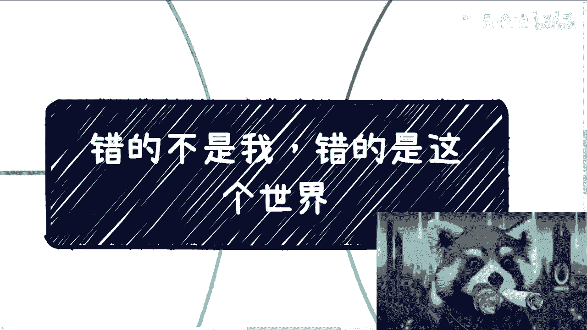

## 概述
在本节课中，我们将探讨一个源自动漫《东京食尸鬼》的主题——“错的不是我，是这个世界”。我们将分析这个主题背后的含义，并讨论如何在现实生活中与自己和解，应对外界纷杂的信息和压力。课程旨在帮助初学者理解自我接纳的重要性，并学会在复杂环境中保持内心的坚定。

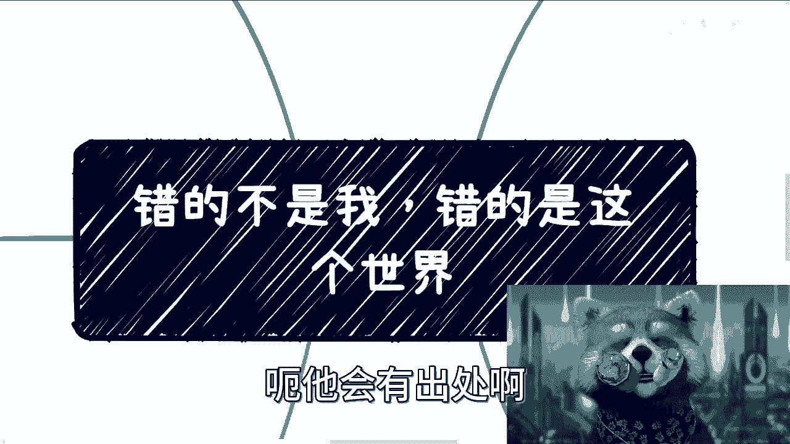

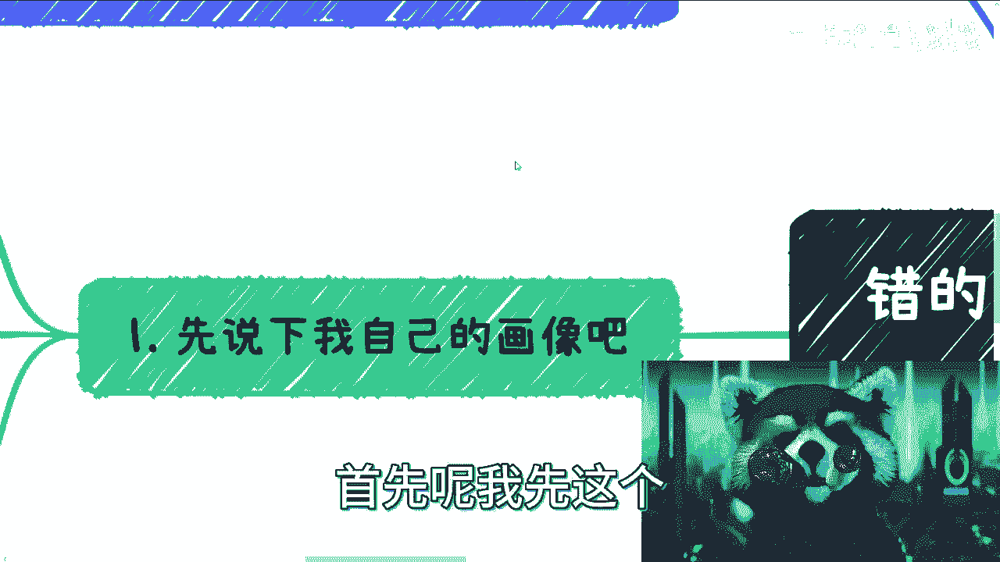

---

## 讲师自我介绍 👨‍🏫

我是一名前开发者，目前专注于为高校设计课程、进行NBA教学以及为政企提供数字经济方向的咨询。我目前在上海新天地工作。

我的个人兴趣包括游戏和动漫。我涉猎广泛，从早期的经典作品到近年来的新番都有所了解。我特别喜欢恐怖游戏，虽然有时也会感到害怕。此外，我也热衷于《暗黑破坏神2》和《超级机器人大战》等游戏。

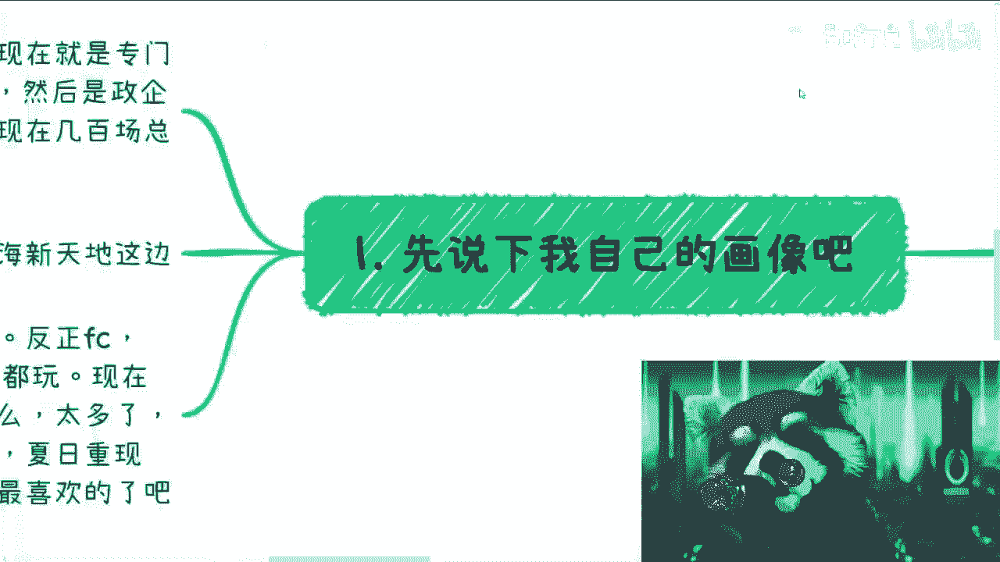

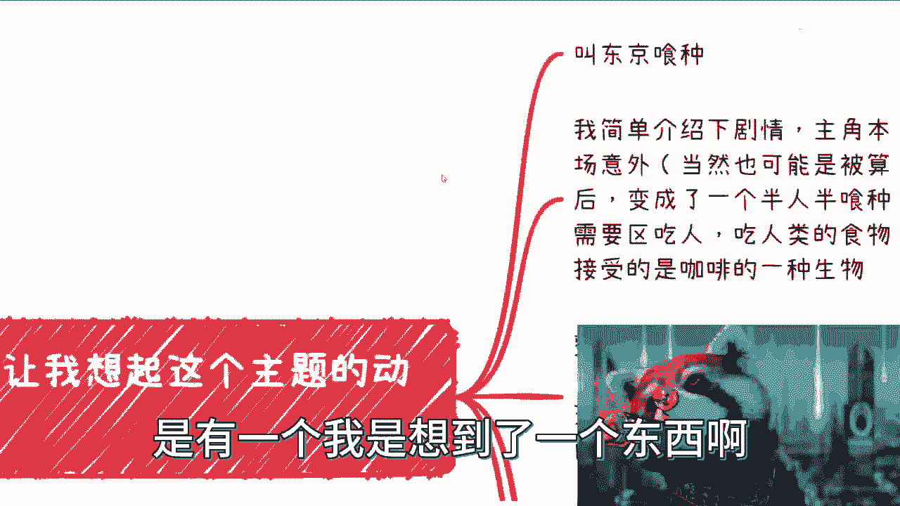

---

## 主题引入与背景 📖

上一节我们进行了简单的介绍，本节中我们来看看本系列课程的核心主题。

这个主题“错的不是我，是这个世界”来源于动漫《东京食尸鬼》（该作品目前可能已被下架）。我想通过这个故事来展开讨论。

剧情简述如下：主角原本是人类，因一场意外（或阴谋）接受了手术，变成了半人半食尸鬼的生物。在这个世界观里，食尸鬼需要以人类为食。他们无法消化正常人类食物（如汉堡），会感到恶心，唯一能接受的是咖啡。

整个第一季描绘了主角挣扎、沟通并最终接受自己新身份的过程。在我看来，这与许多人在现实中面对内心冲突、寻求自我接纳的过程相似。主角起初拒绝自己的身份，拒绝食尸鬼的行为。但在经历囚禁和虐待后，他最终与自己和解，接受了半人半食尸鬼的现实，并说出了“错的不是我，是这个世界”这句话，随后成功反击。

我认为，任何人在生活中取得进展或具备执行力，其前提往往是已经在一定程度上与自己达成了和解。

---

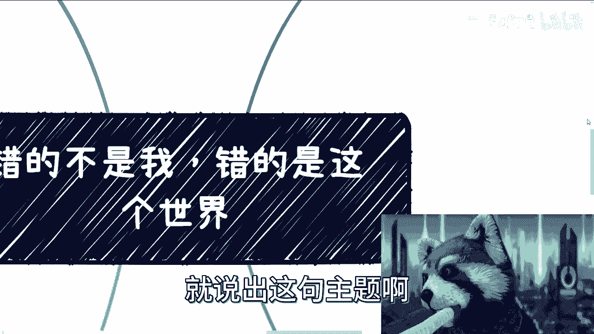

## 核心观点：与自己和解 🤝

上一节我们了解了主题的故事背景，本节中我们来深入探讨“与自己和解”这个核心概念。

在我看来，每个人都需要面对和接受自己。虽然各人面临的问题不同，但核心都是减少内耗，达成内心的平衡与坚定。

我通过咨询工作观察到，所谓“不普通”的人与普通人的一个关键区别在于，前者思虑较少，不易陷入内耗。普通人内耗的原因则非常复杂。

以下是我对这个过程的理解：
*   **经历与认知**：我分享的所有观点都源于我个人或身边合伙人的真实经历。对于未曾亲身经历的事情，我无法确认其绝对真实性。因此，我的观点不一定完全正确，请大家结合自己的认知进行判断。
*   **接地气的共鸣**：我理解许多朋友面临的困境，因为我自己也来自普通家庭，经历过类似的挑战（例如童年家境清贫、需要勤工俭学）。我并非天生优越，目前的成就都是自己努力的结果。
*   **坦诚与界限**：对于我完全不了解、没有经验的领域，我会直接表明“我不懂，我讲不了”。我认为分享不熟悉的领域没有意义。

---

## 应对外界噪音与质疑 🚫

在探讨了自我和解的重要性后，我们不可避免地会面对外界的各种声音。本节中我们来看看如何应对这些噪音。

在分享这个主题时，我预料到可能会遇到两种质疑：
1.  主题“三观不正”。
2.  “即使知道错的是世界，我们也改变不了，有什么用？”

对于持有这些观点的人，我的建议是：可以选择拉黑，无需过多争论。

很多时候，所谓的“正能量”可能只是包裹着负能量的外壳。例如，当有人说“改变不了有什么用”时，其潜台词可能是鼓励“摆烂”或推销高价课程（例如“45万块钱的课”）。这与张雪峰老师评论新闻学事件类似——在纯粹由资本和利益驱动的环境中，一个稍微为普通人着想、接地气的观点反而显得突兀。

我们需要关注的核心是自己。需要和解的对象，也只有我们自己。

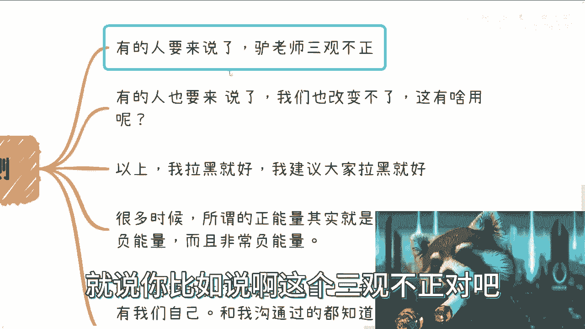

---

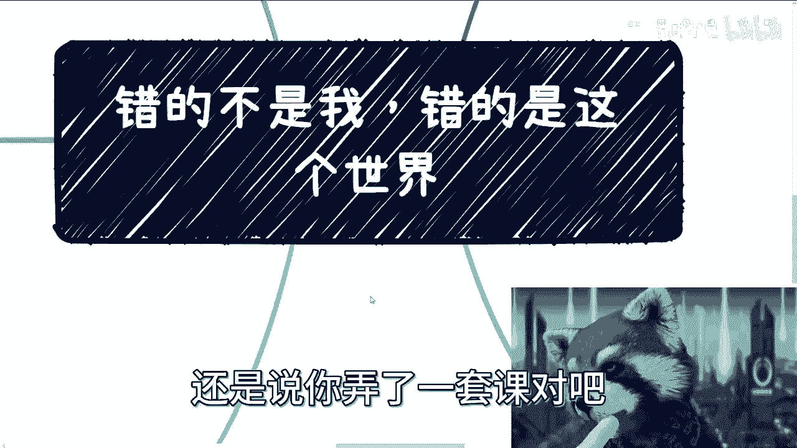

## 咨询中的立场与原则 🧭

上一节我们讨论了如何应对外界噪音，本节中我们明确一下在寻求或提供建议时应秉持的原则。

在我的咨询过程中，我始终坚持一个原则：**决策权永远在你自己手中**。

我会为你分析各种选择的利弊和所处环境，但最终的决定必须由你做出。无论对错，这都是你自己的成长经历。如果你总是听从别人的建议，你就无法获得真正的成长，并且容易养成“甩锅”的习惯（例如，“是吕老师让我这么做的”）。我不会为此承担责任。

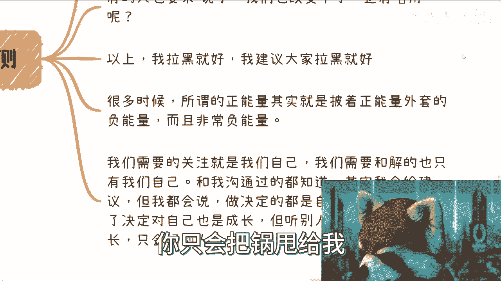

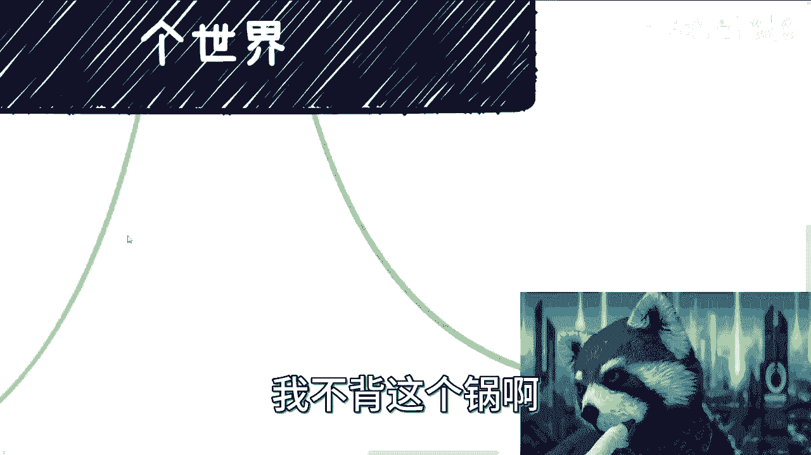

核心在于，无论环境顺逆，人生都是一个不断与自己对话、寻求平衡、并最终变得坚定的过程。这种坚定不是暂时的，而是不会因外界信息或他人观点而轻易动摇的内心状态。

当前许多问题的根源，可能并不在于我们自身，而在于：
*   从小到大的教育和环境灌输。
*   近年来短视频、社交媒体和资本营销带来的信息洪流。

这些外部信息流有时过于庞杂，导致人们没有时间和空间进行深度思考。正如我朋友所说，现在的年轻人不是不会思考，而是被信息冲得没空思考。

---

## 总结与展望 📚

本节课我们一起学习了“错的不是我，是这个世界”这一主题的起源和核心内涵。

我们探讨了通过动漫剧情理解自我接纳的重要性，分析了“与自己和解”是减少内耗、获得进展的关键。我们也讨论了如何应对外界的质疑与噪音，并明确了在个人成长中自我决策的重要性。最后，我们指出许多内心冲突的根源可能来自外部环境的灌输和信息过载。

在这个合集后续的内容中，我将尝试从不同角度切入，探讨如何更好地实现与自我的和解。希望这些内容能为有类似感受的朋友提供一些缓解，对于没有相关感受的朋友，也可以当作故事来听，或当作一次轻松的聊天。

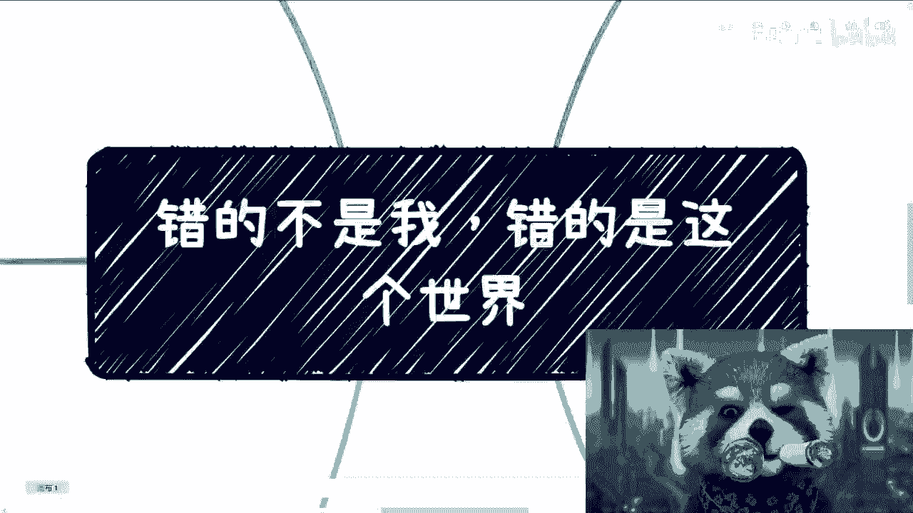

---
**公式/代码强调的核心概念：**
*   **自我和解的最终状态**：`内心坚定度 != f(外界变量)` （内心坚定度不应是外界变量的函数）。
*   **决策原则**：`最终选择 = your_decision(分析利弊(我的建议, 你的环境))`