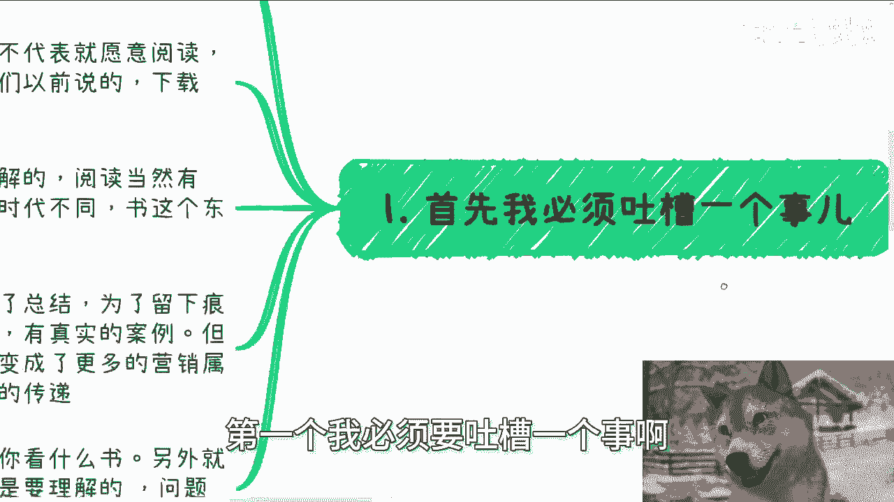
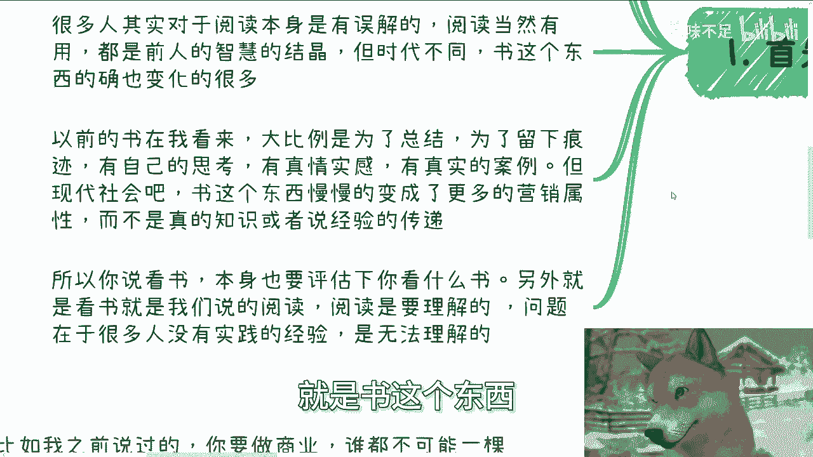
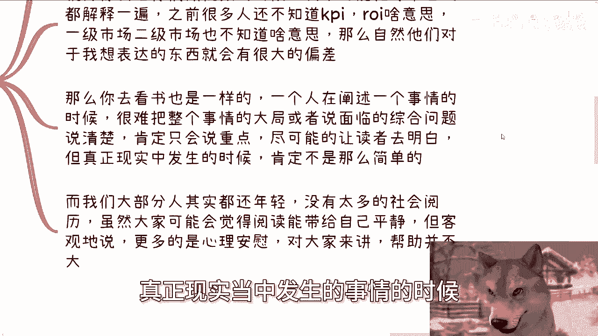
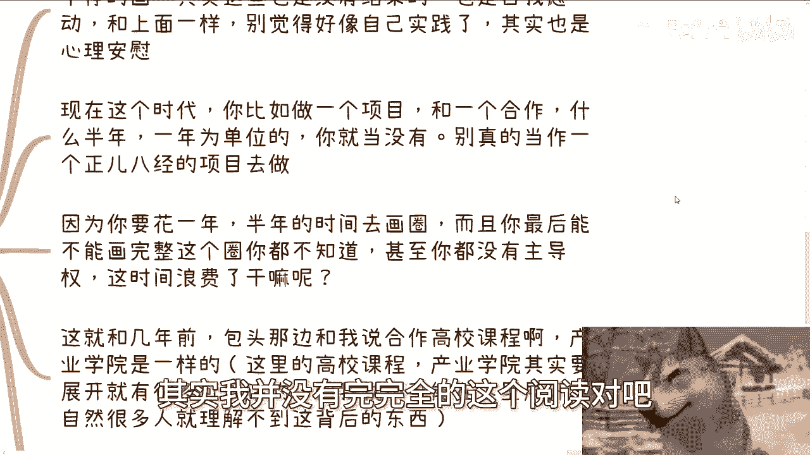

# 阅读和实践，哪个更重要 - P1 - 赏味不足 - BV1Mz421i7qz

哈喽大家好，这个已经是我第二次第三次给你们录了，为什么，因为前面两次被我家猫打断了，哎呦我靠，真的是唉烦哦，我们今天讲的这个主题呢是叫做阅，阅读跟实践哪个更重要，这个主题呢其实以前也有相关的啊。

但是呢就是说切入点不太一样，那今天呢我们还是会从一个新的这个切入点，来讲这个东西啊。

嗯先把这个狗子弄大一点啊，好首先是这样子的，我先说结论啊，都重要啊，就是呃我们肯定不是二极管的思维，来分析这个东西啊，只不过就是说人生不同的阶段呢，或者说你不同的等级呢呃可能会有关啊。

但是对于大部分人来讲，尤其是对于现在年轻人来讲，包括现在的整个的这个整个土壤经济环境，我就这么跟你们讲一刀切，不要纠结你们只有一条路，那就是时间啊，那么下一期活动已经定了，在本周日啊。

8月11号在长沙好吧，在长沙呃，主题的话呢，一个是围绕不同的一些企业的offer嗯，国央企啊，私企啊，外企啊对吧这种，那另外一方面呢就是说围绕个体来做自媒体啊，或者跨境电商啊这么一些这个内容展开啊。

最后再帮大家展望一下啊，包括就是说未来的一些发展，那么报名或者了解详情，你们继续可以私信我啊，首先第一个啊我必须要吐槽一个事啊。

就是虽然我不能一刀切，但是呢呃大概率中的大概率啊，问我选择阅读还是实践的，我其实是说啥呢都没啥用，因为这个问这个问题的这个人，或者这种群体的出发点呢，大概率都是不愿意去实践的。

而且呢又大概率就是不愿意实践情况，下面呢也不代表他们就愿意阅读啊，本身也不是也是不愿意阅读的，就像我们以前说的，下载好PDF保存到网盘，就他妈当阅读过的啊，那么很多人呢对于阅读本身其实是有误解的。

这个阅读当然有用，这是没有错的，因为为什么，因为阅读本身，我们读的东西是所谓的前人的智慧的结晶对吧，但是呢你们要明白一点，时代不同，书这个东西底其实也是有很大的变化，就以前的书在我看来大比例啊。

为了总结，为了留下痕迹啊，为了把当时的这个真情实感，真实的案例，自己的思考记录下来而存在的，但是现在现代社会，你们但凡只要跟出版社有过接触的，你们都会明白我说的几句话。

就是书这个东西慢慢的形成了更多的营销属性。

而不是说真的知识或者经验的这种传递，所以说你说看书本身也得评估一下，你看什么书啊，你不是他妈的阿猫阿狗这种乱七八糟，他妈听上去名头大的书，你就看你妈没没他妈用啊，另外就是看书呢就是我们说的阅读，对吧啊。

阅读理解，阅读理解，阅读是需要理解的，那么问题在于，很多人他压根自己都没有所谓的实践经验。

或者对社会就没有认知，你让他他妈怎么理解对吧，嗯第二那么俗话说得好。

叫做纸上得来终觉浅，为什么啊，因为看书看视频或者看任何一样东西，一个人在输出内容的时候不可能面面俱到对吧，这就好像我们今天我们打个比方啊，这就好像我们今天说啊，这个呃在学小学这个加减乘除的时候对吧。

我们把哦或者这么说吧，就不应该拿小学来讲，就是拿比如说高等数学来讲，教所有的人一视同仁，再开始学高等数学，那么我们并不知道学这个高等数学人，数学能力到底是多少对吧，那你说难道我们在教一个高等数学的。

一个知识点的时候，我们要向下所有的那个内容全部兼容吗，不可能对吧，那么当我们不可能面面俱到的时候，那么对于看的人来讲就会天差地别，这就好像我给你们做视频的时候，我不可能把每个名字都给你们解释一遍。

我也不可能把每个上下文都给你们解释一遍，对不对，你包括之前很多人看我视频，还不知道KPI什么意思，ROOI什么意思对吧，那包括还还问我爱车老师，我不是金融行业的一级市场，二级市场对吧，证券啊。

券商也不知道什么意思对吧，那你们就就就不是你们，就他们他不知道什么意思，以及不知道如何自己去google，这个是一回事，但是问题是我不能因为他不会google，也不能因为他不知道这个什么意思。

所以我把每一个讲到的东西，全部给你们展开一下，那这个东西没底了，对不对，而且你反过来想，对于那些懂的人，对于那些了解的人来讲，就会觉得卧槽他妈陈老师，这有什么好解释的对吧，那么自然你就会发现。

所有的人对我表达的东西的理解，就会有很大的偏差，那么你去看书也是一样的，一个人在阐述一个事情的时候，很难把整个事情的大局或者说面临的综合问题，当时的上下文都说清楚，不可能的，肯定只抓重点，为什么。

因为他的目的要让尽可能让读者去明白对吧，但是当读者也好，或者那个作者也好，真正现实当中发生的事情的时候。

那肯定不是书里面写的那么简单啊，而我们大部分人其实还很年轻，没有太多的社会阅历，虽然大家可能会觉得，阅读能带给带给自己平静啊，但是我不客气的说啊，这种想法无非都是你们自己给自己的安慰啊。

就是我说的就是说客观的说更多的是心理安慰。

对大家来讲帮助其实并不大啊，那么第三实践呢就要不停的去闭环式的去实践。

这就好像很多人画圈对吧，就是那很多人又要说了，他说那陈老师按照你这说法，我们就实践呗对吧，好实践也他妈不是瞎他妈实践对吧啊，就好像很多人画圈，每次都画一半啊，或者画个七八十%不画完整，然后不停的画。

其实这些圈你只要不画完整都没有结果。

本质上也是一种自我感动，和上面是一样的啊，别觉得好像他妈到时候就觉得哎呦。

我的，我我实践了对吧，其实我并没有完完全的这个阅读对吧。

我都每天都在实践，然但其实还是心理安慰，因为现在这个时代，你比如说做一个项目和一个这个合作什么，以半年为一呃，半年也好，一个季度也好，一年为也也好，为单位的，你就当没有啊，不要去幸存者偏差。

不要去抱侥幸心理，你就当没有啊，别真的当做一个正儿八经的项目去做，你最后吃亏的只有你自己，因为你花一年半年时间去画圈，而且最后你能不能画完整这个圈你也不知道，甚至你有没有主导权在这里面你也不知道。

那么这个事情浪费了干嘛呢，对吧，这就和我几年前，然后我跟你们讲啊，包头那边跟我讲啊，合作高校课程产业学院是一样的对吧，那么这里这里我就括号写了一个东西叫什么，在这个地方我所提到的高校课程和产业学院。

其实你要让我展开，有很多东西可以展开对吧，比如说课程是什么样的东西，什么叫高效课程对吧，产业学院又是怎么一个东西，但是我不可能在这里展开，但为什么，因为这个视频不可能无限量的往外面展开。

那么当我不展开的时候，自然很多人就理解不了这背后的东西，这就像我第二点上面写的东西对吧啊，那么和我说合作对吧，每次跟我同步信息，就包头那边政府每次跟我合作，每次跟我同步信息，基本上都是一个季度一次啊。

然后最后就不了了之了，在一年半之后，两年左右就不了了之了，那我就这么跟你们讲，如果我真的认真给他们去做，我真的认真出方案，去不停的跟进。

最后他们都没有损失，只有我是对吧，好第四，无论阅读还是实践，都是需要多元化并行的，这个事情我也在之前提过无数次了啊。

就比如我之前说的，我不管你做商业还是什么，做些别的事情，你都不可能一棵树上吊死，但凡你做一件事情在一棵树上吊死的，那我跟你讲，你不要狡辩，你就是啊，要出任何问题，你不要怪别人，就怪你自己啊。

比如念书对吧，比如说学历，比如说考公，比如说创业，比如说投资，比如说所有的事情，你只要是一棵树上吊死的，你把押宝押在一个东西身上，无疑都是自己作死，我就这句话对吧，我一直说的很清楚，叫做自作孽不可活啊。

也就是说你说你看书可以吗，可以深的浅的，宏观的，微观的你都要去看啊，而且看的时候你需要不停的去评估你理解多少，他妈不要死，开对吧，那么瞎他妈在里面看，卧槽看上去很牛逼，对吧啊，什么阅读时间啊，看的书啊。

一套一套的，最终他妈的一个都没吸收进去，有卵用啊，对不对啊，结合你的认知跟经验，如果你没有多少认知跟经验，那么请你先转移到实践这根线上对吧好，那么实践就如我之前说的，短线的钱你要有业务支撑。

长线的钱你也需要有业务支撑，那你们可以粗俗就是非常粗犷的理解为，那就你不需要付出劳动啊，就你就当你做了一件事情，一次性劳动之后，你可以不停的收钱的这种业务对吧，那么无论发生什么事情，你都可以有应对方式。

或者说就是我们所谓的，你才能真正达到所谓的稳定，或者说所谓的抗风险性对吧，那很多人做业务也是的，就是他说爱创手，我要去创业。

或者我要去做个副业，然后呢你就会发现哎他要么就是把宝，把时间全部压在一根线上，可能就是快钱，要么就全部压在这个长期的这种积累上面，就是所谓的慢钱，要么就是压在那种就是说是赌博的。

就以小博大的这种东西上面，就是然后来问我哎，陈老师这个东西行不行，我跟你们讲，不是短线不行，也不是长线不行，也不是以小博大不行，你得有百分比去分配你的时间嘛，对不对，你不分配，我不管你做什么。

都是一棵树上吊死，有什么好讨论的对吧，就像我回到我今天这个第四点刚刚说的，你只要一棵树上吊死，这叫什么，这叫自作孽，没啥好讨论的对吧，你要是命好，你还能赚点钱，你要命不好，直接就是浪费时间，浪费精力。

浪费金钱，对你你图啥呢，有什么意义呢，丝毫意义都没有啊。

对吧啊，所以说就是一般来讲啊，尤其是比如说他会纠结在阅读跟实践这件事情，上面的，我说实话我敢打赌，他妈100个人里面98个人，99个人，他是最后实践跟阅读一个都不会做的，你知道吗，因为真正他有执行力。

有行动力的人，他不会问这种问题的哦。

行好吧，反正中心核心思想你们get到就行了，好吧嗯好吧，然后那个下期活动啊，本周日本周日8月11号在长沙好吧，然后场地我已经定了，然后另外呃几个主题，一个是呃围绕不同的企业的offer啊。

另外一个围绕自媒体跨境电商啊，最后呢帮大家展望一下未来好吧，然后你们要报名或者了解详情的，去私信我，然后剩下的话就是说职业规划啊，商业规划，包括你们做副业啊，自己做些什么产品业务啊，或者跟别人合作啊。

在这里面涉及到啊合同啊，分润啊，分红啊，股权啊，股份啊，商业计划书啊，白皮书啊啊，包括就是说呃你们希望通过跟我的沟通，能够给你们一些更接接地气的一些建议，或者规划，能让你们少走点弯路的话。

那么你们可以整理好对应的问题跟个人背景。