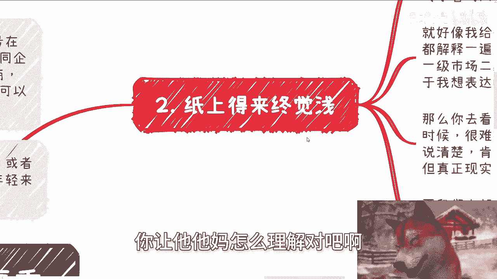
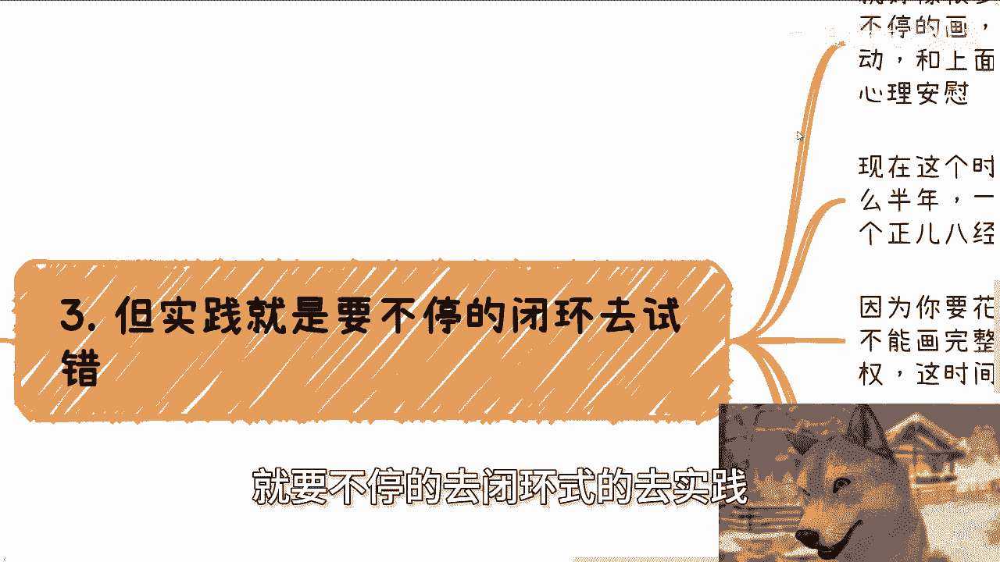
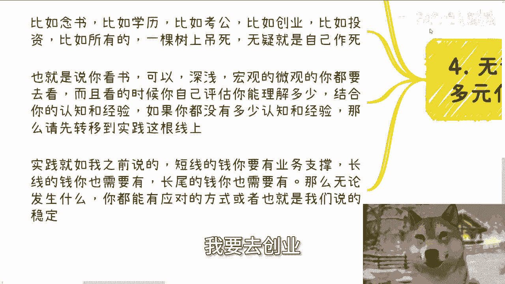

# 阅读和实践-哪个更重要---P1---赏味不足---BV1Mz421i7qz


在本节课中，我们将探讨一个经典问题：阅读与实践，哪个对个人成长更重要？我们将从一个新的切入点进行分析，并给出明确的行动建议。

---


## 概述

阅读与实践都重要，并非二元对立。但在不同的人生阶段和环境下，侧重点可能不同。对于当前环境下的多数人，尤其是年轻人，有一条更清晰的道路。

---


## 核心观点分析


上一节我们概述了课程主题，本节中我们来详细分析几个核心观点。



### 1. 问题的本质：缺乏行动力

首先，必须指出一个现象。询问“选择阅读还是实践”的人，其出发点大概率是既不愿意实践，也不愿意真正深入阅读。许多人将“保存资料到网盘”等同于“已经阅读过”，这是一种自我安慰。

### 2. 现代阅读的局限性：理解需要基础

阅读当然有用，它传递的是前人的智慧结晶。但需要注意两点：

*   **书籍性质变化**：现代许多书籍带有强烈的营销属性，而非纯粹的知识或经验传递。因此，阅读前需评估书籍质量。
*   **理解需要实践基础**：阅读的核心在于理解。但若缺乏实践经验或社会认知，则难以真正理解书中的内容。这正如公式：
    ```
    有效理解 = 阅读内容 × 个人实践经验
    ```
    当个人实践经验趋近于0时，理解效果也大打折扣。


### 3. “纸上得来终觉浅”：信息的天然损耗




任何内容的输出都无法面面俱到。作者在阐述时，必然会省略大量上下文和细节，只抓重点。这使得读者接收到的信息是不完整的。没有亲身实践，很难把握事情的全貌和复杂性。对于缺乏社会阅历的年轻人，仅靠阅读获得的“平静感”，更多是心理安慰。


### 4. 实践的关键：完成“闭环”


那么，是否只要实践就行？并非如此。实践必须是**闭环式**的。

许多人做事如同“画圈”，每次只画七八成便放弃，然后换一个重新开始。这种未完成的实践同样没有结果，本质仍是自我感动。在当今时代，如果一个项目或合作的周期以季度或年为单位，且你无法主导进程，那么投入大量时间风险极高，很可能最终一无所获。

以下是实践需避免的陷阱：
*   项目周期长且无主导权。
*   行动不彻底，无法形成完整闭环。
*   将过程努力误认为有效结果。

### 5. 多元化并行：不把鸡蛋放在一个篮子里


无论是阅读还是实践，**多元化并行**是基本原则。绝不可“一棵树上吊死”。


*   **阅读多元化**：深浅结合，宏观与微观结合，并持续评估自己的理解程度。
*   **实践多元化**：业务布局需长短结合。可以粗略理解为：
    *   **短线业务**：提供即时现金流支撑。
    *   **长线业务**：追求复利和持续收益。
    合理分配时间和资源在不同类型的事务上，才能构建真正的抗风险能力。将所有赌注押在单一方向（无论是快钱、慢钱还是赌博式投机）都是高风险行为。

---

## 总结与行动指南

本节课我们一起学习了阅读与实践的辩证关系。核心结论是：两者都重要，但需根据个人情况动态调整。



对于大多数询问此问题的人，首要问题是**缺乏行动力**。因此，更迫切的建议是：

1.  **停止空想，立即行动**：从一个小而具体的实践开始。
2.  **追求闭环**：确保每一件事尽力做到有始有终，产生可衡量的结果。
3.  **多元化发展**：在实践的同时，搭配针对性的阅读；在布局事务时，注意长短线结合。
4.  **保持批判性**：对阅读内容保持鉴别力，对实践过程保持反思。


真正有执行力的人，不会纠结于此问题，他们会在行动中自然融合阅读与思考。所以，关键在于**动起来**，在行动中学习，在学习中优化行动。


---

**下期活动预告**：本周日（8月11日）于长沙举行。主题将围绕不同企业（国央企、私企、外企）的offer选择，以及个体如何开展自媒体、跨境电商等展开，并展望未来发展趋势。报名或了解详情请私信。

如需针对个人职业规划、商业规划、副业开展、合作协议（合同、分润、股权等）或商业文书（计划书、白皮书等）进行更接地气的咨询，请整理好具体问题与个人背景。